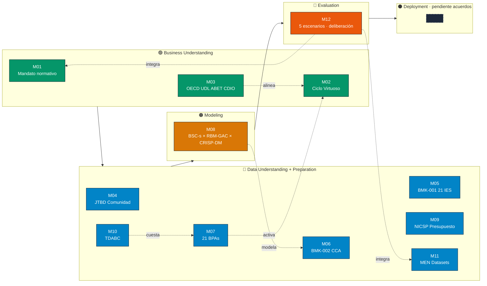

# Inv. Buenas Prácticas · 12 Investigaciones que Sustentan la Reforma

Las **12 investigaciones (M01–M12)** componen el **sustrato teórico** de la Reforma Vinculante UDFJC. Cada una resuelve una pieza del rompecabezas: del **mandato normativo** (M01) al **deployment integrador** (M12), pasando por **JTBD de la comunidad**, **benchmark de 21 IES**, **modelo CCA de créditos académicos**, **estándares internacionales**, **presupuesto NICSP**, **costeo TDABC** y **datasets MEN**.

> [!info] Stats del corpus
> **12 papers** · **6 fases CRISP-DM** · **74 conceptos** del [[glo-acu-004-25|Glosario Universal]] invocados · **125 aristas** en el grafo semántico · **35 referencias APA** · **5 rutas Clark** (R1 Gobernanza · R2 Periferia · R3 Sector · R4 Misión · R5 Cultura).

## Mapa CRISP-DM del corpus

## Mapa de actores · qué leer según tu rol

Cada paper resuelve una pregunta clave de un actor específico. **Empieza por la fila que más resuene con tu rol**:

| Actor | Pregunta clave | Papers prioritarios | Concepto-puente |
|---|---|---|---|
| 🎓 **Estudiante** | ¿Cómo recupero soberanía cognitiva? | M02 · M04 · M06 | [[glo-soberania-cognitiva]] · [[glo-jtbd-christensen]] |
| 🎨 **Docente Diseñador** | ¿Cómo diseño bajo modelo CCA? | M06 · M08 · M07 | [[glo-cca]] · [[glo-credito-academico]] |
| 🔬 **Docente Investigador** | ¿Cómo activo el ciclo Pasteur? | M02 · M07 · M05 | [[glo-pasteur-quadrant]] · [[glo-cinco-vias-clark]] |
| 🏛️ **Director** | ¿Cómo aterriza la gobernanza nueva? | M01 · M08 · M09 | [[glo-acu-004-25]] · [[glo-bsc-s]] |
| 📊 **Veedor / Auditor** | ¿Cómo se cuestea y auditea? | M10 · M11 · M09 | [[glo-rbm-gac]] · [[glo-veeduria-universitaria]] |
| 🚀 **Diseñador política pública** | ¿Cómo se despliega en 8 años? | M12 · M01 · M03 | [[glo-piiom]] · [[glo-conpes-4069]] |

## Cómo navegar este corpus

> [!tip] Patrón sugerido para principiantes
> 1. **Empieza por M01** (mandato normativo) para entender qué reforma se está pidiendo y por qué.
> 2. **Salta a M12** (hoja de ruta) para ver el panorama completo de cómo encajan las 12 piezas.
> 3. **Profundiza en la M## que más te interese** según tu rol (mapa de actores arriba).

> [!quote] Convenciones de lectura
> Cada paper usa **wikilinks Obsidian-style** `[[glo-concepto]]` que enlazan al **Glosario** (74 conceptos canónicos), **citas APA Pandoc-style** `[@christensen2016]` con hover preview, **callouts** abstract/info/warning, **diagramas Mermaid** clickables (zoom + pan en el visor), y **secciones colapsables** para overview rápido.

## Trazabilidad — Acuerdo CSU 04/2025

Todas las investigaciones citan y se alinean con el **Acuerdo CSU 04 de 2025** (la nueva carta constitucional UDFJC). El [[glo-acu-004-25|ACU-004-25]] es la raíz normativa del corpus, articulado con [[glo-conpes-4069|CONPES 4069]] y [[glo-piiom|PIIOM]].

> [!success] Calidad evidenciada
> Cada paper M## tiene su frontmatter `relations.custom.glosario` auto-derivado, sus **citas APA verificables** contra los átomos `content/biblio/<key>.md`, y su **vecindario semántico** visualizable en el grafo (107 nodos paper-comunidad-concepto + 125 aristas).
