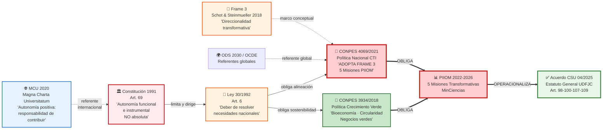
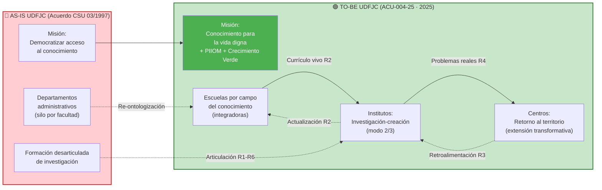

# §01 · Mandato Normativo: del Acuerdo CSU 04/2025 a la MCU 2020 vía CONPES 4069 y PIIOM

> [!abstract] 📄 Propiedad Intelectual & Ciencia Abierta
> **Autor**: Carlos Camilo Madera Sepúlveda · ccmaderas@udistrital.edu.co · UDFJC
> **Licencia**: CC BY-SA 4.0 · **Cita sugerida**: Madera Sepúlveda, C. C. (2026). §01 · Mandato Normativo. *Reforma Vinculante UDFJC: Análisis, Buenas Prácticas y Prospectiva Transformativa* (cap-MI12, Sección 1). Universidad Distrital Francisco José de Caldas. https://reforma-ud.vercel.app/canonico/m01/ [DOI pendiente]

---

## §0 · Abstract y Metas de Aprendizaje

> [!abstract] §0 · Abstract
> Esta sección reconstruye y fundamenta la **cadena normativa multinivel** que convierte la reforma de la Universidad Distrital Francisco José de Caldas (UDFJC) en un mandato vinculante —no una opción discrecional. La cadena inicia en instrumentos internacionales de ciencia abierta (Magna Charta Universitatum, 2020; Schot & Steinmueller, 2018; UNESCO, 2021) y desciende a través de la política pública nacional (CONPES 4069, 2021; CONPES 3934, 2018; PIIOM 2022–2026) hasta el ordenamiento colombiano (Constitución Política, 1991, Art. 69; Ley 30, 1992, Art. 6) y la operacionalización institucional (UDFJC, 2025). El argumento central es que la autonomía universitaria consagrada en la Constitución de 1991 **no es autonomía absoluta**: es autonomía *funcional e instrumental*, limitada y dirigida por el marco legal superior. Por lo tanto, la UDFJC no puede elegir si alinearse a las misiones transformativas nacionales ni al crecimiento verde soberano: el marco legal superior lo establece como **deber constitucional y legal**.
>
> **Al leer esta sección aprenderá a:**
> 1. Mapear la cadena normativa completa CO + UDFJC desde la MCU 2020 y [[con-frame-3|Frame 3]] hasta el [[con-acu-004-25|Acuerdo CSU 04/2025]].
> 2. Identificar los mandatos específicos que CONPES 4069 y PIIOM imponen sobre las IES públicas colombianas.
> 3. Aplicar el glosario normativo para leer el articulado del ACU-004-25 con precisión conceptual.
> 4. Distinguir entre obligación normativa verificable e interpretación institucional discrecional en el contexto de la reforma.
>
> **Palabras clave**: cadena normativa multinivel, autonomía universitaria funcional, Frame 3, CONPES 4069, PIIOM, MCU 2020, Acuerdo CSU 04/2025, reforma UDFJC.

---

## §1 · Introducción

> [!question] §1 · Pregunta trazadora
> ¿Cuál es la cadena normativa multinivel que obliga a la UDFJC a transformarse hacia un modelo universitario emprendedor-transformativo, y cómo el Acuerdo CSU 04/2025 operacionaliza esa cadena?

### §1.1 La reforma como imperativo sistémico, no como opción

El Acuerdo del Consejo Superior Universitario 004 de 2025 de la Universidad Distrital Francisco José de Caldas (en adelante ACU-004-25) es con frecuencia debatido en el ámbito institucional como si fuera el resultado de una preferencia rectoral o política coyuntural. Esta sección argumenta lo contrario: el ACU-004-25 es la respuesta institucional **obligada** a una cadena normativa multinivel que comienza en la Constitución Política de 1991 y recibe instrucciones operativas de cinco instrumentos de política suprainstitucional.

Comprender esta cadena no es un ejercicio académico neutral: tiene consecuencias prácticas directas para cualquier unidad organizativa de la UDFJC que intente "no implementar" la reforma invocando la autonomía universitaria. Como demuestra esta sección, esa invocación es normativamente errónea: la autonomía universitaria del Art. 69 de la Constitución no es un derecho defensivo frente a las políticas de CTI nacional, sino una capacidad instrumental al servicio del cumplimiento de los deberes constitucionales de la universidad pública.

### §1.2 Alcance y límites de §01

Esta sección se ocupa exclusivamente del **marco normativo**: no analiza la viabilidad operativa de la implementación, ni los presupuestos, ni los conflictos inter-institucionales — esos aspectos corresponden a instrumentos de gestión, modelado prospectivo y análisis presupuestario que se desarrollan en otras secciones del capítulo. §01 responde únicamente: *¿qué obliga a la UDFJC a transformarse, y con qué peso normativo?*

---

## §2 · Marco Teórico

### §2.1 Tres marcos para la política de innovación (Schot & Steinmueller, 2018)

La política de innovación ha evolucionado históricamente a través de tres marcos o "frames" conceptuales con implicaciones radicalmente distintas para el rol de la universidad:

> [!note] §2.1 · Los tres frames de política de innovación
>
> | Marco | Período | Pregunta rectora | Mecanismo | Limitación |
> |-------|---------|-----------------|-----------|------------|
> | **[[con-frame-1|Frame 1]]**: R&D | 1945-1980s | ¿Cómo producir más ciencia? | Inversión en investigación básica → spillovers | Lineal; no garantiza impacto social |
> | **[[con-frame-2|Frame 2]]**: Sistemas de Innovación | 1980s-2010s | ¿Cómo conectar actores? | Redes, clústeres, triple hélice | El crecimiento económico como fin; no cuestiona la dirección |
> | **[[con-frame-3|Frame 3]]**: Cambio Transformativo | 2010s→ | ¿*Hacia dónde* dirigir la innovación? | **Direccionalidad** → misiones transformativas | Requiere repensar el propósito institucional |
>
> Fuente: Schot & Steinmueller [-@schot2018frame3].

**[[con-frame-3|Frame 3]] es el marco del [[con-acu-004-25|Acuerdo CSU 04/2025]]**. El [[con-conpes-4069|CONPES 4069/2021]] lo adopta explícitamente como paradigma rector de la Política Nacional CTI. La universidad no solo debe producir conocimiento (Frame 1) ni solo conectarse a ecosistemas (Frame 2): debe asumir **direccionalidad** hacia transformaciones sociotécnicas que aborden desafíos de pobreza, injusticia, insostenibilidad y desigualdad [@schot2018frame3, p. 1555].

> [!quote] §2.1 · Cita canónica Frame 3
> "Exploring options for transformative innovation policy should be a priority."
> — Schot & Steinmueller [-@schot2018frame3, p. 1567].

### §2.2 La Magna Charta Universitatum 2020 (MCU 2020) y la autonomía positiva

La [[con-mcu-2020|Magna Charta Universitatum (MCU)]] fue suscrita en Bolonia en 1988 por 388 universidades y ampliada en 2020 con más de 950 signatarias. La revisión de 2020 es conceptualmente crítica para esta sección porque introduce el concepto de **[[con-autonomia-positiva|autonomía positiva]]**:

> [!quote] §2.2 · MCU 2020 — [[con-autonomia-positiva|Autonomía positiva]]
> "Universities acknowledge that they have a responsibility to engage with and respond to the aspirations and challenges of the world and to the communities they serve, to benefit humanity and contribute to sustainability."
> — Magna Charta Universitatum Observatory [-@mcu2020].

La MCU 1988 establecía la *libertad negativa* (freedom *from* coercion). La MCU 2020 añade la *libertad positiva* (freedom *to* contribute). La universidad no solo es libre de interferencias externas: es libre **para** contribuir activamente a la transformación social. Esto requiere un meta-propósito institucional ([[con-omt|Omega-Meta-Telos, ΩMT]]) — análogo al [[con-vsm-system-5|System 5]] del Modelo de Sistemas Viables [@beer1979heart] — que oriente todos los procesos misionales.

Para la UDFJC, esto implica que invocar la "autonomía universitaria" del Art. 69 como escudo frente a las políticas CONPES es una lectura **incompatible con MCU 2020**: la autonomía es el instrumento de la responsabilidad, no su sustituto.

### §2.3 Jerarquía normativa multinivel CO: la autonomía como instrumento

El sistema colombiano de educación superior opera en una jerarquía normativa donde la autonomía universitaria no es el nivel más alto sino un principio instrumental contenido en el tercer nivel (constitucional), subordinado al interés general y operacionalizado por la Ley 30/1992:

> [!important] §2.3 · Principio fundamental
> La autonomía universitaria del Art. 69 de la Constitución de 1991 es autonomía *funcional e instrumental* — no es soberanía. La Ley 30/1992 Art. 6 establece el **deber** de las universidades públicas de resolver las necesidades nacionales. El CONPES 4069/2021 define cuáles son esas necesidades para el período 2022-2031. Por lo tanto, incumplir el CONPES no es ejercer autonomía: es violar el Art. 6 de la Ley 30 y el deber constitucional de la universidad pública.

---

## §3 · Metodología

### §3.1 Tipo de investigación

Análisis documental crítico de fuentes primarias normativas, aplicando el método de **síntesis normativa top-down** (de lo internacional a lo institucional) y **verificación de coherencia** (identificación de contradicciones, omisiones y brechas en la cadena).

### §3.2 Corpus de fuentes primarias

| # | Fuente | Tipo | Nivel | Referencia |
|:-:|--------|------|-------|-----------|
| 1 | [[con-constitucion-1991-art-69\|Constitución Política de Colombia, Art. 69]] | Norma | Constitucional | Colombia [-@colombia1991constitucion] |
| 2 | [[con-ley-30-1992-art-6\|Ley 30 de 1992, Art. 6]] | Ley | Legal | Colombia [-@colombia1992ley30] |
| 3 | [[con-conpes-4069\|CONPES 4069/2021]] | Política pública | Nacional | CONPES [-@conpes2021cti] |
| 4 | [[con-conpes-3934\|CONPES 3934/2018]] | Política pública | Nacional | CONPES [-@conpes2018crecverde] |
| 5 | [[con-piiom\|PIIOM 2022-2026]] | Plan operativo | Nacional | MinCiencias [-@minciencias2022piiom] |
| 6 | [[con-acu-004-25\|Acuerdo CSU 04/2025]] | Norma institucional | Institucional | UDFJC [-@udfjc2025acu00425] |
| 7 | [[con-mcu-2020\|Magna Charta Universitatum 2020]] | Declaración internacional | Internacional | MCU Observatory [-@mcu2020] |
| 8 | [[con-frame-3\|Schot & Steinmueller (2018) Frame 3]] | Artículo académico | Teórico | *Research Policy* 47(9) [@schot2018frame3] |
| 9 | [[con-unesco-reimagining-2021\|UNESCO (2021)]] | Reporte global | Internacional | UNESCO Publishing [@unesco2021reimagining] |

### §3.3 Protocolo de síntesis normativa

1. **Lectura de cada fuente primaria** (verificación de existencia y vigencia).
2. **Extracción de mandatos** (obligaciones directas sobre IES públicas).
3. **Construcción de la cadena normativa** (relaciones de jerarquía y operacionalización).
4. **Identificación de brechas AS-IS** (qué cumple UDFJC hoy vs qué exige la cadena).
5. **Formulación del glosario normativo** (términos con definición unívoca).

> [!note] §3.3 · Limitación metodológica L-01
> El análisis es de escritorio (*desk research*): se basa en documentos oficiales públicos, no en percepciones de actores o trabajo de campo. Los documentos fuente son públicos y verificables, lo que garantiza replicabilidad pero no captura dinámicas políticas internas.

---

## §4 · Hallazgos — La Cadena Normativa Completa

### §4.1 La cadena normativa: diagrama maestro

*Fig-MI12-01 — Diagrama maestro de la cadena normativa multinivel: de MCU 2020 y [[3-diseño-capitulo-libro/_archived/60-glosario/glo-frame-3|Frame 3]] al [[3-diseño-capitulo-libro/_archived/60-glosario/glo-acu-004-25|Acuerdo CSU 04/2025]] vía Constitución 1991, Ley 30/1992, [[3-diseño-capitulo-libro/_archived/60-glosario/glo-conpes-4069|CONPES 4069/2021]], [[3-diseño-capitulo-libro/_archived/60-glosario/glo-conpes-3934|CONPES 3934/2018]] y [[3-diseño-capitulo-libro/_archived/60-glosario/glo-piiom|PIIOM 2022-2026]].*

> [!info] Lectura de la cadena
> Los dos CONPES (4069/2021 y 3934/2018) son el **nodo crítico**: son la bisagra entre el ordenamiento constitucional y el programa operativo PIIOM. El ACU-004-25 no es el origen de la reforma — es el punto de llegada de una obligación que nació en la Constitución y fue concretada por la política nacional CTI.

*Figura 01 · cadena normativa*

### §4.2 Constitución Política de Colombia, Artículo 69 (1991)

La Constitución garantiza la autonomía universitaria pero en su formulación completa la condiciona:

> [!quote] §4.2 · Art. 69 Constitución 1991
> "Se garantiza la autonomía universitaria. Las universidades podrán darse sus directivas y regirse por sus propios estatutos, de acuerdo con la ley. La ley establecerá un régimen especial para las universidades del Estado."

**Interpretación jurídica**: La frase "de acuerdo con la ley" es determinante. La autonomía universitaria no es preconstitucional ni absoluta: opera dentro del marco que la ley establece. La Ley 30/1992 es precisamente ese marco.

### §4.3 Ley 30 de 1992, Artículo 6 — El deber como cláusula operativa

> [!important] §4.3 · Art. 6 Ley 30/1992 — Deber constitucional
> El Art. 6 de la Ley 30/1992 define los objetivos de la educación superior colombiana. Entre ellos:
>
> *"Trabajar por la creación, el desarrollo y la transmisión del conocimiento en todas sus formas y expresiones y, promover su utilización en todos los campos para solucionar las necesidades del país."*
>
> Este artículo convierte la "solución de necesidades nacionales" en **objetivo legal obligatorio** de toda IES colombiana — no en aspiración ni en opción.

**Consecuencia normativa**: Cuando el CONPES 4069/2021 define cuáles son las necesidades nacionales prioritarias para el período 2022-2031 (las 5 misiones transformativas), automáticamente obliga a las IES públicas a alinearse con esas misiones por mandato del Art. 6 de la Ley 30 [@colombia1992ley30].

### §4.4 CONPES 4069/2021 — Política Nacional CTI: adopción formal de Frame 3

El [[con-conpes-4069|CONPES 4069]] es el instrumento de política pública nacional que operacionaliza el mandato constitucional y legal de CTI para el decenio 2022-2031. Sus tres aportes fundamentales al mandato de la UDFJC son:

> [!success] §4.4 · Tres aportes del CONPES 4069 al mandato UDFJC
> 1. **Adopta [[con-frame-3|Frame 3]]** de Schot & Steinmueller [-@schot2018frame3] como paradigma rector: la CTI no solo debe producir conocimiento ([[con-frame-1|Frame 1]]) ni conectar actores ([[con-frame-2|Frame 2]]), sino **dirigirse hacia transformaciones sociotécnicas** que resuelvan los desafíos nacionales.
> 2. **Establece [[con-cinco-misiones-piiom|5 misiones nacionales]]** que todo el [[con-sncti|SNCTI]] (incluyendo las IES) debe operacionalizar a través del [[con-piiom|PIIOM]].
> 3. **Adopta el modelo de [[con-quintuple-helix|Quíntuple Hélice]]** [@carayannis2012quintuple] que incorpora universidad, industria, gobierno, sociedad civil *y medio ambiente* como actores co-creadores del ecosistema de innovación.

### §4.5 CONPES 3934/2018 — Política de Crecimiento Verde: el destino de las misiones

El CONPES 3934/2018 establece el modelo económico hacia el cual la CTI debe orientarse:

> [!note] §4.5 · Cinco pilares del Crecimiento Verde [@conpes2018crecverde]
>
> | Pilar | Descripción | Relevancia UDFJC |
> |-------|-------------|-----------------|
> | **Bioeconomía** | Valorizar biodiversidad → productos sostenibles | Investigación en ecosistemas urbanos + territorios |
> | **Economía circular** | Cerrar ciclos materiales | I4 Campus Regenerativo + grupos de ingeniería |
> | **Negocios verdes** | Empresas que generan valor ambiental verificable | Spin-offs + TTO + extensión emprendedora |
> | **Productividad sostenible** | Eficiencia sin degradar ecosistemas | Optimización energética + gestión de residuos |
> | **Desarrollo territorial** | Cerrar brechas + oportunidades justas | Misión M5 (Equitativa) del PIIOM |

### §4.6 PIIOM 2022-2026 — Las 5 Misiones Transformativas como mandato operativo

El [[con-piiom|Programa Indicativo de Investigación y Orientación de Misiones (PIIOM)]] del MinCiencias es el instrumento que convierte el marco conceptual del [[con-conpes-4069|CONPES 4069]] en **mandatos operativos** para todo el [[con-sncti|SNCTI]]. Las [[con-cinco-misiones-piiom|5 misiones]] son:

> [!note] §4.6 · Las 5 Misiones Transformativas del PIIOM 2022-2026
>
> | # | Misión | Descripción | Conexión CONPES 3934 |
> |:-:|--------|-------------|---------------------|
> | **PIIOM-M1** | 🌱 Bioeconomía | Valorizar la biodiversidad y generar productos sostenibles | Bioeconomía + economía circular |
> | **PIIOM-M2** | 🌾 Alimentaria | Seguridad alimentaria + agricultura sostenible | Productividad sostenible |
> | **PIIOM-M3** | ⚡ Energética | Transición energética + fuentes renovables | Economía circular |
> | **PIIOM-M4** | 🏥 Sanitaria | Salud pública + prevención + medicina de precisión | Bienestar territorial |
> | **PIIOM-M5** | ⚖️ Equitativa | Cierre de brechas + oportunidades justas | Desarrollo territorial |
>
> Fuente: MinCiencias [-@minciencias2022piiom].

**Implicación para la UDFJC**: Cada proyecto de investigación, cada currículo, cada iniciativa de extensión debe poder trazarse a al menos una de estas 5 misiones. Si no puede trazarse, no cumple el mandato del PIIOM y, por extensión, viola el [[con-ley-30-1992-art-6|Art. 6 de la Ley 30/1992]] [@colombia1992ley30].

### §4.7 Acuerdo CSU 04/2025 — Operacionalización institucional del mandato

El [[con-acu-004-25|ACU-004-25]] es el instrumento institucional que traduce toda la cadena anterior al ordenamiento interno de la UDFJC. Sus artículos clave para la reforma son:

> [!note] §4.7 · Hitos normativos del Acuerdo CSU 04/2025
>
> | Artículo | Mandato | Plazo | Estado (a 2026-04-25) |
> |----------|---------|-------|----------------------|
> | **Art. 109** | Fecha de publicación | 5 mayo 2025 | ✅ Cumplido |
> | **Art. 98** | [[con-plan-implementacion\|Plan de implementación]] | 45 días (≈ 20 jun 2025) | ⚠️ EXPIRADO |
> | **Art. 98** | Estatuto Académico | 6 meses (≈ 5 nov 2025) | ⚠️ EXPIRADO |
> | **Art. 98** | Reglamento Electoral | Sin plazo explícito | 🔴 Pendiente |
> | **Art. 100** | Implementación total | 4 años (5 mayo 2029) | 🟡 En plazo |
> | **Art. 100** | [[con-comision-implementacion-art-100\|Comisión de Implementación]] | Conformación pendiente | 🔴 No conformada |
> | **Art. 107** | [[con-potestad-rectoral-transitoria\|Potestad rectoral discrecional]] | Primeros 2 años (2025-2027) | 🟢 Vigente |

> [!danger] §4.7 · Anti-patrón: autonomía como escudo
> Cualquier unidad organizativa que invoque la autonomía universitaria o la "tradición académica" para no implementar el ACU-004-25 está incurriendo en violación de la cadena normativa descrita en §4.1-§4.6. La **única** defensa normativa válida es señalar contradicciones entre el ACU-004-25 y instrumentos de jerarquía superior (Ley 30, Constitución) — no oponerse al mandato per se.

### §4.8 Marco internacional de referencia — MCU 2020, UNESCO, ODS

Además de la cadena vinculante nacional, la UDFJC opera en un contexto de compromisos internacionales que refuerzan (pero no reemplazan) el mandato legal:

| Instrumento | Año | Compromiso clave para IES |
|-------------|-----|--------------------------|
| **Magna Charta Universitatum 2020** | 2020 | Autonomía positiva: responsabilidad de contribuir a la sostenibilidad |
| **UNESCO: Reimagining Our Futures Together** | 2021 | Conocimiento como bien común; IES como motores de desarrollo sostenible |
| **UNESCO: Beyond Limits** | 2024 | Nuevo contrato educativo: IES deben reinventarse para el desarrollo sostenible |
| **ODS Agenda 2030** | 2015 | 17 objetivos; ODS 4 (educación de calidad) + ODS 17 (alianzas) |
| **Misión de Sabios 2019** | 2019 | 5 focos estratégicos nacionales; insumo técnico para CONPES 4069 |

> [!info] §4.8 · Los instrumentos internacionales son referentes, no vinculantes directos
> La MCU 2020, UNESCO y ODS no son vinculantes en el derecho colombiano en el mismo sentido que la Constitución y la Ley 30. Sin embargo, informan la interpretación del "espíritu" del mandato y son argumentos de peso en cualquier discusión sobre el modelo de universidad pública que la reforma aspira a construir.

### §4.9 Glosario normativo CO + UDFJC

El glosario consolidado del capítulo cap-MI12 establece definiciones unívocas para los términos más utilizados —y más malentendidos— en el debate de la reforma. Cada entrada se transcluye desde el [Glosario Universal](/glosario/):

![[con-cadena-normativa-multinivel]]

![[con-autonomia-funcional-instrumental]]

![[con-frame-3]]

![[con-piiom]]

![[con-cinco-misiones-piiom]]

![[con-acu-004-25]]

![[con-quintuple-helix]]

![[con-iniciativas-i0-i4]]

![[con-omt]]

![[con-caba]]

![[con-taxonomia-sub-n1-n4]]

### §4.10 Transformación estructural mandatada: AS-IS → TO-BE

La diferencia entre la UDFJC anterior (Acuerdo CSU 03 de 1997) y la proyectada ([[con-acu-004-25|ACU-004-25]]) no es cosmética — es una **[[con-re-ontologizacion|re-ontologización]]** de la estructura organizativa:

*Fig-MI12-02 — Re-ontologización organizativa de la UDFJC: del modelo departamentos-silo (Acuerdo CSU 03/1997) al modelo Escuelas-Institutos-Centros con retroalimentaciones R1-R6 entre procesos misionales (ACU-004-25, 2025).*

> [!important] El mandato de la re-ontologización
> El ACU-004-25 no simplemente cambia nombres (Facultades → Escuelas): cambia la **lógica de coordinación**. El paso de "departamento administrativo" (silo por facultad) a "Escuela por campo del conocimiento" ([[3-diseño-capitulo-libro/_archived/60-glosario/glo-caba|CABA]] transversal) es la operacionalización del [[3-diseño-capitulo-libro/_archived/60-glosario/glo-frame-3|Frame 3]] a nivel organizativo: la universidad deja de ser una suma de departamentos que producen conocimiento y se convierte en un ecosistema que lo co-crea con el territorio.

*Figura 02 · re ontologizacion*

---

## §5 · Discusión

### §5.1 ¿Qué cumple la UDFJC hoy? Análisis AS-IS normativo

> [!warning] §5.1 · Brechas normativas verificadas (a abril 2026)
>
> | Mandato normativo | Estado | Evidencia |
> |------------------|:------:|-----------|
> | Plan de implementación ACU-004-25 (Art. 98, 45 días) | ⚠️ EXPIRADO | Plazo venció jun 2025 |
> | Estatuto Académico (Art. 98, 6 meses) | ⚠️ EXPIRADO | Plazo venció nov 2025 |
> | Comisión Art. 100 conformada | 🔴 PENDIENTE | No conformada |
> | Asamblea Universitaria (Art. 19) | 🔴 PENDIENTE | No constituida |
> | Escuelas operativas (≥7 piloto) | 🟡 PARCIAL | Identificadas 7 en diagnóstico HRIEG-v2 |
> | Plan de Desarrollo alineado a ACU-004-25 | 🔴 PENDIENTE | Vigente responde a ACU-003-97 |
> | Matriz de trazabilidad PIIOM | 🔴 PENDIENTE | No existe formalmente |

### §5.2 Seis riesgos críticos de la transición

El análisis del autor sobre la implementación del mandato normativo identifica seis riesgos sistémicos. Se etiquetan **[[con-riesgos-rt1-rt6|RT1-RT6]]** (Riesgos de Transición) para evitar colisión con las retroalimentaciones R1-R6 del ciclo virtuoso institucional y con las [[con-cinco-vias-clark|cinco vías R-1 a R-5 de Clark]] [@clark1998entrepreneurial].

> [!danger] §5.2 · Los 6 riesgos de la transición
>
> | Riesgo | Probabilidad | Impacto | Mitigación recomendada |
> |--------|:-----------:|:-------:|----------------------|
> | **RT1** Fragmentación organizacional: cada dependencia interpreta el Acuerdo a su manera | ALTA | CRÍTICO | Marco interpretativo único (glosario normativo §4.9) |
> | **RT2** Conflictos normativos: contradicciones con reglamentación anterior | ALTA | ALTO | Auditoría normativa automatizada |
> | **RT3** Desalineación con PIIOM: implementar sin verificar contribución a 5 misiones | MEDIA | CRÍTICO | Matriz de trazabilidad PIIOM por iniciativa |
> | **RT4** Pérdida de memoria institucional: no documentar decisiones | ALTA | MEDIO | Knowledge Graph institucional (E2 del ciclo virtuoso) |
> | **RT5** Ausencia de sistema de seguimiento | ALTA | ALTO | Framework de gestión estratégica ([[con-bsc-s\|BSC-s]] + [[con-rbm-gac\|RBM-GAC]]) con dashboard de indicadores institucionales |
> | **RT6** Resistencia al cambio no gestionada | MUY ALTA | CRÍTICO | Gestión del cambio en 3 pilares: comunicación + capacitación + quick wins |

### §5.3 La paradoja de la autonomía instrumentalizada

La paradoja central es que la autonomía universitaria —usada retóricamente para resistir la reforma— es precisamente el instrumento legal que *habilita* la implementación. Sin la autonomía del Art. 69, la UDFJC no podría reformarse sin intervención directa del Congreso. La autonomía no es el obstáculo: es el motor constitucional del mandato.

> [!tip] §5.3 · La autonomía como palanca, no como freno
> La respuesta correcta a quien invoca la autonomía para resistir la reforma es: "Precisamente porque tienes autonomía universitaria, tienes la capacidad —y la obligación— de reformarte sin esperar que te lo ordene el Congreso. La autonomía te da el poder de hacerlo. La Ley 30 Art. 6 te da la obligación de hacerlo."

---

## §6 · Conceptos Clave

> [!note] §6 · Conceptos Clave de §01 (transcluidos del [Glosario Universal](/glosario/))
>
> - **[[con-cadena-normativa-multinivel|Cadena normativa multinivel]]**: jerarquía de instrumentos normativos que van desde lo internacional (MCU 2020, Frame 3) hasta lo institucional (ACU-004-25), estableciendo una obligación acumulativa de alineación.
> - **[[con-autonomia-funcional-instrumental|Autonomía funcional e instrumental]]**: la autonomía universitaria del Art. 69 CO como capacidad para ejercer soberanía del conocimiento al servicio del territorio — no como derecho defensivo frente a políticas públicas.
> - **[[con-deber-normativo|Deber normativo]]** (vs opción): el [[con-ley-30-1992-art-6|Art. 6 de la Ley 30/1992]] convierte la "solución de necesidades nacionales" en deber legal, no en aspiración.
> - **[[con-frame-3|Frame 3]]**: paradigma de política CTI que exige *direccionalidad* hacia transformaciones sociotécnicas [@schot2018frame3]; adoptado por [[con-conpes-4069|CONPES 4069/2021]].
> - **[[con-cinco-misiones-piiom|PIIOM 5 misiones]]**: Bioeconomía, Alimentaria, Energética, Sanitaria, Equitativa — mandatos operativos del [[con-sncti|SNCTI]] para 2022-2026.
> - **[[con-re-ontologizacion|Re-ontologización]]**: cambio de la lógica organizativa de la UDFJC: de departamentos-silo a [[con-escuela|Escuelas]]-[[con-instituto|Instituto]]-[[con-centro|Centros]] integrados por [[con-caba|CABAs]] transversales.

---

## §7 · Deudas Técnicas Declaradas

> [!bug] DT-MI12-01-01 · Articulado completo ACU-004-25 no verificado exhaustivamente
> Esta sección cita los artículos clave (98, 100, 107, 109) pero no ha verificado el articulado completo del Acuerdo CSU 04/2025. Pueden existir artículos adicionales con mandatos específicos sobre procesos misionales o estructuras académicas que complementen o maticen lo aquí presentado.
> **Prioridad**: Alta | **Responsable**: Secretaría General + equipo §01

> [!bug] DT-MI12-01-02 · Cruce PIIOM con proyectos de investigación UDFJC vigentes
> No se ha verificado qué proyectos de investigación activos en la UDFJC están alineados a las 5 misiones PIIOM. Esta matriz de trazabilidad es crítica para el seguimiento del mandato del Art. 6 Ley 30/1992.
> **Prioridad**: Alta | **Responsable**: CIDC + Vicerrectoría de Investigación

> [!bug] DT-MI12-01-03 · URL y texto completo del PIIOM 2022-2026
> Esta sección cita el PIIOM por referencia al CONPES 4069 y a síntesis analíticas previas del autor. Para una versión revisada por pares se requiere verificación directa contra el documento oficial de MinCiencias.
> **Prioridad**: Media

---

## §8 · Implicaciones operativas del mandato

> [!tip] §8 · Implicaciones operativas del mandato normativo
> 1. **El mandato normativo es el primer gate de decisión**: antes de cualquier diseño técnico, cada iniciativa de la UDFJC debe pasar la prueba "¿se alinea con PIIOM?". Si no, no pertenece al cumplimiento del Art. 6 Ley 30/1992.
> 2. **El glosario normativo §4.9** es el vocabulario controlado de la reforma: cualquier instrumento de gestión, modelado prospectivo o reporte de cumplimiento derivado del mandato debe usarlo para garantizar coherencia semántica.
> 3. **La re-ontologización §4.10** define la estructura organizativa objetivo: Escuelas, Institutos, Centros con CABAs transversales. Esta es la arquitectura sobre la cual deberán operar los instrumentos de gestión estratégica (BSC-s, RBM-GAC), de minería de datos (CRISP-DM) y de participación comunitaria ([[con-jtbd-christensen|JTBD]]/[[con-odi-ulwick|ODI]]).
> 4. **Los 6 riesgos RT1-RT6 §5.2** son los anti-patrones de la transición: cualquier sistema de monitoreo institucional debe incluir indicadores de alerta temprana para cada uno.

---

## §9 · Referencias

Las referencias APA 7 se compilan automáticamente desde `99--sources/citations.bib` mediante Pandoc Citeproc. Claves citadas en esta sección: `@beer1979heart`, `@carayannis2012quintuple`, `@clark1998entrepreneurial`, `@colombia1991constitucion`, `@colombia1992ley30`, `@conpes2018crecverde`, `@conpes2021cti`, `@geels2002mlp`, `@mcu2020`, `@minciencias2022piiom`, `@prahalad1990core`, `@schot2018frame3`, `@udfjc2025acu00425`, `@unesco2021reimagining`, `@unesco2024beyond`.

---

## §10 · 🖼️ Figuras transcluidas

- **Fig-MI12-01** — Diagrama maestro de la cadena normativa multinivel · `02-figuras/fig-MI12-01--cadena-normativa.md`
- **Fig-MI12-02** — Transformación AS-IS → TO-BE de la estructura organizativa UDFJC · `02-figuras/fig-MI12-02--re-ontologizacion.md`

> [!bug] DT-MI12-01-04 · Fig-MI12-XX (riesgos RT1-RT6) pendiente de creación como artefacto atómico independiente

---

## §11 · ⚗️ Ecuaciones

*No aplica en §01. Si en versiones futuras se formaliza un Índice de Cumplimiento Normativo (ICN) para medir el grado de alineación de cada unidad organizativa con la cadena normativa, se incluirá en `10-ecuaciones/`.*

---

## §12 · 🏹 Estrategia de Aplicación

![[est-MI12-01--activar-cadena-normativa]]

---

## §13 · 📚 Ejemplo Resuelto

![[ej-MI12-01--escuela-fisica-plan-accion]]

---

## §14 · ✅ Evalúa tu Comprensión

![[pa-MI12-01--mandato-normativo]]

---

## §15 · 🧩 Problemas y Aplicaciones Propuestas

![[prb-MI12-01]]

![[prb-MI12-02]]

![[prb-MI12-03]]

---

## Historial de Versiones §01

| Versión | Fecha | Cambios |
|---|---|---|
| 1.0.0 | 2026-04-25 | Atomización inicial desde M01-mandato-normativo-v2.1.0 (origen: `2-resultado-consolidados/M01-mandato-normativo/M01-mandato-normativo-v2.md`). Migración a estructura de capítulo cap-MI12 con transclusiones a `02-figuras/`, `20-estrategias/`, `30-ejemplos/`, `40-problemas/`, `41-preguntas-analisis/`, `60-glosario/`. Wikilinks limpios. |
| **1.1.0** | **2026-04-26** | **Refactor Fase C audit-refactor-M01-vs-glosario-universal v1.0**: (a) reemplazo sistemático de wikilinks rotos `_archived/60-glosario/` por `00-glosoario-universal/` (corpus canónico Glosario Universal M00 v1.1.0, 73 conceptos disponibles); (b) wikilinks añadidos a 15+ menciones hardcodeadas previas (Constitución 1991 Art. 69, Ley 30/1992 Art. 6, MCU 2020, ΩMT, VSM System 5, Cinco Vías Clark, Frame 3, Quintuple Helix, Re-ontologización, Comisión Art. 100, Plan Implementación, Potestad Rectoral, BSC-s, RBM-GAC, RT1-RT6, SNCTI, Cadena Normativa Multinivel, Autonomía Funcional Instrumental, Deber Normativo, 5 Misiones PIIOM); (c) §6 Conceptos Clave totalmente refactorizada con wikilinks al corpus universal; (d) tabla §3.2 corpus de fuentes primarias con wikilinks; (e) tabla §4.7 hitos ACU-004-25 con wikilinks. Cero referencias hardcodeadas a conceptos del glosario. Cero wikilinks a `_archived/`. M01 plenamente integrado al corpus canónico. |

---

*CC BY-SA 4.0 · Carlos Camilo Madera Sepúlveda · UDFJC · 2026-04-26 · sec-MI12-01 v1.1.0*
