# §02 · Ciclo Virtuoso ΩMT — Universidad Emprendedora & Transformativa

> [!abstract] 📄 Propiedad Intelectual & Ciencia Abierta
> **Autor**: Carlos Camilo Madera Sepúlveda · ccmaderas@udistrital.edu.co · UDFJC
> **Licencia**: CC BY-SA 4.0 · **Cita sugerida**: Madera Sepúlveda, C. C. (2026). §02 · Ciclo Virtuoso ΩMT. *Capítulo MI-12* (cap-MI12, Sección 2). UDFJC. [DOI pendiente]

---

## §0 · Abstract y Objetivos de Aprendizaje

> [!abstract] §0 · Abstract
> Esta sección aborda la pregunta estructurante de la reforma estatutaria de la UDFJC: ¿cómo deben orientarse las tres vicerrectorías mandatadas por ACU-004-25 —Académica (PM1), de Investigaciones (PM2) y de Extensión (PM3)— para que su interacción sistémica produzca innovación transformativa como propiedad emergente (ΩMT), sin necesidad de una unidad institucional adicional? Tras sintetizar 12 marcos teóricos de alcance global —desde los modos de producción de conocimiento [@gibbons1994newproduction; @nowotny2003mode2revisited; @carayannis2006mode3] hasta la Perspectiva Multi-Nivel [@geels2002mlp], el [[glo-frame-3|Frame 3]] transformativo [@schot2018frame3] y el Modelo de Sistemas Viables [@beer1979heart]— y contrastar cinco casos de universidades emprendedoras líderes (Aalto, Twente, Stanford d.school, MIT, ECIU), la evidencia converge en una conclusión inequívoca: la innovación transformativa no es un proceso operativo que puede encapsularse en una vicerrectoría adicional; es el *meta-telos* (ΩMT) que reorienta la formación, la investigación y la extensión hacia misiones sistémicas de transformación.
>
> El modelo propuesto para las tres vicerrectorías mandatadas articula seis retroalimentaciones bidireccionales entre los tres procesos misionales (R1-R6), genera tres resultados emergentes (E1 Competencias de Núcleo, E2 Aprendizaje Soberano, E3 Nichos Transformativos) y, en el contexto UDFJC, implica un salto cuántico desde la condición Sub-N1 actual hasta el nivel N4 integrado, mediado por Comunidades Académicas de Base (CABAs) que activan simultáneamente las cinco vías de Clark [-@clark1998entrepreneurial].
>
> **Palabras clave**: innovación transformativa, meta-telos, ciclo virtuoso, retroalimentaciones misionales, universidades emprendedoras, Geels [[glo-mlp-geels|MLP]], Frame 3, CABAs, tres vicerrectorías.

### Objetivos de Aprendizaje

Al finalizar la lectura de esta sección, el lector podrá:

1. **Distinguir** la diferencia estructural entre un cuarto proceso operativo departamentalizado y ΩMT (meta-propósito) y argumentar por qué la evidencia internacional soporta el segundo modelo.
2. **Describir** las seis retroalimentaciones R1-R6 del ciclo virtuoso, sus mecanismos de activación y sus indicadores AS-IS/TO-BE en el contexto UDFJC.
3. **Aplicar** el marco Multi-Nivel de Geels [-@geels2002mlp] para identificar nichos transformativos y patrones de transición en una IES concreta.
4. **Evaluar** el estadio organizacional actual de una unidad académica en la taxonomía Sub-N1→N4 y proponer una ruta de salto cuántico vía CABAs y las cinco vías de Clark.

---

## §1 · Introducción

### §1.1 Contexto Institucional: ACU-004-25 y el Reto de la Integración Misional

La reforma estatutaria de la UDFJC —materializada en el Acuerdo CSU 04 de 2025 [@udfjc2025acu00425]— establece con precisión la arquitectura misional de la institución: tres vicerrectorías —Académica (PM1), de Investigaciones (PM2) y de Extensión (PM3)— como los pilares sobre los cuales se construye la misión universitaria. El desafío real que enfrenta la UDFJC no radica en la cantidad de vicerrectorías sino en la *orientación* de su interacción: ¿cómo deben las tres operar en conjunto para producir innovación transformativa como propiedad emergente del sistema?

La tentación burocrática que la literatura documenta —y que el ACU-004-25 implícitamente evita— es crear una unidad adicional para "alojar" la innovación. Clark [-@clark1998entrepreneurial], en su estudio de universidades europeas transformadas, documenta extensamente por qué esta solución fracasa: la innovación se encapsula en la unidad nueva, se reduce a gestión de patentes y spin-offs, y libera al resto de la institución de la responsabilidad de innovar. Etzkowitz [-@etzkowitz2003quasifirms] describe el mismo patrón en el contexto de la segunda revolución académica: la "entrepreneurial university" no tiene un departamento de innovación, *se convierte ella misma en una organización innovadora*. Beer [-@beer1979heart], desde la cibernética organizacional, formaliza esta intuición: el propósito institucional (System 5 del VSM) no es una unidad operativa más, sino la identidad que da razón de ser y coherencia a todos los procesos. Ninguna organización crea un "Departamento del Sistema 5".

### §1.2 Pregunta rectora

> *¿Cómo deben orientarse las tres vicerrectorías mandatadas por ACU-004-25 —Académica (PM1), de Investigaciones (PM2), y de Extensión (PM3)— para que su interacción sistémica produzca innovación transformativa como propiedad emergente (ΩMT), sin necesidad de una unidad institucional adicional?*

### §1.3 Relevancia para la reforma UDFJC

El ACU-004-25 operacionaliza el mandato normativo descrito en §01 de este capítulo. Su articulación con el CONPES 4069 [-@conpes2021cti] y el [[glo-piiom|PIIOM 2022-2026]] [@minciencias2022piiom] requiere que la UDFJC adopte el Frame 3 de política de innovación —direccionalidad hacia misiones transformativas— y no se limite al [[glo-frame-2|Frame 2]] (conexión de actores). Esta sección provee los fundamentos teóricos para esa transición.

---

## §2 · Marco Teórico

### §2.1 Los Modos de Producción del Conocimiento

**Mode 1** [@gibbons1994newproduction]: producción disciplinaria, homogénea, jerárquica, internamente dirigida. La universidad enseña lo que investiga; la relación con la sociedad es lineal (difusión).

**Mode 2** [@nowotny2003mode2revisited]: conocimiento producido en contexto de aplicación. Transdisciplinario, heterogéneo, socialmente distribuido, sujeto a múltiples rendiciones de cuentas. La universidad ya no monopoliza el conocimiento.

**Mode 3** [@carayannis2006mode3]: ecosistema fractal de investigación, educación e innovación (FREIE). La innovación no es un proceso añadido; es la **propiedad emergente** del sistema cuando los tres procesos misionales se retroalimentan correctamente.

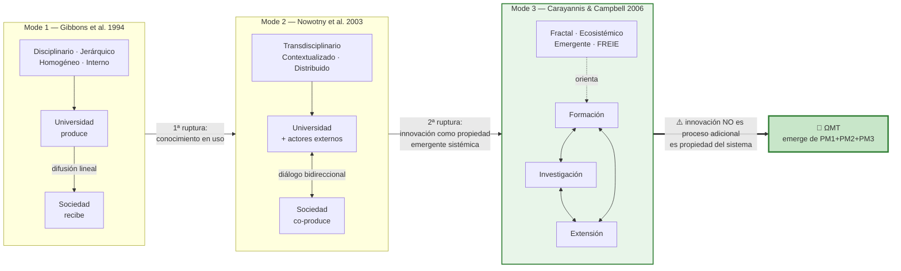

*Fig-MI12-08 — Evolución Mode 1 → Mode 2 → Mode 3: la innovación como propiedad emergente sistémica, no como proceso adicional*

*Figura 08 · evolucion mode 1 2 3*

> [!important] Implicación para el ciclo virtuoso
> En Mode 3, la innovación **no puede ser un cuarto proceso** porque no es un proceso paralelo que se añade: es la propiedad que emerge cuando PM1, PM2 y PM3 se conectan sistémicamente.

### §2.2 Triple, Quadruple y Quintuple Helix

| Modelo | Autores | Actores | Implicación |
|--------|---------|---------|-------------|
| **Triple Helix** | Etzkowitz & Leydesdorff [-@etzkowitz1995triplehelix] | Universidad-Industria-Gobierno | La innovación emerge en las interfaces, no dentro de un actor |
| **Quadruple Helix** | Carayannis & Campbell [-@carayannis2009quadruple] | + Sociedad civil y medios | La universidad como agente de democracia cognitiva |
| **Quintuple Helix** | Carayannis et al. [-@carayannis2012quintuple] | + Entorno natural | La innovación debe ser ecológicamente consciente |

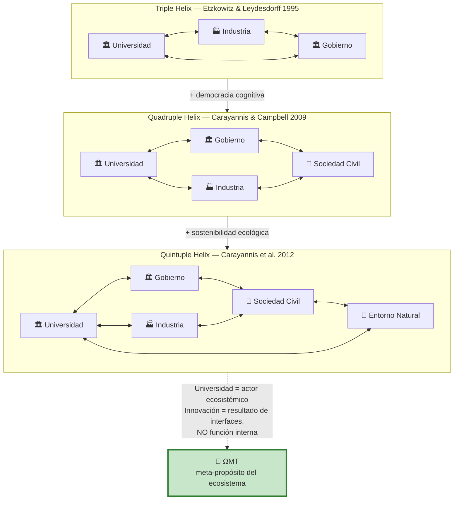

*Fig-MI12-09 — Expansión de actores en el modelo de hélices: la innovación como fenómeno de interfaces ecosistémicas*

*Figura 09 · triple quadruple quintuple helix*

La universidad en el modelo de hélices es un *actor ecosistémico*, no una máquina de cuatro engranajes. La innovación no es función interna: es resultado de la interacción del ecosistema.

### §2.3 La Universidad Emprendedora: Clark y Etzkowitz

**Clark** [-@clark1998entrepreneurial] estudia cinco universidades europeas transformadas y extrae cinco vías simultáneas de transformación.

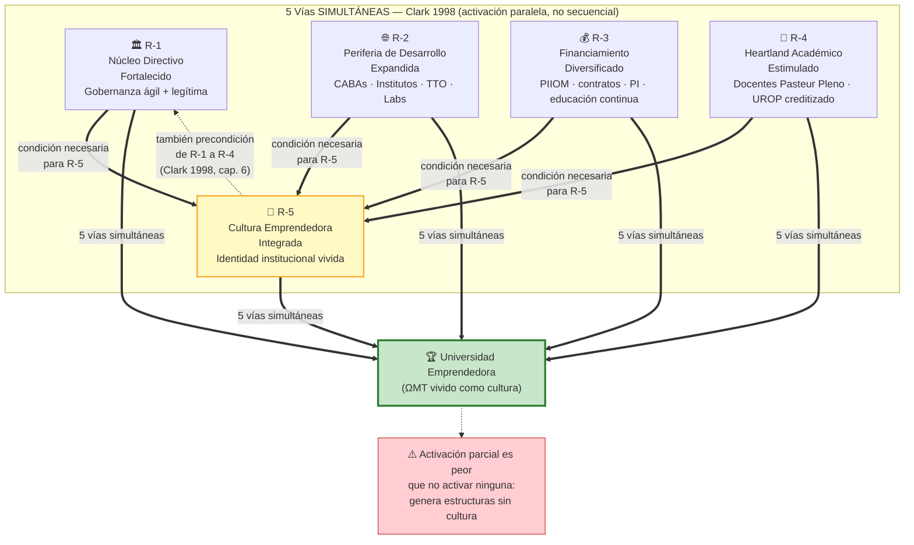

*Fig-MI12-10 — Las 5 vías de Clark (1998): simultáneas, interdependientes, con R-5 como resultado y precondición*

*Figura 10 · cinco vias clark*

> La vía más relevante (y la más difícil) es R-5: la cultura emprendedora **no es un departamento** sino una **propiedad cultural transversal**. Clark no propone crear una "oficina de emprendimiento" sino transformar la institución entera.

**Etzkowitz** [-@etzkowitz2003quasifirms] describe la segunda revolución académica: si la primera integró la investigación (modelo humboldtiano), la segunda integra la innovación como función orgánica. La "entrepreneurial university" no tiene un departamento de innovación: *se convierte ella misma en una organización innovadora*.

### §2.4 Perspectiva Multi-Nivel (MLP) — Geels

**Geels** [-@geels2002mlp; -@geels2007typology] explica cómo ocurren las transiciones sociotécnicas mediante tres niveles anidados:

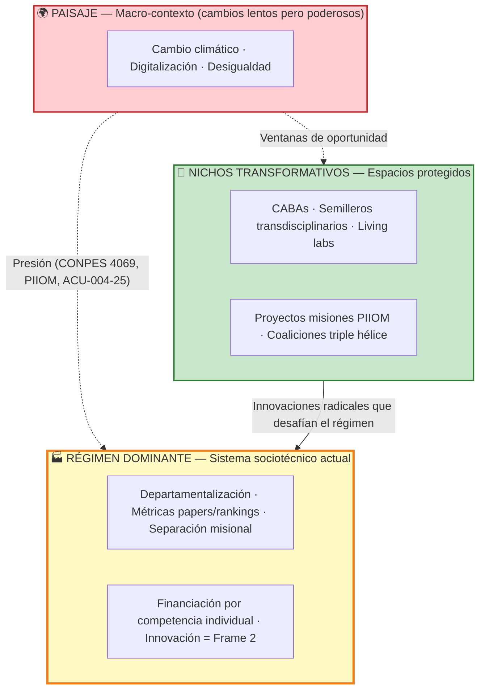

*Fig-MI12-05 — [[glo-mlp-geels|MLP]] de Geels aplicado a UDFJC: Paisaje, Régimen dominante y Nichos transformativos*

*Figura 05 · mlp geels*

**Geels & Schot** [-@geels2007typology] identifican cuatro patrones de transición según la naturaleza de la presión del paisaje y la madurez de los nichos:

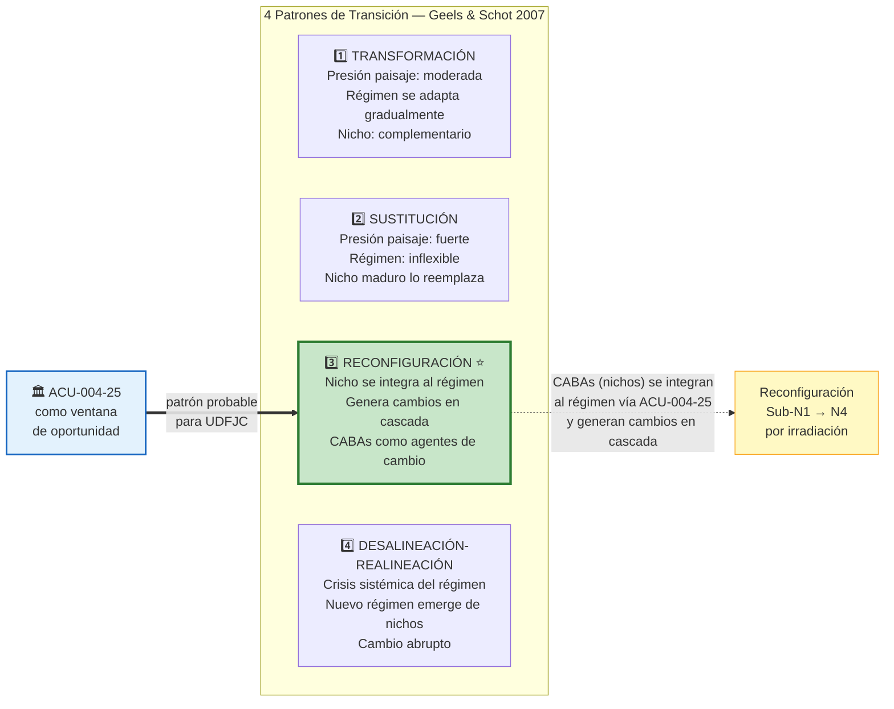

*Fig-MI12-11 — 4 patrones de transición sociotécnica (Geels & Schot, 2007): el patrón de Reconfiguración es el más probable para UDFJC*

*Figura 11 · cuatro patrones transicion geels*

> [!info] El ACU-004-25 como ventana de oportunidad
> La reforma estatutaria es exactamente el tipo de perturbación de paisaje que puede acelerar la Reconfiguración: legitima los nichos, les da marco legal y los conecta con financiamiento PIIOM.

### §2.5 Tres Marcos de Política de Innovación — Schot & Steinmueller

[@schot2018frame3] proponen tres marcos históricos evolutivos:

| Marco | Período | Pregunta | Mecanismo | Limitación |
|-------|---------|---------|-----------|-----------|
| **[[glo-frame-1|Frame 1]]**: R&D | 1945-1980s | ¿Cómo producir más ciencia? | Inversión en investigación básica → spillovers | Lineal; no garantiza impacto social |
| **Frame 2**: Sistemas de Innovación | 1980s-2010s | ¿Cómo conectar actores? | Redes, clusters, triple helix | Crecimiento económico como fin; no cuestiona dirección |
| **Frame 3**: Cambio Transformativo | 2010s→ | ¿*Hacia dónde* dirigir la innovación? | **Direccionalidad** → misiones transformativas | Requiere repensar el propósito institucional |

```mermaid
flowchart LR
    subgraph F1["Frame 1 — R&D (1945–1980s)"]
        Q1["❓ ¿Cómo producir<br/>más ciencia?"]
        M1["📊 Inversión investigación<br/>básica → spillovers"]
        L1["❌ Lineal<br/>No cuestiona dirección"]
    end
    subgraph F2["Frame 2 — Sistemas de Innovación (1980s–2010s)"]
        Q2["❓ ¿Cómo conectar<br/>actores?"]
        M2["🕸️ Redes · clusters<br/>Triple Helix"]
        L2["❌ Crecimiento econ.<br/>como fin único"]
    end
    subgraph F3["Frame 3 — Cambio Transformativo (2010s→)"]
        Q3["❓ ¿HACIA DÓNDE<br/>dirigir la innovación?"]
        M3["🧭 Direccionalidad<br/>→ misiones transformativas"]
        L3["✅ Reorienta propósito<br/>institucional completo"]
    end
    F1 -->|"Insuficiente:<br/>no cuestiona la<br/>dirección del cambio"| F2
    F2 -->|"Insuficiente:<br/>no cuestiona el<br/>propósito institucional"| F3
    F3 ==>|"Habilita"| OMT["🧭 ΩMT<br/>Meta-Telos Transformativo<br/>UDFJC"]
    style F3 fill:#C8E6C9,stroke:#2E7D32,stroke-width:3px
    style OMT fill:#C8E6C9,stroke:#2E7D32,stroke-width:3px
    style F1 fill:#FFCDD2,stroke:#C62828
    style F2 fill:#FFF9C4,stroke:#F9A825
```

*Fig-MI12-12 — Evolución [[glo-frame-1|Frame 1]] → [[glo-frame-2|Frame 2]] → [[glo-frame-3|Frame 3]] (Schot & Steinmueller, 2018): la pregunta pasa de "cuánto" a "hacia dónde"*

*Figura 12 · evolucion frame 1 2 3*

> Frame 3 no propone una "Vicerrectoría de Transformación". Propone que *todas las políticas* de ciencia, tecnología e innovación se reorienten hacia misiones transformativas.

### §2.6 El Cuadrante de Pasteur — Stokes

[@stokes1997pasteur] desmonta la dicotomía básica/aplicada con una matriz 2×2:

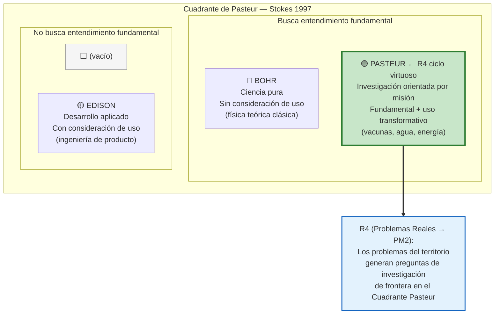

*Fig-MI12-13 — Cuadrante de Pasteur (Stokes, 1997): la retroalimentación R4 del ciclo virtuoso opera exactamente en el cuadrante Pasteur*

*Figura 13 · cuadrante pasteur*

### §2.7 La Espiral SECI y el *Ba* — Nonaka & Takeuchi

[@nonaka1995knowledgecreating] proponen que la creación de conocimiento organizacional opera como espiral continua (SECI) en contextos compartidos (*Ba*).

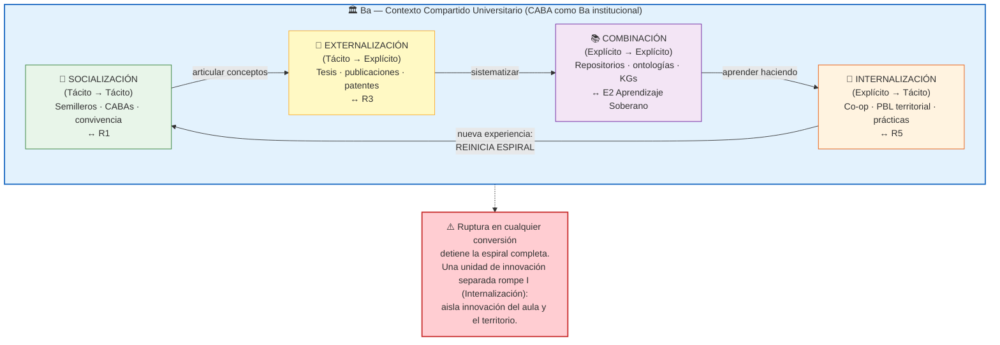

*Fig-MI12-07 — Espiral SECI de Nonaka & Takeuchi (1995) aplicada al ciclo virtuoso: la [[glo-caba|CABA]] como Ba institucional*

*Figura 07 · seci ba caba*

**La ruptura de cualquier conversión detiene la espiral**: si la investigación no se incorpora al currículo (R2 bloqueada), el conocimiento se estanca. Una unidad de innovación separada rompe estructuralmente la Internalización al aislar la innovación del aula y el territorio.

### §2.8 Competencias de Núcleo — Prahalad & Hamel

[@prahalad1990core] definen las *core competencies* como capacidades que: (1) dan acceso a múltiples mercados, (2) contribuyen significativamente al valor percibido, (3) son difíciles de imitar.

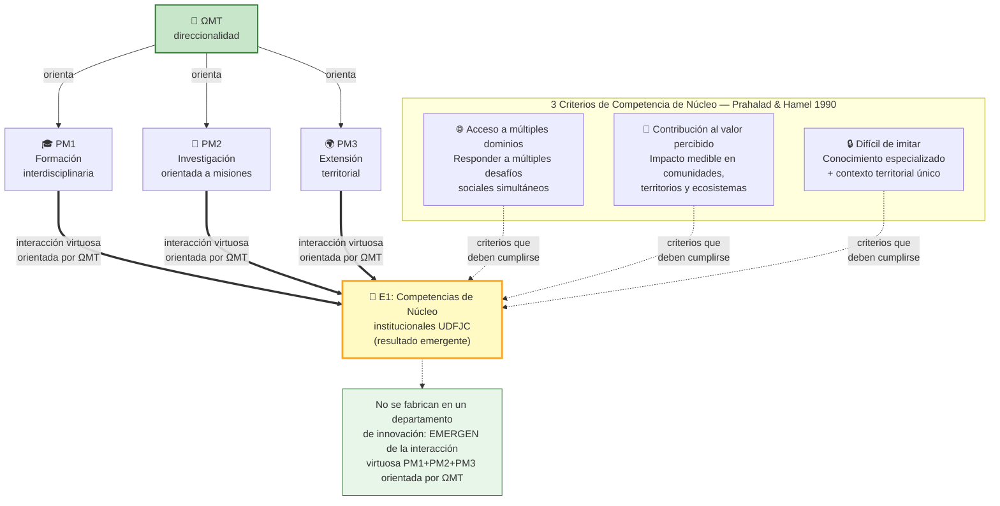

*Fig-MI12-14 — Emergencia de Competencias de Núcleo (E1): los 3 criterios de Prahalad & Hamel aplicados a IES pública*

*Figura 14 · core competencies prahalad*

Las competencias de núcleo universitarias no se fabrican en un departamento de innovación: **emergen** de la interacción virtuosa entre PM1, PM2 y PM3 orientada por ΩMT.

### §2.9 Comunidades de Práctica — Wenger

[@wenger1998cop]: las CoPs son "grupos que comparten una preocupación o pasión y aprenden a hacerlo mejor mientras interactúan regularmente". Son la unidad social primaria de aprendizaje.

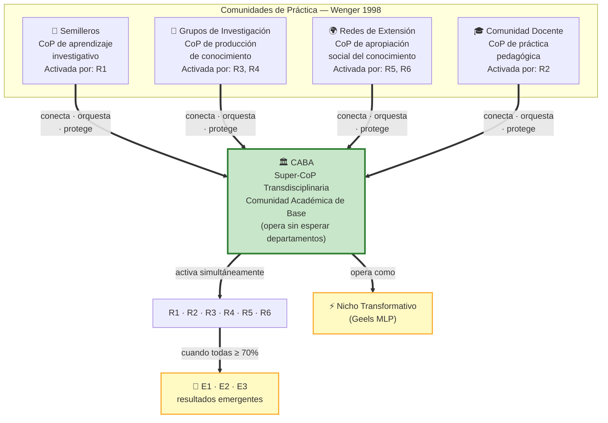

*Fig-MI12-15 — Red de CoPs convergiendo en la [[glo-caba|CABA]] como super-CoP transdisciplinaria y nodo vitalizador del ciclo virtuoso*

*Figura 15 · cops caba super cop*

### §2.10 La Tercera Misión — Compagnucci & Spigarelli

[@compagnucci2020thirdmission] concluyen que la tercera misión es un fenómeno *multidisciplinario, complejo y evolutivo* que no se reduce a transferencia tecnológica.

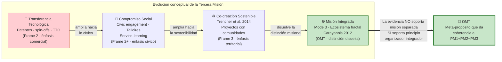

*Fig-MI12-16 — Evolución de la Tercera Misión: de transferencia tecnológica a misión integrada bajo ΩMT*

*Figura 16 · evolucion tercera mision*

**Conclusión de la literatura**: la evidencia **no soporta** una cuarta misión separada. Sí soporta un principio organizador que dé coherencia y direccionalidad a las tres existentes.

### §2.11 Modelo de Sistemas Viables — Beer

[@beer1979heart] propone el VSM: cinco sistemas anidados donde System 5 (identidad/ethos/propósito) no es un sistema operativo más; es el que da razón de ser a los sistemas 1-4.

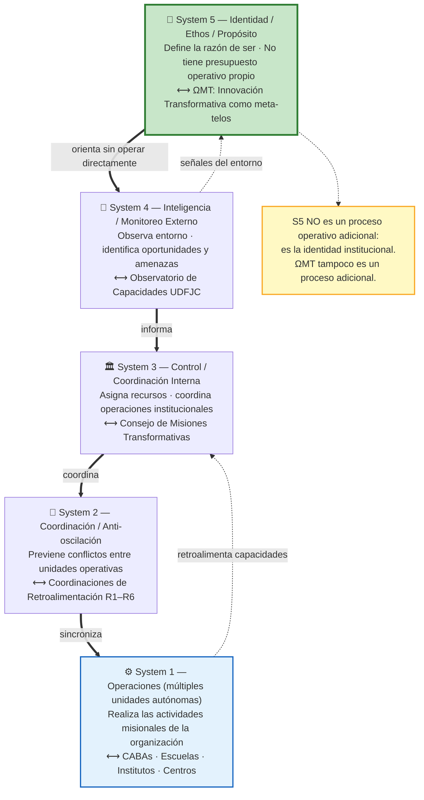

*Fig-MI12-17 — VSM de Beer (1979) aplicado a UDFJC: ΩMT como System 5, las CABAs como System 1*

*Figura 17 · vsm beer omt*

**ΩMT como System 5**: la innovación transformativa opera exactamente como System 5 — define la identidad institucional y la dirección estratégica sin ser una unidad operativa.

### §2.12 Seis Dimensiones de Gestión de Transiciones — Markard et al.

[@markard2012transitions; @kohler2019agenda] proponen que cualquier transición sociotécnica debe gestionarse en seis dimensiones interdependientes.

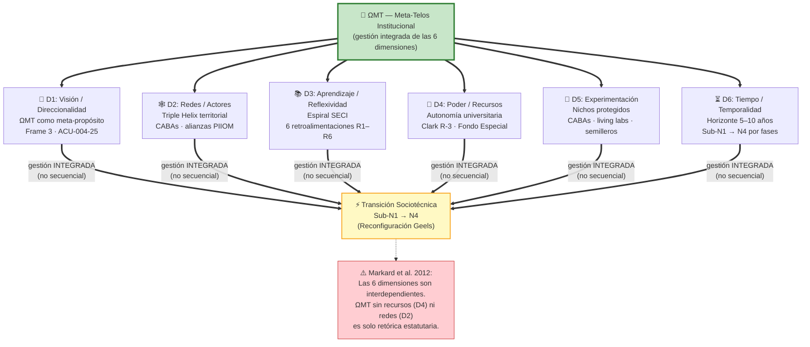

*Fig-MI12-18 — Las 6 dimensiones de Markard et al. (2012) integradas bajo ΩMT para la transición UDFJC Sub-N1 → N4*

*Figura 18 · seis dimensiones markard*

> Las seis dimensiones deben gestionarse de manera integrada. Un ΩMT sin recursos (Dimensión 4) ni redes (Dimensión 2) es solo retórica.

---

## §3 · Metodología

Esta sección es un **estudio de síntesis documental y conceptual** basado en monografías (Clark, Beer, Stokes, Nonaka), artículos académicos (Schot & Steinmueller, Geels, Carayannis & Campbell), declaraciones globales (MCU 2020), reportes (UNESCO 2021), políticas públicas (CONPES 4069, PIIOM) y la normativa UDFJC (ACU-004-25). Procedimiento: síntesis analítica de los 12 marcos teóricos → contraste con 5 casos globales (Aalto, Twente, Stanford d.school, MIT, ECIU) → derivación del modelo de ciclo virtuoso → aplicación al contexto UDFJC con diagnóstico Sub-N1.

---

## §4 · Hallazgos

### §4.1 ΩMT como Principio de Diseño para las Tres Vicerrectorías Mandatadas

#### §4.1.1 Anti-patrón histórico: los riesgos de departamentalizar la innovación

La literatura especializada documenta un patrón recurrente de fracaso en instituciones que intentan institucionalizar la innovación mediante la creación de una unidad separada —una Vicerrectoría, Dirección u Oficina de Innovación.

| Riesgo | Mecanismo | Evidencia |
|--------|-----------|-----------|
| **Encapsulamiento** | La innovación se convierte en "lo que hace la oficina" | [@clark1998entrepreneurial] |
| **Medición perversa** | Se miden patentes y spin-offs en vez de transformación sistémica | [@compagnucci2020thirdmission] |
| **Desconexión** | La unidad queda "al lado" de PM1-PM3, no "a través" | Ver §4.1.2 |
| **Contingencia presupuestal** | Como proceso separado, su presupuesto puede recortarse sin afectar las "misiones principales" | [@beer1979heart] |

#### §4.1.2 La evidencia a favor de ΩMT

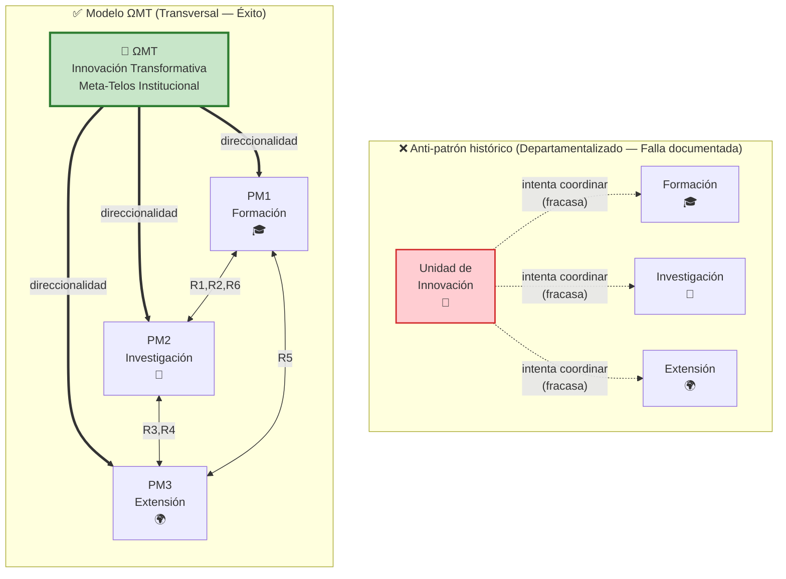

*Fig-MI12-03 — Anti-patrón departamentalizado vs. modelo transversal (ΩMT): diferencia ontológica de nivel*

*Figura 03 · anti patron vs omt*

En el modelo correcto, ΩMT está en un **nivel ontológico diferente** al de los procesos misionales: no compite con PM1-PM3 ni los sustituye; los orienta hacia misiones transformativas mientras ellos se retroalimentan mutuamente.

### §4.2 Las Seis Retroalimentaciones R1-R6

Las retroalimentaciones son **bucles bidireccionales** entre los tres procesos misionales. Cuando están activas simultáneamente, forman el ciclo virtuoso. Cuando están rotas, la universidad opera en silos y no genera resultados emergentes.

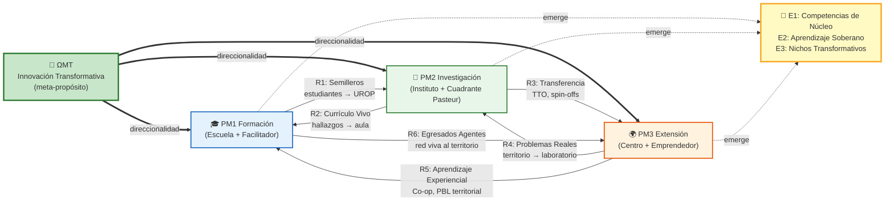

*Fig-MI12-04 — Ciclo virtuoso completo: 6 retroalimentaciones R1–R6 y 3 resultados emergentes E1–E3*

*Figura 04 · ciclo virtuoso r1 r6*

Las seis retroalimentaciones (síntesis de los detalles AS-IS/TO-BE):

- **R1 — Semilleros (PM1→PM2)**: estudiantes UROP creditizados, no voluntarios. AS-IS UDFJC: <5%; TO-BE S5: ≥70%.
- **R2 — Currículo Vivo (PM2→PM1)**: hallazgos al aula desde CRIS institucional. AS-IS UDFJC: actualizaciones cada 5-7 años; TO-BE: semestrales.
- **R3 — Transferencia (PM2→PM3)**: TTO, spin-offs, contratos territoriales. AS-IS UDFJC: $0 COP en TTO; TO-BE: oficina activa, >3 disclosures/año.
- **R4 — Problemas Reales (PM3→PM2)**: territorio surfacea preguntas Cuadrante Pasteur. AS-IS: sin mecanismo formal; TO-BE: CABAs territoriales generan >10 proyectos/año.
- **R5 — Aprendizaje Experiencial (PM3→PM1)**: co-op creditizado, PBL territorial. AS-IS: ≈0% creditizado; TO-BE: 40%+ co-op antes de graduarse.
- **R6 — Egresados Agentes (PM1→PM3)**: red viva al territorio, no solo "consiguen empleo". AS-IS: red inactiva; TO-BE: egresados activos en 20+ localidades PIIOM.

> [!warning] Condición de ciclo virtuoso
> Una escuela alcanza el estado S5 cuando sus CABAs tienen las **6 R en estado 🟢 Activa simultáneamente**. Si alguna R permanece en 🔴 Rota, el ciclo virtuoso está incompleto y el impacto misional (P1 [[glo-bsc-s|BSC-s]]) está comprometido. No existe jerarquía entre las R: romper cualquiera degrada el sistema (cf. Eq-MI12-02).

### §4.3 Los Tres Resultados Emergentes

Los resultados emergentes no se "producen" en ningún proceso específico: **emergen** de la interacción virtuosa de PM1-PM3 orientada por ΩMT.

- **E1 Competencias de Núcleo** [@prahalad1990core]: capacidades institucionales únicas, difíciles de imitar.
- **E2 Aprendizaje Soberano** [@unesco2021reimagining]: plataformas de producción y circulación de conocimiento que no dependen de infraestructuras privadas.
- **E3 Nichos Transformativos** [@geels2002mlp; @schot2018frame3]: espacios protegidos donde se ensayan modelos alternativos integrados.

### §4.4 Diagnóstico AS-IS UDFJC: La Condición Sub-N1

> [!info] Fuente de la taxonomía
> La taxonomía N1-N4 de madurez universitaria es resultado del proyecto de investigación **BMK-001** [@maderasepulveda2026bmk001] que analizó 21 instituciones de referencia global con 751 documentos normativos.

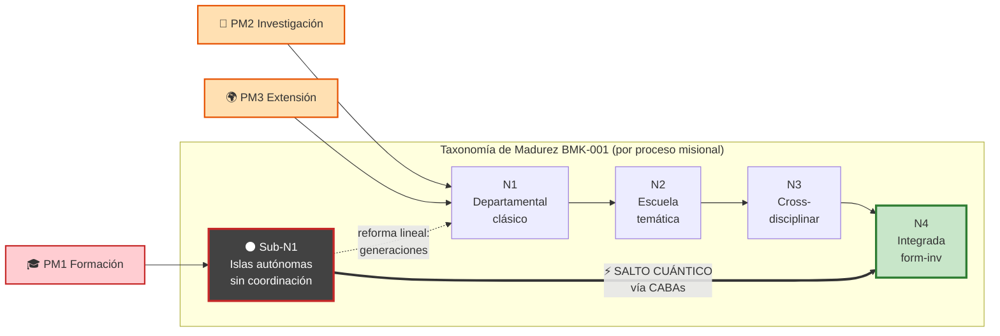

*Fig-MI12-19 — Posición UDFJC AS-IS en la taxonomía BMK-001: Sub-N1 en Formación, N1 en Investigación y Extensión*

*Figura 19 · taxonomia bmk 001*

> [!warning] La UDFJC no es N1 uniforme
> El diagnóstico BMK-001 revela que la UDFJC tiene **tres estadios distintos por proceso misional**: Sub-N1 en Formación (sin departamentos reales, solo islas programa), N1 incipiente en Investigación (82 grupos Minciencias, 200+ semilleros sin crédito) y N1 en Extensión. La reforma lineal tardaría generaciones. La ruta propuesta es el salto cuántico vía CABAs.

#### §4.4.2 El salto cuántico: Sub-N1 → N4 vía nichos

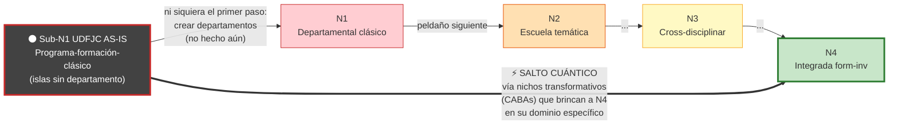

*Fig-MI12-06 — Taxonomía Sub-N1 → N4 con salto cuántico mediado por CABAs (patrón de Reconfiguración Geels)*

*Figura 06 · salto cuantico caba*

La reforma lineal (Sub-N1 → N1 → N2 → N3 → N4) tomaría generaciones y casi siempre fracasa. La alternativa es activar **nichos transformativos** (CABAs, escuelas piloto) que salten directamente a N4 en su dominio específico.

### §4.5 Las Cinco Vías de Clark: traducción al contexto UDFJC

[@clark1998entrepreneurial] demostró que las universidades que se transformaron con éxito activaron las cinco vías **simultáneamente**, no secuencialmente. La activación parcial es peor que no activar ninguna.

> [!info] Nomenclatura: R-1 a R-5 (Clark) vs. R1 a R6 (retroalimentaciones)
> Las cinco vías de Clark se etiquetan **R-1 a R-5** (con guion) siguiendo la literatura canónica y son distintas de las seis retroalimentaciones **R1-R6** (sin guion) del ciclo virtuoso (§4.2). También son distintas de los seis riesgos de transición **RT1-RT6** introducidos en §01.

| Vía Clark | Nombre | Traducción UDFJC | Rol-palanca |
|-----------|--------|-----------------|-------------|
| **R-1** | Núcleo Directivo Fortalecido | Consejo de Escuela + Director + CABAs con autonomía + Rectoría ejecutando ACU-004-25 sin parálisis | 🏛️ Director |
| **R-2** | Periferia de Desarrollo Expandida | CABAs + Institutos temáticos + Centros de Extensión + convenios Alcaldía/SED/empresas | 🌍 Emprendedor + 🔬 Investigador |
| **R-3** | Base de Financiamiento Diversificada | Fondo Especial + fondos PIIOM M1-M5 + educación continua + contratos + licencias PI | 🌍 Emprendedor + 🏛️ Director |
| **R-4** | Heartland Académico Estimulado | 70%+ docentes como "Pasteur Pleno" + UROP creditizado + Plan individual docente + PBL + UDL | 🔬 Investigador + 🎤 Formador |
| **R-5** | Cultura Emprendedora Integrada | Estudiantes construyen portafolio [[glo-cca|CCA]]; investigar es lo normal; servir al territorio es identidad colectiva | 🎓 Estudiante Soberano + todos los roles |

### §4.6 La CABA como Nodo Vitalizador

La **Comunidad Académica de Base ([[glo-caba|CABA]])** es el dispositivo operativo que hace posible el salto cuántico Sub-N1 → N4:

1. **Conecta** docentes de múltiples programas sin esperar que la institución cree departamentos.
2. **Activa** las 6 retroalimentaciones R1-R6 mediante Paquetes CCA (Competencia-Conocimiento-Atómica), la unidad mínima indivisible que certifica V1 Comprensiva ∧ V2 Experimental ∧ V3 Transformativa simultáneamente [@maderasepulveda2026bmk002].
3. **Opera como nicho transformativo** dentro del régimen sub-N1 actual.
4. **Escala** desde una escuela piloto hacia el resto de la institución (Reconfiguración).

### §4.7 Casos Globales Comparados

| Universidad | País | Mecanismo de innovación | Lección principal |
|------------|------|------------------------|-------------------|
| **Aalto University** | Finlandia | Aalto Design Factory: plataforma co-creación, no departamento | Fusionar las 3 misiones bajo un principio integrador produce resultados superiores |
| **University of Twente** | Países Bajos | DesignLab como hub transdisciplinario; programa University Innovation Fellows | Innovación como cultura (no como oficina) |
| **Stanford d.school** | EE.UU. | Plataforma interdisciplinaria sin títulos ni facultad propia; *design thinking* como meta-capacidad | La innovación puede institucionalizarse como plataforma transversal sin ser un proceso misional separado |
| **MIT** | EE.UU. | The Engine (tough tech) + convergence research | Cuadrante de Pasteur a escala institucional |
| **ECIU** (14 universidades) | Europa | Challenge-based learning + micro-credenciales | Redes de universidades que comparten el meta-propósito amplían los nichos |

**Patrón común**: ninguna de estas instituciones tiene una "Vicerrectoría de Innovación". Todas han dispersado la innovación como **capacidad organizacional** transversal.

---

## §5 · Discusión

### §5.1 ACU-004-25: Lo que ya implementa y lo que requiere política operativa

> [!success] ✅ Lo que ACU-004-25 ya implementa
>
> | Implicación | Descripción |
> |------------|-------------|
> | **Estructura tripartita consolidada** | ACU-004-25 establece con precisión las tres vicerrectorías (PM1, PM2, PM3) como la arquitectura misional correcta, evitando el anti-patrón de la departamentalización de la innovación |
> | **Marco de autonomía y gobernanza** | El estatuto provee el marco de autonomía universitaria (Clark R-1: Núcleo Directivo Fortalecido) necesario para que las CABAs operen como nichos protegidos |
> | **Alineación con PIIOM** | Establece los fundamentos para articular las tres vicerrectorías con el PIIOM 2022-2026 [@minciencias2022piiom] y con el CONPES 4069 [@conpes2021cti] |

> [!warning] ⏳ Lo que requiere política operativa
>
> | Implicación | Descripción |
> |------------|-------------|
> | **Institucionalizar las 6 retroalimentaciones R1-R6** | Cada R requiere políticas transversales entre vicerrectorías: R1→política de semilleros creditizados, R2→mandato curricular de actualización semestral, R3→componente obligatorio de extensión en investigación, R4→mecanismo de captura territorial, R5→co-op creditizado, R6→red de egresados transformativa |
> | **Medir resultados emergentes, no outputs departamentales** | No contar papers de una oficina; medir competencias de núcleo consolidadas (E1), espacios soberanos creados (E2), % agenda autónoma, nichos transformativos activos (E3) |
> | **Mecanismos de protección CABA** | Las CABAs como nichos transformativos necesitan protección formal: autonomía curricular, presupuesto propio, autorización para créditos UROP. Sin estos mecanismos, los nichos son absorbidos y domesticados |
> | **Base de financiamiento diversificada** | Clark R-3 requiere política activa: Fondo Especial operativo + fondos PIIOM M1-M5 + educación continua + contratos + licencias PI. La dependencia de una sola fuente es el mayor riesgo |

### §5.2 Gobernanza VSM para ΩMT

| Componente | Función | Analogía VSM |
|-----------|---------|--------------|
| **Consejo de Misiones Transformativas** | Define direcciones y misiones ΩMT | System 5 (Identity) |
| **Observatorio de Capacidades** | Monitorea competencias de núcleo y retroalimentaciones R1-R6 | System 4 (Intelligence) |
| **Coordinaciones de Retroalimentación** | Implementa R1-R6 como interfaces entre PMs | System 2 (Coordination) |
| **CABAs** | Unidades operativas que ejecutan el ciclo virtuoso | System 1 (Operations) |

### §5.3 El riesgo del Sub-N1 ignorado

El error más frecuente en las reformas universitarias latinoamericanas es aplicar modelos N4 a condiciones Sub-N1 sin un diagnóstico previo del escalón real. La ruta correcta es: **diagnóstico Sub-N1 honesto → activación de nichos (CABAs piloto) → demostración de N4 en escala reducida → irradiación gradual**.

### §5.4 Tensiones no resueltas

1. **Tensión autonomía-responsabilidad**: La MCU 2020 exige "libertad positiva para contribuir", pero las universidades públicas colombianas operan con restricciones presupuestales que limitan la diversificación de financiamiento (Clark R-3).

2. **Tensión métricas-cultura**: Los sistemas de evaluación docente (Minciencias CvLAC, SciVal) continúan incentivando el Frame 2 (papers indexados, citaciones). Sin reforma del sistema de incentivos, el Heartland Académico (Clark R-4) no se estimulará.

3. **Tensión nicho-régimen**: Las CABAs como nichos transformativos necesitan *protección* del régimen sub-N1 dominante. Sin mecanismos formales, los nichos son absorbidos y domesticados.

---

## §6 · Conceptos Clave

| Concepto | Definición en esta sección | Fuente externa |
|----------|----------------------------|--------|
| **ΩMT** | Meta-Telos de Innovación Transformativa: principio rector (System 5 VSM) que orienta PM1-PM3 sin ser un proceso operativo | [@beer1979heart] |
| **PM1, PM2, PM3** | Procesos misionales: Formación, Investigación, Extensión | [@udfjc2025acu00425] |
| **R1-R6** | Seis retroalimentaciones bidireccionales entre procesos misionales | §4.2 |
| **E1, E2, E3** | Tres resultados emergentes: Competencias de Núcleo, Aprendizaje Soberano, Nichos Transformativos | §4.3 |
| **CABA** | Comunidad Académica de Base: super-CoP que conecta programas y activa R1-R6 mediante Paquetes CCA | [@maderasepulveda2026bmk002] |
| **CCA** | Competencia-Conocimiento-Atómica: unidad mínima indivisible V1∧V2∧V3 | [@maderasepulveda2026bmk002] |
| **Sub-N1** | Estadio organizacional más precario que N1 departamental | [@maderasepulveda2026bmk001] |
| **Salto cuántico** | Transición Sub-N1 → N4 mediada por nichos transformativos sin pasar por todos los escalones | [@geels2002mlp] |

Glosario consolidado del capítulo (transclusiones desde `60-glosario/`):

![[glo-omt]]

![[glo-procesos-misionales-pm1-pm2-pm3]]

![[glo-retroalimentaciones-r1-r6]]

![[glo-resultados-emergentes-e1-e3]]

![[glo-caba]]

![[glo-cca]]

![[glo-taxonomia-sub-n1-n4]]

![[glo-salto-cuantico-sub-n1-n4]]

![[glo-cinco-vias-clark]]

![[glo-anti-patron-departamentalizacion]]

---

## §7 · Deudas Técnicas

| ID | Descripción | Impacto | Sección afectada |
|----|-------------|---------|-----------------|
| **DT-MI12-02-01** | Cuantificación de indicadores AS-IS para R1-R6 en UDFJC: los estados 🔴 descritos son estimaciones cualitativas; se necesitan datos SICIUD/CRIS para calibración exacta | Alto | §4.2 |
| **DT-MI12-02-02** | Calibración de pesos $w_k$ en la fórmula de intensidad (cf. Eq-MI12-01): los pesos actuales son conceptuales (confianza 0.4-0.5) | Alto | Eq-MI12-01 |
| **DT-MI12-02-03** | Definición formal de criterios de protección de nicho (CABA): ¿qué mecanismos estatutarios específicos del ACU-004-25 protegen a las CABAs del régimen sub-N1? | Medio | §5.3 |
| **DT-MI12-02-04** | Casos colombianos equivalentes: el análisis se basa en referencias globales (Aalto, Twente, MIT). Falta sistematización de casos colombianos (UNAL Medellín, UPB, EIA) | Bajo | §4.7 |
| **DT-MI12-02-05** | **Decisión terminológica CCA**: la denominación "Competencia-Conocimiento-Atómica (CCA)" es estructuralmente precisa pero puede refinarse. Opciones: (a) Atómica (actual); (b) Transformativa (CCT, riesgo de colisión con V3); (c) Articulada (mantiene acrónimo). Recomendación preliminar: mantener "Atómica" + nota aclaratoria | Medio | §4.6, §6 |

---

## §8 · Implicaciones operativas del modelo ΩMT

| Iniciativa de la reforma (ACU-004-25) | Implicación de esta sección |
|---------------|------------------------------|
| **I1 — Escuelas que Aprenden** | La escuela debe activar R1 (semilleros creditizados) + R2 (currículo vivo) como condición mínima. El papel del Formador es activar el Heartland (Clark R-4). |
| **I2 — Institutos que Inventan** | El Instituto es el nodo de PM2; debe activar R3 (transferencia) + R4 (problemas reales) y operar exclusivamente en el Cuadrante de Pasteur. |
| **I3 — Centros que Emprenden** | El Centro es el nodo de PM3; debe activar R5 (aprendizaje experiencial) + R6 (egresados agentes) y operar como Periferia de Desarrollo (Clark R-2). |
| **I4 — Campus Regenerativo** | El Campus es el living lab donde las 6 R se visibilizan físicamente. La CABA que instala la turbina solar demuestra R4 (problema real) + R5 (aprendizaje experiencial) + R3 (transferencia a planta física). |
| **I0 — Reforma Vinculante** | El ACU-004-25 es la intervención de Paisaje (Geels) que legitima y financia los nichos (CABAs). Sin I0, los nichos no tienen protección estatutaria. |

---

## §9 · Referencias

Compiladas automáticamente desde `99--sources/citations.bib` mediante Pandoc Citeproc.

---

## §10 · 🖼️ Figuras transcluidas

| ID | Título | Origen |
|----|--------|---------|
| Fig-MI12-03 | Anti-patrón departamentalizado vs. modelo transversal (ΩMT) | M02 §4.1.2 |
| Fig-MI12-04 | Ciclo virtuoso completo con 6 retroalimentaciones R1-R6 | M02 §4.2 |
| Fig-MI12-05 | MLP de Geels aplicado a UDFJC | M02 §2.4 |
| Fig-MI12-06 | Salto cuántico Sub-N1 → N4 vía CABAs | M02 §4.4.2 |
| Fig-MI12-07 | Espiral SECI aplicada al ciclo virtuoso (Ba = CABA) | M02 §2.7 |
| Fig-MI12-08 | Evolución Mode 1 → Mode 2 → Mode 3 | M02 §2.1 |
| Fig-MI12-09 | Triple → Quadruple → Quintuple Helix | M02 §2.2 |
| Fig-MI12-10 | Clark 5 vías simultáneas | M02 §2.3 |
| Fig-MI12-11 | 4 patrones de transición (Geels & Schot, 2007) | M02 §2.4 |
| Fig-MI12-12 | Frame 1 → Frame 2 → Frame 3 | M02 §2.5 |
| Fig-MI12-13 | Cuadrante de Pasteur 2×2 | M02 §2.6 |
| Fig-MI12-14 | Competencias de Núcleo emergente | M02 §2.8 |
| Fig-MI12-15 | Red de CoPs convergiendo en CABA super-CoP | M02 §2.9 |
| Fig-MI12-16 | Evolución de la Tercera Misión | M02 §2.10 |
| Fig-MI12-17 | VSM de Beer aplicado a UDFJC | M02 §2.11 |
| Fig-MI12-18 | 6 dimensiones de Markard et al. | M02 §2.12 |
| Fig-MI12-19 | Posición UDFJC AS-IS en taxonomía BMK-001 | M02 §4.4 |

---

## §11 · ⚗️ Ecuaciones

![[eq-MI12-01--intensidad-retroalimentacion]]

![[eq-MI12-02--condicion-ciclo-virtuoso]]

---

## §12 · 🏹 Estrategia de Aplicación

![[est-MI12-02--secuencia-activacion-ciclo]]

---

## §13 · 📚 Ejemplo Resuelto

![[ej-MI12-02--diagnostico-ciclo-virtuoso-cba-fisica]]

---

## §14 · ✅ Evalúa tu Comprensión

![[pa-MI12-02--ciclo-virtuoso]]

---

## §15 · 🧩 Problemas de Aplicación

![[prb-MI12-04]]

![[prb-MI12-05]]

![[prb-MI12-06]]

---

## Historial de Versiones §02

| Versión | Fecha | Cambios |
|---|---|---|
| 1.0.0 | 2026-04-25 | Atomización inicial desde M02-ciclo-virtuoso-v3.1.0 (origen: `2-resultado-consolidados/M02-ciclo-virtuoso/M02-ciclo-virtuoso-v3.md`). Migración a estructura de capítulo cap-MI12 con transclusiones a `02-figuras/` (17 figuras Mermaid extraídas), `10-ecuaciones/` (2 ecuaciones), `20-estrategias/`, `30-ejemplos/`, `40-problemas/`, `41-preguntas-analisis/`, `60-glosario/`. Wikilinks limpios. |

---

*CC BY-SA 4.0 · Carlos Camilo Madera Sepúlveda · UDFJC · 2026-04-25 · sec-MI12-02 v1.0.0*
