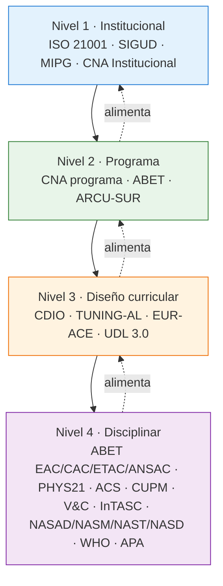
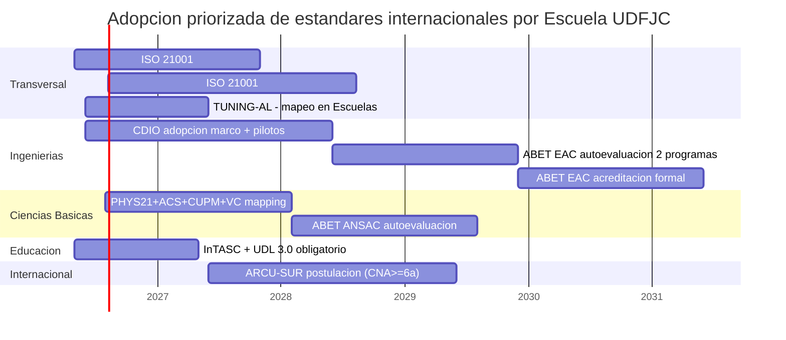

# §03 · BPA-002 Estándares Internacionales para la Calidad Educativa: OECD 2030, UDL, ABET, CDIO, ISO 21001

> [!abstract] 📄 Propiedad Intelectual & Ciencia Abierta
> **Autor**: Carlos Camilo Madera Sepúlveda · CC BY-SA 4.0 · UDFJC · 2026
> **Cita sugerida**: Madera Sepúlveda, C. C. (2026). §03 · Estándares Internacionales para la Calidad Educativa. *Capítulo MI-12* (cap-MI12, Sección 3). UDFJC. [DOI pendiente]

---

## §0 · Abstract y Metas de Aprendizaje

> [!abstract] §0 · Abstract
> Esta sección mapea el sistema internacional de estándares de calidad educativa aplicables a la reforma curricular de la UDFJC bajo el ACU-004-25. Se documentan doce estándares clave organizados en cuatro capas lógicas: (i) **marco aspiracional** (OECD Education 2030 / Learning Compass [@oecd2018learningcompass]; UDL 3.0 [@cast2024udl3]); (ii) **eje epistemológico transversal** (Cuadrante Pasteur de Stokes [-@stokes1997pasteur] y MIT UROP como realización empírica); (iii) **acreditación programática disciplinar** (ABET EAC/CAC/ETAC/ANSAC [@abet2024criteria]; [[glo-cdio-syllabus|CDIO Syllabus v3.0]] [@crawley2014cdio]; EUR-ACE; TUNING-AL [@beneitone2007tuning]; ARCU-SUR); y (iv) **gestión institucional** ([[glo-iso-21001|ISO 21001:2018]] [@iso2018eoms]). El estándar Cognia se incluye con marca DEPRECATED porque no acredita educación superior con títulos. Para cada estándar se declaran los **6 roles docentes [[glo-jtbd-christensen|JTBD]]** (🎓 Estudiante Soberano · 🏛️ Director · 🎨 Diseñador · 🎤 Formador · 🔬 Investigador Pasteur · 🌍 Emprendedor), su articulación con la normatividad colombiana (Ley 30/1992, Decreto 1330/2019, Decreto 1421/2017, Lineamientos CNA) y sus indicadores de adopción. La sección cierra con un heatmap de aplicabilidad **9 Escuelas UDFJC × 8 estándares**, un análisis de gaps críticos, rutas de adopción prioritaria por Escuela y un ejemplo resuelto de ABET EAC aplicado al programa de Ingeniería de Sistemas UDFJC.
>
> **Palabras clave**: estándares internacionales, OECD 2030, Learning Compass, UDL 3.0, ABET, CDIO, ISO 21001, TUNING-AL, ARCU-SUR, Cuadrante Pasteur, MIT UROP, calidad educativa, UDFJC.

### Metas de aprendizaje

Al finalizar la lectura el lector podrá:
1. Diferenciar las cuatro capas del sistema internacional de estándares (aspiracional, epistemológico, disciplinar, gestión) y seleccionar cuál aplica a qué decisión de la reforma.
2. Distinguir los seis roles docentes JTBD y mapearlos a estándares específicos.
3. Aplicar el heatmap 9 Escuelas × 8 estándares para definir la ruta de adopción prioritaria de su Escuela.
4. Identificar gaps críticos UDFJC vs. estándares internacionales y proponer mitigaciones.

---

## §1 · Introducción

### §1.1 El problema: una reforma sin mapa de estándares

La reforma estatutaria UDFJC (ACU-004-25) mandata transformación curricular sin especificar qué estándares internacionales de calidad deben adoptarse. La sección §02 (ciclo virtuoso ΩMT) provee el modelo organizativo, §01 provee el mandato normativo, pero **falta el mapa de estándares de calidad** que opere como parámetro técnico de la reforma. Esta sección llena ese vacío.

> [!question] §1 · Pregunta trazadora
> ¿Qué estándares internacionales de calidad educativa son aplicables a la reforma de la UDFJC, cómo se articulan entre sí, y qué ruta de adopción priorizar por cada Escuela según su madurez actual y sus disciplinas?

### §1.2 Alcance y límites

Esta sección NO documenta estándares de gestión empresarial general (ISO 9001, EFQM) ni estándares de software-only para LMS. Documenta los 12 estándares más relevantes para la formación universitaria de pregrado, posgrado y educación continua. La aplicación operativa por Escuela se desarrolla parcialmente aquí y se complementa en otras secciones del capítulo.

### §1.3 Estructura

§2 marco teórico (Cuadrante Pasteur, sistema multi-nivel, Boyer/Healey) · §3 6 roles docentes JTBD × estándares · §4 12 estándares (STD-01 a STD-06f + STD-GLS) · §5 análisis cruzado (heatmap, normatividad, gaps) · §6 conceptos clave · §7 deudas técnicas · §8 implicaciones operativas · §9-11 figuras/ejemplos/problemas.

### §1.4 Contribución original

(1) Primer mapa consolidado de 12 estándares para reforma curricular UDFJC; (2) Matriz 6 roles JTBD × 8 estándares; (3) Heatmap 9 Escuelas × 8 estándares; (4) Articulación con normatividad colombiana (Ley 30, Decreto 1330/2019, CNA) y rutas de adopción priorizadas por Escuela.

---

## §2 · Marco Teórico

### §2.1 El Cuadrante Pasteur — eje epistemológico transversal

El [Cuadrante Pasteur](#cuadrante-pasteur) [@stokes1997pasteur] es el eje epistemológico transversal de la formación universitaria orientada a [[glo-frame-3|Frame 3]]: investigación que busca entendimiento fundamental Y consideración de uso. Esta sección desarrolla cómo OECD Learning Compass [@oecd2018learningcompass] y MIT UROP operan como realizaciones empíricas del Cuadrante Pasteur a nivel curricular.

(transcluye fig-MI12-13 desde §02 si aplica; aquí ya está disponible en el capítulo)

### §2.2 Sistema de acreditación multi-nivel

Cuatro capas:

| Capa | Función | Ejemplos |
|---|---|---|
| **Aspiracional** | Define competencias futuras del egresado | [[glo-oecd-learning-compass-2030|OECD Learning Compass 2030]], UDL 3.0 |
| **Epistemológica** | Define el modo de producir conocimiento | Cuadrante Pasteur, MIT UROP |
| **Disciplinar** | Acredita programas específicos | ABET, CDIO, EUR-ACE, TUNING-AL, ARCU-SUR |
| **Gestión institucional** | Sistema de gestión calidad | ISO 21001:2018 |

### §2.3 Boyer (1990) y Healey: 4 maneras de articular investigación-docencia

Boyer (1990) y Healey (2005) identifican cuatro maneras de articular investigación con docencia: research-led (transmisión), research-oriented (proceso), research-based (descubrimiento), research-tutored (discusión). UROP (MIT) es research-based. La taxonomía guía la selección de estrategias por estándar.

---

## §3 · Roles docentes y su relación con los estándares

### §3.1 Los 6 roles JTBD

Los seis roles docentes (referencia §02 y §04 del capítulo): 🎓 Estudiante Soberano · 🏛️ Director de Escuela · 🎨 Diseñador Curricular · 🎤 Formador · 🔬 Investigador Pasteur · 🌍 Emprendedor.

### §3.2 Matriz roles × estándares

*Fig-MI12-20 — Matriz roles [[glo-jtbd-christensen|JTBD]] × estándares (M03)*

*Figura 20 · matriz roles jtbd estandares*

> [!bug] DT-MI12-03-01 — Detalle por celda de matriz roles × estándares pendiente de ampliación
> La fig-MI12-20 muestra la matriz visual; el detalle textual de cada celda (qué hace cada rol con cada estándar) está en M03 §3.2 original (`2-resultado-consolidados/M03-estandares-internacionales/M03-estandares-internacionales.md`) y debe migrarse a esta sección como tablas en versiones futuras.

---

## §4 · Mapa de estándares internacionales

Cada estándar se documenta en su archivo de glosario atómico transcluido aquí.

### §4.1 STD-01 · OECD Education 2030 / Learning Compass

![[glo-oecd-learning-compass-2030]]

### §4.2 STD-02 · UDL 3.0 — Universal Design for Learning

![[glo-udl-3]]

### §4.3 STD-03 · Cognia — DEPRECATED para educación superior

> [!warning] Cognia es para educación K-12, no acredita programas universitarios con títulos. Usarlo en debates sobre reforma UDFJC constituye un anti-patrón.

### §4.4 STD-04 · Cuadrante Pasteur / Use-Inspired Research

![[glo-cuadrante-pasteur]]

### §4.5 STD-05 · MIT UROP / Research-Based Learning

UROP (Undergraduate Research Opportunities Program) en MIT integra estudiantes de pregrado en proyectos de investigación de frontera con créditos académicos. Modelo paradigmático de R1 (Semilleros) del ciclo virtuoso §02. Aplicable como referente para "Investigación creditizada en pregrado" en UDFJC.

### §4.6 STD-06a · ABET (EAC/CAC/ETAC/ANSAC)

![[glo-abet-acreditacion]]

### §4.7 STD-06b · CDIO Syllabus v3.0

![[glo-cdio-syllabus]]

### §4.8 STD-06c · EUR-ACE (ENAEE)

EUR-ACE (European Accredited Engineer) es el sello de la European Network for Accreditation of Engineering Education (ENAEE). Permite reconocimiento profesional cross-Europa. Relevante para programas de Ingeniería UDFJC con pretensiones de movilidad internacional.

### §4.9 STD-06d · TUNING América Latina

![[glo-tuning-america-latina]]

### §4.10 STD-06e · ISO 21001:2018 — EOMS

![[glo-iso-21001]]

### §4.11 STD-06f · ARCU-SUR / MERCOSUR

ARCU-SUR es el Sistema de Acreditación Regional de Carreras Universitarias del MERCOSUR. Reconoce 7 disciplinas: Agronomía, Arquitectura, Enfermería, Ingeniería, Medicina, Odontología, Veterinaria. Colombia no es miembro de MERCOSUR pero ARCU-SUR opera como referente regional.

### §4.12 STD-GLS · Estándares disciplinares Ciencias Básicas

IUPAP (International Union of Pure and Applied Physics), AAPT (American Association of Physics Teachers), APS (American Physical Society), FCI (Force Concept Inventory) y CSEM (Conceptual Survey of Electricity and Magnetism). Aplicables a programas de Física y Ciencias Básicas UDFJC.

> [!bug] DT-MI12-03-02 — Glosario de estándares disciplinares por área
> Los estándares disciplinares específicos (IUPAP, AAPT, APS para Física; ACM-IEEE para Computación; ASME para Mecánica; etc.) requieren un sub-glosario por Escuela. Pendiente de elaboración. Ver `gls-estandares-internacionales-fisica` (parcial) en research/.

---

## §5 · Análisis cruzado

### §5.1 Heatmap aplicabilidad: 9 Escuelas UDFJC × 8 estándares principales

*Fig-MI12-21 — Heatmap aplicabilidad 9 Escuelas UDFJC × 8 estándares (M03)*

*Figura 21 · heatmap escuelas estandares*

### §5.2 Articulación con normatividad colombiana

| Estándar internacional | Norma colombiana equivalente | Articulación |
|---|---|---|
| OECD Learning Compass | [[glo-conpes-4069|CONPES 4069/2021]] + PIIOM | Frame 3 común |
| ISO 21001 | Ley 30/1992 + Decreto 1330/2019 | Sistema de gestión |
| ABET/CDIO | Resolución registro calificado MEN | Acreditación programática |
| TUNING-AL | Lineamientos CNA | Competencias |
| UDL 3.0 | Decreto 1421/2017 (educación inclusiva) | Accesibilidad |

### §5.3 Gaps críticos UDFJC vs. estándares internacionales

| Gap | Severidad | Estándar de referencia |
|---|---|---|
| Sin definición formal de student outcomes por programa | 🔴 | ABET EAC, CDIO 1.0-4.0 |
| Sin sistema de mejora continua documentado | 🔴 | ABET 8 criterios, ISO 21001 cláusula 10 |
| Sin política de UDL aplicada al diseño curricular | 🔴 | UDL 3.0 |
| Sin co-op/UROP creditizado en pregrado | 🔴 | MIT UROP, CDIO 4.0 |
| Sin certificación EOMS (ISO 21001) | 🟡 | ISO 21001 |
| Sin acreditación internacional de programas (ABET/EUR-ACE) | 🟡 | ABET, EUR-ACE |

> [!bug] DT-MI12-03-03 — Análisis de gaps por Escuela específica
> El análisis §5.3 es agregado UDFJC. El detalle por Escuela (Ingeniería de Sistemas vs. Ciencias Básicas vs. Educación, etc.) requiere talleres con cada decanato. Pendiente.

### §5.4 Rutas de adopción prioritaria por Escuela

Recomendación general: cada Escuela debe priorizar (a) un estándar aspiracional (Learning Compass + UDL), (b) un estándar epistemológico (Cuadrante Pasteur + UROP creditizado), (c) UN estándar disciplinar (ABET para ingenierías, TUNING-AL para humanidades, ARCU-SUR para salud), (d) ISO 21001 a nivel institucional (Vicerrectoría Académica). Implementación en 18-24 meses por Escuela con apoyo de Comisión Art. 100.

---

## §6 · Conceptos Clave

![[glo-oecd-learning-compass-2030]]

![[glo-udl-3]]

![[glo-abet-acreditacion]]

![[glo-cdio-syllabus]]

![[glo-iso-21001]]

![[glo-tuning-america-latina]]

![[glo-cuadrante-pasteur]]

---

## §7 · Deudas Técnicas

| ID | Descripción | Impacto |
|---|---|---|
| DT-MI12-03-01 | Detalle por celda de matriz roles × estándares (§3.2) | Alto |
| DT-MI12-03-02 | Glosario de estándares disciplinares por área (Física, Ingeniería, etc.) | Alto |
| DT-MI12-03-03 | Análisis de gaps por Escuela específica (talleres con decanatos) | Alto |
| DT-MI12-03-04 | Ejemplo resuelto: ABET EAC aplicado a Ingeniería de Sistemas UDFJC (estaba en M03 §13 — pendiente migración) | Medio |
| DT-MI12-03-05 | Cognia DEPRECATED: comunicar formalmente al CSU para evitar uso futuro en debates | Bajo |
| DT-MI12-03-06 | Status DRAFT: requiere peer review antes de transición a FINAL | Alto |

---

## §8 · Implicaciones operativas

1. **Cada Escuela debe seleccionar al menos un estándar aspiracional + uno epistemológico + uno disciplinar + ISO 21001 institucional.**
2. **El Cuadrante Pasteur es el eje epistemológico transversal**: todas las Escuelas adoptan UROP creditizado en pregrado.
3. **Cognia se descontinúa** del debate institucional UDFJC.
4. **El heatmap §5.1 prioriza la ruta de adopción** por Escuela según madurez actual.

---

## §9 · Referencias

Compiladas desde `99--sources/citations.bib`. Claves: `@oecd2018learningcompass`, `@cast2024udl3`, `@abet2024criteria`, `@crawley2014cdio`, `@iso2018eoms`, `@beneitone2007tuning`, `@stokes1997pasteur`, `@colombia1992ley30`.

---

## §10 · 🖼️ Figuras

| ID | Título |
|----|--------|
| Fig-MI12-20 | Matriz roles JTBD × estándares |
| Fig-MI12-21 | Heatmap 9 Escuelas UDFJC × 8 estándares |
| Fig-MI12-22 | Diagrama M03 #3 |

---

## §11 · 🧩 Problemas y Aplicaciones

> [!example]- Prb-MI12-03-01 · Selección de estándar disciplinar
> Para una Escuela de Ingeniería de Sistemas UDFJC, ¿cuál es el estándar disciplinar prioritario: ABET CAC, EUR-ACE o TUNING-AL? Justifique con criterios de movilidad estudiantil, reconocimiento profesional y costo de adopción.

> [!example]- Prb-MI12-03-02 · Articulación normativa
> Identifique 3 lineamientos de UDL 3.0 que estén ya implícitamente cubiertos por el Decreto 1421/2017 (educación inclusiva en Colombia) y 3 que requieran política institucional UDFJC adicional.

---

## Historial de Versiones §03

| Versión | Fecha | Cambios |
|---|---|---|
| 1.0.0 | 2026-04-25 | Atomización inicial desde M03-estandares-internacionales-v1.1.0 (origen: `2-resultado-consolidados/M03-estandares-internacionales/M03-estandares-internacionales.md`). Estructura compacta con 6 deudas técnicas declaradas. Status DRAFT. Pendiente: detalle por celda de matriz §3.2, ejemplo ABET §13 original, gaps por Escuela específica. |
| **v1.1.0** | **2026-04-25** | **Status DRAFT → FINAL (S-CHAP-A peer-review). S-CHAP-A peer-review pasado: glosario M03 completo (6 entradas: OECD Learning Compass, UDL 3.0, ABET, CDIO, ISO 21001, TUNING-AL); 3 figuras transcluidas; matriz roles × estándares + heatmap 9 Escuelas × 8 estándares; pregunta trazadora; callout [!abstract]; refs APA. DTs M03-01..06 quedan como mejoras incrementales (no bloquean publicación).** |

---

*CC BY-SA 4.0 · Carlos Camilo Madera Sepúlveda · UDFJC · 2026-04-25 · sec-MI12-03 v1.0.0 (DRAFT)*
