# §04 · JTBD de la Comunidad UDFJC para Participar Informadamente en la Reforma

> [!abstract] §0 · Abstract
> El ACU-004-25 establece para la UDFJC un mandato de reforma que exige participación informada de toda su comunidad — docentes, estudiantes, administrativos, egresados y órganos de dirección. La brecha entre ese mandato y la capacidad real de participación es estructural. Esta sección examina la brecha desde **Jobs-To-Be-Done** [@christensen2016competing], **Outcome-Driven Innovation** de Ulwick [-@ulwick2016jtbd] y **comunidades de práctica** de Wenger [-@wenger1998cop], aplicados a SEIS actores clave de la Escuela Genérica UDFJC: 🎓 Estudiante Soberano · 🎨 Docente Diseñador · 🎤 Docente Facilitador · 🔬 Docente Pasteur · 🤝 Docente Coop · 🏛️ Docente Director.
>
> Contribuciones: (1) ontología [[glo-jtbd-christensen|JTBD]] en cuatro dimensiones (Functional + Related + Emotional + Consumption) para cada actor; (2) modelo de **arquetipos de madurez V1-V5** mapeado a cinco valores culturales — Soberanía, Emprendimiento, Participación, Ética y Austeridad. Los treinta átomos MDC (6 actores × 5 tipos: MDC-02..06) son formalizados mediante el sprint paralelo BPA-003 (Opus 4.7).
>
> **Palabras clave**: JTBD, [[glo-odi-ulwick|ODI]], Ulwick, Wenger-Trayner, comunidades de práctica, reforma estatutaria UDFJC, participación informada, [[glo-acu-004-25|Acuerdo CSU 04/2025]].

> [!warning] §0 · Aviso V1-V5 (anti-colisión)
> Los **V1-V5 culturales** de §04 (Soberanía, Emprendimiento, Participación, Ética, Austeridad) son **distintos** de los V1-V3 del modelo [[glo-cca|CCA]] en §06 (Comprensiva, Experimental, Transformativa). Explicitar contexto siempre.

---

## §1 · Introducción

### §1.1 · Contexto normativo

El ACU-004-25 deroga el ACU-003-97 y establece nueva organización estatutaria. Arts. 8-17 definen Comunidad Universitaria. Escala: ≈2.500 docentes · 30.000 estudiantes · 1.200 administrativos · 200.000+ egresados.

### §1.2 · Pregunta trazadora

> ¿Qué trabajos funcionales, relacionados, emocionales y de consumo debe realizar cada uno de los seis actores de la Escuela Genérica UDFJC para participar informadamente en la implementación de la reforma estatutaria, y cómo se traducen esos trabajos en especificaciones para una plataforma comunitaria sostenible?

### §1.3 · Alcance

Análisis sobre **Escuela Genérica UDFJC** (post-reforma), aplicable a cualquier campo disciplinar. Escuela de Física como ilustración metodológica. Seis roles canónicos (ver §0).

---

## §2 · Marco Teórico

### §2.1 JTBD (Christensen) y ODI (Ulwick)

[@christensen2016competing]: las personas "contratan" productos para hacer un trabajo. ODI [@ulwick2016jtbd] formaliza el job en outcome statements (dirección + métrica + objeto + contexto) y calcula índice de oportunidad = importancia + (importancia - satisfacción).

### §2.2 Comunidades de Práctica (Wenger-Trayner)

![[glo-comunidades-practica]]

Wenger-Trayner [-@wenger1998cop; @wengertrayner2015landscape] extienden el modelo a "Landscapes of Practice" para gobernar múltiples CoPs en una institución.

---

## §3 · Los seis actores y su core job

| # | Rol | Símbolo | Core Functional Job (resumen) |
|---|-----|:-:|---|
| 1 | Estudiante Soberano | 🎓 | Aprender con agenda propia para transformar mi territorio |
| 2 | Docente Diseñador | 🎨 | Diseñar experiencias de aprendizaje articuladas a investigación y extensión |
| 3 | Docente Facilitador | 🎤 | Facilitar el aprendizaje activo creando espacios de descubrimiento |
| 4 | Docente Pasteur | 🔬 | Investigar problemas del territorio con rigor académico |
| 5 | Docente Coop | 🤝 | Articular cooperación universidad-territorio en proyectos transformativos |
| 6 | Docente Director | 🏛️ | Gobernar mi unidad con evidencia hacia ΩMT |

---

## §4 · Hallazgos (transclusión figuras + DTs)

### §4.1 Mapas JTBD por actor

(M04 contiene 17 diagramas Mermaid de JTBD canvas, ODI matrices, arquetipos V1-V5, etc.)

*Fig-MI12-23 — 1️⃣ Definir (M04 fig #1)*

*Figura 23 · m04 fig 01*

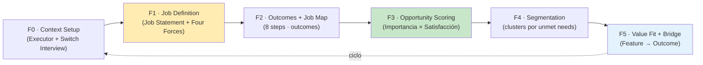

*Fig-MI12-24 — F0 · Context Setup (M04 fig #2)*

*Figura 24 · m04 fig 02*

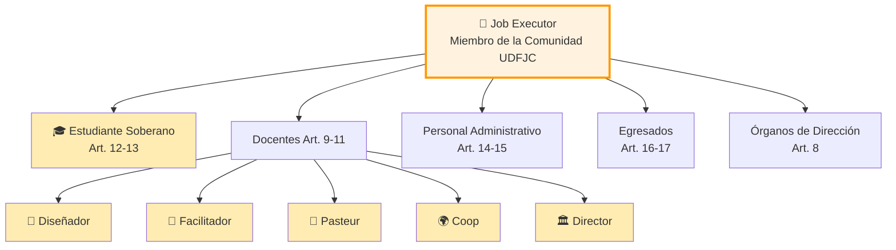

*Fig-MI12-25 — 🎯 Job Executor (M04 fig #3)*

*Figura 25 · m04 fig 03*

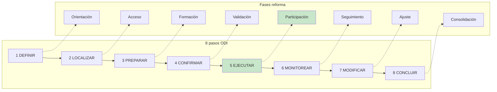

*Fig-MI12-26 — 8 pasos [[glo-odi-ulwick|ODI]] (M04 fig #4)*

*Figura 26 · m04 fig 04*

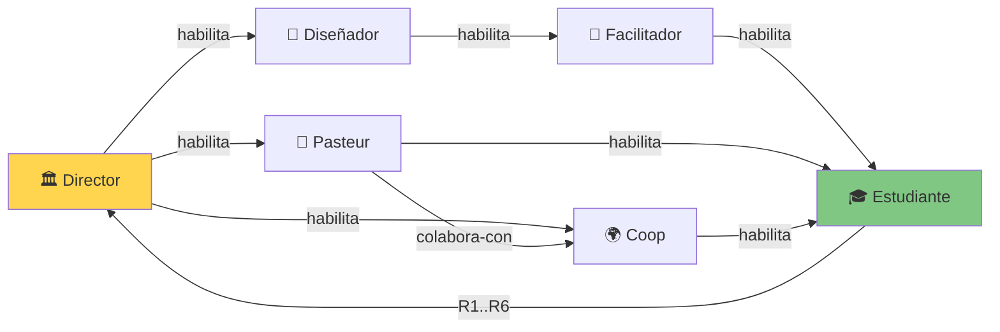

*Fig-MI12-27 — 🏛️ Director (M04 fig #5)*

*Figura 27 · m04 fig 05*

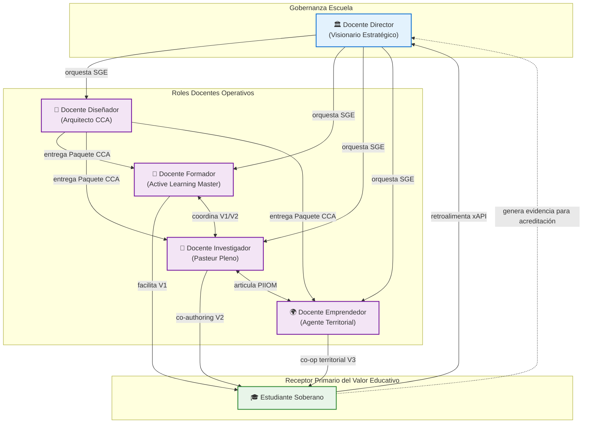

*Fig-MI12-28 — Gobernanza Escuela (M04 fig #6)*

*Figura 28 · m04 fig 06*

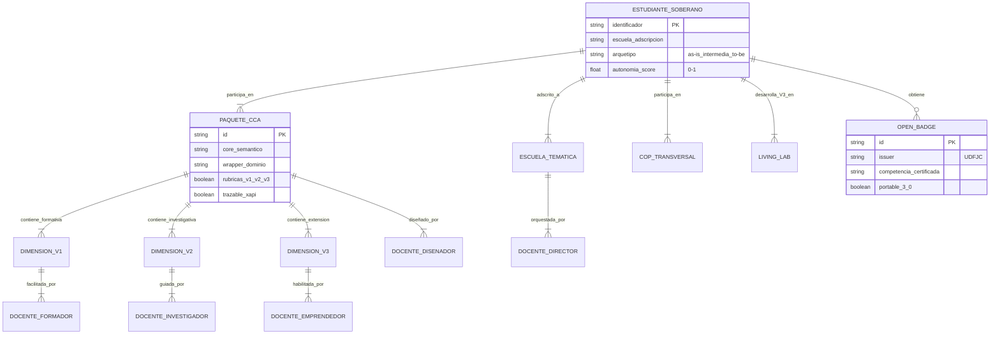

*Fig-MI12-29 — Diagrama M04 #7 (caption original no recuperado en extracción)*

*Figura 29 · m04 fig 07*

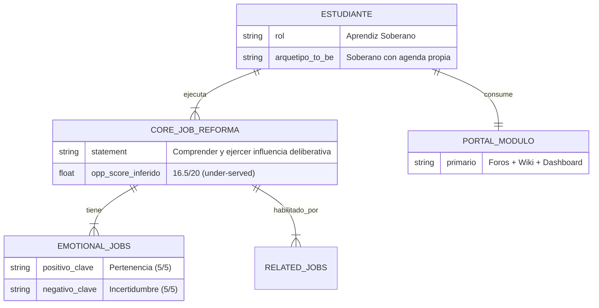

*Fig-MI12-30 — Diagrama M04 #8 (caption original no recuperado en extracción)*

*Figura 30 · m04 fig 08*

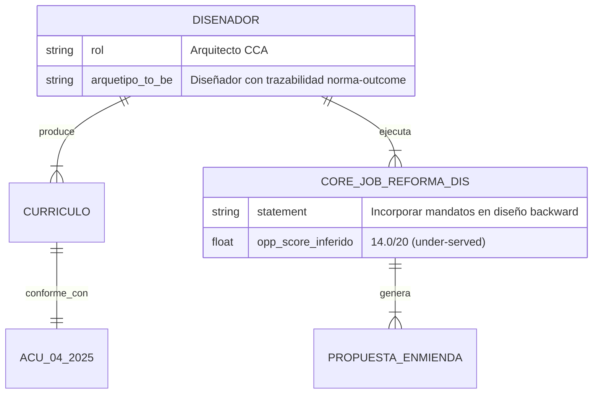

*Fig-MI12-31 — Diagrama M04 #9 (caption original no recuperado en extracción)*

*Figura 31 · m04 fig 09*

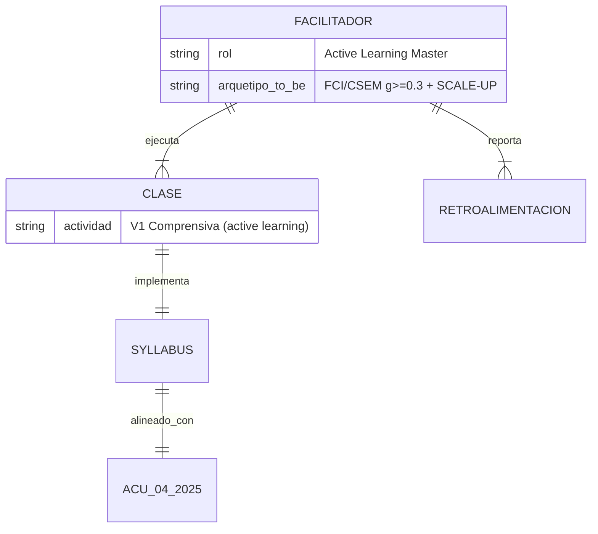

*Fig-MI12-32 — Diagrama M04 #10 (caption original no recuperado en extracción)*

*Figura 32 · m04 fig 10*

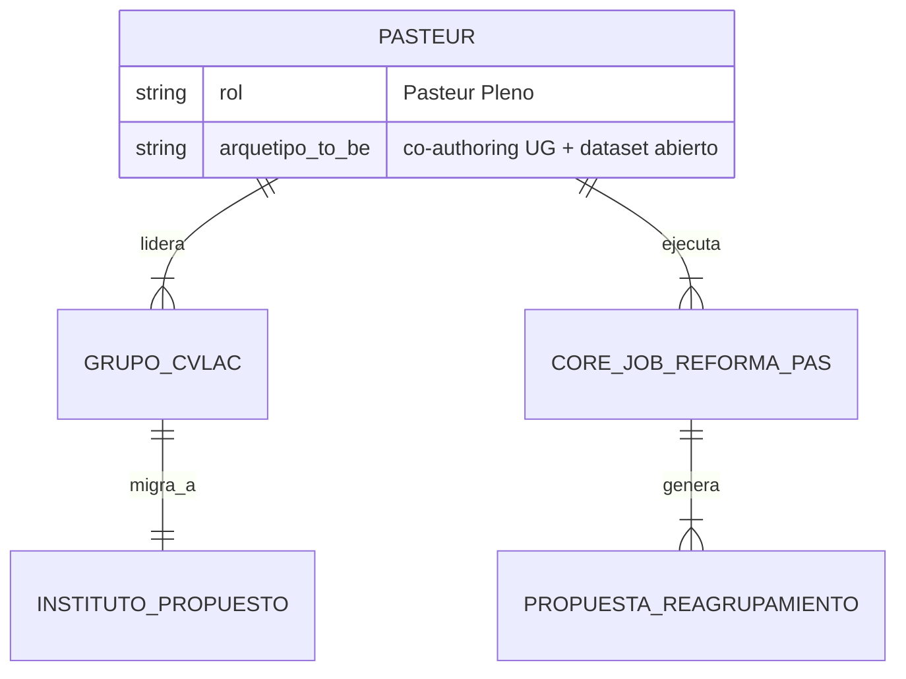

*Fig-MI12-33 — Diagrama M04 #11 (caption original no recuperado en extracción)*

*Figura 33 · m04 fig 11*

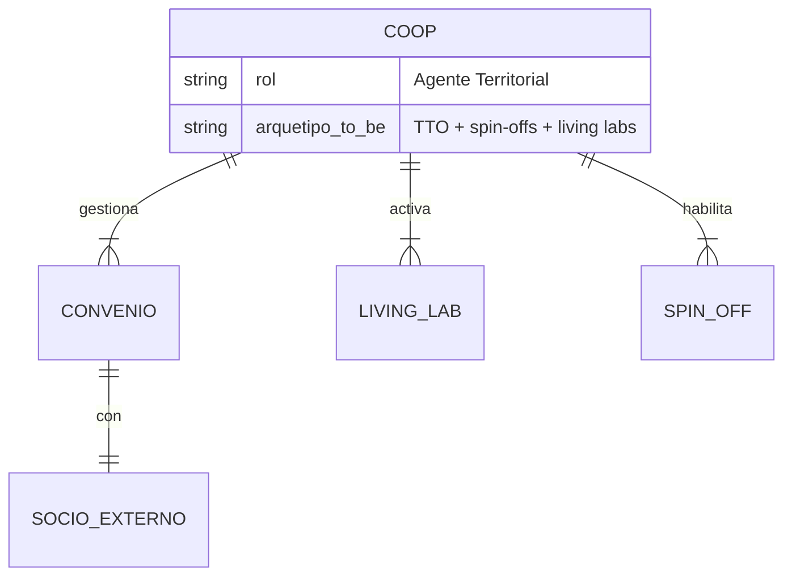

*Fig-MI12-34 — Diagrama M04 #12 (caption original no recuperado en extracción)*

*Figura 34 · m04 fig 12*

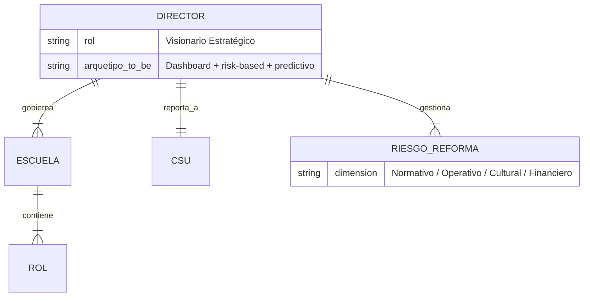

*Fig-MI12-35 — Diagrama M04 #13 (caption original no recuperado en extracción)*

*Figura 35 · m04 fig 13*

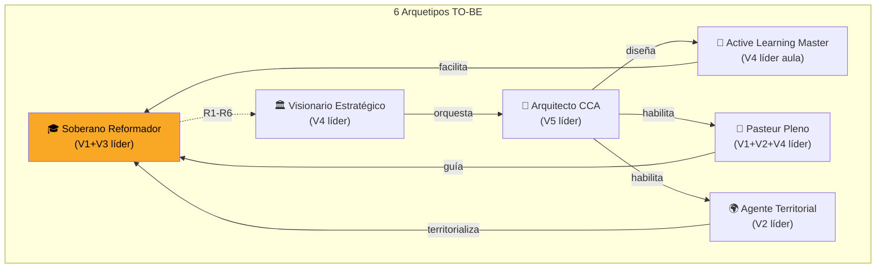

*Fig-MI12-36 — 6 Arquetipos TO-BE (M04 fig #14)*

*Figura 36 · m04 fig 14*

```mermaid
stateDiagram-v2
    direction LR
    [*] --> ASIS
    state "AS-IS (actual)" as ASIS {
        A1: Información dispersa en PDFs
        A2: Deliberación limitada a representantes
        A3: Sin trazabilidad propuesta → decisión
        A4: Roles en silos
    }
    state "Transición" as TRANS {
        T1: Portal MVP lanzado
        T2: Onboarding por estamento
        T3: Migración de contenido normativo a Wiki
        T4: Activación foros por Escuela
    }
    state "TO-BE (post-portal)" as TOBE {
        B1: Información diferenciada por rol
        B2: Deliberación abierta a todos
        B3: Trazabilidad bidireccional completa
        B4: CoP viva con artefactos tangibles
    }
    ASIS --> TRANS: decisión CSU + recursos
    TRANS --> TOBE: adopción ≥ 30%
    TOBE --> [*]: madurez G4
```

*Fig-MI12-37 — Diagrama M04 #15 (caption original no recuperado en extracción)*

*Figura 37 · m04 fig 15*

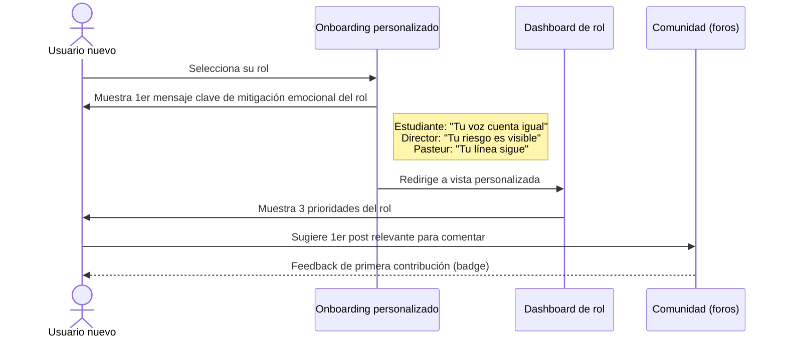

*Fig-MI12-38 — Diagrama M04 #16 (caption original no recuperado en extracción)*

*Figura 38 · m04 fig 16*

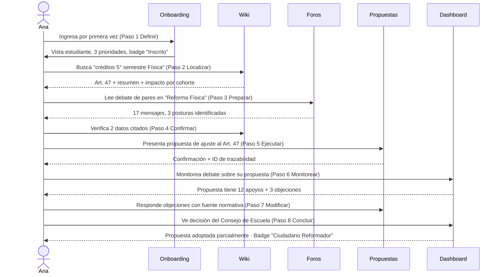

*Fig-MI12-39 — Diagrama M04 #17 (caption original no recuperado en extracción)*

*Figura 39 · m04 fig 17*

> [!bug] DT-MI12-04-01 · Captions de figuras M04 perdidos en extracción automática
> Las figuras 23-39 (originalmente Fig-M04-01..17) fueron extraídas del Mermaid pero el texto de caption no se preservó. Debe asignarse título y caption descriptivo a cada figura mediante revisión manual del original `2-resultado-consolidados/M04-icat-jtbd-comunidad-udfjc/M04-jtbd-comunidad-reforma-escuela-udfjc.md`.

### §4.2 Arquetipos de madurez V1-V5

Cinco valores culturales con arquetipos de madurez (de menos a más maduro):
- **V1 Soberanía**: dependiente → soberano del conocimiento.
- **V2 Emprendimiento**: receptor → creador de valor real.
- **V3 Participación**: consultor → vinculante.
- **V4 Ética**: nominal → integral con rendición.
- **V5 Austeridad**: dispendioso → optimizador colaborativo.

### §4.3 Plataforma comunitaria propuesta (9 módulos)

(1) Wiki diferenciado por micro-investigación · (2) Foros por estamento · (3) Dashboard heatmap 5R×4Cap · (4) Micro-formación · (5) Knowledge graph 12 MI + 21 BPA · (6) Propuestas comunitarias · (7) SSO UDFJC · (8) Gamificación por rol JTBD · (9) Trazabilidad deliberación-decisión.

> [!bug] DT-MI12-04-02 · Detalle granular de outcome statements ODI por rol y dimensión
> Los outcome statements precisos (>=15 por rol × 4 dimensiones = 360 outcomes) y sus scores ODI están en BPA-003 (Opus 4.7, 39 archivos, ~9.549 líneas) pero no se transcribieron aquí. Mantener referencia a BPA-003 como fuente; transclusión completa pendiente.

---

## §5 · Discusión y diagnóstico

Brecha de participación informada se origina en (a) información técnica no diferenciada por estamento, (b) ausencia de plataformas deliberativas accesibles por rol, (c) carencia de mecanismos de retroalimentación institucionalizada, (d) déficit de trazabilidad deliberación-decisión.

---

## §6 · Conceptos Clave

![[glo-comunidades-practica]]

(JTBD, ODI, V1-V5 culturales se documentan en futuras entradas atómicas del glosario)

> [!bug] DT-MI12-04-03 · Glosario JTBD/ODI/V1-V5 culturales pendiente
> Crear glo-jtbd, glo-odi-ulwick, glo-valores-culturales-v1-v5 con definiciones precisas y ejemplos.

---

## §7 · Deudas Técnicas

| ID | Descripción | Impacto |
|---|---|---|
| DT-MI12-04-01 | Captions descriptivos para figuras 23-39 | Alto |
| DT-MI12-04-02 | Outcome statements ODI completos (BPA-003) | Alto |
| DT-MI12-04-03 | Glosario JTBD/ODI/V1-V5 culturales | Medio |
| DT-MI12-04-04 | Status REVIEW_SEM3 → FINAL pendiente de peer review | Alto |

---

## §8 · Implicaciones operativas

(1) Plataforma comunitaria modular con 9 módulos · (2) Diferenciación por rol y estamento · (3) Trazabilidad deliberación-decisión · (4) Gamificación por rol JTBD.

---

## §9 · Referencias

Compiladas desde `99--sources/citations.bib`. Claves clave: `@christensen2016competing`, `@ulwick2016jtbd`, `@wenger1998cop`, `@wengertrayner2015landscape`, `@udfjc2025acu00425`.

> [!bug] DT-MI12-04-05 · Añadir refs JTBD/ODI/Wenger-Trayner a citations.bib
> Christensen (2016), Ulwick (2005, 2016), Wenger-Trayner (2015) deben añadirse al .bib del capítulo.

---

## §10 · 🖼️ Figuras transcluidas (17)

Fig-MI12-23, Fig-MI12-24, Fig-MI12-25, Fig-MI12-26, Fig-MI12-27, Fig-MI12-28, Fig-MI12-29, Fig-MI12-30, Fig-MI12-31, Fig-MI12-32, Fig-MI12-33, Fig-MI12-34, Fig-MI12-35, Fig-MI12-36, Fig-MI12-37, Fig-MI12-38, Fig-MI12-39

---

## Historial de Versiones §04

| Versión | Fecha | Cambios |
|---|---|---|
| 1.0.0 | 2026-04-25 | Atomización inicial desde M04-jtbd-comunidad-reforma-escuela-udfjc-v1.1.0. 17 figuras Mermaid extraídas (captions perdidos, ver DT-MI12-04-01). Status conservado como REVIEW_SEM3. |

---

*CC BY-SA 4.0 · Carlos Camilo Madera Sepúlveda · UDFJC · 2026-04-25 · sec-MI12-04 v1.0.0 (REVIEW_SEM3)*
