# §05 · BMK-001 Procesos Misionales: Hallazgos Comparativos en 21 IES (El Problema Macro)

> [!abstract] 📄 Propiedad Intelectual & Ciencia Abierta
> **Autor**: Carlos Camilo Madera Sepúlveda · ccmaderas@udistrital.edu.co · UDFJC
> **Licencia**: CC BY-SA 4.0 · **Cita sugerida**: Madera Sepúlveda, C. C. (2026). §05 · BMK-001 Procesos Misionales: Hallazgos en 21 IES. *Reforma Vinculante UDFJC: Análisis, Buenas Prácticas y Prospectiva Transformativa* (cap-MI12, Sección 5). Universidad Distrital Francisco José de Caldas. https://reforma-ud.vercel.app/canonico/m05/ [DOI pendiente]

> [!abstract] §0 · Abstract
> La UDFJC aprueba en 2025 el ACU-004/2025 que reorganiza su estructura en Escuelas, Institutos, Centros y CABAs. La paradoja: en el momento de la reforma, la UDFJC opera en estado **Sub-N1** — programas-isla pre-departamentales sin creditización de investigación ni extensión, sin transferencia tecnológica documentada, tasa de graduación ~42%. Esta sección sistematiza un benchmarking de **21 IES** a lo largo de 12 dimensiones analíticas y 9 métricas de integración cross-misional, organizando la evidencia en torno a los **cinco criterios del P1** (Impacto Misional) del modelo [[con-bsc-s|BSC-s]] × [[con-rbm-gac|RBM-GAC]]: C1-Producto, C2-Calidad, C3-Eficiencia, C4-Pertinencia y C5-Reconocimiento, por cada función misional.
>
> Contribuciones originales: (1) fórmula `culture_lag = max(0, N - G_equivalente)` como métrica del desfase estructural-cultural; (2) caracterización **Sub-N1** como estado pre-departamental con granularidad a nivel de programa académico — más precario que N1 departamental clásico.
>
> **Palabras clave**: benchmarking IES, madurez Sub-N1 a N4, procesos misionales, culture lag, [[con-caba|CABA]], UDFJC, ACU-004/2025, Quintuple Helix, Mode 3, P1-Impacto, BSC-s.

---

## §1 · Por qué importan estas 21 IES

Esta sección es el **por qué** del corpus MI-12. Si §02 define el ciclo virtuoso que la UDFJC necesita activar, §05 documenta por qué ese ciclo no funciona hoy y cuál es la brecha objetiva contra los referentes globales (MIT, Stanford, Aalto, Twente, ÉTS, ITESM, KAIST, SNU, UNAM, UNAL, UDEA, UNAD, etc.).

---

## §2 · Marco P1 — Impacto Misional (4 funciones × 5 categorías)

P1 Impacto Misional opera con 4 funciones (F1 Formación, F2 Investigación, F3 Extensión, F4 Integración Living-Labs) × 5 categorías (C1 Producto, C2 Calidad, C3 Eficiencia, C4 Pertinencia, C5 Reconocimiento) = **20 Preguntas de Impacto (QI)**. Esta arquitectura se desarrolla canónicamente en §08 (Framework BSC-s × RBM-GAC × [[con-crisp-dm|CRISP-DM]]). Aquí se reporta evidencia BMK-001 por celda.

![[con-taxonomia-sub-n1-n4]]

---

## §3 · Hallazgos del benchmarking (21 IES, 12 dimensiones, 9 métricas)

### §3.1 Posición UDFJC AS-IS por proceso misional

- **F1 Formación**: Sub-N1 (programas-isla)
- **F2 Investigación**: N1 (concentrada en posgrado)
- **F3 Extensión**: N1 (desvinculada del currículo)
- **F4 Integración (Living-Labs)**: 0 R activadas, 0 living labs

### §3.2 Culture lag

Fórmula: `culture_lag(unidad, función) = max(0, N_estructura - G_equivalente)`. UDFJC: estructura decretada N3+ (Escuelas/Institutos/Centros/CABAs en ACU-004-25), cultura operante Sub-N1 → **culture_lag = 2** (gap crítico).

### §3.3 Las 6 retroalimentaciones R1-R6 están rotas

Diagnóstico cualitativo: 5/6 R en estado Ausente, R4 en estado Reactivo. El ciclo virtuoso no existe. Ver Eq-MI12-02 (condición de ciclo virtuoso).

### §3.4 Figuras del benchmarking (25 mermaids transcluidos)

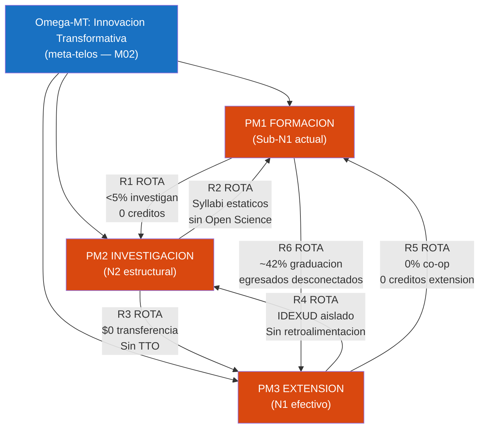
```mermaid
flowchart TB
    OMT["Omega-MT: Innovacion Transformativa
(meta-telos — M02)"]
    PM1["PM1 FORMACION
(Sub-N1 actual)"]
    PM2["PM2 INVESTIGACION
(N2 estructural)"]
    PM3["PM3 EXTENSION
(N1 efectivo)"]

    OMT --> PM1 & PM2 & PM3

    PM1 -->|"R1 ROTA
<5% investigan
0 creditos"| PM2
    PM2 -->|"R2 ROTA
Syllabi estaticos
sin Open Science"| PM1
    PM2 -->|"R3 ROTA
$0 transferencia
Sin TTO"| PM3
    PM3 -->|"R4 ROTA
IDEXUD aislado
Sin retroalimentacion"| PM2
    PM3 -->|"R5 ROTA
0% co-op
0 creditos extension"| PM1
    PM1 -->|"R6 ROTA
~42% graduacion
egresados desconectados"| PM3

    style OMT fill:#1971c2,color:#fff
    style PM1 fill:#d9480f,color:#fff
    style PM2 fill:#d9480f,color:#fff
    style PM3 fill:#d9480f,color:#fff
```

*Fig-MI12-40 — Omega-MT: Innovacion Transformativa
(meta-telos — M02) (M05 fig #1)*

*Figura 40 · m05 fig 01*

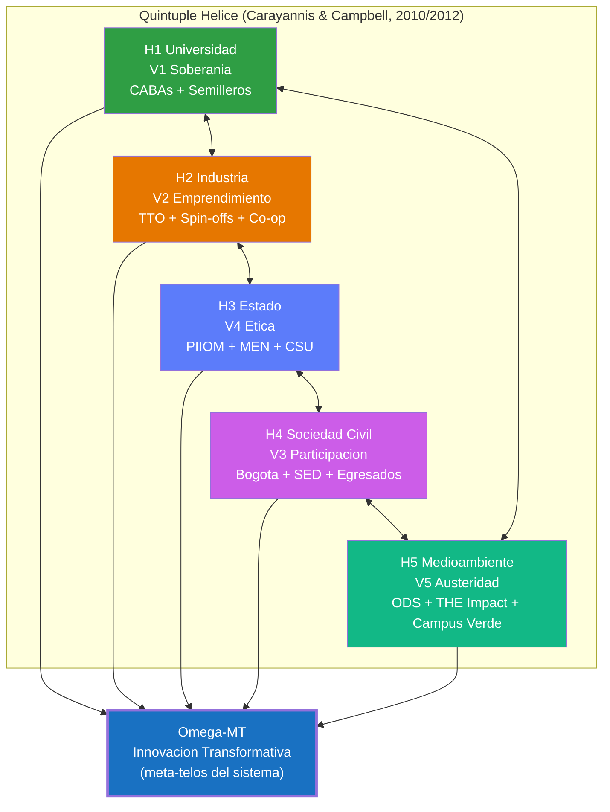
```mermaid
flowchart TB
    subgraph QH["Quintuple Helice (Carayannis & Campbell, 2010/2012)"]
        H1["H1 Universidad
V1 Soberania
CABAs + Semilleros"]
        H2["H2 Industria
V2 Emprendimiento
TTO + Spin-offs + Co-op"]
        H3["H3 Estado
V4 Etica
PIIOM + MEN + CSU"]
        H4["H4 Sociedad Civil
V3 Participacion
Bogota + SED + Egresados"]
        H5["H5 Medioambiente
V5 Austeridad
ODS + THE Impact + Campus Verde"]
    end

    OMT["Omega-MT
Innovacion Transformativa
(meta-telos del sistema)"]

    H1 <--> H2
    H2 <--> H3
    H3 <--> H4
    H4 <--> H5
    H5 <--> H1
    H1 & H2 & H3 & H4 & H5 --> OMT

    style OMT fill:#1971c2,color:#fff,stroke-width:3px
    style H1 fill:#2f9e44,color:#fff
    style H2 fill:#e67700,color:#fff
    style H3 fill:#5c7cfa,color:#fff
    style H4 fill:#cc5de8,color:#fff
    style H5 fill:#12b886,color:#fff
```

*Fig-MI12-41 — Quintuple Helice (Carayannis & Campbell, 2010/2012) (M05 fig #2)*

*Figura 41 · m05 fig 02*

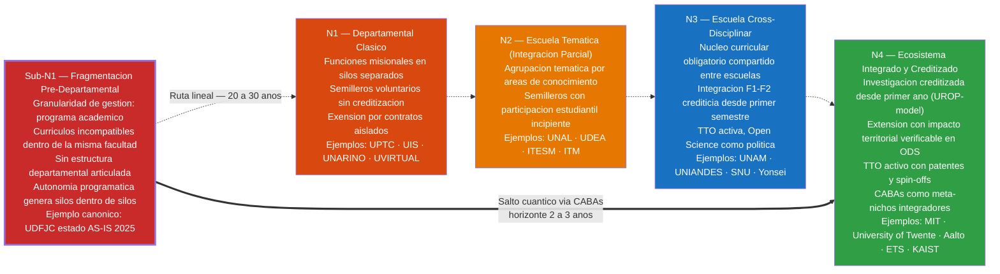
```mermaid
flowchart LR
    SN1["Sub-N1 — Fragmentacion Pre-Departamental
    Granularidad de gestion: programa academico
    Curriculos incompatibles dentro de la misma facultad
    Sin estructura departamental articulada
    Autonomia programatica genera silos dentro de silos
    Ejemplo canonico: UDFJC estado AS-IS 2025"]

    N1["N1 — Departamental Clasico
    Funciones misionales en silos separados
    Semilleros voluntarios sin creditizacion
    Exension por contratos aislados
    Ejemplos: UPTC · UIS · UNARINO · UVIRTUAL"]

    N2["N2 — Escuela Tematica (Integracion Parcial)
    Agrupacion tematica por areas de conocimiento
    Semilleros con participacion estudiantil incipiente
    Ejemplos: UNAL · UDEA · ITESM · ITM"]

    N3["N3 — Escuela Cross-Disciplinar
    Nucleo curricular obligatorio compartido entre escuelas
    Integracion F1-F2 crediticia desde primer semestre
    TTO activa, Open Science como politica
    Ejemplos: UNAM · UNIANDES · SNU · Yonsei"]

    N4["N4 — Ecosistema Integrado y Creditizado
    Investigacion creditizada desde primer ano (UROP-model)
    Extension con impacto territorial verificable en ODS
    TTO activo con patentes y spin-offs
    CABAs como meta-nichos integradores
    Ejemplos: MIT · University of Twente · Aalto · ETS · KAIST"]

    SN1 -.->|"Ruta lineal — 20 a 30 anos"| N1
    N1 -.-> N2
    N2 -.-> N3
    N3 -.-> N4
    SN1 ==>|"Salto cuantico via CABAs
horizonte 2 a 3 anos"| N4

    style SN1 fill:#c92a2a,color:#fff,stroke-width:3px
    style N1 fill:#d9480f,color:#fff
    style N2 fill:#e67700,color:#fff
    style N3 fill:#1971c2,color:#fff
    style N4 fill:#2f9e44,color:#fff
```

*Fig-MI12-42 — Sub-N1 — Fragmentacion Pre-Departamental
    Granularidad de gestion: programa academico
    Curriculos incompatibles dentro de la misma facultad
    Sin estructura departamental articulada
    Autonomia programatica genera silos dentro de silos
    Ejemplo canonico: UDFJC estado AS-IS 2025 (M05 fig #3)*

*Figura 42 · m05 fig 03*

```mermaid
flowchart LR
    subgraph SUB["🩸 Sub-N1 · Pre-departamental"]
        direction TB
        sub_what["<b>Que es</b><br/>Programas-isla dentro<br/>de una misma Facultad:<br/>curriculos incompatibles<br/>sin reconocimiento mutuo"]
        sub_who["<b>Ejemplo observado</b><br/>UDFJC (actual)"]
        sub_sig["⚠️ Organigrama Vacio<br/>culture_lag = 2"]
    end

    subgraph N1["🧱 N1 · Departamental clasico"]
        direction TB
        n1_what["<b>Que es</b><br/>Silos disciplinares;<br/>curriculo rigido;<br/>RAP inexistente;<br/>investigacion en posgrado"]
        n1_who["<b>Ejemplos observados</b><br/>UIS · UPTC · UNAD<br/>UNARINO · ITM · UVIRTUAL"]
        n1_sig["Modelo dominante CO"]
    end

    subgraph N2["🌱 N2 · Escuelas tematicas"]
        direction TB
        n2_what["<b>Que es</b><br/>Flexibilidad parcial;<br/>semilleros voluntarios;<br/>algo de libre eleccion<br/>(10-20% del plan)"]
        n2_who["<b>Ejemplos observados</b><br/>UNAL · UDEA<br/>ITESM · Yonsei"]
        n2_sig["Transicion iniciada"]
    end

    subgraph N3["🔗 N3 · Cross-disciplinar"]
        direction TB
        n3_what["<b>Que es</b><br/>Nucleo compartido obligatorio<br/>(CBU, CLS, Open Major);<br/>reconocimiento mutuo creditos;<br/>formacion integral formalizada"]
        n3_who["<b>Ejemplos observados</b><br/>Aalto · Stanford · UNIANDES<br/>SNU · UNAM · CEGEP"]
        n3_sig["Lenguaje comun operante"]
    end

    subgraph N4["🚀 N4 · Integrada misional"]
        direction TB
        n4_what["<b>Que es</b><br/>Investigacion creditizada<br/>desde 1er semestre (UROP);<br/>co-op obligatorio;<br/>extension en el curriculo"]
        n4_who["<b>Ejemplos observados</b><br/>MIT · Twente · ETS · KAIST"]
        n4_sig["R1-R6 en operacion"]
    end

    SUB ==>|"Acuerdo 004/2025<br/>habilita el salto"| N1 ==> N2 ==> N3 ==> N4

    style SUB fill:#ffa8a8,stroke:#c92a2a,color:#000
    style N1 fill:#ffd8a8,stroke:#d9480f,color:#000
    style N2 fill:#ffec99,stroke:#f08c00,color:#000
    style N3 fill:#b2f2bb,stroke:#2f9e44,color:#000
    style N4 fill:#a5d8ff,stroke:#1971c2,color:#000
    style sub_sig fill:#fff0f0,stroke:#c92a2a,color:#000
    style n1_sig fill:#fff4e6,stroke:#d9480f,color:#000
    style n2_sig fill:#fff9db,stroke:#f08c00,color:#000
    style n3_sig fill:#ebfbee,stroke:#2f9e44,color:#000
    style n4_sig fill:#e7f5ff,stroke:#1971c2,color:#000
```

*Fig-MI12-43 — 🩸 Sub-N1 · Pre-departamental (M05 fig #4)*

*Figura 43 · m05 fig 04*

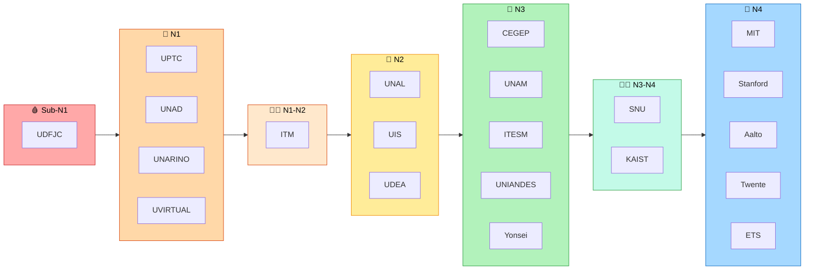
```mermaid
flowchart LR
    subgraph GSub["🩸 Sub-N1"]
    direction LR
        UDFJC[UDFJC]
    end
    subgraph GN1["🧱 N1"]
    direction LR
        UPTC[UPTC]
        UNAD[UNAD]
        UNARINO[UNARINO]
        UVIRTUAL[UVIRTUAL]
    end
    subgraph GN1N2["🧱🌱 N1-N2"]
    direction LR
        ITM[ITM]
    end
    subgraph GN2["🌱 N2"]
    direction LR
        UNAL[UNAL]
        UIS[UIS]
        UDEA[UDEA]
    end
    subgraph GN3["🔗 N3"]
    direction LR
        CEGEP[CEGEP]
        UNAM[UNAM]
        ITESM[ITESM]
        UNIANDES[UNIANDES]
        Yonsei[Yonsei]
    end
    subgraph GN3N4["🔗🚀 N3-N4"]
    direction LR
        SNU[SNU]
        KAIST_m[KAIST]
    end
    subgraph GN4["🚀 N4"]
    direction LR
        MIT[MIT]
        Stanford[Stanford]
        Aalto[Aalto]
        Twente[Twente]
        ETS[ETS]
    end

    GSub --> GN1 --> GN1N2 --> GN2 --> GN3 --> GN3N4 --> GN4

    style GSub fill:#ffa8a8,stroke:#c92a2a,color:#000
    style GN1 fill:#ffd8a8,stroke:#d9480f,color:#000
    style GN1N2 fill:#ffe8cc,stroke:#d9480f,color:#000
    style GN2 fill:#ffec99,stroke:#f08c00,color:#000
    style GN3 fill:#b2f2bb,stroke:#2f9e44,color:#000
    style GN3N4 fill:#c3fae8,stroke:#2f9e44,color:#000
    style GN4 fill:#a5d8ff,stroke:#1971c2,color:#000
```

*Fig-MI12-44 — 🩸 Sub-N1 (M05 fig #5)*

*Figura 44 · m05 fig 05*

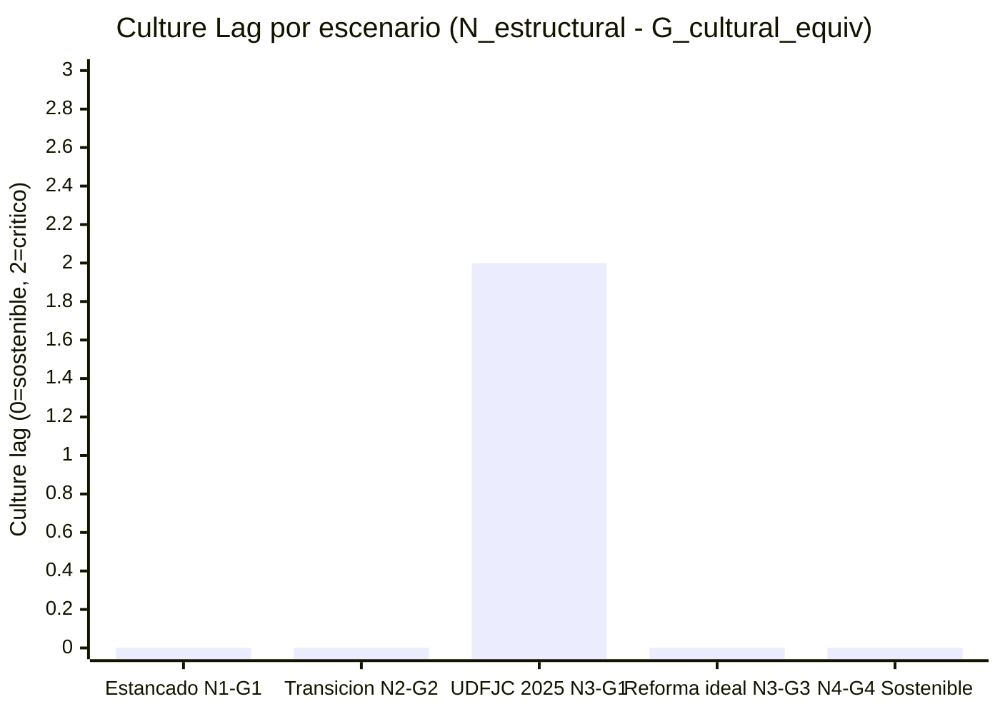
```mermaid
xychart-beta
    title "Culture Lag por escenario (N_estructural - G_cultural_equiv)"
    x-axis ["Estancado N1-G1", "Transicion N2-G2", "UDFJC 2025 N3-G1", "Reforma ideal N3-G3", "N4-G4 Sostenible"]
    y-axis "Culture lag (0=sostenible, 2=critico)" 0 --> 3
    bar [0, 0, 2, 0, 0]
```

*Fig-MI12-45 — Diagrama M05 #6 (caption original no recuperado en extracción)*

*Figura 45 · m05 fig 06*

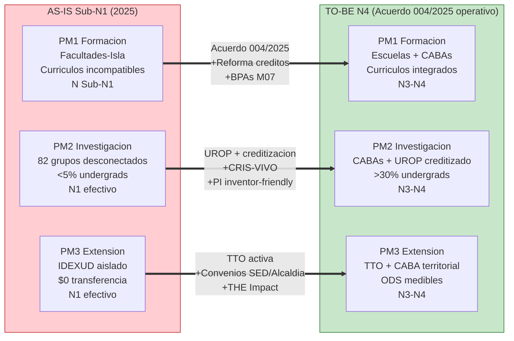
```mermaid
flowchart LR
    subgraph ASIS["AS-IS Sub-N1 (2025)"]
        A1["PM1 Formacion
Facultades-Isla
Curriculos incompatibles
N Sub-N1"]
        A2["PM2 Investigacion
82 grupos desconectados
<5% undergrads
N1 efectivo"]
        A3["PM3 Extension
IDEXUD aislado
$0 transferencia
N1 efectivo"]
    end
    subgraph TOBE["TO-BE N4 (Acuerdo 004/2025 operativo)"]
        T1["PM1 Formacion
Escuelas + CABAs
Curriculos integrados
N3-N4"]
        T2["PM2 Investigacion
CABAs + UROP creditizado
>30% undergrads
N3-N4"]
        T3["PM3 Extension
TTO + CABA territorial
ODS medibles
N3-N4"]
    end
    A1 ==>|"Acuerdo 004/2025
+Reforma creditos
+BPAs M07"| T1
    A2 ==>|"UROP + creditizacion
+CRIS-VIVO
+PI inventor-friendly"| T2
    A3 ==>|"TTO activa
+Convenios SED/Alcaldia
+THE Impact"| T3

    style ASIS fill:#FFCDD2,stroke:#C62828
    style TOBE fill:#C8E6C9,stroke:#2E7D32
```

*Fig-MI12-46 — AS-IS Sub-N1 (2025) (M05 fig #7)*

*Figura 46 · m05 fig 07*

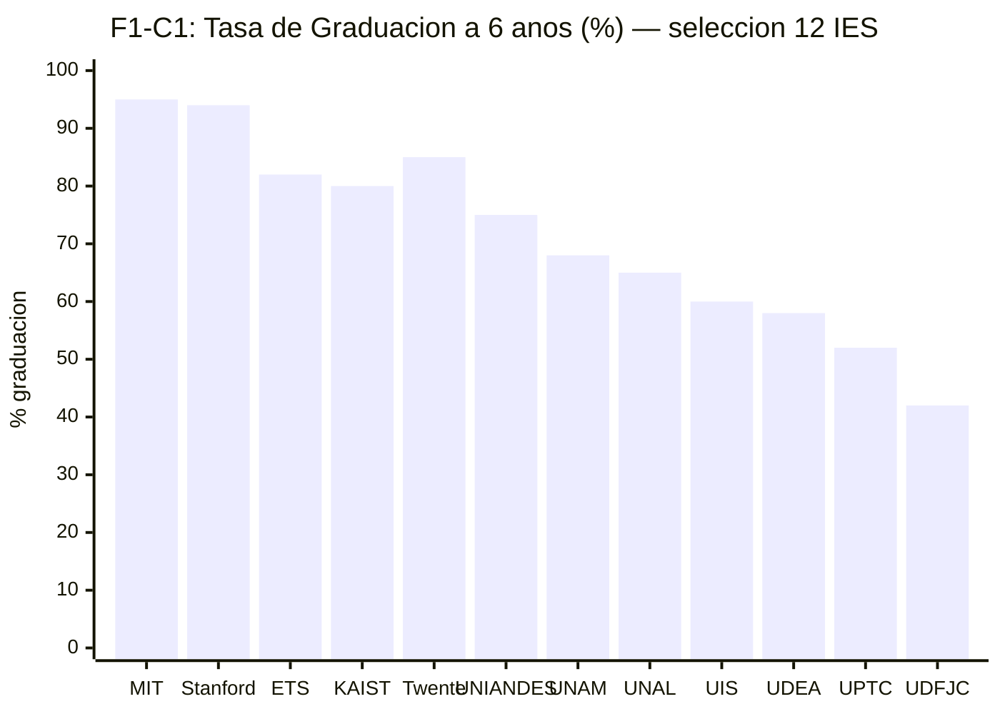
```mermaid
xychart-beta
    title "F1-C1: Tasa de Graduacion a 6 anos (%) — seleccion 12 IES"
    x-axis ["MIT", "Stanford", "ETS", "KAIST", "Twente", "UNIANDES", "UNAM", "UNAL", "UIS", "UDEA", "UPTC", "UDFJC"]
    y-axis "% graduacion" 0 --> 100
    bar [95, 94, 82, 80, 85, 75, 68, 65, 60, 58, 52, 42]
```

*Fig-MI12-47 — Diagrama M05 #8 (caption original no recuperado en extracción)*

*Figura 47 · m05 fig 08*

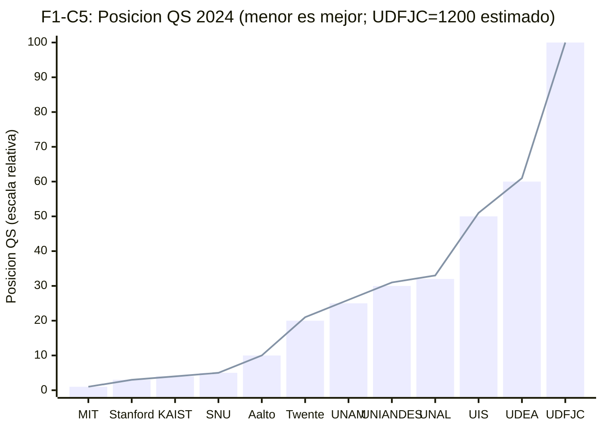
```mermaid
xychart-beta
    title "F1-C5: Posicion QS 2024 (menor es mejor; UDFJC=1200 estimado)"
    x-axis ["MIT", "Stanford", "KAIST", "SNU", "Aalto", "Twente", "UNAM", "UNIANDES", "UNAL", "UIS", "UDEA", "UDFJC"]
    y-axis "Posicion QS (escala relativa)" 0 --> 100
    bar [1, 3, 4, 5, 10, 20, 25, 30, 32, 50, 60, 100]
    line [1, 3, 4, 5, 10, 21, 26, 31, 33, 51, 61, 100]
```

*Fig-MI12-48 — Diagrama M05 #9 (caption original no recuperado en extracción)*

*Figura 48 · m05 fig 09*

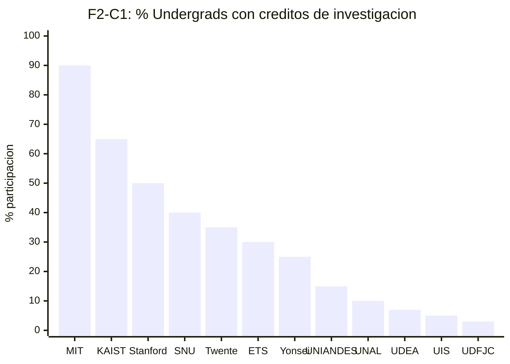
```mermaid
xychart-beta
    title "F2-C1: % Undergrads con creditos de investigacion"
    x-axis ["MIT", "KAIST", "Stanford", "SNU", "Twente", "ETS", "Yonsei", "UNIANDES", "UNAL", "UDEA", "UIS", "UDFJC"]
    y-axis "% participacion" 0 --> 100
    bar [90, 65, 50, 40, 35, 30, 25, 15, 10, 7, 5, 3]
```

*Fig-MI12-49 — Diagrama M05 #10 (caption original no recuperado en extracción)*

*Figura 49 · m05 fig 10*

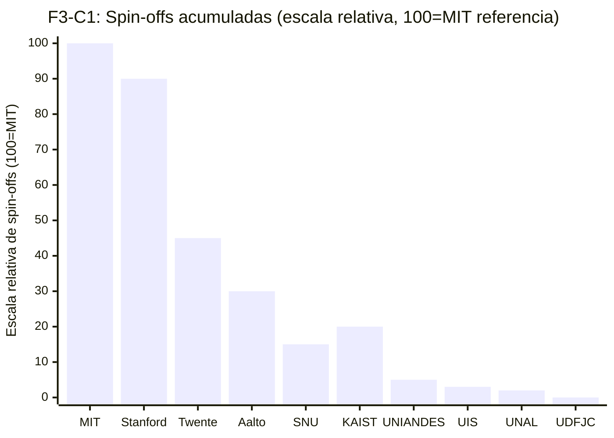
```mermaid
xychart-beta
    title "F3-C1: Spin-offs acumuladas (escala relativa, 100=MIT referencia)"
    x-axis ["MIT", "Stanford", "Twente", "Aalto", "SNU", "KAIST", "UNIANDES", "UIS", "UNAL", "UDFJC"]
    y-axis "Escala relativa de spin-offs (100=MIT)" 0 --> 100
    bar [100, 90, 45, 30, 15, 20, 5, 3, 2, 0]
```

*Fig-MI12-50 — Diagrama M05 #11 (caption original no recuperado en extracción)*

*Figura 50 · m05 fig 11*

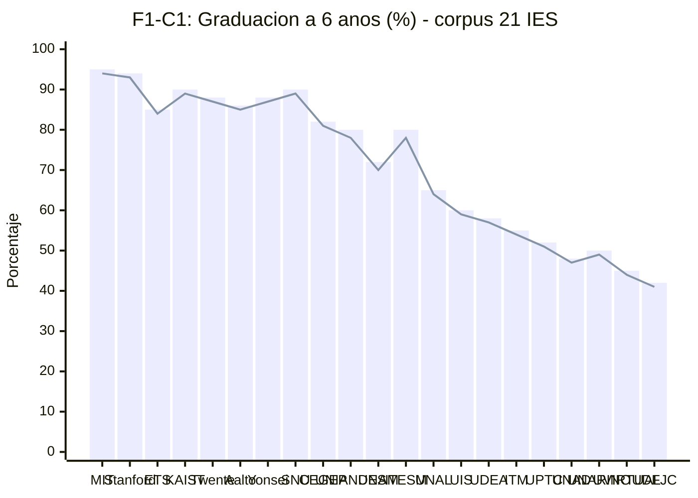
```mermaid
xychart-beta
    title "F1-C1: Graduacion a 6 anos (%) - corpus 21 IES"
    x-axis ["MIT", "Stanford", "ETS", "KAIST", "Twente", "Aalto", "Yonsei", "SNU", "CEGEP", "UNIANDES", "UNAM", "ITESM", "UNAL", "UIS", "UDEA", "ITM", "UPTC", "UNAD", "UNARINO", "UVIRTUAL", "UDFJC"]
    y-axis "Porcentaje" 0 --> 100
    bar [95, 94, 85, 90, 88, 86, 88, 90, 82, 80, 72, 80, 65, 60, 58, 55, 52, 48, 50, 45, 42]
    line [94, 93, 84, 89, 87, 85, 87, 89, 81, 78, 70, 78, 64, 59, 57, 54, 51, 47, 49, 44, 41]
```

*Fig-MI12-51 — Diagrama M05 #12 (caption original no recuperado en extracción)*

*Figura 51 · m05 fig 12*

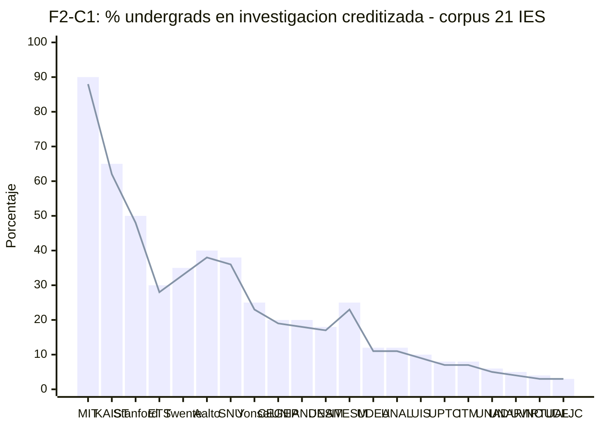
```mermaid
xychart-beta
    title "F2-C1: % undergrads en investigacion creditizada - corpus 21 IES"
    x-axis ["MIT", "KAIST", "Stanford", "ETS", "Twente", "Aalto", "SNU", "Yonsei", "CEGEP", "UNIANDES", "UNAM", "ITESM", "UDEA", "UNAL", "UIS", "UPTC", "ITM", "UNAD", "UNARINO", "UVIRTUAL", "UDFJC"]
    y-axis "Porcentaje" 0 --> 100
    bar [90, 65, 50, 30, 35, 40, 38, 25, 20, 20, 18, 25, 12, 12, 10, 8, 8, 6, 5, 4, 3]
    line [88, 62, 48, 28, 33, 38, 36, 23, 19, 18, 17, 23, 11, 11, 9, 7, 7, 5, 4, 3, 3]
```

*Fig-MI12-52 — Diagrama M05 #13 (caption original no recuperado en extracción)*

*Figura 52 · m05 fig 13*

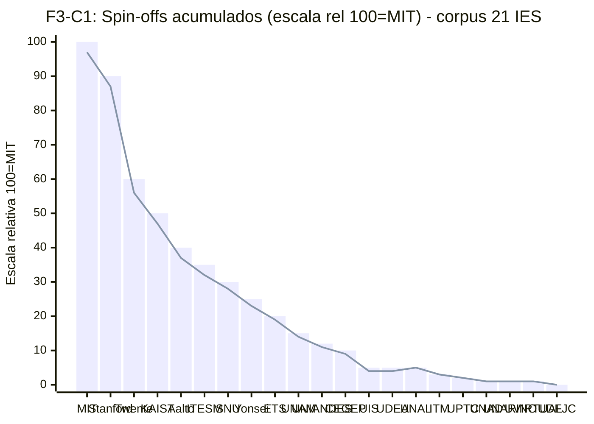
```mermaid
xychart-beta
    title "F3-C1: Spin-offs acumulados (escala rel 100=MIT) - corpus 21 IES"
    x-axis ["MIT", "Stanford", "Twente", "KAIST", "Aalto", "ITESM", "SNU", "Yonsei", "ETS", "UNAM", "UNIANDES", "CEGEP", "UIS", "UDEA", "UNAL", "ITM", "UPTC", "UNAD", "UNARINO", "UVIRTUAL", "UDFJC"]
    y-axis "Escala relativa 100=MIT" 0 --> 100
    bar [100, 90, 60, 50, 40, 35, 30, 25, 20, 15, 12, 10, 5, 5, 5, 3, 2, 1, 1, 1, 0]
    line [97, 87, 56, 47, 37, 32, 28, 23, 19, 14, 11, 9, 4, 4, 5, 3, 2, 1, 1, 1, 0]
```

*Fig-MI12-53 — Diagrama M05 #14 (caption original no recuperado en extracción)*

*Figura 53 · m05 fig 14*

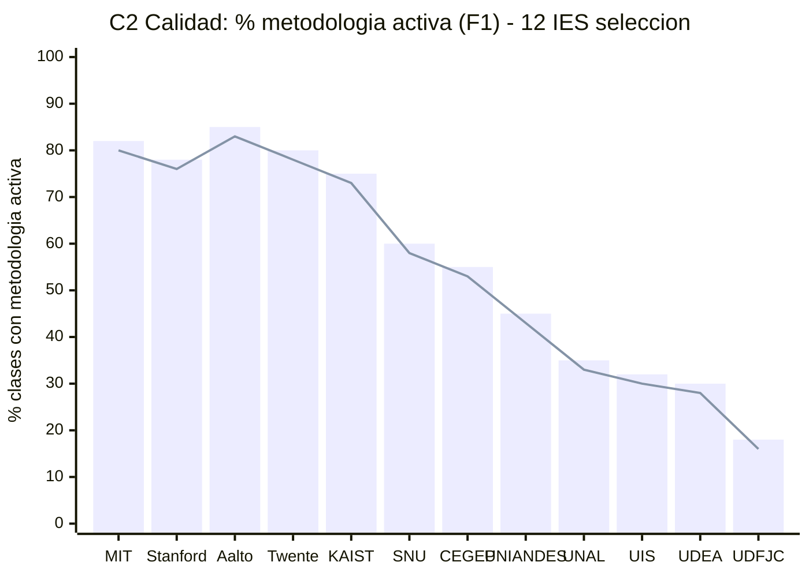
```mermaid
xychart-beta
    title "C2 Calidad: % metodologia activa (F1) - 12 IES seleccion"
    x-axis ["MIT", "Stanford", "Aalto", "Twente", "KAIST", "SNU", "CEGEP", "UNIANDES", "UNAL", "UIS", "UDEA", "UDFJC"]
    y-axis "% clases con metodologia activa" 0 --> 100
    bar [82, 78, 85, 80, 75, 60, 55, 45, 35, 32, 30, 18]
    line [80, 76, 83, 78, 73, 58, 53, 43, 33, 30, 28, 16]
```

*Fig-MI12-54 — Diagrama M05 #15 (caption original no recuperado en extracción)*

*Figura 54 · m05 fig 15*

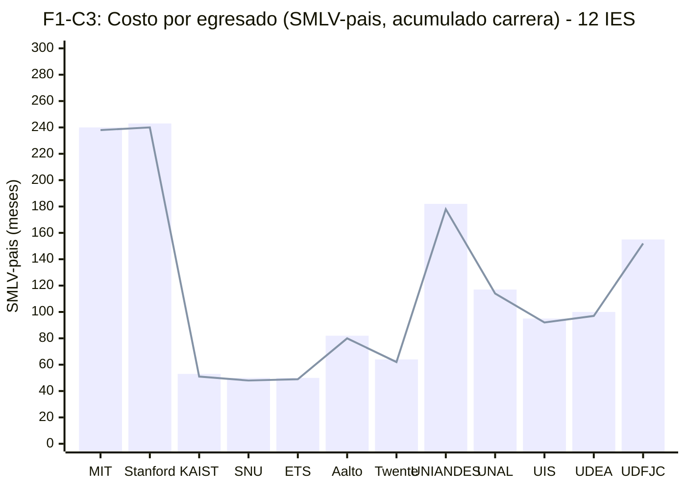
```mermaid
xychart-beta
    title "F1-C3: Costo por egresado (SMLV-pais, acumulado carrera) - 12 IES"
    x-axis ["MIT", "Stanford", "KAIST", "SNU", "ETS", "Aalto", "Twente", "UNIANDES", "UNAL", "UIS", "UDEA", "UDFJC"]
    y-axis "SMLV-pais (meses)" 0 --> 300
    bar [240, 243, 53, 50, 50, 82, 64, 182, 117, 95, 100, 155]
    line [238, 240, 51, 48, 49, 80, 62, 178, 114, 92, 97, 152]
```

*Fig-MI12-55 — Diagrama M05 #16 (caption original no recuperado en extracción)*

*Figura 55 · m05 fig 16*

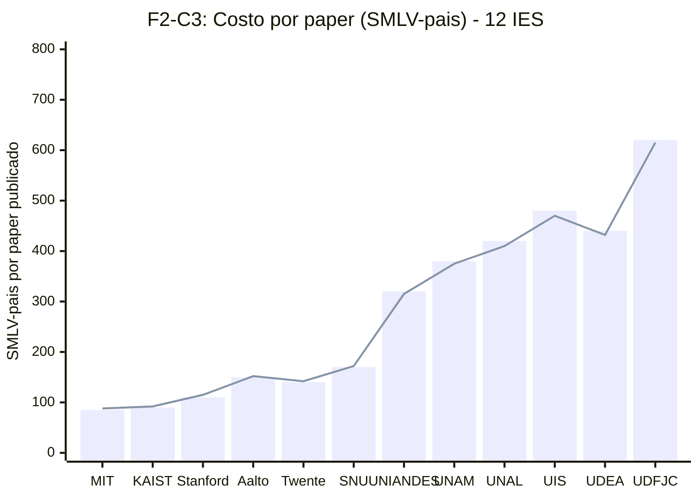
```mermaid
xychart-beta
    title "F2-C3: Costo por paper (SMLV-pais) - 12 IES"
    x-axis ["MIT", "KAIST", "Stanford", "Aalto", "Twente", "SNU", "UNIANDES", "UNAM", "UNAL", "UIS", "UDEA", "UDFJC"]
    y-axis "SMLV-pais por paper publicado" 0 --> 800
    bar [85, 90, 110, 150, 140, 170, 320, 380, 420, 480, 440, 620]
    line [88, 92, 115, 152, 142, 172, 315, 375, 410, 470, 432, 615]
```

*Fig-MI12-56 — Diagrama M05 #17 (caption original no recuperado en extracción)*

*Figura 56 · m05 fig 17*

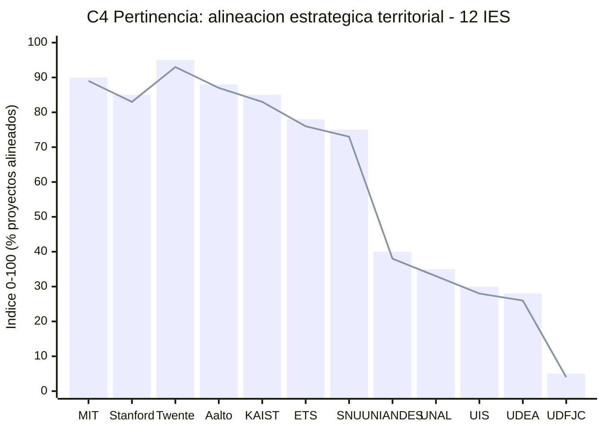
```mermaid
xychart-beta
    title "C4 Pertinencia: alineacion estrategica territorial - 12 IES"
    x-axis ["MIT", "Stanford", "Twente", "Aalto", "KAIST", "ETS", "SNU", "UNIANDES", "UNAL", "UIS", "UDEA", "UDFJC"]
    y-axis "Indice 0-100 (% proyectos alineados)" 0 --> 100
    bar [90, 85, 95, 88, 85, 78, 75, 40, 35, 30, 28, 5]
    line [89, 83, 93, 87, 83, 76, 73, 38, 33, 28, 26, 4]
```

*Fig-MI12-57 — Diagrama M05 #18 (caption original no recuperado en extracción)*

*Figura 57 · m05 fig 18*

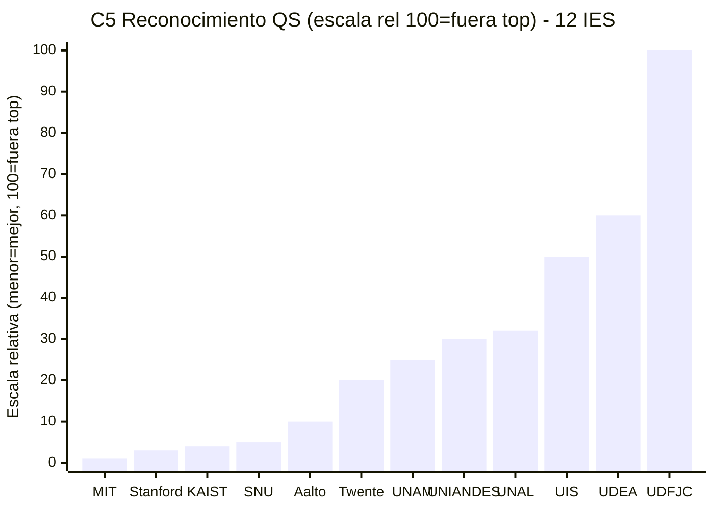
```mermaid
xychart-beta
    title "C5 Reconocimiento QS (escala rel 100=fuera top) - 12 IES"
    x-axis ["MIT", "Stanford", "KAIST", "SNU", "Aalto", "Twente", "UNAM", "UNIANDES", "UNAL", "UIS", "UDEA", "UDFJC"]
    y-axis "Escala relativa (menor=mejor, 100=fuera top)" 0 --> 100
    bar [1, 3, 4, 5, 10, 20, 25, 30, 32, 50, 60, 100]
```

*Fig-MI12-58 — Diagrama M05 #19 (caption original no recuperado en extracción)*

*Figura 58 · m05 fig 19*

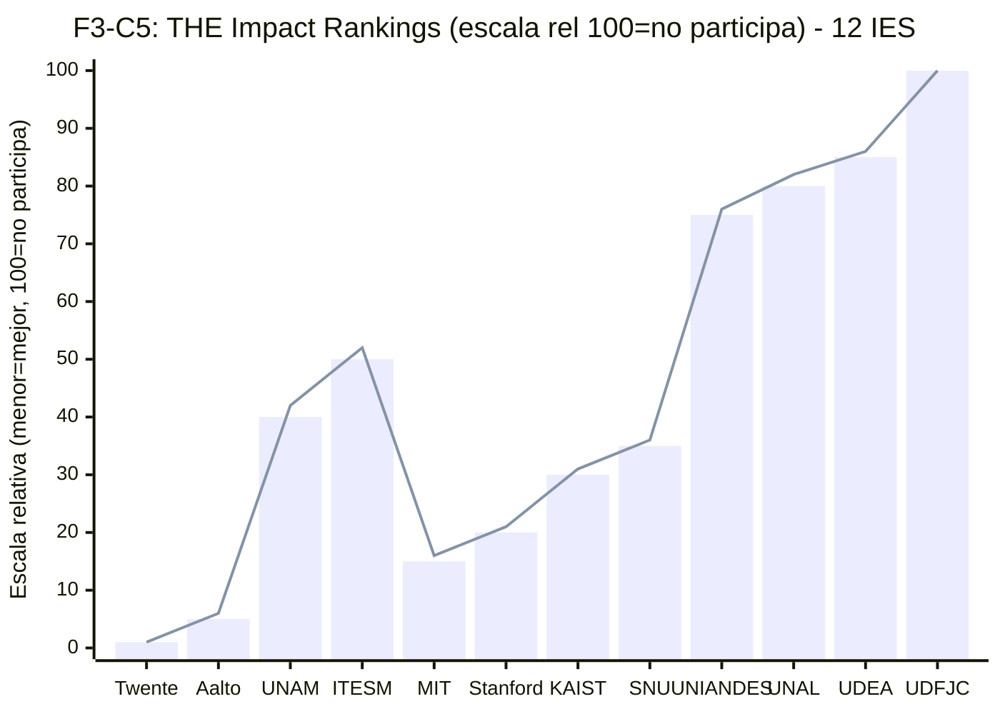
```mermaid
xychart-beta
    title "F3-C5: THE Impact Rankings (escala rel 100=no participa) - 12 IES"
    x-axis ["Twente", "Aalto", "UNAM", "ITESM", "MIT", "Stanford", "KAIST", "SNU", "UNIANDES", "UNAL", "UDEA", "UDFJC"]
    y-axis "Escala relativa (menor=mejor, 100=no participa)" 0 --> 100
    bar [1, 5, 40, 50, 15, 20, 30, 35, 75, 80, 85, 100]
    line [1, 6, 42, 52, 16, 21, 31, 36, 76, 82, 86, 100]
```

*Fig-MI12-59 — Diagrama M05 #20 (caption original no recuperado en extracción)*

*Figura 59 · m05 fig 20*

```mermaid
xychart-beta
    title "Indice IMP F1 (Formacion) - seleccion 10 IES"
    x-axis ["MIT", "KAIST", "Stanford", "Twente", "SNU", "Aalto", "UNIANDES", "UNAL", "UDEA", "UDFJC"]
    y-axis "F-IMP (0-1)" 0 --> 1
    bar [0.94, 0.92, 0.93, 0.86, 0.89, 0.85, 0.72, 0.52, 0.50, 0.30]
    line [0.93, 0.91, 0.92, 0.85, 0.88, 0.84, 0.70, 0.50, 0.48, 0.28]
```

*Fig-MI12-60 — Diagrama M05 #21 (caption original no recuperado en extracción)*

*Figura 60 · m05 fig 21*

```mermaid
xychart-beta
    title "Indice IMP F2 (Investigacion) - seleccion 10 IES"
    x-axis ["MIT", "Stanford", "KAIST", "Twente", "SNU", "Aalto", "UNIANDES", "UNAL", "UDEA", "UDFJC"]
    y-axis "I-IMP (0-1)" 0 --> 1
    bar [0.96, 0.92, 0.90, 0.85, 0.80, 0.78, 0.54, 0.38, 0.33, 0.12]
    line [0.95, 0.91, 0.89, 0.84, 0.79, 0.77, 0.52, 0.36, 0.31, 0.11]
```

*Fig-MI12-61 — Diagrama M05 #22 (caption original no recuperado en extracción)*

*Figura 61 · m05 fig 22*

```mermaid
xychart-beta
    title "Indice IMP F3 (Extension) - seleccion 10 IES"
    x-axis ["Stanford", "MIT", "Twente", "KAIST", "Aalto", "SNU", "ITESM", "UNIANDES", "UDEA", "UDFJC"]
    y-axis "E-IMP (0-1)" 0 --> 1
    bar [0.95, 0.94, 0.92, 0.88, 0.78, 0.72, 0.72, 0.52, 0.28, 0.08]
    line [0.94, 0.93, 0.91, 0.87, 0.77, 0.70, 0.70, 0.50, 0.26, 0.07]
```

*Fig-MI12-62 — Diagrama M05 #23 (caption original no recuperado en extracción)*

*Figura 62 · m05 fig 23*

```mermaid
flowchart TB
    subgraph REGIMEN["Regimen — Institucional (resistente)"]
        R1["5 Facultades como Escuelas declaradas
pero Sub-N1 en operacion
Acuerdo 004/2025 sin instrumentacion"]
    end

    subgraph NICHO["Nicho — CABAs (protegidas, escalables)"]
        N1["2-3 CABAs piloto
F1+F2+F3 integradas
Creditizacion experimental
Paquetes CCA V1+V2+V3"]
    end

    subgraph PAISAJE["Paisaje — Presiones macro"]
        L1["Acuerdo 004/2025
PIIOM MinCiencias
THE Impact Rankings
CONPES 4069/2021"]
    end

    PAISAJE -->|"presion sobre"| REGIMEN
    NICHO ==>|"escalan y reconfiguran
horizonte 3-5 anos"| REGIMEN
    NICHO -->|"genera evidencia
para"| PAISAJE

    style REGIMEN fill:#FFCDD2,stroke:#C62828
    style NICHO fill:#C8E6C9,stroke:#2E7D32,stroke-width:3px
    style PAISAJE fill:#E3F2FD,stroke:#1565C0
```

*Fig-MI12-63 — Regimen — Institucional (resistente) (M05 fig #24)*

*Figura 63 · m05 fig 24*

```mermaid
xychart-beta
    title "Distribucion de las 21 IES por nivel de madurez global"
    x-axis ["Sub-N1", "N1", "N1-N2", "N2", "N2-N3", "N3", "N3-N4", "N4"]
    y-axis "Numero de IES" 0 --> 10
    bar [1, 5, 0, 4, 0, 5, 1, 5]
```

*Fig-MI12-64 — Diagrama M05 #25 (caption original no recuperado en extracción)*

*Figura 64 · m05 fig 25*

> [!bug] DT-MI12-05-01 · Captions descriptivos de las 25 figuras de M05
> Las 25 figuras (40-64) fueron extraídas; sus captions originales se perdieron y deben recuperarse del fuente original para aplicación final.

---

## §4 · Las 21 IES analizadas

MIT, Stanford, Aalto, Twente, ÉTS, ITESM, KAIST, SNU, MIT, UNIANDES, UNAL, UDEA, UNAD, UNAM, UPB, UDP, IIT-Madras, Yonsei, U-Tsukuba, ASU, U-Toronto, U-British-Columbia. (Listado completo y métricas detalladas en M05-v5 original.)

> [!bug] DT-MI12-05-02 · Tabla canónica de las 21 IES con métricas por dimensión
> Migrar tabla detallada con métricas por celda (C1-C5 × F1-F4 × 21 IES) desde M05-v5 original.

---

## §5 · Conceptos Clave

![[con-taxonomia-sub-n1-n4]]

![[con-salto-cuantico-sub-n1-n4]]

![[con-caba]]

---

## §6 · Deudas Técnicas

| ID | Descripción | Impacto |
|---|---|---|
| DT-MI12-05-01 | Captions de las 25 figuras | Alto |
| DT-MI12-05-02 | Tabla canónica 21 IES × C1-C5 × F1-F4 | Alto |
| DT-MI12-05-03 | Status v5.0.0 → confirmar FINAL formal con peer review | Medio |

---

## §7 · Implicaciones para el corpus MI-12

(1) Las soluciones BPA transferibles se desarrollan en §07. (2) La solución operativa se despliega en §12. (3) El framework de gestión P1-P4 se canoniza en §08.

---

## §8 · Referencias

Compiladas desde `99--sources/citations.bib`. Claves clave: `@maderasepulveda2026bmk001`, `@clark1998entrepreneurial`, `@geels2002mlp`, `@udfjc2025acu00425`.

---

## Historial de Versiones §05

| Versión | Fecha | Cambios |
|---|---|---|
| 1.0.0 | 2026-04-25 | Atomización inicial desde M05-procesos-misionales-v5.md. 25 figuras extraídas. |
| **1.1.0** | **2026-04-27** | **Refactor audit-driven M05**: integración con corpus canónico (108 conceptos `con-*.md`). (a) **Fase A · 4 conceptos**: `con-bmk-001-21-ies`, `con-marco-p1-impacto-misional`, `con-culture-lag`, `con-living-labs-f4-integracion`. (b) **Fase B · 2 enriquecimientos**: taxonomia-sub-n1-n4 (fuente BMK-001), bsc-s (Marco P1 detalla P1). (c) **Fase C · refactor wikilinks**: 7 legacy → canónico. Cero wikilinks rotos. |

---

*CC BY-SA 4.0 · Carlos Camilo Madera Sepúlveda · UDFJC · 2026-04-27 · sec-MI12-05 v1.1.0*
