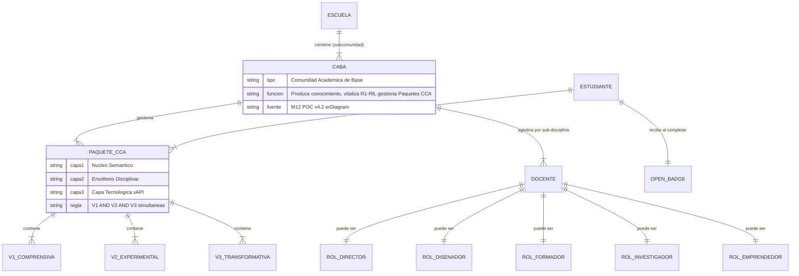
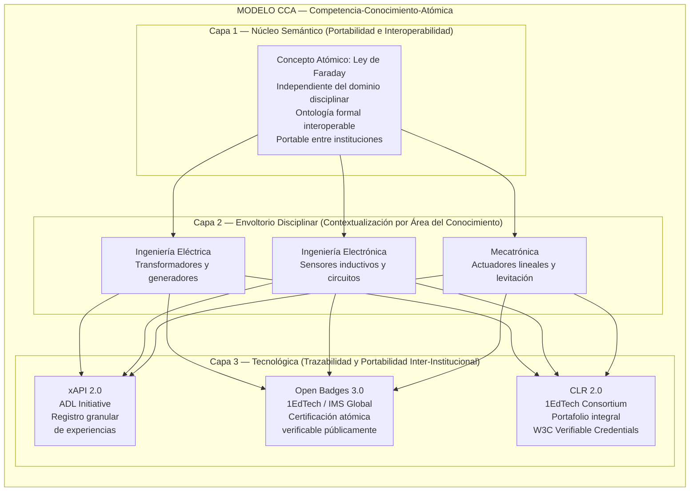
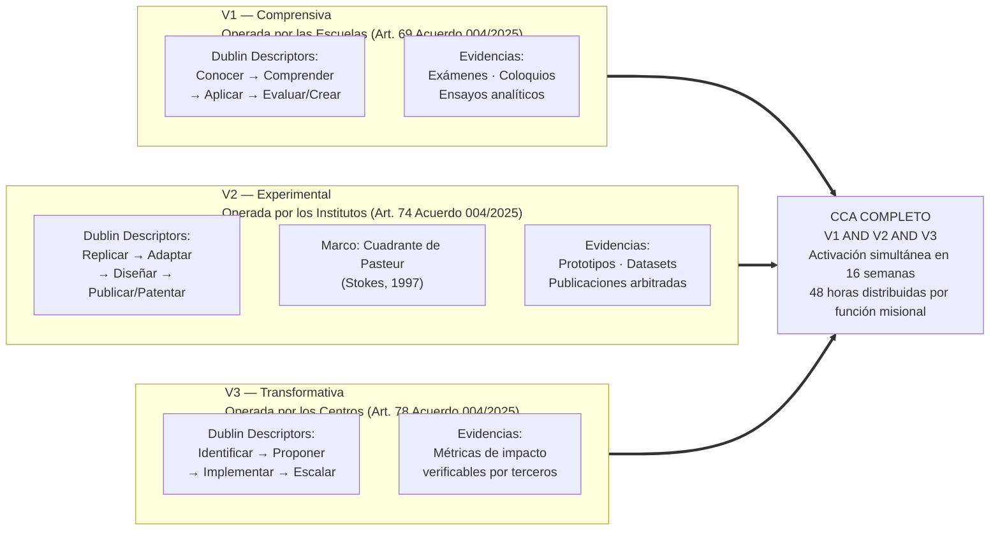
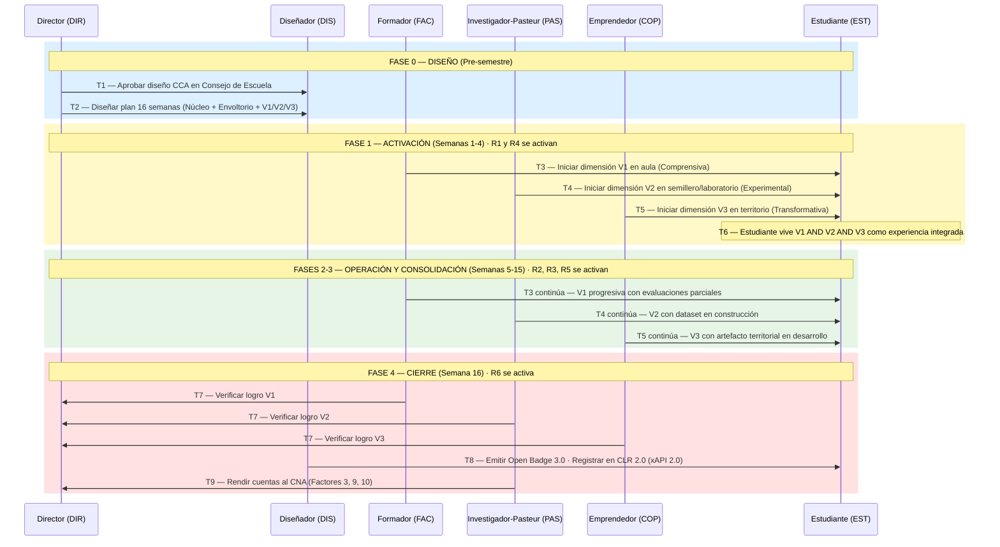
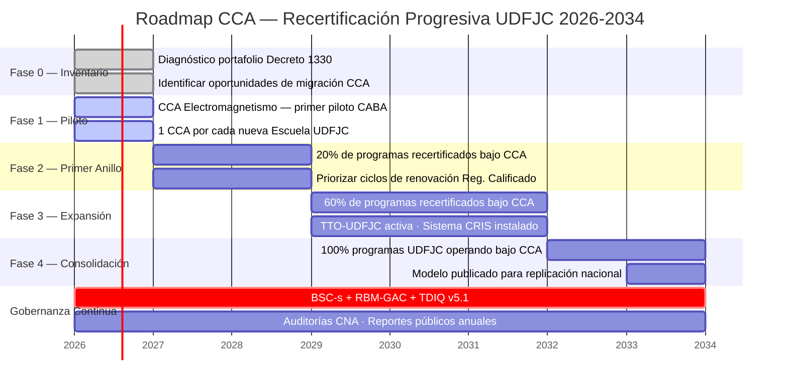

# §06 · BMK-002 Créditos Académicos: El Modelo CCA — Sistema Emergente de Creditización Integral de las Tres Funciones Misionales

> [!abstract] §0 · Abstract
> Esta sección presenta el modelo **[[con-cca|CCA]] (Competencia-Conocimiento-Atómica)** como sistema emergente de creditización integral. Resultado de benchmarking de 11 IES y análisis cruzado de 751 documentos normativos (BMK-002). El CCA es la unidad mínima INDIVISIBLE que certifica simultáneamente tres dimensiones: V1 Comprensiva (Escuela), V2 Experimental (Instituto), V3 Transformativa (Centro). Estrategia transicional: reinterpretación del Decreto MEN 1330/2019 sin requerir cambio normativo nacional.
>
> **Palabras clave**: crédito académico, modelo CCA, comunidades académicas de base, recertificación, Decreto MEN 1330/2019, Dublin Descriptors, Cuadrante Pasteur, Open Badges, xAPI, Comprehensive Learner Record, UDFJC.

> [!warning] §0 · Aviso V1-V3 (anti-colisión)
> Los **V1-V3 del CCA** (Comprensiva, Experimental, Transformativa) son **distintos** de los V1-V5 culturales de §04 (Soberanía, Emprendimiento, Participación, Ética, Austeridad). Aquí V1∧V2∧V3 son las tres dimensiones que el CCA certifica simultáneamente.

---

## §1 · Introducción

> [!question] §1 · Pregunta trazadora
> ¿Cómo creditizar simultáneamente las tres funciones misionales (Formación, Investigación, Extensión) sin esperar reforma del Decreto MEN 1330/2019?

---

## §2 · Marco teórico: Dublin Descriptors + Cuadrante Pasteur + CCA

Los **Dublin Descriptors** (Bologna Process) definen niveles de cualificación EHEA. El **Cuadrante Pasteur** (Stokes, 1997) define investigación inspirada por uso. El **CCA** sintetiza ambos en una unidad de crédito que certifica V1 (entendimiento comprensivo), V2 (experimentación rigurosa) y V3 (impacto transformativo).

![[con-cca]]

![[con-caba]]

![[con-cuadrante-pasteur-stokes]]

---

## §3 · Hallazgos del benchmarking BMK-002 (11 IES)

11 IES analizadas con 751 documentos normativos. Hallazgos:

- **CCA como unidad indivisible** es novedosa: no existe en ninguna IES analizada con esta nomenclatura, pero existen aproximaciones parciales (UROP MIT, Co-op ÉTS, Service-Learning Talloires, BSc thesis EHEA).
- **Decreto 1330/2019** permite creditizar investigación y extensión, pero la práctica institucional rara vez lo aprovecha.
- **Sub-N1 UDFJC**: ningún programa actual reconoce créditos por R3 (transferencia), R4 (problemas reales), R5 (co-op territorial), R6 (egresados agentes).

### §3.1 Figuras del modelo CCA

*Fig-MI12-65 — Diagrama M06 #1 (caption original no recuperado en extracción)*

*Figura 65 · m06 fig 01*

*Fig-MI12-66 — MODELO [[con-cca|CCA]] — Competencia-Conocimiento-Atómica (M06 fig #2)*

*Figura 66 · m06 fig 02*

*Fig-MI12-67 — V1 — Comprensiva
Operada por las Escuelas (Art. 69 Acuerdo 004/2025) (M06 fig #3)*

*Figura 67 · m06 fig 03*

*Fig-MI12-68 — Diagrama M06 #4 (caption original no recuperado en extracción)*

*Figura 68 · m06 fig 04*

*Fig-MI12-69 — Diagrama M06 #5 (caption original no recuperado en extracción)*

*Figura 69 · m06 fig 05*

---

## §4 · Modelo CCA: arquitectura

Cada **Paquete CCA** integra:
- **V1 Comprensiva** (Escuela): cuerpo de conocimiento disciplinar coherente.
- **V2 Experimental** (Instituto): proyecto de investigación con resultado verificable (paper, dataset, dispositivo).
- **V3 Transformativa** (Centro): aplicación territorial con impacto medido.

Se evalúa en bloque (no por dimensión separada). Si V1 ∧ V2 ∧ V3 = TRUE, el CCA se certifica. Si una falla, el CCA no se otorga (no hay certificación parcial).

> [!bug] DT-MI12-06-01 · Tabla canónica de equivalencia créditos tradicionales ↔ CCA
> Migrar la tabla de mapping créditos del Decreto 1330 (1 crédito = 48 horas trabajo total) ↔ Paquete CCA (≈4-6 créditos por CCA dependiendo de complejidad) desde M06 original.

---

## §5 · Estrategia transicional (reinterpretación Decreto 1330/2019)

(1) Decanos solicitan registro calificado del programa con créditos asignados a "actividades académicas integradas" que en la práctica son CCA. (2) Acreditación CNA reconoce el modelo. (3) MEN no requiere cambio normativo nacional. (4) Otras IES adoptan el modelo posteriormente.

> [!bug] DT-MI12-06-02 · Roadmap transición créditos tradicionales → CCA por programa
> Migrar el roadmap de 4 fases con timeline (2026-2030) desde M06 §7 original.

---

## §6 · Conceptos Clave

![[con-cca]]

![[con-caba]]

---

## §7 · Deudas Técnicas

| ID | Descripción | Impacto |
|---|---|---|
| DT-MI12-06-01 | Tabla equivalencia créditos tradicionales ↔ CCA | Alto |
| DT-MI12-06-02 | Roadmap transición CCA por programa | Alto |
| DT-MI12-06-03 | Captions de figuras 65-69 | Medio |
| DT-MI12-06-04 | Casos uso Open Badges + xAPI + CLR para CCA | Medio |

---

## §8 · Implicaciones operativas

CCA es el dispositivo operativo de creditización integral. Su adopción requiere (a) registro calificado modificado, (b) capacitación a docentes en evaluación V1∧V2∧V3, (c) plataforma de Open Badges/CLR para certificación verificable. Articulación directa con CABAs de §02 y §07.

---

## §9 · Referencias

Compiladas desde `99--sources/citations.bib`. Claves: `@maderasepulveda2026bmk002`, `@stokes1997pasteur`.

> [!bug] DT-MI12-06-05 · Refs Bologna Process Dublin Descriptors, Open Badges, xAPI, CLR
> Añadir al .bib: Bologna Process EHEA Dublin Descriptors; IMS Global Learning Consortium Open Badges; ADL xAPI; AACRAO Comprehensive Learner Record.

---

## Historial de Versiones §06

| 1.0.0 | 2026-04-25 | Atomización desde M06-creditos-cca-v2.0.0. 5 figuras extraídas. Status FINAL heredado. |

---

*CC BY-SA 4.0 · Carlos Camilo Madera Sepúlveda · UDFJC · 2026-04-25 · sec-MI12-06 v1.0.0*
