# §07 · BPA-001 — Especificación de 21 Buenas Prácticas Adoptables + matriz R1-R6

> [!abstract] §0 · Abstract
> Esta sección especifica **21 Buenas Prácticas Adoptables (BPAs)** transferibles desde el benchmarking BMK-001 (§05) hacia la implementación operativa de la reforma UDFJC. Las 21 BPAs se organizan por función misional: F01-F05 (5 BPAs Formación), I01-I05 (5 BPAs Investigación), E01-E04 (4 BPAs Extensión), INT01-INT07 (7 BPAs Integración / Living-Labs). Cada BPA está documentada con árbol de problemas [[con-rbm-gac|RBM-GAC]], cadena de resultados (output → outcome → impact) y matriz de activación R1-R6. Caso piloto: la activación de R4 (problemas reales) en [[con-caba|CABA]] piloto Escuela de Física UDFJC.
>
> **Palabras clave**: 21 BPAs, RBM-GAC, árbol de problemas, retroalimentaciones R1-R6, ΩMT, CABA, Clark routes, INT01-INT07.

---

## §1 · Las 21 BPAs

### §1.1 Por función misional

| Función | BPAs | Cantidad |
|---|---|---|
| Formación (PM1) | F01-F05 | 5 |
| Investigación (PM2) | I01-I05 | 5 |
| Extensión (PM3) | E01-E04 | 4 |
| Integración / Living-Labs (F4) | INT01-INT07 | 7 |
| **Total** | | **21** |

### §1.2 Cada BPA contiene

(1) Árbol de problemas (RBM-GAC); (2) Cadena de resultados output → outcome → impact; (3) Matriz R1-R6 (qué retroalimentaciones activa); (4) Roles [[con-jtbd-christensen|JTBD]] afectados; (5) IES de referencia; (6) Indicadores de adopción L0-L4; (7) Costo estimado en SMMLV-país.

---

## §2 · Figuras y diagramas (26 mermaids)


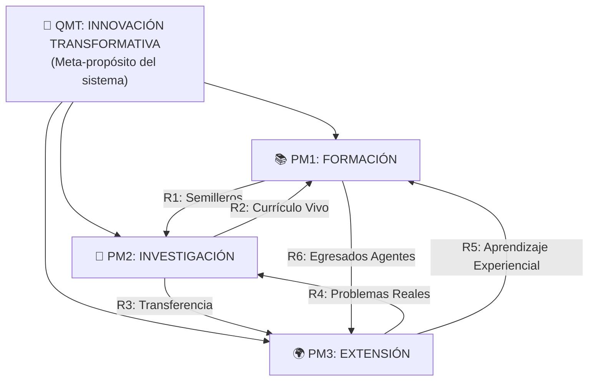

*Fig-MI12-70 — 🎯 QMT: INNOVACIÓN TRANSFORMATIVA (M07 fig #1)*

*Figura 70 · m07 fig 01*


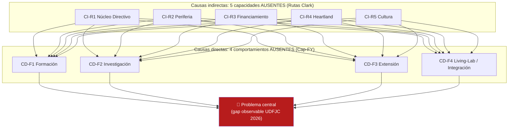

*Fig-MI12-71 — 🔴 Problema central (M07 fig #2)*

*Figura 71 · m07 fig 02*


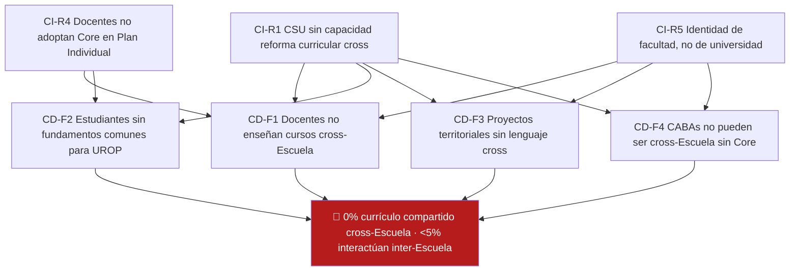

*Fig-MI12-72 — 🔴 0% currículo compartido cross-Escuela · <5% interactúan inter-Escuela (M07 fig #3)*

*Figura 72 · m07 fig 03*


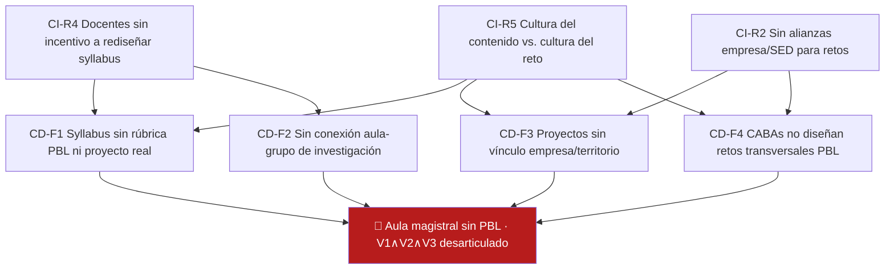

*Fig-MI12-73 — 🔴 Aula magistral sin PBL · V1∧V2∧V3 desarticulado (M07 fig #4)*

*Figura 73 · m07 fig 04*


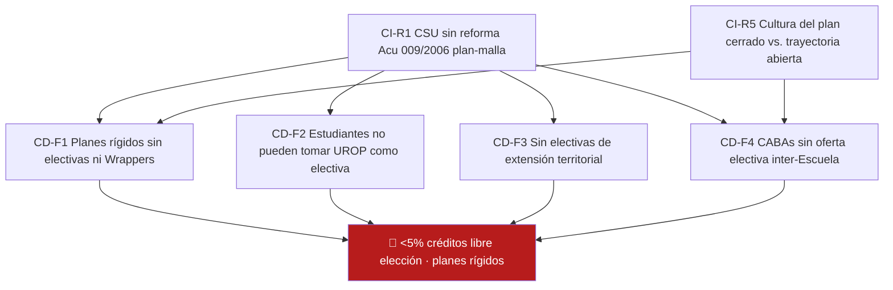

*Fig-MI12-74 — 🔴 <5% créditos libre elección · planes rígidos (M07 fig #5)*

*Figura 74 · m07 fig 05*


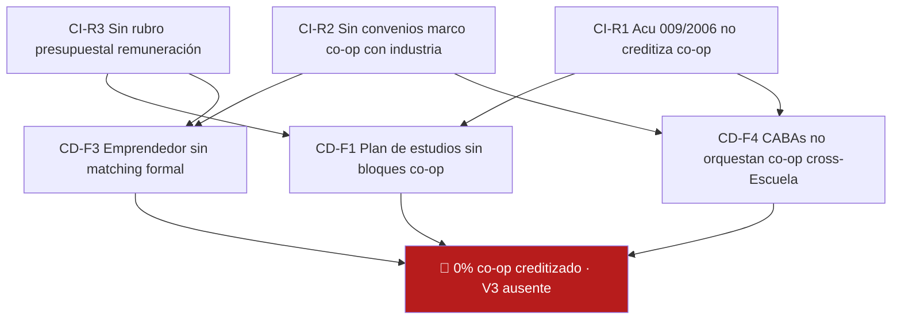

*Fig-MI12-75 — 🔴 0% co-op creditizado · V3 ausente (M07 fig #6)*

*Figura 75 · m07 fig 06*


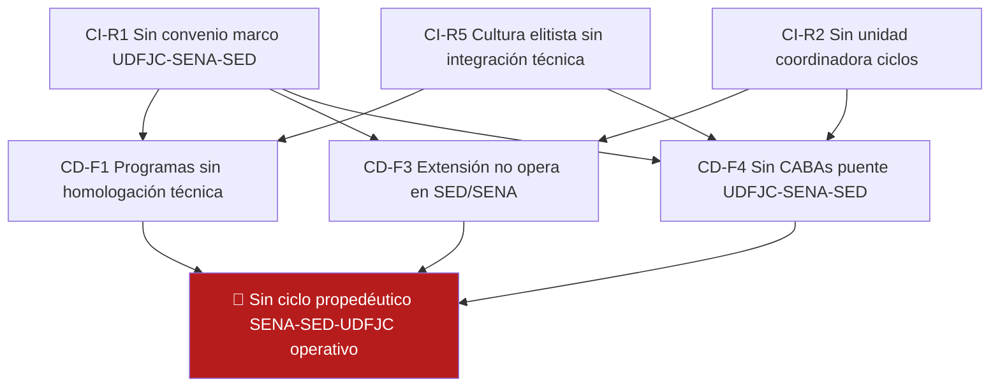

*Fig-MI12-76 — 🔴 Sin ciclo propedéutico SENA-SED-UDFJC operativo (M07 fig #7)*

*Figura 76 · m07 fig 07*


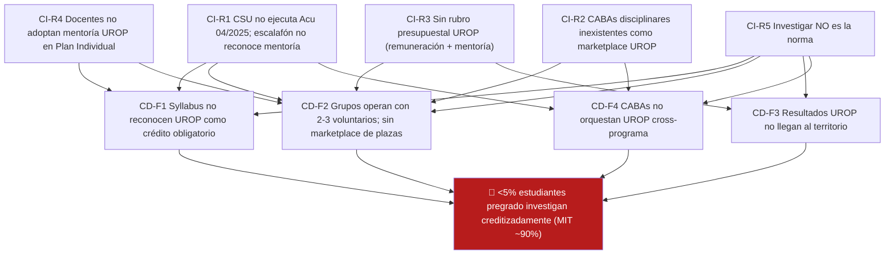

*Fig-MI12-77 — 🔴 <5% estudiantes pregrado investigan creditizadamente (MIT ~90%) (M07 fig #8)*

*Figura 77 · m07 fig 08*


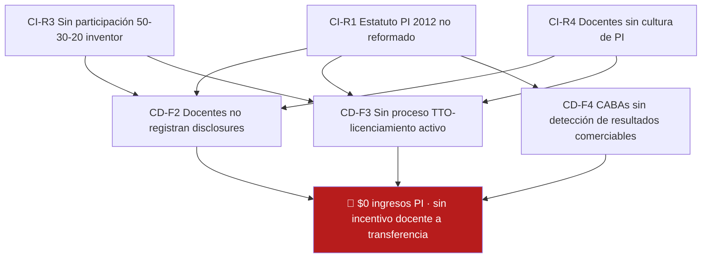

*Fig-MI12-78 — 🔴 $0 ingresos PI · sin incentivo docente a transferencia (M07 fig #9)*

*Figura 78 · m07 fig 09*


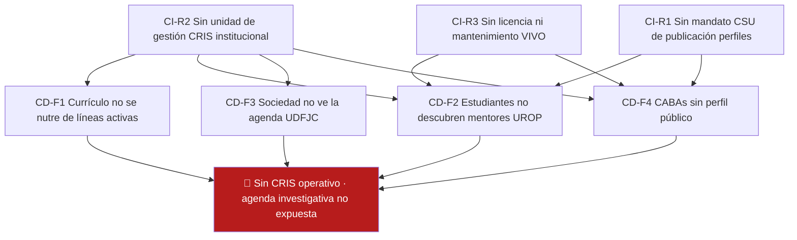

*Fig-MI12-79 — 🔴 Sin CRIS operativo · agenda investigativa no expuesta (M07 fig #10)*

*Figura 79 · m07 fig 10*


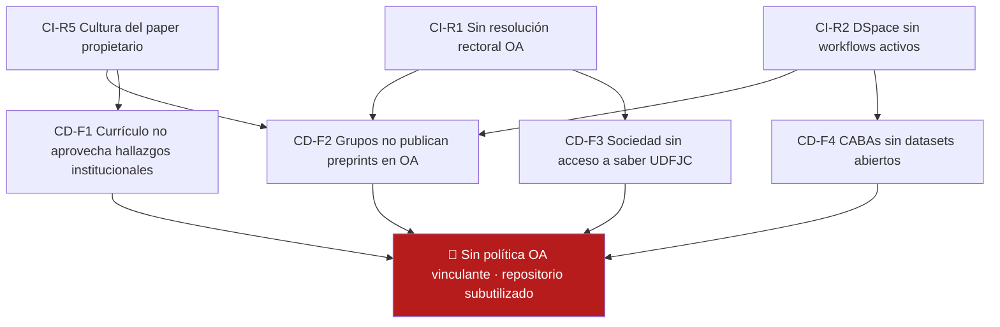

*Fig-MI12-80 — 🔴 Sin política OA vinculante · repositorio subutilizado (M07 fig #11)*

*Figura 80 · m07 fig 11*


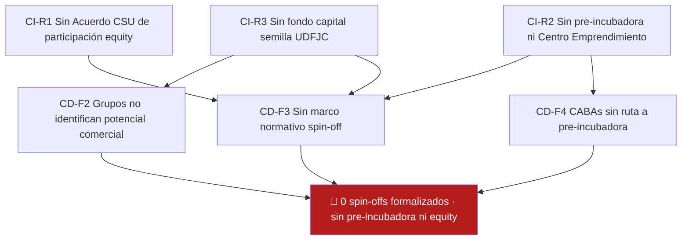

*Fig-MI12-81 — 🔴 0 spin-offs formalizados · sin pre-incubadora ni equity (M07 fig #12)*

*Figura 81 · m07 fig 12*


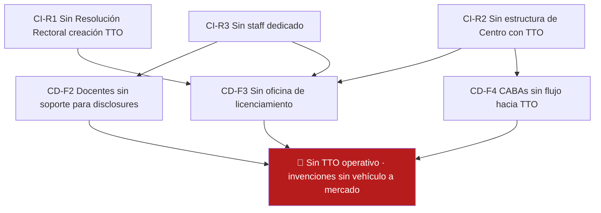

*Fig-MI12-82 — 🔴 Sin TTO operativo · invenciones sin vehículo a mercado (M07 fig #13)*

*Figura 82 · m07 fig 13*


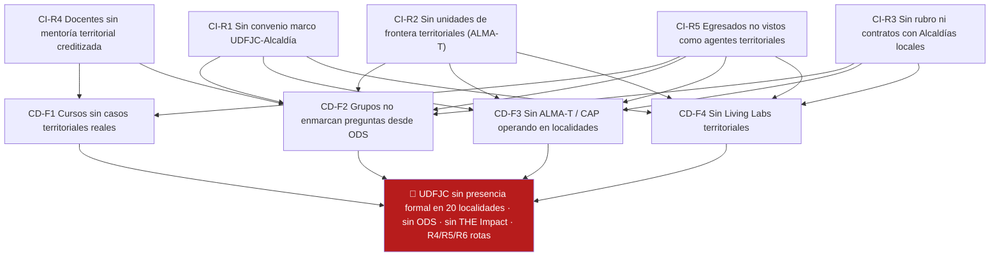

*Fig-MI12-83 — 🔴 UDFJC sin presencia formal en 20 localidades · sin ODS · sin THE Impact · R4/R5/R6 rotas (M07 fig #14)*

*Figura 83 · m07 fig 14*


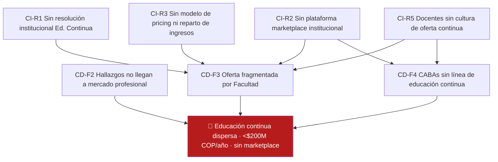

*Fig-MI12-84 — 🔴 Educación continua dispersa · <$200M COP/año · sin marketplace (M07 fig #15)*

*Figura 84 · m07 fig 15*


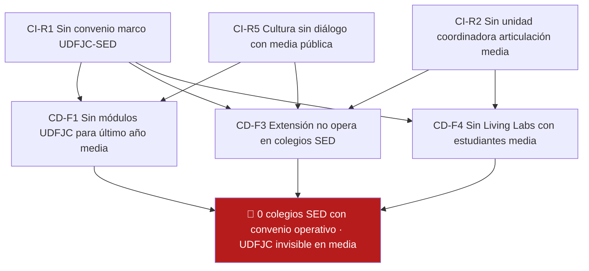

*Fig-MI12-85 — 🔴 0 colegios SED con convenio operativo · UDFJC invisible en media (M07 fig #16)*

*Figura 85 · m07 fig 16*


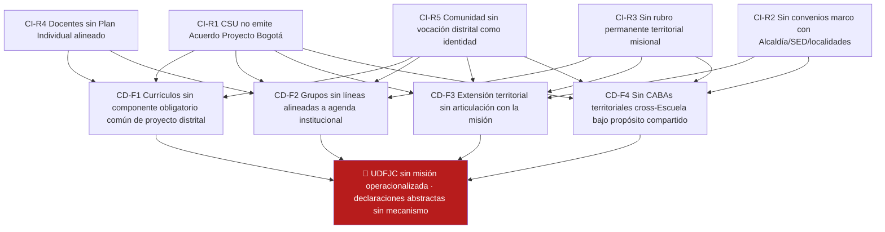

*Fig-MI12-86 — 🔴 UDFJC sin misión operacionalizada · declaraciones abstractas sin mecanismo (M07 fig #17)*

*Figura 86 · m07 fig 17*


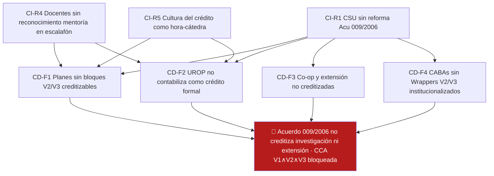

*Fig-MI12-87 — 🔴 Acuerdo 009/2006 no creditiza investigación ni extensión · [[con-cca|CCA]] V1∧V2∧V3 bloqueada (M07 fig #18)*

*Figura 87 · m07 fig 18*


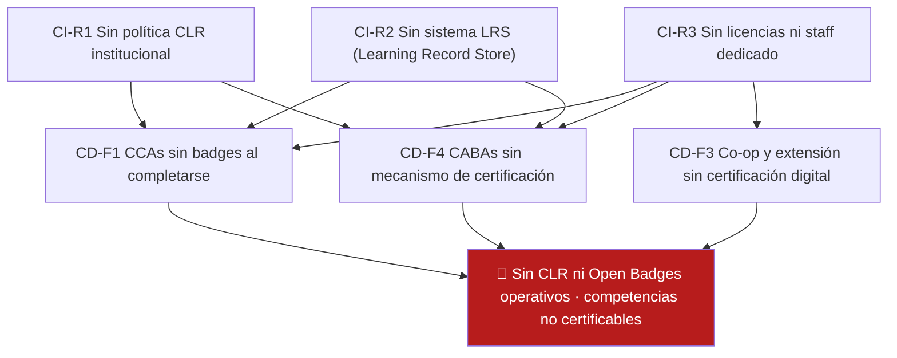

*Fig-MI12-88 — 🔴 Sin CLR ni Open Badges operativos · competencias no certificables (M07 fig #19)*

*Figura 88 · m07 fig 19*


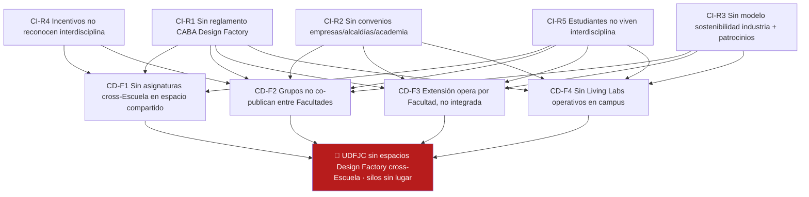

*Fig-MI12-89 — 🔴 UDFJC sin espacios Design Factory cross-Escuela · silos sin lugar (M07 fig #20)*

*Figura 89 · m07 fig 20*


```mermaid
flowchart TB
    P["🔴 Duplicación programática · capacidad docente atomizada"]
    CD1["CD-F1 Planes sin Cores compartidos"]
    CD4["CD-F4 Sin CABAs disciplinares como unidad de entrega"]
    CD2["CD-F2 Sin liberación de capacidad para investigar"]
    CI1["CI-R1 CSU sin decisión de consolidación"]
    CI4["CI-R4 Docentes temen pérdida de territorio"]
    CI5["CI-R5 Cultura de 'cada programa su feudo'"]
    CI1 --> CD1
    CI1 --> CD4
    CI4 --> CD1
    CI4 --> CD4
    CI5 --> CD1
    CI5 --> CD4
    CD1 --> P
    CD2 --> P
    CD4 --> P
    style P fill:#B71C1C,color:#fff
```

*Fig-MI12-90 — 🔴 Duplicación programática · capacidad docente atomizada (M07 fig #21)*

*Figura 90 · m07 fig 21*


```mermaid
flowchart TB
    P["🔴 Graduación ~42% · deserción alta primeros 3 semestres"]
    CD1["CD-F1 Aulas sin mentoría personalizada"]
    CD2["CD-F2 Semilleros no actúan como ancla de permanencia"]
    CD4["CD-F4 Sin CABA de seguimiento estudiantes en riesgo"]
    CI2["CI-R2 Sin unidad S4 Inteligencia VSM"]
    CI4["CI-R4 Docentes sin rol mentor formalizado"]
    CI5["CI-R5 Cultura del 'filtro' vs. acompañamiento"]
    CI2 --> CD1
    CI2 --> CD2
    CI2 --> CD4
    CI4 --> CD1
    CI4 --> CD2
    CI5 --> CD1
    CI5 --> CD4
    CD1 --> P
    CD2 --> P
    CD4 --> P
    style P fill:#B71C1C,color:#fff
```

*Fig-MI12-91 — 🔴 Graduación ~42% · deserción alta primeros 3 semestres (M07 fig #22)*

*Figura 91 · m07 fig 22*


```mermaid
flowchart TB
    P["🔴 <$500M COP/año extensión productiva · laboratorios ociosos"]
    CD3["CD-F3 Sin portafolio institucional de servicios"]
    CD4["CD-F4 CABAs sin rol comercial"]
    CD2["CD-F2 R4 territorial no alimenta R3 productiva"]
    CI2["CI-R2 Sin TTO/Centro con operación comercial"]
    CI3["CI-R3 Sin modelo de pricing ni incentivos reparto"]
    CI5["CI-R5 Cultura del 'no comercializar saber'"]
    CI2 --> CD3
    CI2 --> CD4
    CI3 --> CD3
    CI3 --> CD4
    CI5 --> CD3
    CI5 --> CD4
    CD2 --> P
    CD3 --> P
    CD4 --> P
    style P fill:#B71C1C,color:#fff
```

*Fig-MI12-92 — 🔴 <$500M COP/año extensión productiva · laboratorios ociosos (M07 fig #23)*

*Figura 92 · m07 fig 23*


```mermaid
flowchart LR
    INT02["🔑 INT02<br/>Créditos inv/ext<br/>PRE-REQUISITO<br/>Año 0"]
    INT01["⭐ INT01<br/>Misión operacional<br/>ANCLA<br/>Año 0"]
    I01["⭐ I01<br/>UROP piloto<br/>ANCLA<br/>Año 1"]
    INT04["⭐ INT04<br/>CABA Design Factory<br/>ANCLA<br/>Año 1"]
    F01["⭐ F01<br/>Concepto compartido<br/>ANCLA<br/>Año 2-3"]
    E02["⭐ E02<br/>Extensión territorial<br/>ANCLA<br/>Año 2-3"]

    INT02 --> I01
    INT02 --> F01
    INT02 --> INT04
    INT01 --> I01
    INT01 --> INT04
    I01 --> F01
    INT04 --> F01
    INT04 --> E02
    INT01 --> E02

    style INT02 fill:#FFE082,stroke:#F57C00,stroke-width:3px
    style INT01 fill:#B39DDB,stroke:#311B92,stroke-width:3px
    style INT04 fill:#B39DDB,stroke:#311B92,stroke-width:3px
    style I01 fill:#81D4FA,stroke:#01579B,stroke-width:3px
    style F01 fill:#A5D6A7,stroke:#1B5E20,stroke-width:3px
    style E02 fill:#A5D6A7,stroke:#1B5E20,stroke-width:3px
```

*Fig-MI12-93 — 🔑 INT02 (M07 fig #24)*

*Figura 93 · m07 fig 24*


```mermaid
gantt
    title Plan mínimo viable — 5 anclas + INT02 pre-requisito (2026–2034)
    dateFormat YYYY
    axisFormat %Y

    section Año 0 (normativo)
    INT02 Créditos inv/ext (pre-req)    :crit, int02, 2026, 1y
    INT01 Misión operacionalizada       :crit, int01, 2026, 1y

    section Año 1 (pilotos)
    I01 UROP piloto (10 grupos)         :active, i01, 2027, 1y
    INT04 2 CABAs Design Factory        :active, int04, 2027, 1y

    section Año 2-3 (consolidación)
    F01 Concepto compartido rollout     :f01, 2028, 2y
    E02 Extensión territorial ODS       :e02, 2028, 2y

    section Año 4-8 (escala)
    Escala + Periodo 2 gobierno         :2030, 4y
```

*Fig-MI12-94 — Diagrama M07 #25 (caption original no recuperado en extracción)*

*Figura 94 · m07 fig 25*


```mermaid
stateDiagram-v2
    direction LR

    [*] --> Desconocida : antes del piloto

    state "⚫ Desconocida" as Desconocida {
        d_def : BPA no está en agenda institucional
        d_R : Ninguna R activa
    }

    state "🔴 Declarada" as Declarada {
        decl_def : Existe marco normativo (Acuerdo/Resolución)
        decl_R : R-1 activada
        decl_ind : ≥1 documento oficial sobre la BPA
    }

    state "🟠 Estructurada" as Estructurada {
        estr_def : Hay plan operativo + unidad responsable + presupuesto
        estr_R : + R-2 + R-3 parcial
        estr_ind : Plan publicado, responsable designado, partida presupuestal
    }

    state "🟡 Operativa" as Operativa {
        oper_def : Ejecutándose con métricas medibles
        oper_R : + R-3 consolidada + R-4
        oper_ind : ≥50% docentes involucrados, ≥1 cohorte completa
    }

    state "🟢 Institucionalizada" as Instit {
        instit_def : Parte de la rutina; cohortes nuevas la heredan
        instit_R : + R-5 activada
        instit_ind : Encuesta clima G4, sin necesidad de campeones heroicos
    }

    Desconocida --> Declarada : CSU/Rectoría aprueba · R-1 Núcleo Directivo
    Declarada --> Estructurada : Unidad responsable + R-2 Periferia + R-3 parcial
    Estructurada --> Operativa : Recursos sostenidos + docentes · R-3 pleno + R-4 Heartland
    Operativa --> Instit : Cultura instalada · R-5 Cultura Emprendedora

    Instit --> [*] : BPA integrada arquetípicamente

    Declarada --> Desconocida : revocación (Acuerdo derogado)
    Estructurada --> Declarada : vaciamiento (presupuesto recortado)
    Operativa --> Estructurada : reversión (docentes se retiran)
    Instit --> Operativa : fragilidad cultural (nuevo rector reinicia)
```

*Fig-MI12-95 — Diagrama M07 #26 (caption original no recuperado en extracción)*

*Figura 95 · m07 fig 26*


> [!bug] DT-MI12-07-01 · Captions descriptivos de las 26 figuras
> Asignar título y caption a cada una de las 26 figuras (Fig-MI12-70 a Fig-MI12-95) basado en el contexto del original M07.

---

## §3 · Articulación con el ciclo virtuoso §02

Las 21 BPAs son las **palancas operativas** que permiten activar las R1-R6 del ciclo virtuoso. Sin BPAs concretas, R1-R6 son aspiración. Con BPAs activas, el ciclo virtuoso se vuelve operativo.

> [!bug] DT-MI12-07-02 · Tabla canónica BPA × R1-R6 × roles JTBD
> Migrar matriz canónica de M07 §K que cruza las 21 BPAs con R1-R6 y los 6 roles JTBD.

---

## §4 · Niveles de adopción L0-L4 por unidad

- L0: no adoptada
- L1: piloto (1 unidad)
- L2: implementada (política formal + CABA activa)
- L3: institucionalizada (BPMN + métricas ITCV)
- L4: generativa (genera nuevas BPAs desde el territorio)

Mapeo a taxonomía Sub-N1→N4 de §05.

---

## §5 · Conceptos Clave

![[con-retroalimentaciones-r1-r6]]

![[con-cinco-vias-clark]]

![[con-caba]]

---

## §6 · Deudas Técnicas

| ID | Descripción | Impacto |
|---|---|---|
| DT-MI12-07-01 | Captions de las 26 figuras | Alto |
| DT-MI12-07-02 | Tabla canónica BPA × R × roles | Alto |
| DT-MI12-07-03 | Costos estimados en SMMLV-país de cada BPA | Alto |
| DT-MI12-07-04 | Casos de adopción L0-L4 por Escuela UDFJC | Medio |
| DT-MI12-07-05 | kd_series antes decía Track-B, ahora Track-D (corregido al migrar) | Cerrado |

---

## §7 · Implicaciones operativas

(1) Las 21 BPAs son catálogo de palancas listas para activar; (2) Cada Escuela debe priorizar 3-5 BPAs por trimestre; (3) El nivel de adopción L0-L4 debe trackearse en dashboard institucional.

---

## §8 · Referencias

Compiladas desde `99--sources/citations.bib`. Claves: `@maderasepulveda2026bmk001`, `@clark1998entrepreneurial`, `@minciencias2022piiom`.

---

## Historial §07

| 1.0.0 | 2026-04-25 | Atomización desde M07-21-bpa-especificadas-v1.1.0. 26 figuras extraídas. Status FINAL heredado. |

---

*CC BY-SA 4.0 · Carlos Camilo Madera Sepúlveda · UDFJC · 2026-04-25 · sec-MI12-07 v1.0.0*
