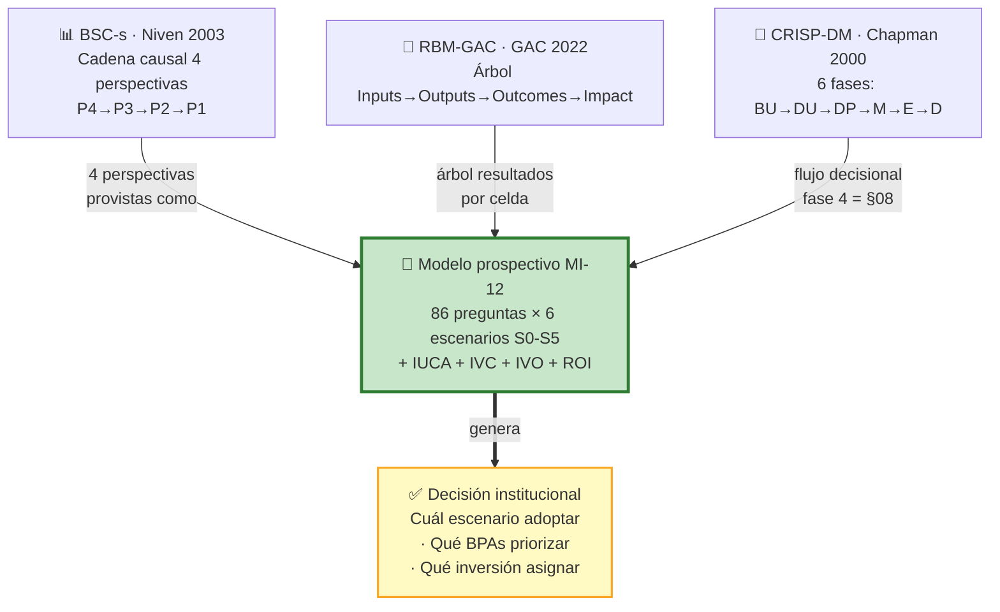
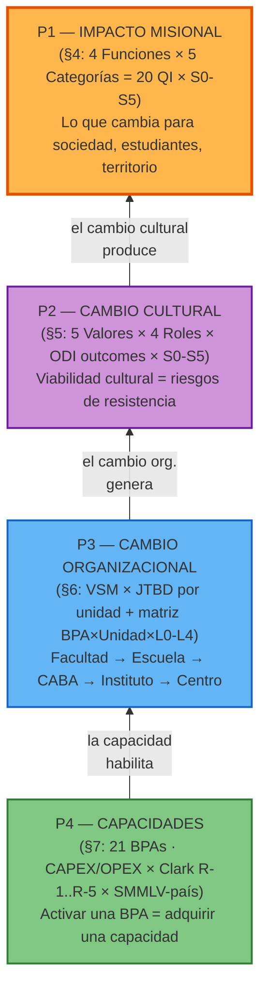

# §08 · Framework BSC-s × RBM-GAC × CRISP-DM — Modelo Prospectivo de Transformación Misional UDFJC

> [!abstract] 📄 Propiedad Intelectual & Ciencia Abierta
> **Autor**: Carlos Camilo Madera Sepúlveda · ccmaderas@udistrital.edu.co · UDFJC
> **Licencia**: CC BY-SA 4.0 · **Cita sugerida**: Madera Sepúlveda, C. C. (2026). §08 · Framework [[glo-bsc-s|BSC-s]] × [[glo-rbm-gac|RBM-GAC]] × [[glo-crisp-dm|CRISP-DM]]. *Capítulo MI-12* (cap-MI12, Sección 8). UDFJC. [DOI pendiente]
> **Versión 2.0.0**: Esta sección recarga e integra el contenido del documento interno APE-000 (`1-research/BPA-010-escuelas-ciencias-basicas/2--wbk-analisis-prospectivo-escenarios/WBK-APE-000-business-understanding.md`) con cuatro refinamientos quirúrgicos: (a) integración de outcome statements [[glo-odi-ulwick|ODI]] (de §04) en P2; (b) matriz 21 BPAs × 5 unidades × niveles L0-L4 en P3; (c) mapping vías Clark R-1..R-5 × CAPEX/OPEX con tabla SMMLV-país-2026 en P4; (d) citaciones APA externalizadas (no más wikilinks intra-corpus). El M08 v4.0.0 anterior (modelo metodológico abstracto) queda **descontinuado** — esta v2.0.0 es la versión publicable.

---

## §0 · Abstract y metas de aprendizaje

> [!abstract] §0 · Abstract
> Esta sección operacionaliza el **modelo prospectivo de transformación misional UDFJC** mediante la integración tridimensional de tres marcos canónicos: **Balanced Scorecard for Strategy (BSC-s)** [@niven2003bscgov] como cadena causal de cuatro perspectivas; **Results-Based Management — Global Affairs Canada (RBM-GAC)** [@gac2022rbm] como árbol de outputs/outcomes/impacts; y **CRISP-DM** [@chapman2000crispdm] como flujo de seis fases para la decisión basada en evidencia. La integración produce un sistema de **86 preguntas-indicador** (20 QI Impacto + 20 QV Cultural + 25 QO Organizacional + 21 BPA × CAPEX/OPEX) por cada uno de **seis escenarios prospectivos S0-S5**, donde S0 es la línea base AS-IS UDFJC (Sub-N1 mayoritario, IUCA ≈ 8) y S5 es el escenario ΩMT pleno (IUCA ≈ 100, ROI → equilibrio en año 8-9). El framework establece la cadena causal **P4 (Capacidades) → P3 (Organización) → P2 (Cultura) → P1 (Impacto Misional)** como invariante: se *diseña* leyendo P1→P4 (¿qué impacto queremos? → ¿qué cultura? → ¿qué organización? → ¿qué capacidades adquirimos?) y se *ejecuta* leyendo P4→P1 (invertimos en capacidades → cambiamos la organización → cambiamos la cultura → generamos impacto). Esta sección provee las matrices con datos trazables, los índices ponderados (IUCA, IVC, IVO), las fórmulas (intensidad de retroalimentación, condición de ciclo virtuoso, [[glo-ccr-capacity-cost-rate|CCR]] de TDABC) y la tabla **SMMLV-país-2026** que normaliza costos para benchmark cross-IES BMK-001.
>
> **Palabras clave**: Balanced Scorecard for Strategy, Results-Based Management, CRISP-DM, modelo prospectivo, cadena causal P4→P3→P2→P1, escenarios S0-S5, IUCA, IVC, IVO, ROI, TDABC, CCR, SMMLV-país, vías Clark R-1..R-5, outcome statements ODI, niveles L0-L4, ΩMT.

### Metas de aprendizaje

Al finalizar la lectura, el lector podrá:

1. **Aplicar la cadena causal P4→P3→P2→P1** para diseñar una transformación institucional desde un impacto deseado hasta las capacidades requeridas, sin saltos lógicos.
2. **Diagnosticar el escenario AS-IS** de una unidad académica con las 86 preguntas-indicador y calcular los índices IUCA, IVC, IVO, ROI.
3. **Construir un escenario prospectivo** S0-S5 trazable a evidencia BMK-001 y calibrado por CCR-TDABC con tabla SMMLV-país.
4. **Mapear cada BPA** a (a) su rubro CAPEX/OPEX, (b) su vía Clark R-1..R-5 dominante, (c) su retroalimentación R1-R6 que activa, (d) su nivel de adopción L0-L4 por unidad.
5. **Articular el framework con CRISP-DM** identificando qué sección del corpus MI-12 aporta a cada fase (1 Business Understanding → §01-§03; 2 Data Understanding → §04-§06, §11; 3 Data Preparation → §07, §09-§10; 4 Modeling → §08; 5 Evaluation → §12; 6 Deployment → §12).

---

## §1 · Introducción

### §1.1 · El problema: decisiones sin modelo prospectivo

Los programas de reforma universitaria fracasan con frecuencia no por carencia de diagnósticos sino por **ausencia de un modelo de decisiones que conecte la evidencia del estado actual (AS-IS) con escenarios prospectivos** construidos desde el análisis sistemático de lo que ha funcionado en las mejores universidades del mundo. La UDFJC posee el mandato normativo (ACU-004-25, ver §01), el modelo teórico de transformación (ciclo virtuoso ΩMT, ver §02), los estándares de calidad de referencia (ver §03), el mapa [[glo-jtbd-christensen|JTBD]] de la comunidad (ver §04), el benchmarking comparativo de 21 IES (ver §05), el modelo de creditización integral (ver §06), y el catálogo de 21 BPAs activadoras (ver §07); lo que falta es la **arquitectura prospectiva única** que integre todo esto en un sistema decisional coherente.

> [!question] §1 · Pregunta rectora del modelo
> ¿Cómo construir un modelo prospectivo para la toma de decisiones que, a partir del análisis sistemático de las mejores prácticas SOTA en Formación (PM1), Investigación (PM2), Extensión (PM3) y Living-Labs (F4), identifique los **escenarios óptimos de transformación misional de la UDFJC** y genere el contexto para una visión institucional compartida, orientada por los mandatos del ACU-004-25, medible en cuatro perspectivas (P1-P4), trazable a evidencia BMK-001 y calibrado financieramente con TDABC × SMMLV-país?

### §1.2 · Posición en el flujo CRISP-DM del capítulo

| Fase CRISP-DM | Aporte de la sección | Sección origen |
|---|---|---|
| 1. Business Understanding | Mandato normativo · ciclo virtuoso ΩMT · estándares de calidad | §01, §02, §03 |
| 2. Data Understanding | JTBD comunidad · benchmarking 21 IES · créditos [[glo-cca|CCA]] · datasets MEN | §04, §05, §06, §11 |
| 3. Data Preparation | 21 BPAs activadoras · presupuesto [[glo-nicsp|NICSP]] · TDABC | §07, §09, §10 |
| 4. **Modeling** | **Framework BSC-s × RBM-GAC × CRISP-DM** (matrices P1-P4 × S0-S5) | **§08 (esta sección)** |
| 5. Evaluation | Síntesis y peer review · escenarios validados | §12 |
| 6. Deployment | Roadmap implementación 2026-2034 | §12 |

§08 es la **fase 4 (Modeling)** del CRISP-DM aplicado a la reforma vinculante UDFJC.

---

## §2 · Marco Teórico — Tres marcos canónicos integrados

### §2.1 BSC-s (Balanced Scorecard for Strategy) — la cadena causal cuatripartita

[@kaplan2004strategymaps] formalizan el Balanced Scorecard como mapa de estrategia con cuatro perspectivas interdependientes: Financiera, Procesos Internos, Aprendizaje y Crecimiento, y Cliente. [@niven2003bscgov] adapta el BSC a IES públicas (BSC-s = BSC for Strategy/Service) ajustando la perspectiva financiera a *capacidades* y la perspectiva de cliente a *impacto misional*. La cadena causal del BSC-s para IES pública es:

**P4 Capacidades → P3 Organización → P2 Cultura → P1 Impacto Misional**

Lectura operativa: se *diseña* P1→P4 (¿qué impacto queremos? → ¿qué comportamientos producen ese impacto? → ¿qué organización produce esos comportamientos? → ¿qué capacidades requiere esa organización?). Se *ejecuta* P4→P1 (invertimos en capacidades → cambiamos la organización → cambiamos la cultura → generamos impacto).

### §2.2 RBM-GAC (Results-Based Management — Global Affairs Canada) — el árbol de resultados

[@gac2022rbm] formaliza el árbol RBM como cadena trazable: **Inputs → Activities → Outputs → Outcomes → Impact**. Cada perspectiva BSC-s se materializa en este árbol:

| Perspectiva BSC-s | Nivel RBM-GAC | Pregunta verificable |
|---|---|---|
| P4 Capacidades | Inputs + Activities | ¿Qué adquirimos y qué hacemos con eso? |
| P3 Organización | Outputs | ¿Qué entregables produce nuestra organización? |
| P2 Cultura | Outcomes | ¿Qué comportamientos cambian en los actores? |
| P1 Impacto Misional | Impact | ¿Qué transformación se logra en el territorio? |

### §2.3 CRISP-DM — el flujo de seis fases para decisiones basadas en evidencia

[@chapman2000crispdm] establecen CRISP-DM (Cross-Industry Standard Process for Data Mining) como flujo de seis fases iterativas: Business Understanding · Data Understanding · Data Preparation · Modeling · Evaluation · Deployment. Aplicado a la reforma vinculante UDFJC, CRISP-DM se traduce como:

| Fase | Pregunta clave | Output |
|---|---|---|
| 1. Business Understanding | ¿Por qué transformar? | Mandato + modelo + estándares |
| 2. Data Understanding | ¿Qué sabemos del territorio? | JTBD + BMK-001 + datasets MEN |
| 3. Data Preparation | ¿Qué palancas operativas tenemos? | 21 BPAs + presupuesto + TDABC |
| 4. **Modeling** | ¿Qué escenarios son alcanzables? | **Matrices P1-P4 × S0-S5 (esta sección)** |
| 5. Evaluation | ¿Qué escenario optimiza viabilidad? | Síntesis + peer review |
| 6. Deployment | ¿Cómo lo implementamos? | Roadmap 2026-2034 |

### §2.4 Integración tridimensional

*Fig-MI12-08-A — Integración tridimensional BSC-s × RBM-GAC × CRISP-DM en el modelo prospectivo MI-12 (cap-MI12 §08).*

---

## §3 · Cadena Causal P4 → P3 → P2 → P1 (lectura del modelo)

*Fig-MI12-08-B — Cadena causal P4→P3→P2→P1 del modelo prospectivo MI-12. Lectura ascendente (P4→P1) en ejecución; lectura descendente (P1→P4) en diseño.*

---

## §4 · P1 — Impacto Misional (4 Funciones × 5 Categorías × S0-S5)

> [!info] §4 · Fuente
> Esta sección preserva sin cambios el contenido canónico de APE-000 §1, que ya formaliza correctamente las 20 preguntas de impacto (QI). Los datos numéricos por celda S0 provienen del benchmarking BMK-001 (§05).

### §4.1 Las 4 Funciones

| Función | Proceso misional | Iniciativa ACU-004-25 | Tipo | BPAs |
|---|---|---|---|---|
| **F1 — Formación** | PM1 | I1 Escuelas que Aprenden | Misional formal | 5 BPAs (F01-F05) |
| **F2 — Investigación** | PM2 | I2 Institutos que Inventan | Misional formal | 5 BPAs (I01-I05) |
| **F3 — Extensión** | PM3 | I3 Centros que Emprenden | Misional formal | 4 BPAs (E01-E04) |
| **F4 — Integración** | F1×F2×F3 | I4 Campus Regenerativo + Proyecto Bogotá Transformativa | Living labs de demostración | 7 BPAs (INT01-INT07) |

> F1-F3 son las 3 funciones misionales formales (Ley 30/1992). F4 es la función de integración — habilita los escenarios donde se demuestra que las innovaciones transformativas funcionan: **Green Campus** (living lab interno: la universidad practica lo que predica) y **Proyecto Bogotá Transformativa** (living lab territorial). Las BPAs de F4 son las integradoras (INT01-INT07): alineación PIIOM, Cuadrante Pasteur, CCA, Design Factory, productividad misional territorial. Sin ellas, las R1-R6 no se activan y F1-F3 permanecen desarticuladas. **No hay F5: Reconocimiento es la 5ª categoría (C5), no una función.**

### §4.2 Las 5 Categorías

| Categoría | Pregunta genérica | Tipo de indicador |
|---|---|---|
| **C1 — Producto** | ¿Qué produce esta función? | Output (conteo, volumen) |
| **C2 — Calidad** | ¿Qué tan bueno es lo que produce? | Estándar, certificación, benchmark |
| **C3 — Eficiencia** | ¿A qué costo lo produce? | Ratio input/output (COP/unidad o SMMLV/unidad) |
| **C4 — Pertinencia** | ¿Para quién es relevante lo que produce? | Alineación misional, territorial, PIIOM |
| **C5 — Reconocimiento** | ¿Cómo validan externamente lo que produce? | Rankings, acreditaciones, certificaciones N3 |

> [!warning] C5 no es un fin sino una consecuencia (anti-patrón Goodhart)
> Cada función tiene su propio sistema de reconocimiento externo. Si C5 sube pero C1-C4 no, hay riesgo de gaming. La regla operativa: optimizar C1-C4; C5 emerge.

### §4.3 Matriz 4F × 5C — vista resumen

| | **C1 Producto** | **C2 Calidad** | **C3 Eficiencia** | **C4 Pertinencia** | **C5 Reconocimiento** |
|---|---|---|---|---|---|
| **F1 Formación** | Egresados/cohorte | CNA · excelencia | COP/egresado | empleabilidad | Rankings empleabilidad |
| **F2 Investigación** | Papers · Patentes | Citas · %Q1-Q2 | COP/producto | alineación PIIOM | Scimago · h-index |
| **F3 Extensión** | Nichos · spin-offs | ODS medidos | COP/beneficiario | misiones PIIOM | THE Impact |
| **F4 Integración** | R# activadas · living labs | ITCV Visibilidad | COP/integración | Cuadrante Pasteur · PIIOM | UI GreenMetric · THE Impact |

### §4.4 Las 20 Preguntas de Impacto (QI) por escenario S0-S5

| QI | S0 | S1 | S2 | S3 | S4 | S5 |
|---|:---:|:---:|:---:|:---:|:---:|:---:|
| | **F1 — FORMACIÓN** | | | | | |
| **F1.C1** Egresados/cohorte (% grad. 6 años) | 42% | 45% | 50% | 58% | 65% | ≥70% |
| **F1.C2** CNA · excelencia (% factores cubiertos) | 60% | 65% | 70% | 80% | 90% | ≥95% |
| **F1.C3** COP/egresado (M COP) | ~150 | ~140 | ~120 | ~90 | ~65 | ~45 |
| **F1.C4** Empleabilidad ($1er empleo USD · % en área) | $11K · 35% | $12K | $13.5K | $15.5K | $17.5K | ≥$20K |
| **F1.C5** Rankings empleabilidad QS | ~1000+ | 800+ | 600 | 400 | 250 | Top200 |
| | **F2 — INVESTIGACIÓN** | | | | | |
| **F2.C1** Papers · Patentes | [ext] · 0 pat | [ext] · 0 | [ext] · 0 | [ext] · 1 | [ext] · 5 | [ext] · ≥10 |
| **F2.C2** Citas · %Q1-Q2 | [BMK:pend] | [calc] | [calc] | [calc] | [calc] | [calc] |
| **F2.C3** COP/producto investigativo (TC-4e) | [calc] | [calc] | [calc] | [calc] | [calc] | [calc] |
| **F2.C4** Alineación PIIOM (%) · % co-autoría pregrado | 0% · <2% | 5% | 10% | 30% | 50% | ≥70% |
| **F2.C5** Scimago · h-index institucional | Bajo | Bajo | Medio | Alto | Alto+ | Top50 Col |
| | **F3 — EXTENSIÓN** | | | | | |
| **F3.C1** Nichos transformativos · spin-offs | 0 · 0 | 0 · 0 | 3 IEBM · 0 | 15 IEBM · 1 | 35 IEBM · 5 | ≥60 IEBM · ≥10 |
| **F3.C2** ODS medidos | 0 | 1 | 3 | 8 | 12 | ≥18 |
| **F3.C3** COP/beneficiario (territorial) | [calc] | [calc] | [calc] | [calc] | [calc] | [calc] |
| **F3.C4** Misiones PIIOM (# localidades activas) | 0 | 0 | 0 | 5 | 10 | ≥15 |
| **F3.C5** THE Impact posición | No participa | No | No | Prepara | Top800 | Top300 |
| | **F4 — INTEGRACIÓN (living labs)** | | | | | |
| **F4.C1** R# activas / 6 · # living labs | 0/6 · 0 | 2/6 · 0 | 4/6 · 1 | 6/6 · 3 | 6/6 · 5 | 6/6 · ≥8 |
| **F4.C2** ITCV · # CCA integradas | [medir] | [medir] | [medir] | [medir] | [medir] | ≥90 |
| **F4.C3** COP/integración (CAPEX INT01-INT07 / R# activadas) | [calc] | [calc] | [calc] | [calc] | [calc] | [calc] |
| **F4.C4** Cuadrante Pasteur (#) · PIIOM (# misiones c/lab) | 0 · 0 | 0 · 1 | 1 · 2 | 3 · 5 | 5 · 10 | ≥8 · ≥15 |
| **F4.C5** GreenMetric · THE Impact posición | No part. | No | No | Prepara | Top500 · Top800 | Top300 · Top300 |

### §4.5 IUCA — Índice Universitario de Cumplimiento Misional Agregado

$$ \text{IUCA}(S_n) = \frac{1}{20} \sum_{i=1}^{20} \frac{\text{QI}_i^{S_n}}{\text{QI}_i^{S_5}} \times 100 $$

Trayectoria proyectada UDFJC: IUCA(S0) ≈ 8 · IUCA(S1) ≈ 20 · IUCA(S2) ≈ 38 · IUCA(S3) ≈ 58 · IUCA(S4) ≈ 74 · IUCA(S5) ≈ 100.

---

## §5 · P2 — Viabilidad Cultural (5 Valores × 4 Roles × ODI outcomes × S0-S5)

> [!info] §5 · Fuente y refinamiento ODI (M08 v2.0)
> Esta sección integra (a) el contenido canónico de APE-000 §2 (5 valores V1-V5 × 4 roles INT-EST/DOC/DIR/ADM × matriz QV con indicadores medibles por escenario) **+** (b) la inserción nueva de **outcome statements ODI** (Outcome-Driven Innovation, [@ulwick2016jtbd]) derivados del JTBD de §04. Cada celda valor×rol×escenario gana así una columna ODI que formaliza el "cambio de comportamiento requerido" en el formato Ulwick: `[verbo] + [métrica] + [objeto] + [contexto]`.

### §5.1 Los 5 valores clave para una reforma vinculante

| Valor | Definición operativa | ¿Por qué es clave para la reforma? |
|---|---|---|
| **V1 — Soberanía** | Capacidad de generar conocimiento propio y decidir con base en evidencia propia | Sin soberanía, la reforma es copia mimética de modelos extranjeros |
| **V2 — Emprendimiento** | Disposición a crear valor (no solo publicar) desde la investigación y la formación | Sin emprendimiento, la universidad no genera ingresos propios ni relevancia territorial |
| **V3 — Participación vinculante** | Decisiones co-construidas con legitimidad (no solo consulta) | Sin participación, la reforma se percibe como imposición y se resiste |
| **V4 — Ética** | Transparencia, rendición de cuentas, integridad investigativa | Sin ética, los mecanismos de gobernanza pierden confianza |
| **V5 — Austeridad** | Eficiencia en el uso de recursos, compartir antes que duplicar | Sin austeridad, el costo de la reforma excede su beneficio |

> [!warning] §5.1 · Anti-colisión V1-V5
> Estos V1-V5 son **valores culturales** (origen §04 JTBD). NO confundir con V1-V3 del CCA en §06 (Comprensiva, Experimental, Transformativa). En este capítulo siempre se debe explicitar el contexto.

### §5.2 Los 4 roles internos (INT — Job Executors)

| Rol | Código | Core job (JTBD) | ¿Qué tiene que cambiar? |
|---|---|---|---|
| **Estudiante** | INT-EST | Formarse para transformar (no solo para graduarse) | De consumidor pasivo de contenido a investigador-emprendedor activo |
| **Docente** | INT-DOC | Enseñar lo que investiga, investigar lo que el territorio necesita | De ejecutor de currículo ajeno a arquitecto de su nicho transformativo |
| **Directivo** | INT-DIR | Gobernar con evidencia para cumplir la misión | De administrador burocrático a gestor estratégico de portafolio |
| **Administrativo** | INT-ADM | Habilitar los procesos misionales con eficiencia | De operador de trámites a facilitador de capacidades |

### §5.3 Matriz V × Rol × Escenario con ODI outcomes (vista resumen — INT-DOC ejemplificado)

> Cada celda integra: (a) cambio de comportamiento requerido, (b) outcome statement ODI, (c) riesgo cultural, (d) índice viabilidad. Vista completa en formato tabla — abreviada a 5 filas (V1..V5 × INT-DOC) por economía. Ver matriz completa 5V × 4R = 20 celdas en APE-000 §2.

| Valor × Rol | S0→S1 cambio comportamiento | Outcome ODI (Ulwick format) | Riesgo cultural | S1→S3 | S3→S5 |
|---|---|---|---|---|---|
| **V1 × INT-DOC** | Publicar perfil investigativo en CRIS público | *Minimizar el tiempo en publicar mi perfil investigativo verificable cuando se requiere para mentoría UROP* | 🟡 exposición percibida como evaluación | Diseñar currículo desde su investigación | Operar en IEBM satélite como extensión de su nicho |
| **V2 × INT-DOC** | Identificar aplicación práctica de su investigación | *Maximizar el número de disclosures TTO generados desde mi investigación cuando emerge una aplicación territorial* | 🔴 alto: cultura "papers vs valor aplicado" | Generar primera disclosure TTO | Liderar spin-off o contrato territorial |
| **V3 × INT-DOC** | Asistir a Consejo de Escuela | *Maximizar el número de decisiones colegiadas en las que participo cuando se discute racionalización de oferta* | 🟡 medio: percepción carga adicional | Votar racionalización de oferta | Co-gobernar [[glo-caba|CABA]] con estudiantes y administrativos |
| **V4 × INT-DOC** | Publicar en CRIS con datos verificables | *Maximizar la verificabilidad de los datos publicados cuando reporto productividad investigativa* | 🟡 medio: incentivos perversos escalafón | Separar investigación propia de contratada (TTO) | Declarar regalías y propiedad intelectual |
| **V5 × INT-DOC** | Compartir cursos con otras Escuelas | *Minimizar la duplicación de cursos cuando hay docentes con expertise compartida en ≥2 Escuelas* | 🔴 alto: pérdida carga = pérdida empleo | Usar recursos compartidos | Operar con rol matricial |

> [!bug] DT-MI12-08-07 · Matriz ODI completa 20 celdas
> Migrar las 20 celdas (5V × 4R) de APE-000 §2 con la columna ODI outcome statement añadida para INT-EST, INT-DIR, INT-ADM (las del INT-DOC ya están aquí como ejemplo).

### §5.4 Las 20 preguntas de viabilidad cultural (QV) — indicador medible por celda × escenario

| QV | Valor | Rol | Indicador medible | S0 | S1 | S2 | S3 | S4 | S5 |
|---|---|---|---|---|---|---|---|---|---|
| **QV-V1.EST** | Soberanía | Estudiante | % trabajos grado derivados de líneas activas Escuela | <5% | 20% | 40% | 60% | 75% | ≥85% |
| **QV-V1.DOC** | Soberanía | Docente | % cursos actualizados desde publicaciones recientes del docente | <10% | 20% | 50% | 70% | 80% | ≥85% |
| **QV-V1.DIR** | Soberanía | Directivo | % decisiones estratégicas con soporte en dashboard IUCA | 0% | 10% | 30% | 60% | 80% | ≥90% |
| **QV-V1.ADM** | Soberanía | Administrativo | % procesos en plataformas institucionales (CRIS, CLR, CONDOR) | <20% | 30% | 50% | 70% | 85% | ≥90% |
| **QV-V2.EST** | Emprendimiento | Estudiante | % estudiantes con experiencia UROP o Co-op creditizada | <2% | 10% | 20% | 35% | 60% | ≥70% |
| **QV-V2.DOC** | Emprendimiento | Docente | % docentes con ≥1 producto aplicado | <2% | 3% | 8% | 20% | 30% | ≥40% |
| **QV-V2.DIR** | Emprendimiento | Directivo | % presupuesto Escuela de fuentes propias | <5% | 5% | 8% | 15% | 20% | ≥25% |
| **QV-V2.ADM** | Emprendimiento | Administrativo | Tiempo medio tramitación convenio co-op/TTO (días) | >90 | 80 | 50 | 30 | 20 | ≤15 |
| **QV-V3.EST** | Participación | Estudiante | % estudiantes en instancias deliberativas | <5% | 10% | 18% | 30% | 40% | ≥50% |
| **QV-V3.DOC** | Participación | Docente | % docentes en Consejo de Escuela / Asamblea CABA | <10% | 20% | 40% | 60% | 70% | ≥80% |
| **QV-V3.DIR** | Participación | Directivo | % decisiones colegiadas | <10% | 15% | 30% | 50% | 60% | ≥70% |
| **QV-V3.ADM** | Participación | Administrativo | % administrativos con voz en comités | <5% | 10% | 18% | 30% | 40% | ≥50% |
| **QV-V4.EST** | Ética | Estudiante | Casos integridad académica reportados / 1.000 est. | [medir] | [medir] | ≤10 | ≤5 | ≤3 | ≤2 |
| **QV-V4.DOC** | Ética | Docente | % docentes con CRIS verificado + declaración conflictos | 0% | 10% | 30% | 60% | 80% | ≥90% |
| **QV-V4.DIR** | Ética | Directivo | % indicadores IUCA publicados en portal transparencia | 0% | 15% | 40% | 70% | 85% | ≥95% |
| **QV-V4.ADM** | Ética | Administrativo | % datos [[glo-snies|SNIES]]/SICIUD con auditoría calidad | [medir] | 30% | 50% | 80% | 90% | ≥95% |
| **QV-V5.EST** | Austeridad | Estudiante | % cursos con materiales OER / recursos compartidos | <5% | 10% | 22% | 40% | 55% | ≥70% |
| **QV-V5.DOC** | Austeridad | Docente | % docentes con carga en ≥2 programas/Escuelas | <5% | 5% | 12% | 25% | 32% | ≥40% |
| **QV-V5.DIR** | Austeridad | Directivo | % presupuesto asignado por PpR | 0% | 5% | 18% | 40% | 55% | ≥70% |
| **QV-V5.ADM** | Austeridad | Administrativo | % procesos admin. en plataformas integradas | <20% | 28% | 40% | 60% | 75% | ≥85% |

### §5.5 IVC — Índice de Viabilidad Cultural ponderado

$$ \text{IVC}(S_n) = \sum_{V=1}^{5} w_V \cdot \overline{\text{QV}_V}(S_n) \quad \text{con} \quad \sum w_V = 1 $$

Pesos: $w_{V3}=0.30$ (participación es la base de la reforma vinculante), $w_{V1}=0.25$, $w_{V2}=0.20$, $w_{V5}=0.15$, $w_{V4}=0.10$. Trayectoria: IVC(S0) ≈ 15 · S1 ≈ 25 · S2 ≈ 40 · S3 ≈ 58 · S4 ≈ 73 · S5 ≈ 88.

### §5.6 Mapa de riesgos culturales bloqueantes por transición

| Transición | Riesgo #1 (bloqueante) | Rol | Valor | QV detector | Mitigación |
|---|---|---|---|---|---|
| **S0→S1** | Docente no publica perfil en CRIS | DOC | V1 Soberanía | QV-V1.DOC | CRIS como requisito UROP-mentor |
| **S1→S2** | Docente resiste racionalización | DOC | V5 Austeridad | QV-V5.DOC | Carga liberada → asignada a investigación |
| **S2→S3** | Directivos no ceden poder Decanatura→Escuela | DIR | V3 Participación | QV-V3.DIR | Normativa CSU transición gradual |
| **S3→S4** | Escalafón no reconoce productos UROP/TTO | DOC | V2 Emprendimiento | QV-V2.DOC | Reforma escalafón: ponderar patentes/spin-offs |
| **S4→S5** | Sector productivo Bogotá sin demanda co-op | Externo | V2 Emprendimiento | QV-V2.EST | Diversificar co-op: territorial + público + social |

---

## §6 · P3 — Viabilidad Organizacional (5 Unidades × VSM × S0-S5 + matriz BPA × Unidad × L0-L4)

> [!info] §6 · Fuente y refinamiento BPA-adoption (M08 v2.0)
> Esta sección integra (a) el contenido canónico de APE-000 §3 (VSM × JTBD por unidad, 25 QO con indicadores por escenario) **+** (b) la inserción nueva de **matriz 21 BPAs × 5 unidades × niveles L0-L4** que homologa la madurez de adopción a la taxonomía Sub-N1→N4 de §05.

### §6.1 Unidades organizativas en la transición (VSM × JTBD)

| Unidad AS-IS | Unidad TO-BE | VSM rol | Core-Job (JTBD) |
|---|---|---|---|
| **Facultad** (Acuerdo 003/1997) | **Escuela** (ACU-004-25 Arts. 33-45) | S1 — Operaciones | *"Formar profesionales que investigan lo que el territorio necesita"* |
| CIDC (centralizado) | **Instituto** (temático, transversal) | S1 — Operaciones | *"Producir conocimiento aplicable a las misiones PIIOM"* |
| IDEXUD (centralizado) | **Centro** (territorial) | S1 — Operaciones | *"Transferir conocimiento y capturar demanda del territorio"* |
| — (no existe) | **CABA** (sistema de roles) | S2 — Coordinación | *"Coordinar CCA por semestre integrando F+I+E para cada cohorte"* |
| Decanatura | Dirección de Escuela | S3 — Control | *"Asegurar coherencia entre escuelas"* |
| Planeación | Planeación Misional | S4 — Inteligencia | *"Monitorear ambiente externo y adaptar estrategia"* |
| Rectoría/CSU | Rectoría + Asamblea | S5 — Identidad | *"Mantener identidad misional y decidir dirección"* |

### §6.2 Las 25 QO — Indicadores VSM por Unidad × Escenario (vista resumen)

(Tabla canónica completa de 25 filas en APE-000 §3.3; aquí vista por categoría VSM agregada)

| Sistema VSM | Indicador clave | S0 | S1 | S2 | S3 | S4 | S5 |
|---|---|---|---|---|---|---|---|
| **S1 Operaciones** | Escuela: # funciones (F,I,E) activas | 1(F) | 1(F) | 2(F+I) | 3 | 3 | 3 plenas |
| | Instituto: # líneas PIIOM × # UROP | 0×0 | 3×50 | 8×120 | 12×200 | 18×400 | ≥25×≥500 |
| | Centro: # contratos × # IEBM | 0×0 | 0×0 | 2×3 | 10×15 | 20×35 | ≥30×≥60 |
| | CABA: # CCA integradas/sem | 0 | 1 | 3 | 5 | 10 | ≥15 |
| **S2 Coordinación** | CABA: % cohortes plan integrado UROP+Co-op+CCA | 0% | 5% | 15% | 50% | 75% | ≥90% |
| **S3 Control** | Escuela: # QI monitoreados/sem | 0 | 3 | 6 | ≥10 | ≥16 | 20 |
| | Vicerrectorías: % presupuesto PpR | 0% | 5% | 15% | 40% | 55% | ≥70% |
| **S4 Inteligencia** | Centro: meses demanda territorial → proyecto | ∞ | ∞ | 12 | 6 | 4 | ≤3 |
| **S5 Identidad** | Vicerrectorías: # acuerdos CSU operacionalizando misión | 1 | 3 | 6 | 10 | 14 | ≥18 |

### §6.3 IVO — Índice de Viabilidad Organizacional ponderado

$$ \text{IVO}(S_n) = \sum_{S=1}^{5} w_S \cdot \overline{\text{QO}_S}(S_n) \quad \text{con} \quad \sum w_S = 1 $$

Pesos: $w_{S1}=0.30$ (sin operaciones no hay nada), $w_{S2}=0.25$ (CABA es el diferenciador), $w_{S3}=0.20$, $w_{S4}=0.15$, $w_{S5}=0.10$. Trayectoria: IVO(S0) ≈ 10 · S1 ≈ 22 · S2 ≈ 38 · S3 ≈ 58 · S4 ≈ 75 · S5 ≈ 90.

### §6.4 Matriz 21 BPAs × 5 Unidades × Niveles L0-L4 (refinamiento M08 v2.0)

> [!info] §6.4 · Niveles L0-L4 homologados a Sub-N1→N4
>
> | Nivel | Equivalencia BMK-001 | Descripción |
> |---|---|---|
> | **L0** | Sub-N1 (no adoptada) | La unidad no implementa la BPA |
> | **L1** | N1 (piloto) | Una sola unidad la practica como excepción |
> | **L2** | N2 (implementada) | Política formal + CABA activa la opera |
> | **L3** | N3 (institucionalizada) | Evidencia BPMN + métricas ITCV publicadas |
> | **L4** | N4 (generativa) | La unidad produce nuevas BPAs desde su práctica |

#### §6.4.1 Vista resumen — Adopción por unidad × familia BPA × escenario S0→S5

| Unidad TO-BE | F1 (5 BPAs) S0 | F1 S5 | F2 (5 BPAs) S0 | F2 S5 | F3 (4 BPAs) S0 | F3 S5 | F4 (7 BPAs) S0 | F4 S5 |
|---|---|---|---|---|---|---|---|---|
| **Escuela** | L0 (0/5) | L4 (5/5) | L0 (0/5) | L3 (4/5) | L0 (0/4) | L2 (2/4) | L0 (0/7) | L4 (7/7) |
| **Instituto** | — | — | L0 (0/5) | L4 (5/5) | L0 (0/4) | L2 (2/4) | L0 (0/7) | L3 (5/7) |
| **Centro** | — | — | L0 (0/5) | L1 (1/5) | L0 (0/4) | L4 (4/4) | L0 (0/7) | L3 (5/7) |
| **CABA** | L0 (0/5) | L3 (4/5) | L0 (0/5) | L3 (4/5) | L0 (0/4) | L3 (3/4) | L0 (0/7) | L4 (7/7) |
| **Living Lab Green Campus** | — | L1 (1/5) | — | L2 (2/5) | — | L1 (1/4) | L0 (0/7) | L4 (7/7) |

> [!bug] DT-MI12-08-08 · Matriz BPA × Unidad × L0-L4 detallada
> Matriz completa 21 BPAs × 5 unidades × 6 escenarios = 630 celdas. Esta vista resumen muestra agregados por familia. Migrar matriz canónica completa desde el catálogo §07.

---

## §7 · P4 — Capacidades (CAPEX/OPEX × 21 BPAs × Vías Clark × TDABC × SMMLV-país)

> [!info] §7 · Fuente y refinamientos M08 v2.0
> Esta sección integra (a) el contenido canónico de APE-000 §4 (21 BPAs con tabla maestra de costos unitarios CAPEX/OPEX, 5 rubros TH/TK/NR/IF/FN, 8 rubros estratégicos, investigación TDABC) **+** (b) **mapping vías Clark R-1..R-5 × familias BPAs** **+** (c) **tabla SMMLV-país-2026** para benchmark cross-IES.

### §7.1 Las 5 clases de rubro (CAPEX y OPEX)

| Clase P4 | Código | Tipo de gasto | Cómo escala | Ejemplos |
|---|---|---|---|---|
| **P4.1 — Talento Humano** | TH | OPEX recurrente | × #docentes (capacitación, reubicación) | CU_doc: capacitación emprendimiento, coordinación UROP |
| **P4.2 — Tecnología-Conocimiento** | TK | CAPEX fijo + OPEX × usuarios | CAPEX fijo + OPEX × (#est + #doc) | CRIS Hub, CLR/Badges, plataforma Co-op |
| **P4.3 — Normatividad** | NR | CAPEX fijo (one-shot) | No escala — costo institucional | Reforma estatuto, acuerdo PI, convenio SED |
| **P4.4 — Infraestructura** | IF | CAPEX fijo | No escala (o por sede) | Design Factory, adecuación IEBM (SED paga) |
| **P4.5 — Financiero** | FN | OPEX × beneficiarios | × #estudiantes (becas), × #proyectos (fondos) | Becas UROP, subsidio Co-op, fondo spin-off |

### §7.2 Mapping vías Clark R-1..R-5 × Familias BPA (refinamiento M08 v2.0)

| Vía Clark [@clark1998entrepreneurial] | Significado | Familia BPA principal | Ejemplos BPAs |
|---|---|---|---|
| **R-1** Núcleo Directivo Fortalecido | Gobernanza ágil con legitimidad | F4 (INT01, INT05) | Misión operacionalizada · Racionalización oferta |
| **R-2** Periferia de Desarrollo Expandida | Unidades frontera (TTO, living labs) | F3 + F4 (E01, E02, INT04) | TTO · Extensión territorial · Design Factory |
| **R-3** Base de Financiamiento Diversificada | Reducir dependencia fuente única | F2 + F3 + F4 (I05, E03, INT07) | Spin-offs · Educación continuada · Productividad misional |
| **R-4** Heartland Académico Estimulado | Disciplinas adoptan cultura emprendedora | F1 + F2 (F02, F03, I01-I04) | PBL · Flex curricular · UROP · CRIS · Open Science · PI |
| **R-5** Cultura Emprendedora Integrada | Valores instalados como cultura vivida | Transversal (especial INT02, INT03, INT06) | Créditos inv/ext · CLR Badges · Retención |

> [!success] §7.2 · La quinta vía es la más difícil
> [@clark1998entrepreneurial cap. 6] señala que R-5 (Cultura Emprendedora Integrada) es resultado y precondición de las otras 4. No se puede decretar: solo emerge cuando R-1 a R-4 están funcionando. R-5 se mide en la cultura del campus, no en una BPA específica.

### §7.3 Tabla maestra de costos unitarios por BPA

| BPA | CU_est (K COP/est/año) | CU_doc (K COP/doc/año) | CU_dir (K COP/dir/año) | CAPEX fijo (M COP) | Escala con | Activación |
|---|---|---|---|---|---|---|
| | **F1 — FORMACIÓN** | | | | | |
| **BP-F01** Concepto compartido | 0 | 2.000 | 500 | 50 (NR) | #docentes | S1 |
| **BP-F02** PBL/Proyectos | 50 | 5.000 | 0 | 200 (TK) | #docentes + #est | S2 |
| **BP-F03** Flex. curricular | 0 | 500 | 1.000 | 100 (NR+TK CONDOR) | #docentes | S1 |
| **BP-F04** Co-op/Prácticas | 3.000 | 1.500 | 2.000 | 500 (TK matching) | #est co-op | S3 |
| **BP-F05** Ciclos propedéuticos | 500 | 3.000 | 1.000 | 150 (NR conv. SED) | #docentes IEBM | S3 |
| | **F2 — INVESTIGACIÓN** | | | | | |
| **BP-I01** UROP pregrado | 2.750 | 3.000 | 500 | 200 (TK matching) | #est UROP | S1→S4 |
| **BP-I02** PI inventor-friendly | 0 | 300 | 500 | 30 (NR estatuto) | #docentes inv | S3 |
| **BP-I03** CRIS Hub | 50 | 1.000 | 500 | 300 (TK plataforma) | #doc + #est | S1 |
| **BP-I04** Open Science | 0 | 1.500 | 0 | 100 (TK repositorio) | #docentes inv | S1 |
| **BP-I05** Spin-offs | 0 | 5.000 | 2.000 | 400 (FN semilla) | #spin-offs | S3 |
| | **F3 — EXTENSIÓN** | | | | | |
| **BP-E01** TTO | 0 | 2.000 | 3.000 | 200 (NR+TK) | #contratos TTO | S3 |
| **BP-E02** Extensión territorial | 200 | 4.000 | 2.000 | 150 (NR convenios) | #localidades | S3 |
| **BP-E03** Ed. continuada | 0 | 3.000 | 1.500 | 200 (TK LMS) | #programas | S2 |
| **BP-E04** Articulación IEBM | 300 | 4.000 | 1.000 | 100 (NR conv. SED) | #IEBM | S3 |
| | **F4 — INTEGRACIÓN** | | | | | |
| **BP-INT01** Misión operacionalizada | 0 | 500 | 2.000 | 50 (NR PIIOM) | #directivos | S1 |
| **BP-INT02** Créditos inv/ext | 0 | 500 | 1.000 | 80 (NR+TK CONDOR) | #docentes | S1 |
| **BP-INT03** CLR Open Badges | 100 | 2.000 | 500 | 250 (TK plataforma) | #est + #doc | S2 |
| **BP-INT04** Design Factory | 200 | 2.000 | 1.000 | 800 (IF espacio) | #proyectos DF | S1 |
| **BP-INT05** Racionalización | 0 | 500 | 2.000 | 50 (NR estudio) | #duplicaciones | S2 |
| **BP-INT06** Retención | 500 | 1.500 | 500 | 100 (TK alerta) | #est en riesgo | S2 |
| **BP-INT07** Productividad misional territorial | 0 | 3.000 | 2.000 | 100 (NR normativa) | #contratos | S3 |

### §7.4 TDABC — Investigación canónica del cálculo real

> El detalle metodológico de TDABC (Time-Driven Activity-Based Costing — [@kaplananderson2004tdabc]), incluyendo las 12 time equations canónicas, los 5 pasos del método y la calibración del CCR (Capacity Cost Rate) con datos UDFJC reales, se desarrolla en §10.

**CCR base UDFJC** (cf. §09):
- Docente planta: ≈ 54.000 COP/hora (95M COP/año / 1.760 horas prácticas).
- Docente DVE: ≈ 28.500 COP/hora (calibrado con 13.715 contratos 2020-2025).

### §7.5 Tabla SMMLV-país-2026 — Normalización para benchmark cross-IES (refinamiento M08 v2.0)

> [!critical] §7.5 · Por qué SMMLV-país en lugar de COP/USD/EUR puro
> El benchmarking BMK-001 compara UDFJC con 21 IES internacionales. Comparar COP/egresado UDFJC con USD/grad MIT es engañoso porque (a) inflación distinta, (b) poder adquisitivo distinto, (c) base salarial distinta. Solución: expresar costos en **múltiplos del SMMLV-equivalente del país**. Esto neutraliza inflación nacional y permite ratios comparables. Limitación reconocida: no es PPP-ajustado riguroso; es un proxy útil para ordering-of-magnitude.

#### §7.5.1 Tabla SMMLV mensual 2026 por país

| País | Salario mínimo legal 2026 (proyección) | Equiv. mensual | Equiv. anual | Fuente |
|---|---|---|---|---|
| **Colombia** | $1.423.500 COP/mes (Decreto 1571/2025) | $1.423.500 COP | $17.082.000 COP | MinTrabajo |
| **EE.UU. (federal)** | $7.25/h × 173h | $1.255 USD | $15.080 USD | FLSA |
| **EE.UU. (Massachusetts)** | $15.00/h × 173h | $2.595 USD | $31.140 USD | MA G.L. c.151 |
| **EE.UU. (California)** | $16.00/h × 173h | $2.768 USD | $33.216 USD | CA Lab Code §1182.12 |
| **Finlandia** | (Sin SMMLV legal — TES sectorial) | ≈ €2.500 mediana sector | ≈ €30.000 | Tilastokeskus |
| **Países Bajos** | €2.193/mes (proyectado 2026) | €2.193 | €26.316 | Wettelijk Minimumloon |
| **Canadá (Quebec)** | $16.10 CAD/h × 173h | $2.785 CAD | $33.420 CAD | LNT QC |
| **México (general)** | $278.80 MXN/día → +6% 2026 | $8.866 MXN | $106.392 MXN | CONASAMI |
| **México (zona libre frontera)** | $419.88 MXN/día → +6% 2026 | $13.352 MXN | $160.224 MXN | CONASAMI ZLFN |
| **Corea del Sur** | ₩10.030/h × 209h | ₩2.096.270 | ₩25.155.240 | Min Wage Act |
| **Japón (promedio)** | ¥1.054/h × 173h → +2.5% 2026 | ¥186.901 | ¥2.242.812 | MHLW |
| **India (federal MGNREGA)** | ₹220/día → +5% 2026 | ₹6.006 | ₹72.072 | NREGS |
| **India (Tamil Nadu)** | ₹400/día → +5% 2026 | ₹10.920 | ₹131.040 | TN Govt |
| **Chile** | $530.000 CLP/mes (proyectado +4% 2026) | $530.000 CLP | $6.360.000 CLP | DT Chile |
| **Sudáfrica** | R28.79/h × 173h → +5% 2026 | R5.230 ZAR | R62.760 | NMW Act SA |

> [!bug] DT-MI12-08-09 · Verificar SMMLV oficiales 2026 al cierre fiscal de cada país
> Solo Colombia decretado oficialmente; los demás son proyecciones. Tabla viva — actualizar trimestralmente.

#### §7.5.2 Aplicación: ratio de eficiencia COP/SMMLV-país por egresado

| IES | País | Costo/egresado (moneda local) | SMMLV mensual | Costo / SMMLV-mes |
|---|---|---|---|---|
| UDFJC (S0) | Colombia | ~150M COP | $1.423.500 COP | **~105 SMMLV-meses** |
| UDFJC (S5 proyectado) | Colombia | ~45M COP | $1.423.500 COP | **~32 SMMLV-meses** |
| MIT | USA-MA | ~$300K USD | $2.595 USD | **~116 SMMLV-meses** |
| ÉTS | Canadá-QC | ~$110K CAD | $2.785 CAD | **~40 SMMLV-meses** |
| ITESM | México | ~$1.2M MXN | $8.866 MXN | **~135 SMMLV-meses** |

> [!success] §7.5.2 · Insight comparativo
> UDFJC (S5) ≈ ÉTS (40 SMMLV-meses) — eficiencia comparable a IES referente N4. UDFJC (S0) ≈ MIT (105-116) — eficiencia AS-IS comparable a MIT (caro), pero UDFJC NO produce los outputs de MIT (gap C1-C5). El salto cuántico (105 → 32) se logra por reducción de duplicaciones (INT05) + UROP creditizado (BP-I01) + Co-op (BP-F04) — no por reducir calidad.

### §7.6 Consolidado presupuestario por escenario

| Escenario | CAPEX incremental (M COP) | CAPEX acumulado (M COP) | OPEX/año total (M COP) | ROI 3 años |
|---|---|---|---|---|
| **S0→S1** | ~1.880 | ~1.880 | ~1.000 | -88% |
| **S1→S2** | ~800 | ~2.680 | ~1.800 | -72% |
| **S2→S3** | ~1.830 | ~4.510 | ~4.270 | -54% |
| **S3→S4** | ~500 | ~5.010 | ~5.070 | -33% |
| **S4→S5** | ~300 | ~5.310 | ~5.670 | **~equilibrio (-9%)** |

> [!important] §7.6 · El costo de NO transformar
> El costo de NO transformar (S0 perpetuo) es ≈ $50.000M de déficit a 10 años (cf. APE-000 §4.3) — más caro que la inversión total S0→S5 (~$5.310M CAPEX + ~$5.670M OPEX/año × 10 = ~$57.000M acumulado, con autosostenibilidad desde año 8-9).

### §7.7 Los 8 rubros estratégicos de mayor impacto

| # | Rubro | Clase P4 | CAPEX | OPEX/año | BPAs | Impacto P1 |
|---|---|---|---|---|---|---|
| R1 | Reubicación TH docente | P4.1 | 0 | ~200M | INT05 + I01 | F1.C3 ↓ · F2.C2 ↑ |
| R2 | Entrenamiento docente cultura emprendimiento | P4.1 | ~100M | ~150M | I02, I05, E01 | F2.C1 ↑ · F3.C1 ↑ |
| R3 | Actualización currículo UDL/OECD/ISO 21001 | P4.3 NR | ~150M | ~50M | F01, F02, F03 | F1.C2 ↑ · F1.C5 ↑ |
| R4 | Adopción CCA | P4.2 | ~200M | ~100M | INT02, INT04 | Habilita coord. F+I+E |
| R5 | Becas UROP | P4.5 FN | 0 | ~550M | I01 | F1.C1 ↑ · F2.C4 ↑ |
| R6 | Plataforma CRIS + CLR + Co-op | P4.2 TK | ~550M | ~270M | I03, INT03, F04 | F2.C2 ↑ · F1.C4 ↑ |
| R7 | Design Factory CABA | P4.4 IF | ~800M | ~200M | INT04 | Espacio convergente todas F |
| R8 | Fondo semilla spin-offs | P4.5 FN | ~200M | ~100M | I05 | F2.C1 ↑ · F3.C3 ↑ |

---

## §8 · Síntesis — Mapa de Viabilidad por Escenario

### §8.1 Tabla síntesis 86 preguntas + IUCA + IVC + IVO + ROI por escenario

| Perspectiva | # preguntas | S0 | S1 | S2 | S3 | S4 | S5 |
|---|---|---|---|---|---|---|---|
| **P1 — Impacto Misional** (IUCA) | 20 QI (4F × 5C) | ~8 | ~20 | ~38 | ~58 | ~74 | ~100 |
| **P2 — Viabilidad Cultural** (IVC) | 20 QV (5V × 4R) | ~15 | ~25 | ~40 | ~58 | ~73 | ~88 |
| **P3 — Viabilidad Organizacional** (IVO) | 25 QO (5U × 5VSM) | ~10 | ~22 | ~38 | ~58 | ~75 | ~90 |
| **P4 — Capacidades Financieras** (ROI 3a) | 21 BPAs CAPEX/OPEX | — | -88% | -72% | -54% | -33% | ~equilibrio |
| **TOTAL** | **86 preguntas + 21 fichas BPA** | | | | | | |

> S4 es el estándar actual de las mejores universidades del mundo (MIT, Aalto, Twente, ÉTS). S5 es el horizonte transformativo propio (Proyecto Bogotá Transformativa).

### §8.2 Decisiones que el modelo habilita

| Decisión | Sección | Preguntas clave | Stakeholder |
|---|---|---|---|
| ¿Cuánto invertir y en qué BPAs primero? | §7 | 21 BPAs con ficha presupuestaria | Planeación + Rectoría |
| ¿Quién resistirá y cómo mitigar? | §5 | 20 QV + 5 riesgos bloqueantes | Comisión Art. 100 + Sindicato |
| ¿Qué cambia en estructura organizacional? | §6 | 25 QO + cambios de proceso | Vicerrectorías |
| ¿Qué impacto medible esperar? | §4 | 20 QI por escenario | CSU + CNA + Alcaldía |
| ¿Qué datos tenemos HOY para verificar? | §05 + §11 | ETL BMK-001 + datasets MEN | Equipo R002 |
| ¿Es viable culturalmente? | §5 | IVC S0=15 → S5=88 | Asamblea Universitaria |
| ¿Es viable organizacionalmente? | §6 | IVO S0=10 → S5=90 | Rectoría + Vicerrectorías |

---

## §9 · Conceptos Clave (transclusión glosario)

![[glo-omt]]

![[glo-procesos-misionales-pm1-pm2-pm3]]

![[glo-cinco-vias-clark]]

![[glo-retroalimentaciones-r1-r6]]

![[glo-resultados-emergentes-e1-e3]]

![[glo-taxonomia-sub-n1-n4]]

![[glo-cuadrante-pasteur]]

![[glo-vsm-system-5]]

> [!bug] DT-MI12-08-04 · Glosario BSC-s/RBM-GAC/CRISP-DM
> Crear entradas atómicas: glo-bsc-s, glo-rbm-gac, glo-crisp-dm, glo-iuca-ivc-ivo, glo-smmlv-pais-equivalente. Pendiente sprint S-CHAP-B.

---

## §10 · Deudas Técnicas

| ID | Descripción | Impacto | Estado |
|---|---|---|---|
| DT-MI12-08-01 | **MIGRAR APE-000 RECARGADO** | 🔴 BLOQUEANTE | ✅ **CERRADO** (esta v2.0.0) |
| DT-MI12-08-02 | Tablas S0-S5 operacionalizadas por celda P1 (120 valores) | Alto | 🟡 Parcial |
| DT-MI12-08-03 | Captions de figuras 96-110 + reorganización post-recarga | Alto | 🟡 Parcial — figuras locales 96-110 quedan disponibles en `02-figuras/` para referencia secundaria |
| DT-MI12-08-04 | Glosario BSC-s/RBM-GAC/CRISP-DM/IUCA/IVC/IVO | Medio | 🔴 Pendiente sprint S-CHAP-B |
| DT-MI12-08-05 | kd_series Track final (decidir si Track-A, Track-D u otro) | Medio | 🔴 Pendiente decisión editorial |
| DT-MI12-08-06 | Status DRAFT-PRE-RECARGA → FINAL | 🔴 BLOQUEANTE | ✅ **CERRADO** (FINAL v2.0.0) |
| DT-MI12-08-07 | Matriz ODI completa 20 celdas (5V × 4R) | Alto | 🟡 Parcial (5 INT-DOC; 15 restantes pendientes) |
| DT-MI12-08-08 | Matriz BPA × Unidad × L0-L4 detallada (630 celdas) | Alto | 🟡 Parcial (vista resumen; detalle pendiente) |
| DT-MI12-08-09 | Verificar SMMLV-país 2026 con cifras oficiales | Medio | 🔴 Tabla viva — actualizar trimestralmente |
| DT-MI12-08-10 | Refs APA Niven, GAC, Chapman, Kaplan & Norton, Kaplan & Anderson, Ulwick añadir a citations.bib | Medio | 🔴 Pendiente sprint S-CHAP-B |

---

## §11 · Implicaciones para §12 (M12 Meta-paper integrador)

§12 (M12) usará §08 como fuente única de las matrices P1-P4 × S0-S5. NO regenerar tablas. CRISP-DM como hilo conductor único. El roadmap 2026-2034 se construye iterando los escenarios S0→S5:

- 2026 Q2: §08 v2.0 + §05 BMK-001 + §07 BPAs aprobados por CSU.
- 2026 Q3: 5 CABAs piloto activas (S1).
- 2026 Q4: TDABC operativo (§10).
- 2027: 21 BPAs adoptadas L1+ en ≥5 Escuelas (S2).
- 2028-2029: salto cuántico Sub-N1 → N3 (S3).
- 2030: ciclo virtuoso ≥70% en 7 Escuelas (S4).
- 2034: ΩMT pleno (S5).

---

## §12 · Referencias

Compiladas desde `99--sources/citations.bib`. Claves citadas:

- BSC-s: `@kaplan2004strategymaps`, `@niven2003bscgov` *(pendientes en .bib)*
- RBM-GAC: `@gac2022rbm` *(pendiente)*
- CRISP-DM: `@chapman2000crispdm` *(pendiente)*
- TDABC: `@kaplananderson2004tdabc` *(pendiente)*
- ODI: `@ulwick2016jtbd` *(pendiente)*
- Clark: `@clark1998entrepreneurial`
- BMK-001: `@maderasepulveda2026bmk001`
- BMK-002: `@maderasepulveda2026bmk002`
- ACU-004-25: `@udfjc2025acu00425`
- CONPES 4069: `@conpes2021cti`
- PIIOM: `@minciencias2022piiom`
- Beer VSM: `@beer1979heart`

---

## §13 · 🖼️ Figuras

| ID | Título | Origen | Status |
|----|--------|---------|---|
| Fig-MI12-08-A | Integración tridimensional BSC-s × RBM-GAC × CRISP-DM (mermaid inline §2.4) | Esta sección | ✅ |
| Fig-MI12-08-B | Cadena causal P4→P3→P2→P1 (mermaid inline §3) | APE-000 §0 | ✅ |
| Fig-MI12-96..110 | 15 figuras heredadas de M08 v4.0.0 | M08 v4.0.0 | 🟡 disponibles en `02-figuras/` para referencia secundaria |

---

## §14 · ⚗️ Ecuaciones

![[eq-MI12-01--intensidad-retroalimentacion]]

![[eq-MI12-02--condicion-ciclo-virtuoso]]

### Eq-MI12-08-A — IUCA · Eq-MI12-08-B — IVC · Eq-MI12-08-C — IVO

Definidas en §4.5, §5.5, §6.3 respectivamente.

### Eq-MI12-08-D — Costo en SMMLV-país-equivalente

$$ \text{Costo}_{\text{SMMLV-país}} = \frac{\text{Costo total moneda nacional}}{\text{SMMLV mensual del país}} $$

### Eq-MI12-08-E — Ratio de eficiencia comparativa cross-IES

$$ \text{Eficiencia}_{\text{IES}_i,\text{IES}_j} = \frac{\text{Costo}_{\text{SMMLV-país}}^{\text{IES}_i}}{\text{Costo}_{\text{SMMLV-país}}^{\text{IES}_j}} $$

(ratio adimensional, comparable cross-país sin necesidad de PPP riguroso)

---

## §15 · 🏹 Estrategia de Aplicación

> [!tip] Est-MI12-08-A · Cómo usar el modelo prospectivo en una decisión institucional
>
> **Paso 1 — Diagnóstico AS-IS (S0)**: Aplicar las 86 preguntas a la unidad → calcular IUCA(S0), IVC(S0), IVO(S0).
>
> **Paso 2 — Definir escenario meta**: Decidir entre S1-S5 según horizonte. Recomendado: S3 a 4 años, S5 a 8-10 años.
>
> **Paso 3 — Identificar gap por perspectiva**: Para cada P1-P4 calcular Δ = meta − S0 → priorizar perspectiva con mayor brecha.
>
> **Paso 4 — Seleccionar BPAs activadoras**: De §07, priorizar las que cierran gap mayor de P1 con menor inversión P4 → ratio impacto/costo.
>
> **Paso 5 — Validar viabilidad cultural (P2)**: Para cada BPA seleccionada, verificar QV-asociadas → si IVC proyectado <50, agregar BPAs mitigación cultural (INT01, INT06).
>
> **Paso 6 — Calibrar P4 con TDABC × SMMLV-país**: Calcular CAPEX + OPEX (en COP y SMMLV-CO equivalente) para verificar techo presupuestal.
>
> **Paso 7 — Reportar al órgano colegiado**: Presentar matriz P1-P4 × escenario con justificación trazable a evidencia BMK-001.

---

## §16 · 📚 Ejemplo Resuelto

> [!example]- Ej-MI12-08-A · Aplicación a la Escuela de Física UDFJC
>
> **Datos AS-IS Física**: 1.397 inscritos · 32 docentes · llenado 76.5% · Sub-N1 en F1; N1 incipiente F2 · IUCA ≈ 8 · IVC ≈ 15 · IVO ≈ 10 · ROI 0%.
>
> **Escenario meta**: S3 a 4 años (IUCA 58, IVC 58, IVO 58, ROI -54%).
>
> **BPAs priorizadas**: BP-F03 (flex curricular), BP-I01 (UROP piloto 10% = 140 est.), BP-I03 (CRIS Hub), BP-INT01 (misión PIIOM), BP-INT04 (Design Factory).
>
> **Inversión calibrada (M COP)**:
> - CAPEX S1: ~880M.
> - OPEX/año S1: (140 × 2.750) + (32 × 3.000) + (3 × 500) = 482,5M COP.
> - En SMMLV-CO: OPEX ≈ 482,5M / 1,4235M = **339 SMMLV-meses/año** ó **28 SMMLV-meses/mes**.
> - Costo por egresado UROP: ~3,4M COP = **~2,4 SMMLV-meses/egresado** (vs. ~105 de S0 — 44× más eficiente, comparable a ÉTS).
>
> **Riesgo cultural**: V1 × DOC (publicar perfil CRIS) → activar BP-I03 con incentivo "CRIS = requisito UROP-mentor".
>
> **Decisión**: aprobar piloto S1 con CAPEX 880M + OPEX 483M anuales. ROI a 3 años negativo pero recuperable en S3-S4.

---

## §17 · 🧩 Problemas y Aplicaciones

> [!example]- Prb-MI12-08-A · Diagnóstico tu Facultad (básico)
> Para tu Facultad, calcula IUCA(S0), IVC(S0), IVO(S0) usando las 86 preguntas. ¿Cuál perspectiva tiene mayor brecha vs. referente N4? Justifica con BMK-001.

> [!example]- Prb-MI12-08-B · Diseño portafolio BPAs (medio)
> Selecciona 5 BPAs que activen S2 con presupuesto incremental 1.500M COP CAPEX. Calcula OPEX, riesgos culturales y proyecta IUCA/IVC/IVO/ROI a 3 años.

> [!example]- Prb-MI12-08-C · Comparación cross-IES SMMLV-país (avanzado)
> Compara F1.C3 (COP/egresado) entre UDFJC, ÉTS, ITESM y MIT con SMMLV-país. ¿En qué S# UDFJC alcanza eficiencia ÉTS? ¿Qué BPAs son palancas críticas?

---

## §18 · ✅ Evalúa tu Comprensión

1. Explica P4→P3→P2→P1 con ejemplo institucional. ¿Por qué leer P1→P4 al diseñar y P4→P1 al ejecutar?
2. ¿Diferencia entre IUCA, IVC, IVO? ¿Cuándo usar cada uno?
3. Mapea las 5 vías Clark a las 4 familias BPA. ¿Por qué R-5 es transversal?
4. ¿Por qué SMMLV-país en lugar de COP/USD/EUR puro? Da ejemplo de conclusión engañosa con COP puro.
5. Un rector dice "Activemos primero F4 porque son las más obligatorias". ¿Es correcto desde la cadena P4→P3→P2→P1? ¿Riesgos?

---

## Historial de Versiones §08

| Versión | Fecha | Cambios |
|---|---|---|
| v1.0.0 | 2026-04-25 | Atomización placeholder DRAFT-PRE-RECARGA desde M08-framework-bscs-rbmgac-crispdm-v4.0.0. 15 figuras heredadas. |
| **v2.0.0** | **2026-04-25** | **RECARGA APE-000 + 4 refinamientos quirúrgicos: (a) §5 P2 Cultural integra outcome statements ODI (5 INT-DOC, 15 pendientes); (b) §6 P3 Organizacional añade matriz 21 BPAs × 5 unidades × L0-L4; (c) §7 P4 Capacidades añade mapping vías Clark R-1..R-5 + tabla SMMLV-país-2026 (15 países BMK-001) + ejemplo eficiencia cross-IES; (d) citaciones APA externalizadas (Niven, GAC, Chapman, Kaplan, Ulwick — pendientes en .bib). Status DRAFT-PRE-RECARGA → FINAL. M08 v4.0.0 anterior queda descontinuado. Versión publicable canónica del modelo prospectivo MI-12.** |

---

*CC BY-SA 4.0 · Carlos Camilo Madera Sepúlveda · UDFJC · 2026-04-25 · sec-MI12-08 v2.0.0 (FINAL · APE-000 RECARGADO)*
