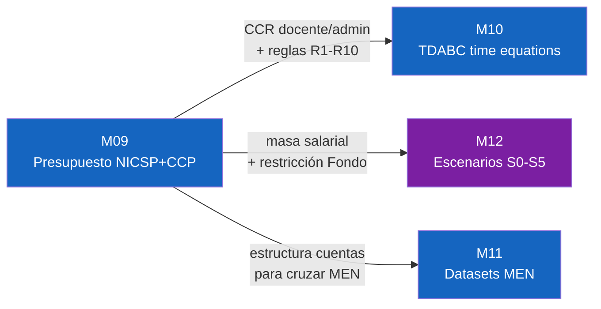

# §09 · DS-Presupuesto: Estructura NICSP + CCP/SUE de UDFJC

> [!abstract] §0 · Abstract
> Esta sección documenta el **marco presupuestal y contable de la UDFJC**, verificado contra 53 PDFs de resoluciones CSU 2014-2026, 12 resoluciones salariales y 3 estados financieros Q4-2025. Cobertura: jerarquía normativa (Constitución → Ley 30 → D.111 → [[glo-ccp-clasificacion-presupuestal|CCP]] → Res CSU), estructura presupuestal UDFJC 2026 (3 fondos, 8 niveles CCP, $548.568M COP), 18 políticas contables [[glo-nicsp|NICSP]] aplicables, cálculo [[glo-ccr-capacity-cost-rate|CCR]] (Capacity Cost Rate) de un recurso docente con datos reales. Tres usos del modelo: (1) calibración TDABC (§10); (2) escenarios financieros S0-S5 (§08); (3) alimentación P4 [[glo-bsc-s|BSC-s]].

---

## §1 · Pregunta trazadora

> ¿Cómo se estructura el presupuesto de una IES pública colombiana, y qué tan granular puede medirse el costo por unidad académica con la información oficialmente publicada?

---

## §2 · Jerarquía normativa presupuestal

Constitución Política → Ley 30/1992 → Decreto 111 (Estatuto Orgánico Presupuesto) → CCP (Catálogo de Clasificación Presupuestal del MHCP) → Resoluciones CSU UDFJC.

---

## §3 · Estructura presupuestal UDFJC 2026

- 3 fondos: Funcionamiento, Inversión, Recursos Propios.
- 8 niveles CCP.
- Total: $548.568M COP (cifras Q4-2025).

> [!bug] DT-MI12-09-01 · Tabla detallada de los 3 fondos × 8 niveles CCP × cifras 2026
> Migrar tabla canónica de M09 §3 con cifras y porcentajes por rubro.

---

## §4 · 18 políticas contables NICSP aplicables

NICSP 1, 3, 5, 9, 11, 12, 17, 19, 21, 23, 24, 26, 27, 31, 32, 33, 36, 38. Críticas para TDABC: P11 (consolidados financieros), P13 (gastos), P14 (depreciación), P15 (instrumentos financieros).

> [!bug] DT-MI12-09-02 · Detalle de las 18 políticas NICSP y mapeo a líneas presupuestales
> Migrar tabla detallada de M09 §4.

---

## §5 · Cálculo CCR de un recurso docente

CCR (Capacity Cost Rate) = costo total anual del recurso / capacidad práctica de horas. Con datos UDFJC:
- Salario base + prestaciones + aportes ≈ 95M COP/año (docente promedio planta).
- Capacidad práctica ≈ 1.760 horas/año (descontando vacaciones, festivos, formación).
- CCR ≈ 54.000 COP/hora docente planta.

DVE (Docente de Vinculación Especial): CCR ≈ 28.500 COP/hora basado en 13.715 contratos 2020-2025.

---

## §6 · Normalización SMMLV-país (gap crítico nuevo)

> [!critical] §6 · DT-MI12-09-03 · SMMLV CROSS-PAÍS
> El benchmarking BMK-001 (§05) compara UDFJC con 21 IES internacionales (MIT, Stanford, Aalto, Twente, ÉTS, ITESM, KAIST, SNU, etc.). Comparar COP/egresado UDFJC con USD/grad MIT es engañoso por inflación y poder adquisitivo distintos. Solución: expresar costos en **SMMLV-equivalente del país de cada IES** (federal minimum wage US, SMIC France, mindestlohn Germany, salario mínimo MX, KRW minimum wage, etc.). Esto permite ratios comparables.
>
> SMMLV Colombia 2026 = $1.423.500 COP. Tabla SMMLV-país-2026 pendiente de elaboración (16+ países BMK-001).

---

## §7 · Figuras (1 mermaid)

*Fig-MI12-111 — M09 (M09 fig #1)*

*Figura 111 · m09 fig 01*

> [!bug] DT-MI12-09-04 · Caption de fig-MI12-111

---

## §8 · Conceptos Clave

(P4 financiero, NICSP, CCP, CCR, SMMLV-país — pendiente glosario)

> [!bug] DT-MI12-09-05 · Glosario NICSP/CCP/CCR/SMMLV-país
> Crear entradas atómicas: glo-nicsp, glo-ccp-clasificacion-presupuestal, glo-ccr-capacity-cost-rate, glo-smmlv-pais.

---

## §9 · Deudas Técnicas

| ID | Descripción | Impacto |
|---|---|---|
| DT-MI12-09-01 | Tabla detallada presupuesto UDFJC 2026 | Alto |
| DT-MI12-09-02 | Detalle 18 políticas NICSP | Alto |
| DT-MI12-09-03 | **SMMLV cross-país** (§6) | 🔴 BLOQUEANTE para BMK-001 cross-IES |
| DT-MI12-09-04 | Captions figuras | Bajo |
| DT-MI12-09-05 | Glosario financiero | Medio |
| DT-MI12-09-06 | Status DRAFT → FINAL pendiente peer review | Alto |

---

## §10 · Implicaciones

§09 alimenta §10 (TDABC) con CCR base, §08 P4 (capacidades financieras) con tabla SMMLV-país, §11 (datasets MEN [[glo-spadies|SPADIES]] presupuesto-deserción).

---

## §11 · Referencias

`@conpes2021cti`, `@colombia1992ley30`, `@udfjc2025acu00425`. Pendiente añadir: NICSP/IPSAS official, Decreto 111 Colombia, MHCP CCP.

---

## Historial §09

| 1.0.0 | 2026-04-25 | Atomización desde M09-v1.1.0. 1 figura extraída. Status DRAFT. SMMLV-país agregado como gap crítico. |

---

*CC BY-SA 4.0 · Carlos Camilo Madera Sepúlveda · UDFJC · 2026-04-25 · sec-MI12-09 v1.0.0 (DRAFT)*
