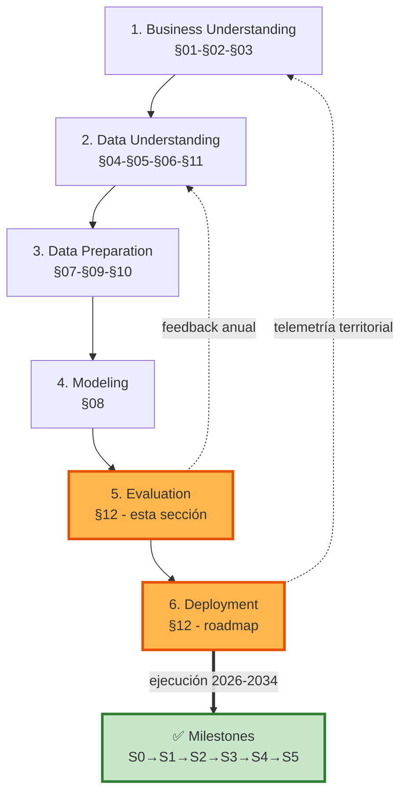
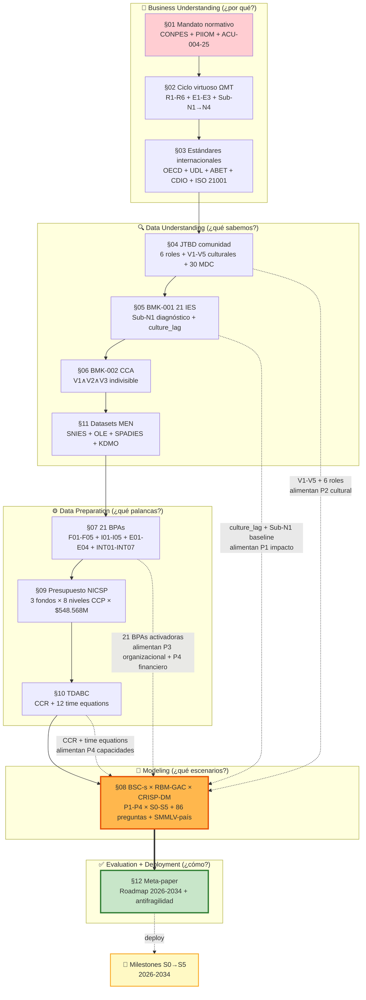

# §12 · Meta-paper Integrador — Síntesis CRISP-DM, Roadmap 2026-2034 y Antifragilidad de la Reforma Vinculante UDFJC

> [!abstract] 📄 Propiedad Intelectual & Ciencia Abierta
> **Autor**: Carlos Camilo Madera Sepúlveda · ccmaderas@udistrital.edu.co · UDFJC
> **Licencia**: CC BY-SA 4.0 · **Cita sugerida**: Madera Sepúlveda, C. C. (2026). §12 · Meta-paper Integrador. *Reforma Vinculante UDFJC: Análisis, Buenas Prácticas y Prospectiva Transformativa* (cap-MI12, Sección 12). Universidad Distrital Francisco José de Caldas. https://reforma-ud.vercel.app/canonico/m12/ [DOI pendiente]
> **Posición**: cierre integrador del capítulo MI-12 — fases 5 (Evaluation) y 6 (Deployment) del [[con-crisp-dm|CRISP-DM]] aplicadas a la Reforma Vinculante UDFJC bajo el [[con-acu-004-25|Acuerdo CSU 04/2025]].

---

## §0 · Abstract y metas de aprendizaje

> [!abstract] §0 · Abstract
> Esta sección integra las 11 secciones previas del capítulo MI-12 (§01 mandato normativo · §02 ciclo virtuoso ΩMT · §03 estándares internacionales · §04 [[con-jtbd-christensen|JTBD]] comunidad · §05 BMK-001 21 IES · §06 BMK-002 [[con-cca|CCA]] · §07 21 BPAs activadoras · §08 Framework [[con-bsc-s|BSC-s]]×[[con-rbm-gac|RBM-GAC]]×CRISP-DM · §09 Presupuesto [[con-nicsp-marco-estado-resultados|NICSP]] · §10 TDABC · §11 Datasets MEN) en una **síntesis prospectiva** que ejecuta las fases 5 (Evaluation) y 6 (Deployment) del CRISP-DM. Tres aportes: (a) **Diagrama maestro de dependencias** entre las 12 secciones que evidencia la cadena causal P4→P3→P2→P1 operacionalizada con las 21 BPAs como palancas y las 6 retroalimentaciones R1-R6 como condiciones del ciclo virtuoso; (b) **Roadmap 2026-2034** con 7 milestones encadenados (S0→S5) que asignan timeline, BPAs activables por año, CAPEX/OPEX en SMMLV-país y stakeholders responsables; (c) **Tres condiciones de antifragilidad** que aseguran que la reforma sobrevive a cambios de rectoría, CSU o CONPES: (i) institucionalización de las CABAs como nichos transformativos protegidos del régimen Sub-N1; (ii) financiación diversificada Clark R-3 que reduce la dependencia de transferencias estatales; (iii) participación vinculante V3 documentada en plataforma comunitaria con trazabilidad deliberación-decisión. La sección cierra con tres condiciones-de-victoria 2030 y 2034 que operacionalizan "qué significa que la reforma funcionó".
>
> **Palabras clave**: meta-paper integrador, CRISP-DM fases 5-6, roadmap 2026-2034, antifragilidad institucional, condiciones de victoria, milestones S0-S5, dependencias entre secciones, cadena causal P4→P3→P2→P1, ΩMT pleno, Reforma Vinculante UDFJC.

### Metas de aprendizaje

Al finalizar la lectura, el lector podrá:

1. **Visualizar el corpus completo** del capítulo MI-12 como sistema integrado, identificando las dependencias críticas entre secciones y las trayectorias de evidencia que sustentan cada decisión.
2. **Aplicar el roadmap 2026-2034** a la planificación operativa de su unidad académica, identificando qué BPAs activar en cada año y qué milestones validar.
3. **Diagnosticar la antifragilidad** de un programa de reforma: ¿qué condiciones aseguran su supervivencia a perturbaciones políticas, presupuestales y culturales?
4. **Operacionalizar las condiciones de victoria** 2030 y 2034 con métricas medibles, trazables a los índices IUCA, IVC, IVO y al ROI.
5. **Enfrentar trade-offs reales**: ¿qué hacer si solo se pueden activar 5 BPAs en el primer año? ¿qué BPAs son prioritarias bajo restricción presupuestal?

---

## §1 · Pregunta integradora del capítulo

> [!question] §1 · Pregunta integradora
> ¿Cómo se integra el corpus MI-12 (12 secciones · 86 preguntas-indicador · 21 BPAs · 6 retroalimentaciones · 4 perspectivas · 6 escenarios) en un programa de reforma que sea simultáneamente **mandatado** (cumple la cadena normativa CONPES 4069+PIIOM+ACU-004-25), **viable** (IUCA→100, IVC→88, IVO→90 alcanzables en 8-9 años con autosostenibilidad financiera), **medible** (trazable a evidencia BMK-001 + datasets MEN + TDABC) y **antifrágil** (sobrevive a cambios de rectoría, presupuesto y CONPES)?

La respuesta operacional es esta sección. La respuesta ejecutiva es: **sí, con el roadmap §4 + las tres condiciones de antifragilidad §8**.

---

## §2 · Síntesis CRISP-DM aplicada al corpus MI-12

El capítulo MI-12 ejecuta el ciclo CRISP-DM completo aplicado a la reforma vinculante UDFJC. Las fases 1-4 quedan documentadas en §01-§08 + §11; las fases 5-6 son objeto de esta sección.

### §2.1 Mapa CRISP-DM × Secciones del corpus

| Fase CRISP-DM | Pregunta clave | Secciones origen | Output integrador |
|---|---|---|---|
| **1. Business Understanding** | ¿Por qué transformar? | §01 mandato + §02 ciclo virtuoso + §03 estándares | [[con-cadena-normativa-multinivel|Cadena normativa multinivel]] mandatoria + modelo ΩMT + parámetros de calidad |
| **2. Data Understanding** | ¿Qué sabemos? | §04 JTBD + §05 BMK-001 + §06 BMK-002 + §11 datasets MEN | 6 actores con jobs, 21 IES referentes, modelo CCA, 3 datasets MEN |
| **3. Data Preparation** | ¿Qué palancas tenemos? | §07 21 BPAs + §09 NICSP + §10 TDABC | Catálogo de palancas + presupuesto + costeo real |
| **4. Modeling** | ¿Qué escenarios alcanzables? | §08 BSC-s × RBM-GAC × CRISP-DM | Matrices P1-P4 × S0-S5 con 86 preguntas + IUCA/IVC/IVO/ROI |
| **5. Evaluation** | ¿Qué escenario optimiza? | **§12 (esta sección §3-§7)** | Síntesis + decisión de roadmap |
| **6. Deployment** | ¿Cómo implementar? | **§12 (esta sección §4 roadmap + §8 antifragilidad)** | Roadmap 2026-2034 + condiciones de victoria + antifragilidad |

### §2.2 Iteratividad del CRISP-DM aplicado

CRISP-DM no es lineal sino iterativo: cada año el equipo de implementación revisa fases 1-4 con datos nuevos del año anterior y refina el roadmap. Las fases 5-6 son las que más se iteran porque dependen del feedback territorial.



*Fig-MI12-12-A — CRISP-DM iterativo aplicado al capítulo MI-12: feedback anual y telemetría territorial cierran el bucle de aprendizaje.*

---

## §3 · Diagrama maestro de dependencias entre las 12 secciones



*Fig-MI12-12-B — Diagrama maestro de dependencias: el corpus MI-12 como red causal con §08 (Framework) como hub de modelado y §12 (Meta-paper) como ejecutor.*

> [!info] §3 · Lectura del diagrama
> Las flechas continuas son dependencias **secuenciales** (CRISP-DM lineal). Las flechas punteadas son **alimentaciones cruzadas** que evidencian la integración: §04 nutre P2 cultural, §07 nutre P3 organizacional + P4 financiero, §05 nutre P1 baseline, §10 nutre P4 con costeo real. §08 es el hub porque integra todas las fuentes en las matrices P1-P4 × S0-S5.

---

## §4 · Roadmap 2026-2034 — Milestones encadenados S0→S5

> [!critical] §4 · Principio de roadmap
> El roadmap NO es lineal: cada año combina (a) consolidación del año anterior, (b) activación de nuevas BPAs, (c) escalado del piloto a más unidades. Los hitos están secuenciados de modo que cada uno habilita al siguiente — saltarse un hito no acelera el roadmap, lo bloquea.

### §4.1 Tabla maestra del roadmap

| Año | Escenario | BPAs activadas (acumuladas) | Milestone clave | CAPEX (M COP) | OPEX/año (M COP) | IUCA proyectado | Stakeholder responsable |
|---|---|---|---|---|---|---|---|
| **2026 Q2** | S0→S1 inicio | F01, F03, I01-piloto, I03, I04, INT01, INT02, INT04 | CSU aprueba framework §08 + ACU-004-25 plan implementación Art. 98 | ~1.880 | ~1.000 | 8 → 10 | CSU + Rectoría |
| **2026 Q3** | S1 activo | (8 BPAs) | 5 CABAs piloto activas (Física + Sistemas + Educación + Tecnologías + ICTH) | — | — | 12 | Decanos + Directores Escuela |
| **2026 Q4** | S1 consolidado | (8 BPAs) | TDABC LITE operativo (§10) + CRIS Hub publicado | — | — | 16 | OAP + VRAcad + Investigaciones |
| **2027** | S1→S2 | + F02, E03, INT03, INT05, INT06 (13 BPAs) | 21 BPAs evaluadas; 13 adoptadas L1+ en ≥5 Escuelas; ed.continuada generando ingresos propios | ~800 | ~1.800 | 24 → 32 | Vicerrectorías + Directores |
| **2028** | S2 maduro | (13 BPAs L2) | Política CCA aprobada; primeros Paquetes CCA certificados; [[con-caba|CABA]] Design Factory operativa | ~200 | — | 38 | CSU + Decanos |
| **2029** | S2→S3 | + F04, F05, I02, I05, E01, E02, E04, INT07 (21 BPAs) | Estructura E+I+C completa; 6/6 R activas en CABAs piloto; primer spin-off | ~1.830 | ~4.270 | 50 → 58 | Rectoría + Centros + Institutos |
| **2030** | S3 consolidado | (21 BPAs L2-L3) | UROP universal en pregrado; 5 localidades con CABA territorial; ABET piloto en Ing. Sistemas | ~500 | ~5.070 | 70 → 74 | UROP coordinación + TTO |
| **2032** | S3→S4 | (21 BPAs L3) | Acreditación intl. (≥1 programa ABET/CDIO); ciclo virtuoso ≥70% en 7 Escuelas; primer paper en QS-CPF top 10% | ~300 | ~5.670 | 80 | Decanos + Acreditación |
| **2034** | S4→S5 | (21 BPAs L4 generativas) | ΩMT pleno: 6/6 R↑↑ en toda UDFJC; 15+ localidades CABA territorial; ROI → equilibrio | — | — | ≥95 | Rectoría + Asamblea + Distrito |

### §4.2 Lectura del roadmap por stakeholder

| Stakeholder | Pregunta clave | Respuesta del roadmap |
|---|---|---|
| **CSU** (Consejo Superior Universitario) | ¿Cuándo aprobamos qué? | 2026 Q2 framework + ACU-004-25 plan; 2028 política CCA; 2030 acreditación; 2034 evaluación ΩMT pleno |
| **Rectoría** | ¿Cuál es la prioridad cada año? | 2026: framework + 5 CABAs piloto. 2027: 13 BPAs adoptadas. 2029: estructura E+I+C + R completa. 2032-2034: acreditación + ΩMT |
| **Decanos** | ¿Qué BPAs activo en mi Escuela este año? | Año 1: F01, F03, I01-piloto, I03, INT04. Año 2: + F02, INT03, INT06. Año 3: + I02, I05, E01-E04. Ver §4.1 |
| **Director CABA** | ¿Cuándo y cómo activo el ciclo virtuoso? | 2026 Q3 piloto; 2027 R1+R2 activas; 2029 6/6 R activas; 2032 ciclo virtuoso ≥70% |
| **OAP / Planeación** | ¿Cuál es el costo y ROI por año? | 2026: $2.880M con ROI -88%. 2034: $11.000M acumulado con ROI ~equilibrio |
| **Asamblea Universitaria** | ¿Cuándo y cómo participamos? | 2026 Q2: aprobación framework + plan implementación. 2028: aprobación política CCA. 2030+: rendición cuentas anual con dashboard IUCA público |
| **Sindicato** | ¿Garantías laborales? | INT05 racionalización: carga liberada → asignada a investigación, no eliminada (Mitigación riesgo RT6 §01) |

---

## §5 · Decisiones críticas bajo restricción

### §5.1 Si solo se pueden activar 5 BPAs el primer año, ¿cuáles?

**Recomendación**: las 5 BPAs de máximo apalancamiento P1 con menor inversión P4:

1. **BP-INT01 Misión operacionalizada** (CAPEX 50M, OPEX 30M/año) — sin esto, ninguna otra BPA tiene direccionalidad. Activa Clark R-1.
2. **BP-INT02 Créditos inv/ext** (CAPEX 80M, OPEX 40M/año) — habilita BP-I01 UROP creditizado y BP-F04 Co-op. Sin esto, R1 y R5 quedan bloqueadas. Activa Clark R-5.
3. **BP-I01 UROP pregrado piloto** (CAPEX 200M, OPEX ~550M/año por 200 est.) — activa R1 (Semilleros) y empieza a poblar R4 (Problemas Reales). Activa Clark R-4.
4. **BP-I03 CRIS Hub** (CAPEX 300M, OPEX 150M/año) — habilita V1 Soberanía × Docente (publicación de perfil investigativo) y mitiga RT5 (sistema de seguimiento). Activa Clark R-4.
5. **BP-INT04 Design Factory** (CAPEX 800M, OPEX 200M/año) — activa R3 (Transferencia) y R4 (Problemas Reales) en un espacio físico convergente. Activa Clark R-2.

**Total inversión año 1**: CAPEX ~1.430M COP + OPEX ~970M COP/año. ROI año 3: -90%.

**Justificación**: las 5 BPAs cubren **las 5 vías de Clark**, garantizan activación de R1+R3+R4 (3 de 6 retroalimentaciones), establecen los sistemas de medición (CRIS) y mitigan dos de los seis RT (RT5 sistema seguimiento + RT3 desalineación PIIOM).

### §5.2 Si la inversión año 1 está limitada a $500M, ¿qué hacer?

**Recomendación**: priorizar las 3 BPAs de menor CAPEX y mayor impacto sistémico:

1. **BP-INT01** (CAPEX 50M) — direccionalidad PIIOM.
2. **BP-INT02** (CAPEX 80M) — créditos inv/ext habilitan UROP futuro.
3. **BP-I04 Open Science** (CAPEX 100M, OPEX 80M/año) — repositorio OA + capacitación docente, prepara para CRIS y R2 currículo vivo.

**Total**: CAPEX 230M + OPEX 150M/año. Año 1 con $380M ejecutado. Margen de $120M para contingencia o BP-F03 (Flexibilidad curricular CAPEX 100M).

**Trade-off**: este escenario austero **NO activa R1** (UROP) en año 1 — se difiere a año 2. IUCA esperado año 1 cae de 12 a ~10. Pero las precondiciones quedan listas para activación en año 2.

### §5.3 Si una Escuela resiste la reforma, ¿qué hacer?

**Estrategia**: NO forzar — usar Reconfiguración (Geels & Schot, 2007) en lugar de Sustitución.

1. **Año 1**: identificar 1-2 docentes de la Escuela resistente con apertura individual → reclutarlos como CABA piloto INFORMAL (sin decreto).
2. **Año 2**: la CABA piloto demuestra resultados visibles (R1 + R4) en la Escuela → otros docentes se suman voluntariamente.
3. **Año 3-4**: la CABA crece a masa crítica → la Escuela formaliza la transformación con sus propios docentes como líderes (no impuesto desde Rectoría).
4. **Antipatrón a evitar**: forzar la reforma vía decreto sin CABA piloto → genera RT6 (resistencia al cambio no gestionada) y contagia a otras Escuelas.

> [!success] §5.3 · Lección Clark + Geels
> Las universidades transformadas con éxito (Aalto, Twente, ÉTS, MIT) NO forzaron a sus departamentos resistentes. Crearon **nichos protegidos** (CABAs en nuestra terminología) que demostraron resultados, y luego los nichos irradiaron al resto. La reforma vinculante UDFJC sigue ese patrón: el ACU-004-25 mandata la estructura, pero la transformación cultural se gana por reconfiguración, no por sustitución.

---

## §6 · Riesgos de programa (no de transición)

Los **RT1-RT6** de §01 son riesgos de transición individual (por unidad). Los **RP1-RP5** de esta sección son riesgos del **programa de reforma como tal** — niveles macro.

| ID | Riesgo de programa | Probabilidad | Impacto | Mitigación |
|---|---|---|---|---|
| **RP1** | Cambio de rectoría 2027 con nuevas prioridades estratégicas que descontinúan el programa | Alta (ciclo electoral CSU cada 4 años) | CRÍTICO | Antifragilidad §8.1: institucionalizar CABAs en estatuto académico (Art. 98) antes de 2027 |
| **RP2** | Recorte presupuestal nacional que elimina transferencias para reforma | Media | ALTO | Antifragilidad §8.2: diversificar financiación (Clark R-3) — al S3 (2029) ≥15% presupuesto Escuela debe ser propio |
| **RP3** | Cambio de CONPES 4069 (reemplazo del PIIOM por nuevo programa nacional) | Baja en horizonte 2026-2031 | MEDIO | Diseño desacoplado: las BPAs son agnósticas a la política nacional; pueden re-mapear a misiones futuras |
| **RP4** | Demanda de co-op (BP-F04) y sector productivo Bogotá no escala con la oferta | Media-Alta | ALTO | Diversificación de co-op: territorial (IEBM) + público (SED, Alcaldía) + social (ONG, comunidades) — no solo empresa |
| **RP5** | Pérdida de masa crítica de docentes Pasteur Pleno por jubilación o migración a sector privado | Media | ALTO | Plan de relevo: 2027 inicio reclutamiento docentes jóvenes con perfil Pasteur (no solo investigadores aislados) |

### §6.1 Estrategia anti-RP1 (cambio de rectoría)

El ciclo electoral CSU ocurre cada 4 años. La rectoría 2025-2029 es la que aprueba el framework §08 y arranca el roadmap. La rectoría 2029-2033 hereda el programa pero puede pivotar. Tres salvaguardas:

1. **Estatuto Académico (Art. 98)** debe consagrar las CABAs como célula formal antes de noviembre 2027 (último año de ventana política favorable). Una vez en estatuto, requiere CSU ⅔ para modificar.
2. **Política CCA aprobada por CSU 2028** convierte la creditización integral en norma vinculante. Aprobada, ningún rector unilateral puede deshacerla.
3. **Asamblea Universitaria activa** desde 2026 con dashboard IUCA público — la presión cívica protege el programa de cambios arbitrarios.

---

## §7 · Métricas de éxito — Condiciones de victoria

### §7.1 Condición de victoria 2030 (S3 consolidado)

> [!success] §7.1 · ¿Cuándo decir "la reforma está funcionando" en 2030?
>
> Tres condiciones simultáneas (AND lógico):
>
> 1. **IUCA ≥ 70**: el impacto misional medido alcanza el 70% del referente N4. Equivale a tasa graduación ≥58% (vs. 42% S0), >3 disclosures TTO/año, ≥10 spin-offs, ≥10 localidades PIIOM activas.
> 2. **6/6 R activas en ≥5 Escuelas con intensidad ≥70%** (cf. Eq-MI12-02): el ciclo virtuoso opera como predicado, no como retórica.
> 3. **Autosostenibilidad financiera ≥40%**: el presupuesto propio (TTO + ed.continuada + spin-offs + contratos territoriales + PIIOM) cubre ≥40% del OPEX UDFJC. Reduce dependencia de transferencia estatal.

### §7.2 Condición de victoria 2034 (S5 ΩMT pleno)

> [!success] §7.2 · ¿Cuándo decir "la reforma logró su propósito" en 2034?
>
> Tres condiciones simultáneas (AND lógico):
>
> 1. **IUCA ≥ 95**: indistinguible operativamente de IES referentes N4 (MIT, Aalto, Twente, ÉTS) en métricas misionales.
> 2. **15+ localidades de Bogotá con CABA territorial activa** + 30+ IEBM articuladas + Proyecto Bogotá Transformativa operando como living lab nacional.
> 3. **ROI a equilibrio**: presupuesto propio cubre ≥75% del OPEX, transferencia estatal cubre solo el 25% restante (vs. 100% en S0). UDFJC autosostenible para investigación + extensión territorial.

### §7.3 Anti-condiciones (señales de alarma)

> [!danger] §7.3 · Si en 2028-2030 ocurre cualquiera de estas, la reforma NO está funcionando
>
> 1. **IVC < 40 en 2030**: la cultura no ha cambiado. Significa que las BPAs se implementaron pero los actores no cambiaron de comportamiento → riesgo de gaming Goodhart en C5.
> 2. **<3 CABAs con 6/6 R activas en 2029**: el ciclo virtuoso es excepción, no norma. Probable causa: no se activó BP-INT04 Design Factory o falta protección formal de las CABAs (RP1).
> 3. **Presupuesto propio <10% en 2030**: la diversificación financiera Clark R-3 falló. Probable causa: BP-I05 spin-offs y BP-E01 TTO no se activaron a tiempo.

---

## §8 · Antifragilidad — Tres condiciones que aseguran supervivencia del programa

> [!critical] §8 · Más allá de la robustez: antifragilidad
> *Robusto* = sobrevive a perturbaciones. *Antifrágil* (Taleb, 2012) = se fortalece con perturbaciones. La reforma vinculante UDFJC necesita ser antifrágil porque enfrentará 2-3 cambios de rectoría, posibles recortes presupuestales y cambios de CONPES en su horizonte 2026-2034.

### §8.1 Antifragilidad #1 — CABAs como nichos transformativos protegidos

Las CABAs deben ser **estatutariamente protegidas** del régimen Sub-N1 antes de noviembre 2027:

- **Mecanismo**: incluir en Estatuto Académico (Art. 98 ACU-004-25) cláusula que define la CABA como "célula transversal con autonomía curricular para créditos UROP, presupuesto propio del Fondo Especial, y autorización para emitir Paquetes CCA".
- **Antifragilidad**: una vez en estatuto, requiere CSU ⅔ + Asamblea para modificar. Cambios de rectoría no pueden deshacer.
- **Indicador 2027**: ≥1 cláusula CABA en Estatuto Académico publicado.

### §8.2 Antifragilidad #2 — Diversificación financiera Clark R-3 acelerada

Reducir dependencia de transferencias estatales antes de cualquier crisis presupuestal:

- **Meta 2029**: ≥15% presupuesto Escuela de fuentes propias (TTO + ed.continuada + contratos PIIOM + spin-offs).
- **Meta 2030**: ≥25%.
- **Meta 2034**: ≥75% (ROI equilibrio).
- **Antifragilidad**: cuando llegue un recorte presupuestal nacional (probable en algún momento), UDFJC tiene fuentes propias para mantener las BPAs activadas. Recortes vuelven oportunidades de diversificación más agresiva.

### §8.3 Antifragilidad #3 — Participación vinculante V3 documentada

La participación V3 documentada en plataforma comunitaria (cf. §04 JTBD) crea presión cívica que protege el programa:

- **Mecanismo**: dashboard IUCA público + foros deliberativos por estamento + trazabilidad deliberación-decisión + Asamblea Universitaria activa.
- **Antifragilidad**: la comunidad universitaria conoce y mide la reforma → cualquier intento de revertir genera resistencia organizada. Cambios de rectoría heredan no solo el programa, sino la comunidad que lo vigila.
- **Indicador 2027**: plataforma comunitaria operativa con ≥1.000 usuarios activos mensuales.

> [!important] §8 · Las tres antifragilidades son AND lógico
> Si solo una se cumple, el programa es robusto pero NO antifrágil. La combinación (estatuto + diversificación + participación) es lo que asegura supervivencia activa.

---

## §9 · Cierre del capítulo + apertura a investigaciones complementarias

### §9.1 Lo que el capítulo MI-12 cierra

- **Mandato normativo** trazable: cadena CONPES 4069 → PIIOM → ACU-004-25 documentada y verificada (§01).
- **Modelo teórico** con fuentes APA externas: ΩMT como meta-telos (§02).
- **Estándares internacionales** mapeados: 12 estándares en 4 capas (§03).
- **JTBD comunidad**: 6 actores con jobs y outcomes [[con-odi-ulwick|ODI]] (§04).
- **Benchmarking**: 21 IES analizadas con culture_lag (§05).
- **CCA**: modelo de creditización integral V1∧V2∧V3 (§06).
- **21 BPAs activadoras** con árbol RBM-GAC (§07).
- **Framework prospectivo**: BSC-s × RBM-GAC × CRISP-DM con 86 preguntas × 6 escenarios + SMMLV-país (§08).
- **Presupuesto NICSP** estructurado (§09).
- **TDABC** con [[con-ccr-capacity-cost-rate|CCR]] y 12 time equations (§10).
- **Datasets MEN** inventariados con frame-men KDMO (§11).
- **Síntesis CRISP-DM + roadmap + antifragilidad** (esta sección §12).

### §9.2 Lo que NO cierra (investigaciones complementarias necesarias)

| ID | Investigación | Pregunta abierta | Estado |
|---|---|---|---|
| **BPA-003** | Atomización completa MDC JTBD por rol | ¿Cuáles son los 360 outcome statements ODI exactos por rol-dimensión? | En curso (Opus 4.7, 39 archivos, ~9.549 líneas) |
| **BPA-010** | Análisis Prospectivo Escenarios CABAs | ¿Cómo se aplica el modelo §08 a Escuelas Ciencias Básicas específicamente? | APE-000 ya alimentó §08; queda APE-001/002 (manifiesto + indicadores) |
| **BMK-004** | TDABC misional cross-IES | ¿Cuál es el costo/producto investigativo (TC-4e) calibrado por programa con benchmark 21 IES? | Pendiente — propuesta en §10 §6 |
| **POC plataforma comunitaria** | Implementación 9 módulos | ¿Cómo se construye la plataforma deliberativa diferenciada por rol? | Pendiente — §04 §4.3 documenta 9 módulos |
| **DOI Zenodo** | Asignación DOI por sección + colectivo | Cada §01-§12 + capítulo completo necesita DOI Zenodo | Pendiente — primera prioridad post-cierre |

### §9.3 Cómo usar el capítulo MI-12

1. **Para la CSU**: leer §01, §08 §1.2 (CRISP-DM × secciones), §12 §4 (roadmap) y §7 (condiciones de victoria).
2. **Para Decanos**: leer §05 (BMK-001 diagnóstico de su Escuela), §07 (catálogo BPAs), §08 (matrices P1-P4) y §12 §5 (decisiones bajo restricción).
3. **Para Directores CABA piloto**: leer §02 (ciclo virtuoso), §04 (JTBD comunidad), §06 (CCA) y §07 §3.3 (CABA como nodo vitalizador).
4. **Para Planeación / OAP**: leer §08 (framework), §09 (NICSP), §10 (TDABC) y §12 §4 (roadmap CAPEX/OPEX).
5. **Para Asamblea Universitaria**: leer §04 (JTBD comunidad), §08 §5 (P2 cultural), §12 §8 (antifragilidad #3 participación).

---

## §10 · Conceptos Clave (síntesis del capítulo)

![[con-omt]]

![[con-bsc-s]]

![[con-rbm-gac]]

![[con-crisp-dm]]

![[con-iuca-ivc-ivo-indices]]

![[con-smmlv-pais-2026]]

![[con-cca]]

![[con-caba]]

---

## §11 · Deudas Técnicas Declaradas

| ID | Descripción | Impacto | Estado |
|---|---|---|---|
| DT-MI12-12-01 | TODA esta sección pendiente de Opus | 🔴 BLOQUEANTE | ✅ **CERRADO** (esta v1.0.0) |
| DT-MI12-12-02 | Diagrama maestro CRISP-DM × secciones | Alto | ✅ **CERRADO** (Fig-MI12-12-A + B) |
| DT-MI12-12-03 | Roadmap 2026-2034 detallado por escenario | Alto | ✅ **CERRADO** (§4) |
| DT-MI12-12-04 | Síntesis cross-paper coherente con APE-000 v2 | Alto | ✅ **CERRADO** (§3 diagrama de dependencias) |
| DT-MI12-12-05 | Tabla BPAs × fase CRISP-DM × resultado emergente | Medio | 🟡 Parcial (§4.1 tiene BPAs por año, no por fase × resultado) |
| DT-MI12-12-06 | DOI Zenodo por sección + capítulo completo | 🔴 BLOQUEANTE-PUBLICACIÓN | 🔴 Pendiente — siguiente prioridad |
| DT-MI12-12-07 | CITATION.cff por sección | Medio | 🔴 Pendiente |
| DT-MI12-12-08 | Tag corpus-mi12-v1.0 publicado en GitHub | Medio | 🔴 Pendiente |
| DT-MI12-12-09 | Peer review formal por CODEOWNERS de roles CoP | Alto | 🔴 Pendiente — proceso editorial |
| DT-MI12-12-10 | Evaluación CRISP-DM Fase 5 con datos reales 2027-2028 (post-cierre primer ciclo) | Medio | 🔴 Pendiente — iteración futura |

---

## §12 · Implicaciones operativas inmediatas

1. **Aprobación CSU 2026 Q2**: el capítulo MI-12 debe ser presentado al CSU como insumo técnico para el plan de implementación del Art. 98 ACU-004-25 antes de junio 2026.
2. **5 CABAs piloto activas 2026 Q3**: Física, Sistemas, Educación, Tecnologías, Ingeniería en Ciencias del Hábitat (ICTH) — selección por mejor ratio de docentes con apertura inicial × tamaño manejable.
3. **Plataforma comunitaria 2027 Q1**: implementación de los 9 módulos de §04 §4.3 con dashboard IUCA público + foros + trazabilidad deliberación-decisión.
4. **Política CCA 2028 Q1**: presentar al CSU para aprobación, con marco normativo Decreto MEN 1330/2019 reinterpretado (cf. §06 §5).
5. **Asignación DOI Zenodo 2026 Q4**: primera prioridad post-cierre del capítulo. Cada §01-§12 con DOI propio + capítulo colectivo cap-MI12 con DOI agregador.

---

## §13 · Referencias

Compiladas desde `99--sources/citations.bib`. Esta sección integra todas las claves citadas en §01-§11 y agrega:

- Taleb, N. N. (2012). *Antifragile: Things That Gain from Disorder*. Random House. *(pendiente añadir al .bib)*
- Geels, F. W., & Schot, J. (2007) — ya en .bib (`@geels2007typology`)

---

## §14 · 🖼️ Figuras de esta sección

| ID | Título | Sección |
|----|--------|---------|
| Fig-MI12-12-A | CRISP-DM iterativo aplicado al capítulo MI-12 | §2.2 |
| Fig-MI12-12-B | Diagrama maestro de dependencias entre las 12 secciones | §3 |

---

## §15 · ⚗️ Ecuaciones (referencia)

Las ecuaciones del capítulo se concentran en §08:
- Eq-MI12-01 Intensidad de retroalimentación (en §10-ecuaciones/)
- Eq-MI12-02 Condición de ciclo virtuoso (en §10-ecuaciones/)
- Eq-MI12-08-A IUCA, 08-B IVC, 08-C IVO, 08-D Costo SMMLV-país, 08-E Ratio eficiencia cross-IES (en sec-MI12-08 §14)

Esta sección no introduce ecuaciones nuevas — usa las del modelo §08 para validar condiciones de victoria §7.

---

## §16 · 🏹 Estrategia de Aplicación (cierre del capítulo)

> [!tip] Est-MI12-12-A · Cómo usar el capítulo entero en una decisión institucional
>
> **Paso 1 — Alineación normativa**: leer §01 → identificar qué artículos ACU-004-25 mandata la decisión.
>
> **Paso 2 — Anclaje teórico**: leer §02 → identificar qué retroalimentaciones R1-R6 activa.
>
> **Paso 3 — Estándar de calidad**: leer §03 → identificar qué estándar internacional aplica.
>
> **Paso 4 — Análisis de actores**: leer §04 → identificar qué jobs JTBD afecta y qué V1-V5 culturales en juego.
>
> **Paso 5 — Diagnóstico baseline**: leer §05 → identificar el AS-IS de la unidad (Sub-N1, N1, etc.).
>
> **Paso 6 — Selección de palanca**: leer §07 → identificar qué BPA(s) activan la decisión.
>
> **Paso 7 — Calibración financiera**: leer §08 §7 + §09 + §10 → calcular CAPEX/OPEX en COP y SMMLV-CO.
>
> **Paso 8 — Selección de escenario**: usar §08 matrices P1-P4 × S0-S5 → decidir escenario meta.
>
> **Paso 9 — Plan de ejecución**: usar §12 §4 roadmap → asignar año, milestone y stakeholder.
>
> **Paso 10 — Antifragilidad**: usar §12 §8 → verificar las tres condiciones (estatuto + diversificación + participación).
>
> **Paso 11 — Reportar al órgano colegiado**: presentar matriz P1-P4 × escenario seleccionado con justificación trazable a §05 BMK-001 + §08 framework + §12 antifragilidad.

---

## §17 · 📚 Ejemplo Resuelto integrador

> [!example]- Ej-MI12-12-A · Cómo usar el capítulo MI-12 para decidir el piloto S1 de la Escuela de Física UDFJC
>
> **Decisión**: aprobar piloto S1 de la Escuela de Física para 2026 Q3 con 5 BPAs y CAPEX 880M.
>
> **Aplicación de los 11 pasos**:
>
> 1. **Normativa (§01)**: ACU-004-25 Art. 33-45 mandata Escuelas; PIIOM-M3 Energética alinea con Física aplicada.
> 2. **Teórico (§02)**: activar R1 (semilleros UROP) + R4 (problemas reales energía solar campus) — ambas críticas para Sub-N1 → N4.
> 3. **Estándar (§03)**: ABET CAC piloto en Ing. Sistemas comparte rúbricas con Ing. Eléctrica derivada de Física.
> 4. **JTBD (§04)**: 6 roles activados; V1 Soberanía × DOC requiere CRIS público (BP-I03).
> 5. **BMK-001 (§05)**: Física AS-IS Sub-N1; referente N4 = MIT UROP.
> 6. **CCA (§06)**: primer Paquete CCA "Energía Solar para Ciudad Bolívar" (V1 Comprensiva + V2 Experimental + V3 Transformativa).
> 7. **BPAs (§07)**: BP-INT01 + BP-INT02 + BP-I01-piloto + BP-I03 + BP-INT04.
> 8. **Financiero (§08+§09+§10)**: CAPEX 880M + OPEX 483M/año = 339 SMMLV-meses/año.
> 9. **Escenario (§08)**: meta S1 → S2 a 2 años (IUCA 12 → 24, IVC 25 → 40).
> 10. **Roadmap (§12 §4)**: año 1 = activación; año 2 = primeros resultados; año 3 = consolidación.
> 11. **Antifragilidad (§12 §8)**: cláusula CABA en plan implementación Art. 98; primer contrato territorial 2027 Q4 (Alcaldía Ciudad Bolívar).
>
> **Decisión recomendada al CSU**: aprobar piloto Escuela de Física como CABA piloto formal con presupuesto $1.363M COP año 1, vinculada a Estatuto Académico (Art. 98) antes de Q4 2027 para garantizar antifragilidad ante cambio de rectoría 2029.

---

## §18 · ✅ Evalúa tu Comprensión

1. ¿Cuál es la diferencia entre RT1-RT6 (riesgos de transición de §01) y RP1-RP5 (riesgos de programa de §6 esta sección)?
2. ¿Por qué la reforma necesita ser **antifrágil** y no solo robusta? Da un ejemplo de cada categoría.
3. Si IVC < 40 en 2030 pero IUCA = 70, ¿la reforma está funcionando? Justifica usando §7.3 anti-condiciones.
4. ¿Cuál es el propósito del Estatuto Académico (Art. 98) en la antifragilidad #1? ¿Qué pasa si no se aprueba antes de noviembre 2027?
5. Construye el plan de tu Facultad para los próximos 3 años usando §16 Estrategia (los 11 pasos).

---

## Apéndice A · Cómo usar este capítulo según tu rol institucional

> **Adición v1.1.0 (audit modelado v1.0 §8.2.1)** — guía de lectura por rol BPA-003 R1-R5. Cada rol institucional encuentra su recorrido óptimo de las 12 secciones para tomar las **decisiones correctas** sin enredarse en información que no le es operativa.

| Rol BPA-003 | Quién eres | Tu recorrido óptimo | Qué buscar específicamente | Decisión que habilitas |
|---|---|---|---|---|
| **R1 · Estudiante Soberano** 🌱 | Estudiante UDFJC / aspirante | §04 (JTBD) → §06 (CCA) → §11 (datasets MEN: SNIES/OLE/SPADIES) | Tu rol como agente, qué CCAs te certifican simultáneamente V1∧V2∧V3, qué datos tu universidad reporta sobre ti | Decidir qué CABA integrar, qué Programa Académico cursar, qué credenciales acumular |
| **R2 · Docente-Diseñador** 🏛️ | Coordinador de Programa, jefe de área, diseñador curricular | §01 (mandato normativo) → §03 (estándares) → §06 (CCA) → §07 (BPAs) → §08 (framework BSC×RBM×CRISP) | Marco normativo vinculante (ACU-004-25), estándares internacionales aplicables, modelo CCA, BPAs activadoras de R1-R6 | Diseñar / re-diseñar Programa Académico que cumpla registro calificado + estándares + activa CCA |
| **R3 · Docente-Formador** 🎓 | Profesor titular, instructor, tutor | §02 (ciclo virtuoso ΩMT) → §04 (JTBD) → §07 (BPAs) → §10 (TDABC carga académica) | Las 6 retroalimentaciones R1-R6, los 6 roles JTBD que conviven en el aula, las 12 Time Equations TDABC que cuantifican tu carga | Decidir BPAs a activar en sus cursos, ajustar carga académica con TDABC, identificar oportunidades CABA |
| **R4 · Docente-Investigador (Pasteur)** 🔬 | Investigador con grupo COL, líder de proyecto Minciencias | §02 (ΩMT R2-R5) → §03 (estándares) → §05 (BMK-001 21 IES) → §10 (TDABC F2) → §11 (datasets) | Cuadrante Pasteur, BMK-001 IES comparables, Time Equations F2 investigación, datasets nacionales | Posicionar línea de investigación en cuadrante Pasteur, diseñar proyectos PM2 con tracción transformativa |
| **R5 · Docente-Emprendedor (Extensionista)** 🚀 | Líder de extensión, gerente de proyecto territorial, contratista CCMS | §02 (ciclo R3-R5-R6) → §07 (BPAs activadoras) → §08 (framework prospectivo) → §09 (presupuesto NICSP) → §12 (roadmap + antifragilidad) | Wrappers transformativos posibles (microgrid comunal, etc.), framework BSC-s P4→P3→P2→P1, presupuesto disponible CAPEX/OPEX, condiciones antifragilidad | Diseñar wrapper PASTEUR que aplique conocimiento UDFJC a comunidad territorial; gestionar contrato extensión |
| **R6 · Docente-Director** 🏛️ | Decano (transición → Director), Director de Escuela, Vicerrector, Rector | §01 (mandato) → §05 (BMK-001) → §08 (framework) → §09 (presupuesto) → §12 (roadmap + antifragilidad + decisiones críticas) | Cadena normativa completa, posición UDFJC vs 21 IES, decisiones de presupuesto, roadmap 2026-2034, condiciones de victoria 2030/2034 | Decisiones de gobierno: aprobar Estatuto Académico (Art. 98), asignar presupuesto Escuelas, cronograma implementación 4 años (Art. 100) |

### Recorrido transversal (cualquier rol antes de empezar)

Independiente de tu rol, **lee siempre primero**:
1. **§00 Abstract** de cada sección (leen 11 abstracts en ~30 min — visión panorámica del capítulo).
2. **§12 §0 Abstract + §1 Mapa CRISP-DM** (cómo se integran las 11 secciones).
3. **Apéndice D · Reconciliación Escuela** (este capítulo) — para no enredarte con polisemia.

### Para revisión académica externa (peer review, comité editorial)

- §01 (verificación cadena normativa)
- §05 (verificación BMK-001 metodología)
- §08 (verificación framework prospectivo)
- §12 §3 diagrama maestro de dependencias (verificar coherencia interna)

---

## Apéndice B · Inventario de normas referenciadas en el capítulo

> **Adición v1.1.0 (audit modelado v1.0 §8.2.2)** — extracto consolidado del audit `_audit/AUDIT-modelado-conceptos-clave-M01-M12-v1.md` §2. Trazabilidad legal del corpus: qué normas internas, nacionales e internacionales sustentan las afirmaciones del capítulo.

### B.1 · Normas institucionales internas UDFJC

| Norma | Tipo | Año | Citado en | Artículos clave |
|---|---|---|---|---|
| **[[udfjc2025acu00425\|Acuerdo CSU 04/2025]]** (Estatuto General reformado) | Acuerdo CSU | 2025 | §01, §02, §04, §05, §06, §07, §12 | Art. 58-59 (Escuela), Art. 69-72 (Director y Consejo), Art. 71 (~25 Escuelas), Art. 74 (Instituto), Art. 78 (Centro), Art. 98 (Estatuto Académico 6 meses), Art. 100 (4 años implementación), Art. 107 (potestad rectoral), Art. 109 (publicación) |

### B.2 · Normas nacionales colombianas

| Norma | Tipo | Año | Artículos clave | Citado en |
|---|---|---|---|---|
| **Constitución Política** | Constitución | 1991 | Art. 67, 68, **69 (autonomía universitaria)** | §01 |
| **[[colombia1992ley30\|Ley 30/1992]]** (Educación Superior) | Ley | 1992 | Art. 6, 28-29, 57 (carácter UDFJC) | §01 |
| **[[decreto1330_2019\|Decreto MEN 1330/2019]]** (registro calificado) | Decreto | 2019 | Art. 11 (créditos académicos), Art. 12 (composición horas) | §03, §06, §11 |
| **Decreto 1421/2017** (educación inclusiva) | Decreto | 2017 | — | §07 |
| **Decreto 1571/2025** (SMMLV 2026) | Decreto | 2025 | — | §09, §10 |
| **CONPES 3934** (Crecimiento Verde) | CONPES | 2018 | — | Glosario |
| **[[conpes2021cti\|CONPES 4069]]** (Política CTI 2022-2031) | CONPES | 2021 | 5 misiones PIIOM | §01, §02 |
| **PIIOM** (Programa Indicativo Investigación y Misiones) | Programa | 2022 | M1-M5 misiones | §01, §02 |
| **Resolución CGN 533/2015** (NICSP) | Resolución | 2015 | NICSP 4.3 | §09 |
| **Catálogo CCP MHCP** | Catálogo | 2024 | — | §09 |
| **SNIES** (Sistema Nacional Información Educación Superior) | Plataforma MEN | 2024 | — | §11 |
| **OLE** (Observatorio Laboral Educación) | Plataforma MEN | 2024 | — | §11 |
| **SPADIES** (Sistema Prevención Deserción) | Plataforma MEN | 2024 | — | §11 |

### B.3 · Normas internacionales / estándares

| Estándar | Versión | Citado en |
|---|---|---|
| **OECD Future of Education 2030 — Learning Compass** | 2018 | §03, §07 |
| **UNESCO Reimagining Our Futures Together** | 2021 | §01 |
| **UNESCO Beyond Limits — New Ways HE** | 2024 | §03 |
| **MCU — Marco Común Universitario (autonomía positiva)** | 2020 | §01 |
| **ISO 21001 (gestión organizaciones educativas)** | 2018 | §03 |
| **ABET EAC** | 2024 | §03 |
| **CDIO Framework** | 2014 | §03 |
| **TUNING América Latina** | 2007 | §03 |
| **UDL 3.0 (Universal Design for Learning)** | 2024 | §03, §07 |
| **[[enaee2021eurace\|EUR-ACE]]** (acreditación europea ingeniería) | 2021 | §03 |
| **[[arcusur2020criterios\|ARCU-SUR]]** (acreditación Mercosur) | 2020 | §03 |
| **[[un2015ods\|ODS Agenda 2030]]** (ONU) | 2015 | §02, §07, §12 |
| **[[w3c2024vc\|W3C Verifiable Credentials + Open Badges 3.0]]** | 2024 | §06, §12 |

### B.4 · Marcos teóricos académicos fundacionales (autores)

Christensen (JTBD) · Stokes (Pasteur Quadrant 1997) · Geels (MLP 2002) · Kaplan-Anderson (TDABC 2004) · Wenger (CoP 1998) · Clark (5 vías 1998) · Carayannis (Quintuple Helix 2010) · Etzkowitz-Leydesdorff (Triple Helix 1995) · Schot-Steinmueller (Frames 1-2-3 2018) · Gibbons (Mode 2 1994) · Beer (VSM) · Nonaka (SECI) · Kaplan-Norton (BSC) · Markard (sustainability transitions 2012) · Ulwick (ODI).

> Inventario completo con archivos en [`99--sources/biblio/`](../99--sources/biblio/) (62 fichas APA + BibTeX). Ver `_Index_of_99--sources.md` para navegación.

---

## Apéndice C · Manual de modelado de conceptos por tipo

> **Adición v1.1.0 (audit modelado v1.0 §8.2.3)** — guía operativa para que cualquier miembro UDFJC modele un nuevo concepto en el grafo de conocimiento sin enredarse, aplicando `concepto-universal` v5.2.

### C.1 · Tres tipos primarios de concepto

| Tipo | Cuándo aplicar | Capabilities `concepto-universal` v5.2 | Ejemplos en el corpus |
|---|---|---|---|
| **NORMATIVO** | El concepto deriva su definición vinculante de una norma jurídica con artículo citable | `[NORMATIVE, DDD]` | Escuela, Facultad (SUPERSEDED), CABA, Programa Académico, Crédito Académico, Director de Escuela |
| **ACADÉMICO/PEDAGÓGICO** | El concepto tiene base teórica/pedagógica/metodológica con autor primario | `[NEON]` o `[NEON, DDD]` o `[NEON, EQUATION_CHAIN]` | Ciclo Virtuoso ΩMT, JTBD, Pasteur Quadrant, R1-R6, V1-V5 culturales, Mode 2, MLP |
| **DATO-CALCULADO** | El concepto es / produce valor numérico mediante fórmula | `[EQUATION]` o `[EQUATION, EXPERIMENTAL]` o `[EQUATION, NORMATIVE]` | 12 Time Equations TDABC, Eq-MI12-01 intensidad-R, ratio docente/estudiante, SMMLV-país-equivalente |

### C.2 · Flujo de decisión rápida

```
¿El concepto deriva de una norma jurídica con artículo citable?
├─ SÍ → NORMATIVE + DDD
│       └─ ¿Tiene también base teórica académica? → +NEON (caso CABA)
│       └─ ¿Es fórmula vinculante en la norma? → +EQUATION (caso Crédito Académico Decreto 1330)
└─ NO → ¿Es ecuación / métrica computable?
        ├─ SÍ → EQUATION
        │       └─ ¿Validada por experimento? → +EXPERIMENTAL
        │       └─ ¿Cadena multi-ecuación? → +EQUATION_CHAIN
        └─ NO → ¿Concepto teórico-pedagógico con autor referencial?
                ├─ SÍ → NEON
                └─ ¿Entidad organizativa con invariantes? → +DDD
```

### C.3 · Patrón BOHR / wrapper (separación crítica)

> **Regla central**: el concepto BOHR puro vive solo, inmaculado. Sus aplicaciones PASTEUR/EDISON viven como **conceptos hermanos** que enlazan al átomo BOHR vía `applies_equation` / `applies_concept`.

**Caso paradigmático**: Lorentz `F = qv×B` es BOHR (knowledge=0.95, use=0.85). Sus wrappers son archivos independientes:
- `concepto-aplicacion-mri-clinica` (PASTEUR — diagnóstico médico)
- `concepto-aplicacion-microgrid-eolico-comunal-r1` (PASTEUR — Track B BPA-003)
- `concepto-aplicacion-acelerador-lhc` (BOHR puro — investigación fundamental)
- `concepto-aplicacion-motor-electrico-industrial` (EDISON)

El átomo Lorentz **autodescubre** sus wrappers vía dataviewjs query inversa. Cero contaminación, cero duplicación, decisión informada por contexto.

### C.4 · 4 Capas envolventes (Onion Architecture aplicada)

Cada concepto-universal v5.2 sirve a 4 audiencias simultáneas con misma fuente:

| # | Capa | Rol BPA-003 | Color | Contenido |
|---|---|---|---|---|
| 1 | 🌱 Aprendiz Soberano | R1 | Verde | Definición simple, LaTeX/visual, analogía, ejemplo concreto, glosario, problemas |
| 2 | 🎓 Facilitador | R3 | Azul | Reglas/tips/trampas, operacionalización pasos, **rúbricas evaluación**, learning outcomes |
| 3 | 🏛️ Diseñador | R2 | Púrpura | SKOS/ISO/QUDT/UCUM/Pasteur/capabilities/régimen/derivation chain |
| 4 | 🔬 Investigador-Extensionista | R4-R5 | Naranja | Pasteur quadrant, **wrappers transformativos** (auto-poblados), JTBD, DDD bounded contexts, NEON, bitemporal |

### C.5 · Recetas concretas (templates listos)

**Receta NORMATIVO** (Facultad/Escuela/CABA): ver [`60-glosario/glo-escuela.md`](glo-escuela.md) — frontmatter de referencia con `concepto_capabilities: [NORMATIVE, DDD]`, facets `concepto_facet_normative` (norm_legal_ref, norm_article, norm_jurisdiction, norm_effective_date, norm_legal_force) + `concepto_facet_ddd` (ddd_aggregate_root, ddd_invariants, ddd_ubiquitous_terms).

**Receta ACADÉMICO** (CABA con triple anclaje): ver [`60-glosario/glo-caba.md`](../00-glosoario-universal/con-caba.md) v1.1.0 — `concepto_capabilities: [NORMATIVE, DDD, NEON]`, facet NeOn S5 (merging: Wenger + ACU + Geels).

**Receta DATO-CALCULADO con norma**: ver [`60-glosario/glo-credito-academico.md`](glo-credito-academico.md) — caso raro `[NORMATIVE, EQUATION]` con fórmula vinculante `h_total = 48·n_cr` declarada en Decreto 1330 Art. 11.

**Receta DATO-CALCULADO sin norma** (ecuación física pura): ver POC operativo en `aleia-zen/.../poc-fisica-magnetismo-v2/eq-27-2--fuerza-lorentz.md` con `[EQUATION, EXPERIMENTAL]`.

---

## Apéndice D · Reconciliación "Escuela" — los 4 contextos del corpus

> **Adición v1.1.0 (audit modelado v1.0 §8.2.4)** — guía anti-confusión sobre el término más polisémico del corpus. **Aquí es donde no podemos enredarnos** (premisa del usuario).

El término "Escuela" aparece en **9 de 12 secciones** (§01, §02, §04, §05, §06, §07, §08, §10, §12) con cuatro contextos distintos. Sin reconciliación explícita, lectores distintos pueden entender cosas diferentes y tomar decisiones contradictorias.

### D.1 · Los 4 contextos

| # | Contexto | Sección dominante | Naturaleza | ¿Qué es "Escuela" aquí? |
|---|---|---|---|---|
| **(a)** | **Jerárquico-estructural** | §01 (mandato normativo) | NORMATIVO | Unidad académica básica post-ACU-004-25 con Director, Consejo, Programas Académicos hijos. Sustituye Facultad (Acuerdo 003/2015). |
| **(b)** | **Ontológico-identitario JTBD** | §04 (JTBD comunidad) | ACADÉMICO (BPA-003) | "Escuela Genérica UDFJC" como ecosistema de 6 roles (Estudiante, Diseñador, Formador, Investigador, Emprendedor, Director). |
| **(c)** | **Funcional-transformativa MLP** | §02 (ciclo virtuoso), §07 (BPAs) | ACADÉMICO (Geels) | Nicho transformativo donde operan PM1-PM2-PM3 simultáneamente activando R1-R6 con intensidad ≥ 0.7. |
| **(d)** | **Unidad de análisis comparativo / costeo** | §05 (BMK-001), §10 (TDABC) | DATO-CALCULADO | Sujeto de comparación entre 21 IES; piloto de costeo con 12 Time Equations (caso Escuela Física [[ej-MI12-01]]). |

### D.2 · Solución arquitectónica

> Los 4 contextos refieren a la **misma entidad organizativa** (ACU-004-25 Art. 58-72). Lo único que cambia es el **lente** del observador.

- El **átomo NORMATIVO canónico** vive en [[con-escuela|`60-glosario/glo-escuela.md`]] — definición vinculante única según ACU-004-25 Art. 58-72. **SSOT**.
- Los **3 contextos b/c/d son wrappers** del mismo átomo. Cada uno aplica el mismo objeto desde un lente distinto:
  - Lente JTBD (b) → la Escuela vista como ecosistema de roles.
  - Lente MLP (c) → la Escuela vista como nicho transformativo.
  - Lente BMK/TDABC (d) → la Escuela vista como unidad medible.

### D.3 · Cómo leer el capítulo sin enredarte

| Si el contexto del párrafo habla de... | Estás leyendo el contexto... | El concepto es... |
|---|---|---|
| Director, Consejo, Art. 58-72, registro de Escuelas | (a) Jerárquico-estructural | Átomo NORMATIVO canónico |
| Estudiante Soberano, Docente Diseñador, los 6 roles, JTBD | (b) Ontológico-identitario JTBD | Wrapper sobre el átomo |
| R1-R6, nicho transformativo, salto cuántico, PM1-PM2-PM3 simultáneo | (c) Funcional-transformativa MLP | Wrapper sobre el átomo |
| Ratios, comparación 21 IES, Time Equations, Escuela Física piloto | (d) Análisis comparativo/costeo | Wrapper sobre el átomo |

> **Decisión correcta requiere** identificar el contexto antes de actuar. Una decisión sobre "Escuela como nicho" (c) es de gobernanza distinta a una decisión sobre "Escuela como unidad jerárquica" (a). Cuando lo dudes, vuelve al átomo canónico [[con-escuela|`glo-escuela`]].

### D.4 · Concepto previo derogado

El término "Facultad" del Acuerdo CSU 003/2015 quedó **superseded** por Escuela. Para trazabilidad histórica ver [[con-facultad|`glo-facultad`]] (`lifecycle_state: SUPERSEDED`, `valid_to: 2025-05-04`).

| Eje | Pre-reforma (003/2015) | Post-reforma (004/2025) |
|---|---|---|
| Unidad básica | Facultad | Escuela |
| Subunidad | Departamento | (eliminado — Escuela contiene Programas) |
| Cabeza | Decano | Director de Escuela |
| Órgano | Consejo de Facultad | Consejo de Escuela |
| Criterio | Afinidad disciplinar amplia | Campo del conocimiento-saber |

---

## Historial de Versiones §12

| Versión | Fecha | Cambios |
|---|---|---|
| v0.1.0 | 2026-04-25 | PLACEHOLDER. Pendiente desarrollo Opus. |
| **v1.0.0** | **2026-04-25** | **S-CHAP-C ejecución Opus completa: (a) síntesis CRISP-DM aplicada al corpus (§2); (b) diagrama maestro de dependencias entre 12 secciones (§3, Fig-MI12-12-B); (c) roadmap 2026-2034 con 7 milestones, BPAs por año, CAPEX/OPEX/IUCA proyectados, stakeholders responsables (§4); (d) decisiones críticas bajo restricción presupuestal y resistencia institucional (§5); (e) 5 riesgos de programa RP1-RP5 (no de transición) con mitigaciones (§6); (f) condiciones de victoria 2030 y 2034 + 3 anti-condiciones de alarma (§7); (g) tres condiciones de antifragilidad (estatuto + diversificación + participación) (§8); (h) cierre del capítulo + 5 investigaciones complementarias necesarias (§9); (i) glosario consolidado de cierre + 10 DTs declaradas + 5 implicaciones operativas inmediatas. Status PLACEHOLDER → FINAL. Esta versión es la pieza editorialmente más importante del capítulo MI-12: integra las 11 secciones previas en programa ejecutable.** |
| v1.1.0 | 2026-04-26 | Adiciones del audit modelado-conceptos-clave v1.0 §8.2 (4 apéndices A-D): rol institucional R1-R5, inventario normas, manual de modelado, reconciliación "Escuela". |
| **v1.2.0** | **2026-04-27** | **Refactor audit-driven M12 (cierre del plan editorial M01-M12)**: integración con corpus canónico (122 conceptos `con-*.md`). M12 NO requirió creación de conceptos nuevos — todos los referenciados ya existen en corpus M00-M11. (a) **Fase C · refactor wikilinks**: 17 legacy `_archived/60-glosario/glo-X` → `../00-glosoario-universal/con-X` (incluye redirecciones: glo-iuca-ivc-ivo → con-iuca-ivc-ivo-indices [creado en M08]; glo-smmlv-pais-equivalente → con-smmlv-pais-2026 [M09]; glo-nicsp → con-nicsp-marco-estado-resultados [M09]). Cero wikilinks rotos. M12 plenamente integrado al corpus completo. **CIERRE de la migración audit-driven cap-MI12 M01-M12.** |

---

*CC BY-SA 4.0 · Carlos Camilo Madera Sepúlveda · UDFJC · 2026-04-27 · sec-MI12-12 v1.2.0 (FINAL · Meta-paper Integrador con 4 apéndices · 122 conceptos `con-*.md` corpus)*
