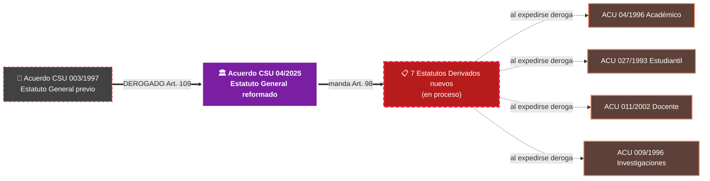
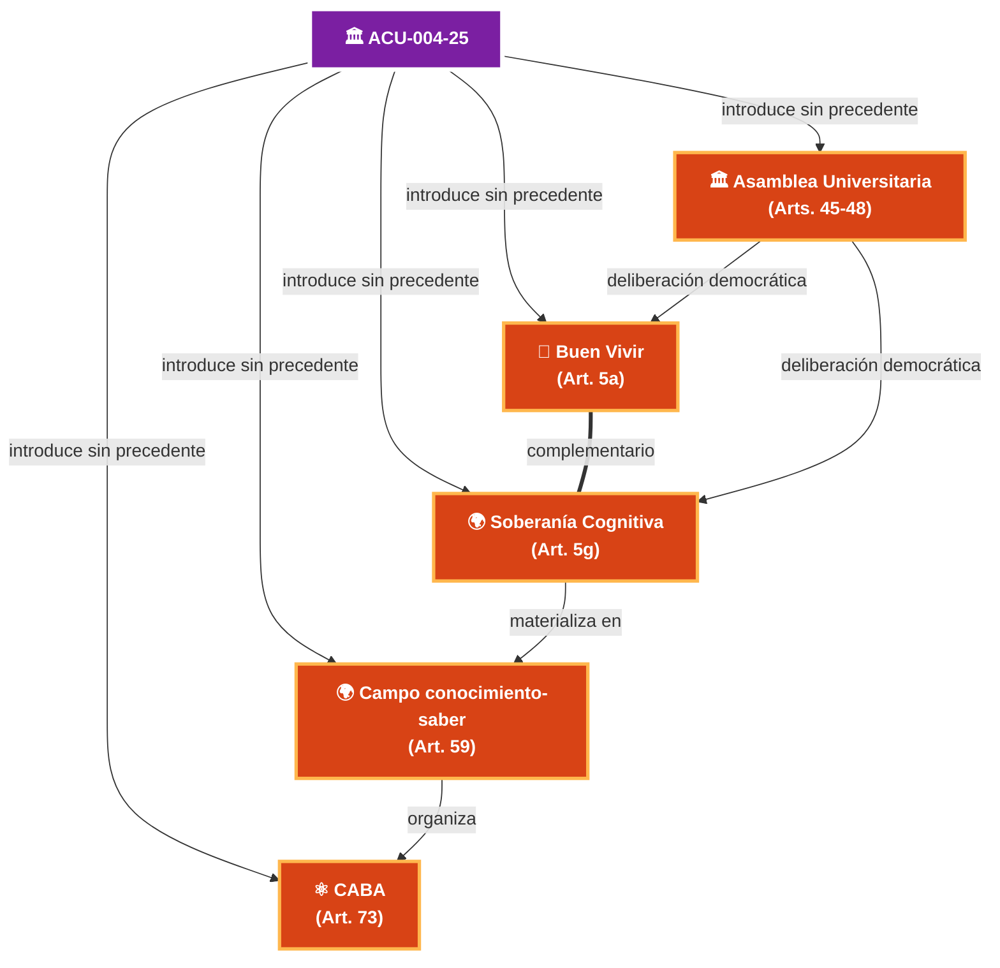
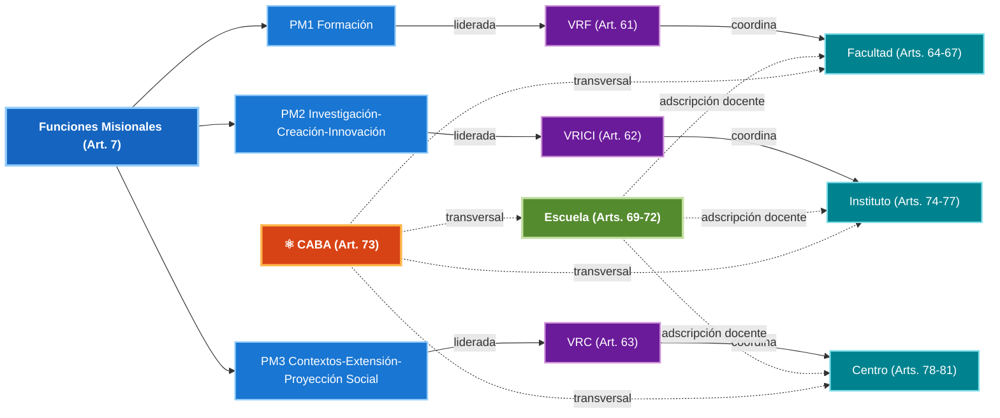
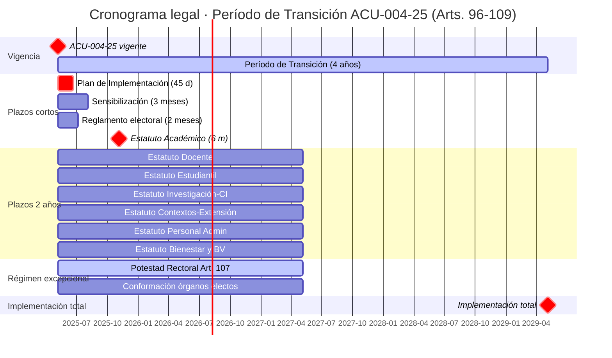

# DAG del Glosario Universal — grafo de relaciones tipadas entre los 38 conceptos M00

> **Propósito**: este documento materializa visualmente las relaciones tipadas entre los 38 conceptos del Glosario Universal extraídos del Acuerdo CSU UDFJC 04/2025. Es el **grafo del corpus conceptual fundacional** de la reforma vinculante UDFJC. Se construye con Mermaid para visualización en Obsidian y Pandoc/Velite.

## Vocabulario CERRADO de relaciones tipadas (recapitulación)

| Color en grafo | Relación | Significado |
|:---:|---|---|
| Rojo grueso | `norm_supersedes` | Esta norma deroga / sustituye a otra |
| Naranja | `norm_mandates` | Esta norma obliga a expedir otra |
| Naranja punteada | `norm_implements` | Operacionaliza un mandato |
| Azul | `skos_broader / narrower` | Jerarquía conceptual |
| Verde | `skos_related` | Relación lateral |
| Morado | `ddd_part_of / contains` | Composición DDD |

## DAG global — los 38 conceptos del corpus M00

```mermaid
%%{init: {'theme': 'dark', 'themeVariables': {'primaryColor': '#1a1a2e', 'primaryTextColor': '#fff', 'lineColor': '#b8b8b8'}}}%%
flowchart TD
    %% ========== NODO RAÍZ ==========
    ACU["🏛️ con-acu-004-25<br/>Carta Constitucional<br/>(ACU-004-25)"]:::raiz

    %% ========== NORMA DEROGADA ==========
    ACU003["📜 Acuerdo 003/1997<br/>(DEROGADO Art. 109)"]:::derogado
    ACU -.->|"norm_supersedes"| ACU003

    %% ========== TÍTULO I — IDENTIDAD ==========
    subgraph TI ["📖 TÍTULO I · Identidad institucional (Arts. 1-17)"]
        UDFJC["con-udfjc-ente-autonomo<br/>(Art. 1)"]:::tit1
        MISION["con-mision-institucional-udfjc<br/>(Art. 4)"]:::tit1
        BV["🌱 con-buen-vivir<br/>(Art. 5a · refundacional)"]:::refund
        SC["🌍 con-soberania-cognitiva<br/>(Art. 5g · refundacional)"]:::refund
        P10["con-10-principios-generales<br/>(Art. 5)"]:::tit1
        FM["con-funciones-misionales<br/>(Art. 7 · PM1·PM2·PM3)"]:::tit1
        CU["con-comunidad-universitaria<br/>(Arts. 8-17)"]:::tit1
    end

    %% ========== TÍTULO II — GOBIERNO ==========
    subgraph TII ["⚖️ TÍTULO II · Gobierno y participación democrática (Arts. 18-57)"]
        CSU["con-csu-consejo-superior-universitario<br/>(Arts. 22-29)"]:::tit2
        CACAD["con-cacad-consejo-academico<br/>(Arts. 30-32)"]:::tit2
        REC["con-rectoria<br/>(Arts. 33-39)"]:::tit2
        SGRAL["con-secretaria-general-sisgral<br/>(Arts. 40-42)"]:::tit2
        AU["🏛️ con-asamblea-universitaria<br/>(Arts. 45-48 · refundacional)"]:::refund
        CPU["con-consejo-participacion-universitaria<br/>(Arts. 49-50)"]:::tit2
        CE["con-consejo-electoral<br/>(Arts. 51-52)"]:::tit2
        CEU["con-consejo-estudiantil-universitario<br/>(Art. 53)"]:::tit2
        CGD["con-claustro-general-docente<br/>(Art. 54)"]:::tit2
        CdE["con-claustro-escuelas<br/>(Art. 55)"]:::tit2
        VEE["con-veeduria-universitaria<br/>(Art. 57)"]:::tit2
    end

    %% ========== TÍTULO III · CAP. 1 — ESTRUCTURA ACADÉMICA ==========
    subgraph TIIIa ["🏫 TÍTULO III · Cap. 1 · Estructura académica (Arts. 58-83)"]
        CAMPO["🌍 con-campo-conocimiento-saber<br/>(Art. 59 · refundacional)"]:::refund
        VRF["con-vicerrectoria-formacion<br/>(Art. 61)"]:::tit3a
        VRICI["con-vicerrectoria-investigacion-creacion-innovacion<br/>(Art. 62)"]:::tit3a
        VRC["con-vicerrectoria-contextos-extension<br/>(Art. 63)"]:::tit3a
        FAC["con-facultad<br/>(Arts. 64-67)"]:::tit3a
        ESC["con-escuela<br/>(Arts. 69-72)"]:::tit3a
        CABA["⚛️ con-caba<br/>(Art. 73 · refundacional)"]:::refund
        INST["con-instituto<br/>(Arts. 74-77)"]:::tit3a
        CTRO["con-centro<br/>(Arts. 78-81)"]:::tit3a
        PROG["con-programa-academico<br/>(Decreto 1330)"]:::tit3a
        CR["con-credito-academico<br/>(Decreto 1330)"]:::tit3a
        DIR["con-director-escuela<br/>(Art. 72)"]:::tit3a
    end

    %% ========== TÍTULO III · CAP. 2-3 — SOPORTE Y BIENESTAR ==========
    subgraph TIIIb ["🏥 TÍTULO III · Caps. 2-3 · Soporte + Bienestar (Arts. 84-90)"]
        EAS["con-estructura-administrativa-soporte<br/>(Arts. 84-87)"]:::tit3b
        SBBV["con-sistema-bienestar-buen-vivir<br/>(Arts. 88-90)"]:::tit3b
    end

    %% ========== TÍTULO IV — RÉGIMEN DE TRANSICIÓN ==========
    subgraph TIV ["⏳ TÍTULO IV · Régimen de transición (Arts. 91-109)"]
        PP["con-presupuesto-participativo<br/>(Art. 95)"]:::tit4
        PT["con-periodo-transicion<br/>(Art. 96 · 4 años)"]:::tit4
        PI["con-plan-implementacion<br/>(Art. 98)"]:::tit4
        PRT["⚠️ con-potestad-rectoral-transitoria<br/>(Art. 107 · 2025-2027)"]:::transitorio
        VTEP["⚠️ con-vigencia-transitoria-estatutos-previos<br/>(Art. 99)"]:::transitorio
    end

    %% ========== ESTATUTOS DERIVADOS PENDIENTES ==========
    ESTAT["📋 7 Estatutos derivados pendientes<br/>(Art. 98 §1-§7 · DT M00)"]:::dt

    %% ========== RELACIONES PRINCIPALES ==========
    %% ACU implementa fuentes superiores
    ACU -->|"norm_implements"| UDFJC

    %% Mandatos de reforma
    ACU ==>|"norm_mandates"| ESTAT

    %% Identidad institucional Título I
    ACU --> MISION
    ACU --> P10
    P10 --> BV
    P10 --> SC
    P10 --> FM
    ACU --> CU
    MISION -.->|"contiene"| BV

    %% Operacionalización funciones misionales
    FM -->|"PM1"| VRF
    FM -->|"PM2"| VRICI
    FM -->|"PM3"| VRC

    %% Vicerrectorías coordinan unidades
    VRF -->|"coordina"| FAC
    VRICI -->|"coordina"| INST
    VRC -->|"coordina"| CTRO

    %% Estructura académica núcleo
    CAMPO -->|"organiza"| ESC
    ESC -.->|"atravesada por"| CABA
    CABA -.->|"atraviesa"| INST
    CABA -.->|"atraviesa"| CTRO
    SC -->|"materializa en"| CAMPO

    %% Programas académicos
    PROG -->|"adscritos a"| ESC
    CR -->|"mide"| PROG

    %% Direcciones
    DIR -->|"dirige"| ESC

    %% Gobierno
    CSU -->|"expide"| ACU
    CACAD -.-> CSU
    REC -->|"preside"| CACAD
    REC -.->|"voz sin voto"| CSU
    SGRAL -.->|"fe pública"| CSU
    SGRAL -.->|"fe pública"| CACAD

    %% Participación democrática
    CU -->|"representada en"| AU
    CU -->|"representada en"| CSU
    AU -->|"propone a"| CSU
    CPU -->|"articula"| AU
    CE -->|"vigila elecciones"| CSU
    CEU -.-> AU
    CGD -.-> AU
    CdE -.-> CGD
    CdE -->|"parte de"| ESC
    VEE -->|"control ciudadano"| ACU

    %% Bienestar
    BV -->|"operacionaliza en"| SBBV

    %% Régimen de transición
    ACU -->|"establece"| PT
    PT -->|"detallado por"| PI
    PI -->|"manda"| ESTAT
    PRT -.->|"excepción"| DIR
    VTEP -.->|"protege"| ESTAT
    PP -->|"durante"| PT

    %% Soporte administrativo
    REC -.->|"coordina"| EAS

    %% ========== ESTILOS ==========
    classDef raiz fill:#7B1FA2,stroke:#fff,stroke-width:4px,color:#fff,font-weight:bold;
    classDef derogado fill:#424242,stroke:#E53935,stroke-width:2px,color:#fff,stroke-dasharray:5 5;
    classDef refund fill:#D84315,stroke:#FFB74D,stroke-width:3px,color:#fff,font-weight:bold;
    classDef tit1 fill:#1565C0,stroke:#90CAF9,stroke-width:2px,color:#fff;
    classDef tit2 fill:#2E7D32,stroke:#A5D6A7,stroke-width:2px,color:#fff;
    classDef tit3a fill:#6A1B9A,stroke:#CE93D8,stroke-width:2px,color:#fff;
    classDef tit3b fill:#00838F,stroke:#80DEEA,stroke-width:2px,color:#fff;
    classDef tit4 fill:#EF6C00,stroke:#FFB74D,stroke-width:2px,color:#fff;
    classDef transitorio fill:#5D4037,stroke:#FF8A65,stroke-width:3px,color:#fff,stroke-dasharray:3 3;
    classDef dt fill:#B71C1C,stroke:#FF1744,stroke-width:3px,color:#fff,font-weight:bold,stroke-dasharray:8 4;
```

## Sub-DAGs por relación tipada (vistas focalizadas)

### Sub-DAG 1 — Cadena de derogación + sucesión normativa

### Sub-DAG 2 — Conceptos refundacionales sin precedente

### Sub-DAG 3 — Estructura académica (Vicerrectorías × Funciones × Unidades)

### Sub-DAG 4 — Cronograma legal del Régimen de Transición

## Métricas del DAG

| Tipo de nodo | Conteo |
|---|:---:|
| Concepto raíz | 1 (ACU-004-25) |
| Conceptos refundacionales sin precedente | 5 (Buen Vivir, Soberanía Cognitiva, Campo, Asamblea Universitaria, CABA) |
| Conceptos del Título I (identidad) | 7 |
| Conceptos del Título II (gobierno) | 11 |
| Conceptos del Título III · Cap. 1 (estructura académica) | 12 |
| Conceptos del Título III · Caps. 2-3 (soporte + bienestar) | 2 |
| Conceptos del Título IV (transición) | 5 |
| **Total nodos del Glosario Universal M00** | **38** |

| Tipo de relación | Conteo aproximado |
|---|:---:|
| `norm_supersedes` (derogaciones) | 6 |
| `norm_mandates` (mandatos de reforma) | 7 (los 7 estatutos derivados) |
| `norm_implements` | ~25 |
| `skos_related` (laterales) | ~30 |
| `ddd_part_of` / `ddd_contains` | ~20 |
| **Total aristas tipadas estimadas** | **~88** |

## Notas de uso

- **Visualización**: este DAG se renderiza nativamente en Obsidian (Mermaid plugin), Pandoc (filtro `mermaid-filter` o `mermaid.cli`) y Velite/Next.js (`@mermaid-js/mermaid`).
- **Actualización**: cuando se añadan nuevos conceptos al Glosario Universal por enriquecimiento incremental de M01-M12, este DAG debe actualizarse con las nuevas aristas tipadas.
- **DAG inverso**: para responder "qué conceptos cita o contiene X", basta con grep `cited_in` y `tupla__relations` en cada archivo `con-*.md`.
