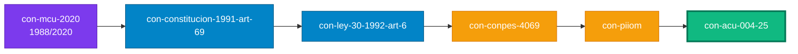

# 📊 Dashboard reactivo · Glosario Universal M00 + M01

> [!info]+ 🎯 Cómo leer este dashboard
> Las métricas se recomputan **en vivo** desde `tupla__relations[]` en cada `con-*.md`. Los charts usan el plugin **Charts** (phibr0); los KPIs usan **Dataview JS**. Path resuelto vía `dv.current().file.folder` — robusto a la raíz del vault.

> [!warning]+ Requisitos
> 1. **Dataview** · habilitar *JS Queries* en settings.
> 2. **Charts** plugin (phibr0) · verifica versión ≥ 3.9.0.

---

## §0 · KPIs de salud del corpus

```dataviewjs
const folder = dv.current().file.folder;
const pages = dv.pages(`"${folder}"`).where(p => p.kd_type === "glosario-universal");

const total = pages.length;
const conRel = pages.where(p => Array.isArray(p.tupla__relations) && p.tupla__relations.length > 0).length;
const huerfanos = total - conRel;

let totalAristas = 0;
let aristasNormativo = 0, aristasSkos = 0, aristasDdd = 0, aristasBib = 0;
for (const p of pages) {
  for (const r of (p.tupla__relations ?? [])) {
    totalAristas++;
    const f = r.rel_frame ?? "";
    if (f === "normativo") aristasNormativo++;
    else if (f === "skos") aristasSkos++;
    else if (f === "ddd" || f === "skos") aristasDdd++;
    else if (f === "bibliografico") aristasBib++;
  }
}

const conFacetNorm = pages.where(p => p.concepto_facet_normative != null).length;
const conPasteur = pages.where(p => p.pasteur_quadrant != null).length;

const score = total === 0 ? 0 : Math.round(
  (conRel/total)*30 +
  (conPasteur/total)*15 +
  ((huerfanos === 0) ? 25 : 0) +
  (conFacetNorm/total)*15 +
  (Math.min(totalAristas/200, 1))*15
);

const statusColor = score >= 85 ? "#10b981" : score >= 65 ? "#f59e0b" : "#ef4444";
const statusEmoji = score >= 85 ? "🟢" : score >= 65 ? "🟡" : "🔴";

dv.el("div", `
<div style="display:grid;grid-template-columns:repeat(4,1fr);gap:14px;margin:8px 0 18px 0;">
  <div style="background:linear-gradient(135deg,#0284c7,#075985);border-radius:14px;padding:18px;color:white;box-shadow:0 4px 12px rgba(2,132,199,0.25);">
    <div style="font-size:0.7rem;letter-spacing:0.06em;opacity:0.85;text-transform:uppercase;">Conceptos</div>
    <div style="font-size:2.6rem;font-weight:800;line-height:1;margin:6px 0;">${total}</div>
    <div style="font-size:0.78rem;opacity:0.85;">en corpus M00+M01</div>
  </div>
  <div style="background:linear-gradient(135deg,#10b981,#047857);border-radius:14px;padding:18px;color:white;box-shadow:0 4px 12px rgba(16,185,129,0.25);">
    <div style="font-size:0.7rem;letter-spacing:0.06em;opacity:0.85;text-transform:uppercase;">Cobertura relacional</div>
    <div style="font-size:2.6rem;font-weight:800;line-height:1;margin:6px 0;">${total ? Math.round(conRel/total*100) : 0}%</div>
    <div style="font-size:0.78rem;opacity:0.85;">${conRel} / ${total} con tupla__relations</div>
  </div>
  <div style="background:linear-gradient(135deg,#7c3aed,#5b21b6);border-radius:14px;padding:18px;color:white;box-shadow:0 4px 12px rgba(124,58,237,0.25);">
    <div style="font-size:0.7rem;letter-spacing:0.06em;opacity:0.85;text-transform:uppercase;">Aristas tipadas</div>
    <div style="font-size:2.6rem;font-weight:800;line-height:1;margin:6px 0;">${totalAristas}</div>
    <div style="font-size:0.78rem;opacity:0.85;">norm:${aristasNormativo} · skos:${aristasSkos} · bib:${aristasBib}</div>
  </div>
  <div style="background:linear-gradient(135deg,${statusColor},${statusColor}cc);border-radius:14px;padding:18px;color:white;box-shadow:0 4px 12px ${statusColor}40;">
    <div style="font-size:0.7rem;letter-spacing:0.06em;opacity:0.85;text-transform:uppercase;">Score global ${statusEmoji}</div>
    <div style="font-size:2.6rem;font-weight:800;line-height:1;margin:6px 0;">${score}<span style="font-size:1.2rem;opacity:0.7;">/100</span></div>
    <div style="font-size:0.78rem;opacity:0.85;">${huerfanos === 0 ? "✅ 0 huérfanos" : "⚠️ " + huerfanos + " huérfanos"}</div>
  </div>
</div>
`);
```

---

## §1 · Distribución del corpus por bucket M00 / M01 / extras

```dataviewjs
const folder = dv.current().file.folder;
const pages = dv.pages(`"${folder}"`).where(p => p.kd_type === "glosario-universal");

const m00 = pages.where(p => (p.tags ?? []).includes("m00-base")).length;
const m01 = pages.where(p => (p.tags ?? []).includes("audit-v1") && !(p.tags ?? []).includes("m00-base")).length;
const otros = pages.length - m00 - m01;

if (typeof window.renderChart === "function") {
  const chartData = {
    type: "doughnut",
    data: {
      labels: [`M00 · ACU-004-25 (${m00})`, `M01 · refactor (${m01})`, `Sin clasificar (${otros})`],
      datasets: [{
        data: [m00, m01, otros],
        backgroundColor: ["#0284c7", "#7c3aed", "#94a3b8"],
        borderColor: ["#075985", "#5b21b6", "#475569"],
        borderWidth: 2
      }]
    },
    options: {
      responsive: true,
      plugins: {
        legend: { position: "right", labels: { font: { size: 13 } } },
        title: { display: true, text: "Distribución por bucket de origen", font: { size: 15, weight: "bold" } }
      }
    }
  };
  window.renderChart(chartData, this.container);
} else {
  dv.paragraph("⚠️ Plugin **Charts** no disponible — instalarlo para visualizar.");
  dv.table(["Bucket","Conteo"], [["M00",m00],["M01",m01],["Otros",otros]]);
}
```

---

## §2 · Huérfanos y enlaces rotos · semáforos P0

```dataviewjs
const folder = dv.current().file.folder;
const pages = dv.pages(`"${folder}"`).where(p => p.kd_type === "glosario-universal");
const fileNames = new Set(pages.map(p => p.file.name).array());

const huerfanos = pages.where(p => !Array.isArray(p.tupla__relations) || p.tupla__relations.length === 0);

let broken = 0, externalRefs = 0;
for (const p of pages) {
  for (const rel of (p.tupla__relations ?? [])) {
    const raw = String(rel.rel_target ?? "").trim();
    if (!raw) continue;
    const frame = String(rel.rel_frame ?? "").trim();
    const m = raw.match(/^\[\[([^\]|]+)(?:\|[^\]]*)?\]\]$/);
    if (!m) {
      if (frame === "bibliografico") externalRefs++;
      else broken++;
      continue;
    }
    const target = m[1].split("/").pop().trim();
    if (!fileNames.has(target)) broken++;
  }
}

const semHuerfanos = huerfanos.length === 0 ? "#10b981" : huerfanos.length <= 3 ? "#f59e0b" : "#ef4444";
const semBroken = broken === 0 ? "#10b981" : broken <= 2 ? "#f59e0b" : "#ef4444";
const labelHuerfanos = huerfanos.length === 0 ? "✅ Sano" : "⚠️ Atender";
const labelBroken = broken === 0 ? "✅ Sano" : "🔴 Bloqueante";

dv.el("div", `
<div style="display:grid;grid-template-columns:1fr 1fr;gap:14px;margin:8px 0;">
  <div style="border:2px solid ${semHuerfanos};border-radius:14px;padding:18px;background:${semHuerfanos}10;">
    <div style="font-size:0.85rem;font-weight:700;color:${semHuerfanos};text-transform:uppercase;letter-spacing:0.05em;">🟠 Huérfanos (P0)</div>
    <div style="font-size:3rem;font-weight:800;color:${semHuerfanos};line-height:1;margin:6px 0;">${huerfanos.length}</div>
    <div style="font-size:0.85rem;color:${semHuerfanos};font-weight:600;">${labelHuerfanos}</div>
    <div style="font-size:0.78rem;opacity:0.7;margin-top:4px;">conceptos sin tupla__relations</div>
  </div>
  <div style="border:2px solid ${semBroken};border-radius:14px;padding:18px;background:${semBroken}10;">
    <div style="font-size:0.85rem;font-weight:700;color:${semBroken};text-transform:uppercase;letter-spacing:0.05em;">🔗 Enlaces rotos (P0)</div>
    <div style="font-size:3rem;font-weight:800;color:${semBroken};line-height:1;margin:6px 0;">${broken}</div>
    <div style="font-size:0.85rem;color:${semBroken};font-weight:600;">${labelBroken}</div>
    <div style="font-size:0.78rem;opacity:0.7;margin-top:4px;">+ ${externalRefs} refs externas legítimas (frame: bibliografico)</div>
  </div>
</div>
`);

if (huerfanos.length > 0) {
  dv.header(4, "Conceptos huérfanos · poblar tupla__relations[]");
  dv.list(huerfanos.map(p => p.file.link));
}
```

---

## §3 · Top 10 hubs · centralidad in-degree

```dataviewjs
const folder = dv.current().file.folder;
const pages = dv.pages(`"${folder}"`).where(p => p.kd_type === "glosario-universal");

const inDeg = new Map();
for (const p of pages) inDeg.set(p.file.name, 0);

for (const p of pages) {
  for (const rel of (p.tupla__relations ?? [])) {
    const m = String(rel.rel_target ?? "").match(/^\[\[([^\]|]+)(?:\|[^\]]*)?\]\]$/);
    if (!m) continue;
    const target = m[1].split("/").pop().trim();
    if (inDeg.has(target)) inDeg.set(target, inDeg.get(target) + 1);
  }
}

const top10 = Array.from(inDeg.entries())
  .sort((a, b) => b[1] - a[1])
  .slice(0, 10);

if (typeof window.renderChart === "function") {
  const chartData = {
    type: "bar",
    data: {
      labels: top10.map(([n]) => n.replace(/^con-/, "")),
      datasets: [{
        label: "In-degree (referencias entrantes)",
        data: top10.map(([, d]) => d),
        backgroundColor: top10.map((_, i) => `hsl(${210 - i * 18}, 75%, 55%)`),
        borderColor: top10.map((_, i) => `hsl(${210 - i * 18}, 75%, 40%)`),
        borderWidth: 1.5,
        borderRadius: 6
      }]
    },
    options: {
      indexAxis: "y",
      responsive: true,
      plugins: {
        legend: { display: false },
        title: { display: true, text: "Hubs del grafo — top 10 conceptos por entrada", font: { size: 15, weight: "bold" } }
      },
      scales: { x: { beginAtZero: true, grid: { color: "rgba(148,163,184,0.15)" } } }
    }
  };
  window.renderChart(chartData, this.container);
} else {
  dv.table(["Hub","In-degree"], top10.map(([n,d]) => [n, d]));
}
```

---

## §4 · Cobertura de facets por capability · radar

```dataviewjs
const folder = dv.current().file.folder;
const pages = dv.pages(`"${folder}"`).where(p => p.kd_type === "glosario-universal");

let normD = 0, normF = 0, dddD = 0, dddF = 0, neonD = 0, neonF = 0;
for (const p of pages) {
  const caps = p.concepto_capabilities ?? [];
  if (caps.includes("NORMATIVE")) { normD++; if (p.concepto_facet_normative) normF++; }
  if (caps.includes("DDD"))       { dddD++;  if (p.concepto_facet_ddd)       dddF++; }
  if (caps.includes("NEON"))      { neonD++; if (p.concepto_facet_neon)      neonF++; }
}

const pctN = normD ? Math.round(normF/normD*100) : 0;
const pctD = dddD  ? Math.round(dddF/dddD*100)   : 0;
const pctNeon = neonD ? Math.round(neonF/neonD*100) : 0;

if (typeof window.renderChart === "function") {
  const chartData = {
    type: "radar",
    data: {
      labels: [`NORMATIVE (${normF}/${normD})`, `DDD (${dddF}/${dddD})`, `NEON (${neonF}/${neonD})`],
      datasets: [{
        label: "Cobertura de facet (%)",
        data: [pctN, pctD, pctNeon],
        backgroundColor: "rgba(124,58,237,0.25)",
        borderColor: "#7c3aed",
        borderWidth: 2,
        pointBackgroundColor: "#7c3aed",
        pointBorderColor: "#fff",
        pointHoverBackgroundColor: "#fff",
        pointHoverBorderColor: "#7c3aed",
        pointRadius: 5
      }]
    },
    options: {
      responsive: true,
      plugins: {
        legend: { position: "bottom" },
        title: { display: true, text: "Cobertura de facets por capability declarada", font: { size: 15, weight: "bold" } }
      },
      scales: {
        r: {
          beginAtZero: true, max: 100, min: 0,
          ticks: { stepSize: 25, font: { size: 11 } },
          grid: { color: "rgba(148,163,184,0.25)" },
          angleLines: { color: "rgba(148,163,184,0.4)" }
        }
      }
    }
  };
  window.renderChart(chartData, this.container);
} else {
  dv.table(["Capability","Declarada","Con facet","%"],
    [["NORMATIVE",normD,normF,pctN+"%"],["DDD",dddD,dddF,pctD+"%"],["NEON",neonD,neonF,pctNeon+"%"]]);
}
```

---

## §5 · Distribución por Pasteur quadrant

```dataviewjs
const folder = dv.current().file.folder;
const pages = dv.pages(`"${folder}"`).where(p => p.kd_type === "glosario-universal");

const byQuadrant = new Map();
for (const p of pages) {
  const q = p.pasteur_quadrant ?? "(sin definir)";
  byQuadrant.set(q, (byQuadrant.get(q) ?? 0) + 1);
}

const labels = Array.from(byQuadrant.keys());
const data = Array.from(byQuadrant.values());
const colors = {
  "PASTEUR": "#7c3aed",
  "EDISON":  "#f59e0b",
  "BOHR":    "#0284c7",
  "PETER":   "#94a3b8",
  "(sin definir)": "#64748b"
};

if (typeof window.renderChart === "function") {
  const chartData = {
    type: "polarArea",
    data: {
      labels: labels.map((l, i) => `${l} (${data[i]})`),
      datasets: [{
        data,
        backgroundColor: labels.map(l => (colors[l] ?? "#64748b") + "bb"),
        borderColor: labels.map(l => colors[l] ?? "#64748b"),
        borderWidth: 2
      }]
    },
    options: {
      responsive: true,
      plugins: {
        legend: { position: "right" },
        title: { display: true, text: "Pasteur quadrant — orientación uso/conocimiento", font: { size: 15, weight: "bold" } }
      }
    }
  };
  window.renderChart(chartData, this.container);
} else {
  dv.table(["Quadrant","Conteo"], labels.map((l,i) => [l, data[i]]));
}
```

---

## §6 · Inventario clasificado · tabla detallada

```dataviewjs
const folder = dv.current().file.folder;
const pages = dv.pages(`"${folder}"`).where(p => p.kd_type === "glosario-universal");

const m00 = pages.where(p => (p.tags ?? []).includes("m00-base"));
const m01 = pages.where(p => (p.tags ?? []).includes("audit-v1") && !(p.tags ?? []).includes("m00-base"));
const otros = pages.where(p => !(p.tags ?? []).includes("m00-base") && !(p.tags ?? []).includes("audit-v1"));

dv.table(
  ["Bucket", "Conteo", "Estado"],
  [
    ["M00 · DAG canónico (`m00-base`)", m00.length, m00.length >= 32 ? "✅" : "⚠️"],
    ["M01 · Audit refactor (`audit-v1`)", m01.length, m01.length >= 35 ? "✅" : "⚠️"],
    ["Sin clasificar", otros.length, otros.length === 0 ? "✅" : "🔴"],
    ["**TOTAL**", `**${pages.length}**`, "—"]
  ]
);

if (otros.length > 0) {
  dv.header(4, "Conceptos sin clasificación · añadir tag `m00-base` o `audit-v1`");
  dv.list(otros.map(p => p.file.link));
}
```

---

## §7 · Cadena normativa multinivel · simetría bidireccional

```dataviewjs
const folder = dv.current().file.folder;
const pages = dv.pages(`"${folder}"`).where(p => p.kd_type === "glosario-universal");
const byName = new Map(pages.map(p => [p.file.name, p]).array());

const chain = [
  "con-mcu-2020",
  "con-constitucion-1991-art-69",
  "con-ley-30-1992-art-6",
  "con-conpes-4069",
  "con-piiom",
  "con-acu-004-25"
];

const acu = byName.get("con-acu-004-25");
const acuTargets = !acu ? [] : (acu.tupla__relations ?? [])
  .map(r => {
    const m = String(r.rel_target ?? "").match(/^\[\[([^\]|]+)(?:\|[^\]]*)?\]\]$/);
    return m ? m[1].split("/").pop().trim() : null;
  }).filter(x => x !== null);

const symRows = chain.slice(0, -1).map(slug => {
  const p = byName.get(slug);
  if (!p) return [`\`${slug}\``, "—", "—", "🔴 no existe"];
  const pTargets = (p.tupla__relations ?? [])
    .map(r => {
      const m = String(r.rel_target ?? "").match(/^\[\[([^\]|]+)(?:\|[^\]]*)?\]\]$/);
      return m ? m[1].split("/").pop().trim() : null;
    }).filter(x => x !== null);
  const aToB = acuTargets.includes(slug);
  const bToA = pTargets.includes("con-acu-004-25");
  const status = (aToB && bToA) ? "✅ simétrico" : (aToB || bToA) ? "🟡 unilateral" : "🔴 desconectado";
  return [p.file.link, aToB ? "✅" : "—", bToA ? "✅" : "—", status];
});

dv.table(["Eslabón", "ACU → eslabón", "Eslabón → ACU", "Simetría"], symRows);
```



---

## §8 · Punch list de remediación

```dataviewjs
const folder = dv.current().file.folder;
const pages = dv.pages(`"${folder}"`).where(p => p.kd_type === "glosario-universal");
const fileNames = new Set(pages.map(p => p.file.name).array());

const VOCAB_CERRADO = new Set([
  "norm_supersedes","norm_predecessor","norm_mandates","norm_mandated_by",
  "norm_implements","norm_amends","norm_complements",
  "skos_broader","skos_narrower","skos_related","skos_closeMatch","skos_exactMatch",
  "ddd_part_of","ddd_contains"
]);

let huerfanos = 0, brokenLinks = 0, vocabViolations = 0, missingFacets = 0;

for (const p of pages) {
  const rels = p.tupla__relations ?? [];
  if (rels.length === 0) huerfanos++;
  for (const rel of rels) {
    if (!VOCAB_CERRADO.has(rel.rel_nombre ?? "")) vocabViolations++;
    const raw = String(rel.rel_target ?? "").trim();
    const frame = String(rel.rel_frame ?? "").trim();
    const m = raw.match(/^\[\[([^\]|]+)(?:\|[^\]]*)?\]\]$/);
    if (!m) {
      if (frame !== "bibliografico") brokenLinks++;
      continue;
    }
    const target = m[1].split("/").pop().trim();
    if (!fileNames.has(target)) brokenLinks++;
  }
  const caps = p.concepto_capabilities ?? [];
  if (caps.includes("NORMATIVE") && !p.concepto_facet_normative) missingFacets++;
  if (caps.includes("DDD") && !p.concepto_facet_ddd) missingFacets++;
}

const status = (n) => n === 0 ? "✅" : "🔴";

dv.table(
  ["Prioridad","Hallazgo","Conteo","Meta","Estado"],
  [
    ["**P0**","Conceptos huérfanos",huerfanos,"0",status(huerfanos)],
    ["**P0**","Wikilinks rotos",brokenLinks,"0",status(brokenLinks)],
    ["**P1**","Violaciones vocab CERRADO",vocabViolations,"0",status(vocabViolations)],
    ["**P1**","Facets faltantes",missingFacets,"0",status(missingFacets)]
  ]
);

const totalIssues = huerfanos + brokenLinks + vocabViolations + missingFacets;
const totalColor = totalIssues === 0 ? "#10b981" : "#ef4444";
const totalLabel = totalIssues === 0 ? "🎉 CORPUS SANEADO" : `⚠️ ${totalIssues} HALLAZGO(S)`;

dv.el("div", `
<div style="margin:14px 0;padding:18px;background:linear-gradient(135deg,${totalColor},${totalColor}cc);border-radius:14px;color:white;text-align:center;box-shadow:0 4px 14px ${totalColor}40;">
  <div style="font-size:0.85rem;letter-spacing:0.08em;opacity:0.85;text-transform:uppercase;font-weight:600;">Estado de remediación</div>
  <div style="font-size:2.4rem;font-weight:800;margin:8px 0;">${totalLabel}</div>
  <div style="font-size:0.85rem;opacity:0.85;">audit forense v1 + audit reactivo continuo · ${new Date().toLocaleDateString('es-CO')}</div>
</div>
`);
```

---

## §9 · Documentación de uso

### Requisitos de plugins

| Plugin | Versión mínima | Rol |
|---|:---:|---|
| **Dataview** | 0.5.x | Queries reactivas + JS access a frontmatter |
| **Charts** (phibr0) | 3.9.0 | `window.renderChart()` para visualizaciones tipo Chart.js |

### Convenciones del corpus

- **`tupla__relations[]`** es el **único source of truth** de relaciones tipadas.
- **Prefijo de archivo**: `con-` (concept). Los archivos `con-*.md` son los conceptos del corpus; `_dash`, `_dag`, `_README`, `_Index_of` son archivos meta.
- **Tags**: `m00-base` (concepto del Acuerdo CSU 04/2025) · `audit-v1` (creado en el refactor M01).
- **Vocabulario CERRADO** declarado en `_README.md` §47 — nunca inventar `rel_nombre`.
- **Citas bibliográficas** (`@autor2024clave`) NO van en `tupla__relations` sino en `cited_in[]` o en el body.
- **Referencias externas** (normas derogadas, papers no atomizados): mantener como string en `rel_target` con `rel_frame: bibliografico`.

### Cómo arreglar el dashboard si los KPIs salen 0/NaN

1. Verificar que el folder del archivo es `00-glosoario-universal` (o equivalente con `con-*.md` adentro).
2. El path de búsqueda usa `dv.current().file.folder` — si has movido este archivo a otro folder, los conceptos no se detectarán. Mover de regreso o adaptar la query.
3. Validar que cada `con-*.md` tiene `kd_type: glosario-universal` en frontmatter.

### Programa de remediación (estado)

| Sprint | Entregable | Estado |
|---|---|:---:|
| Sprint 1 | Dashboard reactivo (este archivo) | ✅ |
| Sprint 2 | Script Node CI · DESCARTADO (cubierto por Sprint 1) | — |
| Sprint 3 P0a | 7 huérfanos saneados (39 aristas) | ✅ |
| Sprint 3 P0b | 7 enlaces rotos reparados | ✅ |
| Sprint 3 P1 | 3 simetrías cerradas (12 aristas) | ✅ |
| Refactor SOTA | `glo-` → `con-` (74 renames + 575 reemplazos) | ✅ |
| Sprint 2-bis | Visualización Cytoscape vía Juggl plugin | ⏳ |
| Sprint 4 | Cytoscape en portal aleia-reforma-ud | 📦 diferido |

---

## Historial

| Versión | Fecha | Cambios |
|---|---|---|
| 1.0.0 | 2026-04-26 | Dashboard inicial con 9 secciones DataviewJS reactivas (KPIs tabulares). |
| 1.1.0 | 2026-04-27 | Sprint 3 completo · refactor `glo-` → `con-` + remediación P0+P1 (39+12 aristas). |
| **2.0.0** | **2026-04-27** | **Rediseño infografía SOTA**: (a) **fix crítico** del path Dataview — usa `dv.current().file.folder` (era hardcoded path roto, causa de KPIs en 0/NaN); (b) **integración plugin Charts** (phibr0) vía `window.renderChart()` para visualizaciones dinámicas: doughnut M00/M01, bar horizontal top hubs, radar facets, polarArea Pasteur; (c) **KPI cards** con CSS gradients + sombras + score con semáforo verde/amarillo/rojo; (d) **estado banner** al final con resultado consolidado de remediación; (e) cadena normativa con Mermaid coloreado por capa (intl/norma/política/raíz); (f) sección §9 con docs de troubleshooting + matriz de plugins requeridos. |

---

*CC BY-SA 4.0 · Carlos Camilo Madera Sepúlveda · UDFJC · 2026-04-27 · `_dash-glosario-universal` v2.0.0*
