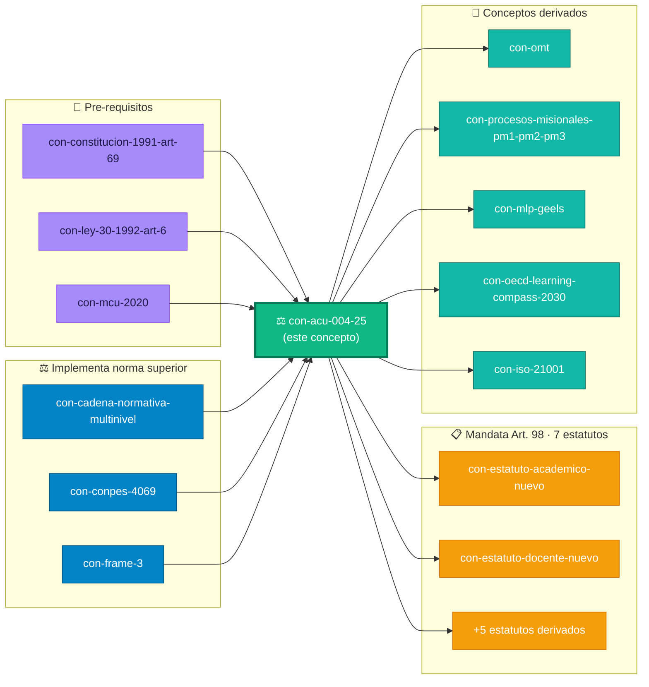

# Acuerdo CSU UDFJC 04 de 2025

> [!quote]+ 🏛️ Concepto raíz del grafo normativo UDFJC
> El **ACU-004-25** es la "carta constitucional que refunda la Universidad". Vigente desde **2025-05-06**. Deroga el Acuerdo 003/1997 (28 años de vigencia previa). Manda expedir **7 estatutos derivados** con plazos legales 6 meses-4 años. **Nodo raíz** de todos los conceptos normativos UDFJC en este grafo.

---

## §0 · 🎭 Vista por rol institucional

> Selecciona tu rol JTBD M04 — el body se adapta al contenido relevante para ti.

---

## §1 · Definición canónica  [SKOS frozen]

> Acto administrativo expedido por el Consejo Superior Universitario de la Universidad Distrital Francisco

| Sub-tipo                                                 |                          Pasteur                          |                                       Authority level                                       |
| -------------------------------------------------------- | :-------------------------------------------------------: | :-----------------------------------------------------------------------------------------: |
| DEFINITION | EDISON | — |

## §2 · 📜 Anclaje normativo  [facet-normative]

### §2.1 · Estructura del Acuerdo · 109 artículos en 4 Títulos

| Título | Capítulos | Artículos | Tema |
|:---:|:---:|:---:|---|
| **I** | 3 | Arts. 1-17 | Naturaleza Jurídica · Principios · Comunidad Universitaria |
| **II** | 2 | Arts. 18-57 | Gobierno · Participación Democrática |
| **III** | 3 | Arts. 58-90 | Estructura · Organización Académica + Administrativa + Bienestar |
| **IV** | 2 | Arts. 91-109 | Disposiciones Generales · Régimen de Transición |

### §2.2 · Texto literal · derogatoria explícita

> "El presente Acuerdo reglamenta íntegramente la materia, deroga todas las disposiciones que le sean contrarias, en especial: Acuerdo 03 de 1997 (Estatuto General anterior) y las normas que adicionan o complementan a este. Vigencia: Rige a partir del día siguiente a su publicación." — **ACU-004-25 Art. 109**.

## §3 · 🔻 Pre-requisitos cognitivos

> Para entender este concepto, necesitas comprender primero:

## §4 · 🔺 Conceptos que declaran este como pre-requisito cognitivo

> Reverse-lookup específico de `concepto_prerequisitos[]` (campo TPL v2.0). NO duplica §7 — §7 muestra las relaciones que YO declaro hacia otros conceptos; aquí veo solo quién me apunta como prerrequisito de comprensión.

## §5 · 📋 Mandatos derivados · 7 estatutos Art. 98

> ⚠️ **Riesgo institucional documentado** (DT-MI12-00-F-01): el Estatuto Académico nuevo (Art. 98 §1) tiene plazo vencido 2025-11-05 sin verificación pública de expedición.

## §6 · 🌳 Evolución longitudinal · provenance normativa  [definitional anchors]

## §7 · 🤝 Relaciones semánticas tipadas (outgoing)

> Vista completa de las relaciones que ESTE concepto declara hacia otros. Labels humanizados + descripción del significado de cada tipo de relación, cargados dinámicamente desde [[_vocabulario-relaciones]] (SoT). Sin tocar el spec `concepto-universal` se preserva interoperabilidad SKOS/PROV.

> 💡 **Patrón SOTA "Label Vocabulary"**: editas una description o label en [[_vocabulario-relaciones]] → se actualiza en todos los conceptos del corpus automáticamente. Cero acoplamiento al spec aleia-zen.

## §8 · 🎭 Vista por rol seleccionado  [Metabind reactivo]

## §9 · 📊 Recursos KDMO complementarios

## §10 · 📜 Citado en (papers cap-MI12)

---

## §11 · 🌐 Grafo Semántico Local · KPIs + Comunidades

> Vista in-situ del concepto en su ecosistema relacional. Calculado en vivo desde `tupla__relations[]` + reverse-lookup en el corpus completo.

### §11.1 · KPIs del concepto en el grafo

### §11.2 · Charts dashboard · Distribución frames + Top vecinos (grid 2-col)

### §11.3 · Comunidades + Métricas (grid 2-col)

### §11.4 · Mini-grafo Mermaid · concepto + vecindad 1-hop

---

## §12 · Régimen epistémico

---

## Historial de versiones

| Versión | Fecha | Cambios |
|---|---|---|
| v1.0.0 | 2026-04-26 | Concepto-universal v5.2 inicial · campos legacy `norm_*` a nivel root |
| v1.1.0-v1.3.0 | 2026-04-26..27 | Cross-references M01-M03 audit-driven |
| **v2.0.0** | **2026-04-27** | **PILOTO TPL T1 NORMATIVO concepto-universal v2.0 SOTA**: (a) **Faceted Architecture**: `concepto_capabilities: [NORMATIVE]` + `concepto_facet_normative` con campos canónicos `#FacetNormative` (`normative_source`, `normative_locator`, `normative_text`, `normative_authority_level: ESTATUTARIO`, `chain_status: LINEAR`, `derogates`, `derogated_by`, `conflicts_with`). (b) **Provenance**: `concepto_definitional_anchors` + `concepto_current_anchor` + `concepto_anchor_chain_status: LINEAR`. (c) **Pre-requisitos cognitivos**: `concepto_prerequisitos: [const-1991-art-69, ley-30-1992-art-6, mcu-2020]`. (d) **Refs entidades KDMO**: `concepto_diagram_ref`, `concepto_alignment_table_ref`, `concepto_qhu_refs`, `concepto_imagen_ref` (TODO stubs). (e) **Mandatos Art. 98**: 7 wikilinks `norm_mandates` agregados a `tupla__relations`. (f) **Body 100% reactivo**: cero duplicación frontmatter↔body. Metabind selector de rol JTBD M04 (`rol_seleccionado`) + 8 secciones DataviewJS reactivas (Anclaje + Pre-req + Derivados + Mandatos + Evolución + Relaciones + Vista por rol + Recursos KDMO + Citado en). (g) Cadena causal: el body lee `me.rol_seleccionado` y muestra contenido específico para 1 de 6 roles JTBD. **PRIMER concepto del corpus en TPL T1 v2.0 · sirve de referente para los 50 NORMATIVOS restantes del Sprint 1.** |

---

*CC BY-SA 4.0 · Carlos Camilo Madera Sepúlveda · UDFJC · 2026-04-27 · `con-acu-004-25` v2.0.0 · TPL T1 NORMATIVO piloto*
