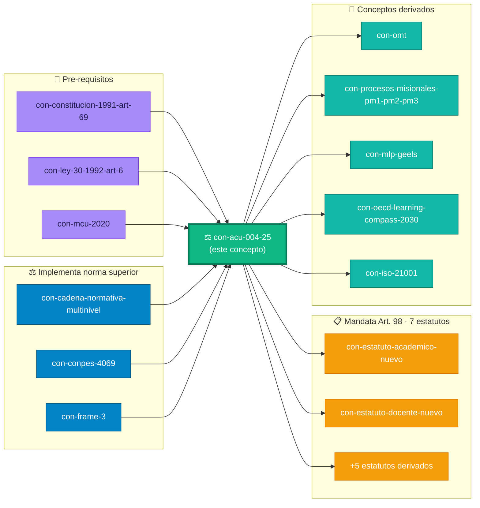

# `INPUT[text(class(meta-bind-readonly)):skos_prefLabel]`

> [!quote]+ 🏛️ Concepto raíz del grafo normativo UDFJC
> El **ACU-004-25** es la "carta constitucional que refunda la Universidad". Vigente desde **2025-05-06**. Deroga el Acuerdo 003/1997 (28 años de vigencia previa). Manda expedir **7 estatutos derivados** con plazos legales 6 meses-4 años. **Nodo raíz** de todos los conceptos normativos UDFJC en este grafo.

---

## §0 · 🎭 Vista por rol institucional

> Selecciona tu rol JTBD M04 — el body se adapta al contenido relevante para ti.

`INPUT[inlineSelect(option(estudiante-soberano,🎓 Estudiante Soberano), option(docente-disenador,🎨 Diseñador), option(docente-formador,🎤 Formador), option(docente-investigador-pasteur,🔬 Investigador Pasteur), option(docente-emprendedor-coop,🤝 Emprendedor/Coop), option(docente-director,🏛️ Director)):rol_seleccionado]`

---

## §1 · Definición canónica  [SKOS frozen]

> `INPUT[textArea(class(meta-bind-readonly)):skos_definition]`

| Sub-tipo                                                 |                          Pasteur                          |                                       Authority level                                       |
| -------------------------------------------------------- | :-------------------------------------------------------: | :-----------------------------------------------------------------------------------------: |
| `INPUT[text(class(meta-bind-readonly)):concept_subtype]` | `INPUT[text(class(meta-bind-readonly)):pasteur_quadrant]` | `INPUT[text(class(meta-bind-readonly)):concepto_facet_normative.normative_authority_level]` |

## §2 · 📜 Anclaje normativo  [facet-normative]

```dataviewjs
const me = dv.current();
const f = me.concepto_facet_normative;
if (!f) {
  dv.paragraph("(sin facet normative declarado)");
} else {
  dv.table(
    ["Campo", "Valor"],
    [
      ["**Fuente normativa** (cita-universal)", f.normative_source ?? "—"],
      ["**Locator**", f.normative_locator ?? "—"],
      ["**Authority level**", f.normative_authority_level ?? "—"],
      ["**Chain status**", f.chain_status ?? "—"],
      ["**Deroga a**", (f.derogates ?? []).join(" · ") || "—"],
      ["**Derogada por**", f.derogated_by || "Vigente"],
      ["**Conflicts with**", (f.conflicts_with ?? []).join(" · ") || "—"]
    ]
  );
}
```

### §2.1 · Estructura del Acuerdo · 109 artículos en 4 Títulos

| Título | Capítulos | Artículos | Tema |
|:---:|:---:|:---:|---|
| **I** | 3 | Arts. 1-17 | Naturaleza Jurídica · Principios · Comunidad Universitaria |
| **II** | 2 | Arts. 18-57 | Gobierno · Participación Democrática |
| **III** | 3 | Arts. 58-90 | Estructura · Organización Académica + Administrativa + Bienestar |
| **IV** | 2 | Arts. 91-109 | Disposiciones Generales · Régimen de Transición |

### §2.2 · Texto literal · derogatoria explícita

> "El presente Acuerdo reglamenta íntegramente la materia, deroga todas las disposiciones que le sean contrarias, en especial: Acuerdo 03 de 1997 (Estatuto General anterior) y las normas que adicionan o complementan a este. Vigencia: Rige a partir del día siguiente a su publicación." — **ACU-004-25 Art. 109**.

## §3 · 🔻 Pre-requisitos cognitivos

> Para entender este concepto, necesitas comprender primero:

```dataviewjs
const me = dv.current();
const prereq = me.concepto_prerequisitos ?? [];
if (prereq.length === 0) {
  dv.paragraph("Sin pre-requisitos formales declarados.");
} else {
  dv.list(prereq);
}
```

## §4 · 🔺 Conceptos que declaran este como pre-requisito cognitivo

> Reverse-lookup específico de `concepto_prerequisitos[]` (campo TPL v2.0). NO duplica §7 — §7 muestra las relaciones que YO declaro hacia otros conceptos; aquí veo solo quién me apunta como prerrequisito de comprensión.

```dataviewjs
const me = dv.current();
const here = me.file.name;
const folder = me.file.folder;
const all = dv.pages(`"${folder}"`).where(p => p.kd_type === "glosario-universal");

if (all.length === 0) {
  dv.paragraph(`⚠️ **Bug path**: folder=\`${folder}\` no contiene archivos kd_type=glosario-universal.`);
}

const matchHere = (target) => {
  if (!target) return false;
  if (typeof target === "object" && target.path !== undefined) {
    const slug = String(target.path).split("/").pop().replace(/\.md$/, "").trim();
    return slug === here;
  }
  const s = String(target);
  const m = s.match(/\[\[([^\]|]+?)(?:\|[^\]]*)?\]\]/);
  if (m) {
    const slug = m[1].split("/").pop().replace(/\.md$/, "").trim();
    return slug === here;
  }
  const slug = s.split("/").pop().replace(/\.md$/, "").trim();
  return slug === here;
};

const habilitados = all.where(p =>
  (p.concepto_prerequisitos ?? []).some(matchHere)
).array();

dv.header(4, `📚 ${habilitados.length} concepto(s) declaran este como pre-requisito directo`);
if (habilitados.length === 0) {
  dv.paragraph("_Ningún concepto del corpus declara `concepto_prerequisitos` apuntando aquí todavía. Este campo es nuevo del TPL v2.0 y se poblará durante Sprint 1 al migrar los 50 NORMATIVOS restantes. Para ver las relaciones outgoing (las que ESTE concepto declara hacia otros), consulta §7 abajo._");
} else {
  dv.list(habilitados.map(p => p.file.link));
}
```

## §5 · 📋 Mandatos derivados · 7 estatutos Art. 98

```dataviewjs
const me = dv.current();
const mandates = (me.tupla__relations ?? []).filter(r => r.rel_nombre === "norm_mandates");
if (mandates.length === 0) {
  dv.paragraph("Sin mandatos derivados declarados.");
} else {
  dv.table(
    ["§", "Estatuto derivado", "Evidencia · plazo · vencimiento"],
    mandates.map((r, i) => [`§${i+1}`, r.rel_target, r.rel_propiedades?.norm_evidence ?? "—"])
  );
}
```

> ⚠️ **Riesgo institucional documentado** (DT-MI12-00-F-01): el Estatuto Académico nuevo (Art. 98 §1) tiene plazo vencido 2025-11-05 sin verificación pública de expedición.

## §6 · 🌳 Evolución longitudinal · provenance normativa  [definitional anchors]

```dataviewjs
const me = dv.current();
const anchors = me.concepto_definitional_anchors ?? [];
dv.paragraph(`**Chain status**: ${me.concepto_anchor_chain_status ?? "—"} · **Anchor ACTIVE actual**: ${me.concepto_current_anchor ?? "—"}`);
dv.paragraph(`**Vigente desde**: ${me.valid_from ?? "—"} · **Hasta**: ${me.valid_to || "actualmente · ACTIVE"}`);

if (anchors.length === 0) {
  dv.paragraph("(Sin definitional anchors poblados todavía · TODO Sprint 1)");
} else {
  dv.header(4, "Cadena de definitional anchors (cronológica)");
  dv.list(anchors);
}
```

## §7 · 🤝 Relaciones semánticas tipadas (outgoing)

> Vista completa de las relaciones que ESTE concepto declara hacia otros. Labels humanizados + descripción del significado de cada tipo de relación, cargados dinámicamente desde [[_vocabulario-relaciones]] (SoT). Sin tocar el spec `concepto-universal` se preserva interoperabilidad SKOS/PROV.

```dataviewjs
const me = dv.current();
const rels = me.tupla__relations ?? [];

// Cargar vocabulario humanizado desde SoT
const vocabPage = dv.page("00-glosoario-universal/_vocabulario-relaciones");
const relMap = vocabPage?.relaciones ?? {};
const frameMap = vocabPage?.frames ?? {};

// Helpers
const lookupRel = (rel_nombre, rel_direccion) => {
  const dir = rel_direccion ?? "co";
  return relMap[rel_nombre]?.[dir]
    ?? relMap[rel_nombre]?.co
    ?? relMap[rel_nombre]?.pre
    ?? relMap[rel_nombre]?.post
    ?? null;
};
const humanLabel = (rel_nombre, rel_direccion) => {
  const e = lookupRel(rel_nombre, rel_direccion);
  return e?.label ?? `\`${rel_nombre}\``;
};
const humanDesc = (rel_nombre, rel_direccion) => {
  const e = lookupRel(rel_nombre, rel_direccion);
  return e?.description ?? "—";
};
const humanFrame = (frame) => {
  const f = frame ?? "general";
  return frameMap[f]?.label ?? `\`${f}\``;
};

// Agrupar por frame
const groups = {};
for (const r of rels) {
  if (r.rel_nombre === "norm_mandates") continue; // ya rendido en §5
  const k = r.rel_frame ?? "general";
  groups[k] = groups[k] ?? [];
  groups[k].push(r);
}

// Render por frame
for (const [frame, rs] of Object.entries(groups)) {
  dv.header(4, `${humanFrame(frame)} · ${rs.length} relación(es)  \`[frame: ${frame}]\``);

  // Sub-render: agrupar por tipo de relación dentro del frame para mostrar
  // descripción una sola vez por tipo + tabla de targets
  const byRel = {};
  for (const r of rs) {
    const key = `${r.rel_nombre}::${r.rel_direccion ?? "co"}`;
    byRel[key] = byRel[key] ?? { rel_nombre: r.rel_nombre, rel_direccion: r.rel_direccion, items: [] };
    byRel[key].items.push(r);
  }

  for (const grp of Object.values(byRel)) {
    const label = humanLabel(grp.rel_nombre, grp.rel_direccion);
    const desc = humanDesc(grp.rel_nombre, grp.rel_direccion);
    dv.header(5, `${label}  \`(${grp.rel_nombre} · ${grp.rel_direccion ?? "co"})\``);
    dv.paragraph(`> ${desc}`);
    dv.table(
      ["→ Target", "Evidencia (en este caso)"],
      grp.items.map(r => [
        r.rel_target,
        r.rel_propiedades?.norm_evidence ?? r.rel_propiedades?.skos_evidence ?? "—"
      ])
    );
  }
}
```

> 💡 **Patrón SOTA "Label Vocabulary"**: editas una description o label en [[_vocabulario-relaciones]] → se actualiza en todos los conceptos del corpus automáticamente. Cero acoplamiento al spec aleia-zen.

## §8 · 🎭 Vista por rol seleccionado  [Metabind reactivo]

```dataviewjs
const me = dv.current();
const rol = me.rol_seleccionado ?? "estudiante-soberano";

const vistas = {
  "estudiante-soberano": {
    titulo: "🎓 Para el Estudiante Soberano",
    contenido: [
      "**Tu situación**: el ACU-004-25 es la fuente jurídica de tus derechos académicos como estudiante UDFJC.",
      "**Lo más relevante para ti**:",
      "- **Art. 5** — los 10 principios refundacionales que orientan tu formación (Buen Vivir, Soberanía Cognitiva, etc.).",
      "- **Art. 7** — las 3 funciones misionales que articulan tu trayectoria académica.",
      "- **Arts. 8-17** — tus derechos y deberes como integrante de la Comunidad Universitaria.",
      "- **Arts. 45-48** — la Asamblea Universitaria donde puedes participar.",
      "- **Art. 73** — las CABAs donde puedes vincularte a investigación creditizada.",
      "**Acción concreta**: identifica las invariantes que protegen tu agencia transformadora y ejérzelas en tu CABA."
    ]
  },
  "docente-disenador": {
    titulo: "🎨 Para el Docente Diseñador",
    contenido: [
      "**Tu situación**: diseñas experiencias curriculares que deben ser conformes al ACU-004-25.",
      "**Lo más relevante para ti**:",
      "- **Art. 7** — las 3 funciones misionales que tu currículo debe articular.",
      "- **Art. 59** — el Campo conocimiento-saber como referente epistémico del diseño.",
      "- **Arts. 69-72** — la Escuela como contenedor de tus diseños.",
      "- **Art. 73** — la CABA como dispositivo activador de retroalimentaciones R1-R6.",
      "- **Art. 98 §1** — el Estatuto Académico nuevo (vencido) que define las reglas curriculares específicas.",
      "**Acción concreta**: traduce las invariantes del Acuerdo en restricciones de diseño de Paquetes CCA (V1∧V2∧V3)."
    ]
  },
  "docente-formador": {
    titulo: "🎤 Para el Docente Formador",
    contenido: [
      "**Tu situación**: facilitas el aprendizaje activo en aula, coherente con los principios del Acuerdo.",
      "**Lo más relevante para ti**:",
      "- **Art. 5** — los 10 principios que dan dirección pedagógica.",
      "- **Art. 5g** — Soberanía Cognitiva como criterio de selección de plataformas/recursos.",
      "- **Art. 5a** — Buen Vivir como horizonte de la formación.",
      "- **Art. 7 PM1** — Formación como proceso misional explícito.",
      "**Acción concreta**: usa el texto literal del Art. 5 como ancla en sesiones de fundamentos institucionales; desarrolla las preguntas QHU vinculadas al Acuerdo."
    ]
  },
  "docente-investigador-pasteur": {
    titulo: "🔬 Para el Investigador Pasteur",
    contenido: [
      "**Tu situación**: investigas problemas territoriales con rigor académico bajo Frame 3.",
      "**Lo más relevante para ti**:",
      "- **Art. 7 PM2** — Investigación-Creación-Innovación como proceso misional.",
      "- **Art. 62** — Vicerrectoría de Investigación-Creación-Innovación.",
      "- **Art. 73** — CABA como dispositivo de articulación con territorio.",
      "- **Arts. 69-72** — Escuela como adscripción docente por campo.",
      "- **Art. 96-100** — Período de Transición · ventana de oportunidad para nichos transformativos.",
      "**Acción concreta**: usa los anchors normativos como restricción institucional + las invariantes DDD como condiciones de campo de tus proyectos PM2."
    ]
  },
  "docente-emprendedor-coop": {
    titulo: "🤝 Para el Emprendedor/Coop",
    contenido: [
      "**Tu situación**: articulas cooperación universidad-territorio-sector productivo.",
      "**Lo más relevante para ti**:",
      "- **Art. 7 PM3** — Extensión-Contextos como proceso misional.",
      "- **Art. 63** — Vicerrectoría de Contextos y Extensión.",
      "- **Arts. 78-81** — Centro como nodo de PM3.",
      "- **Art. 5b** — Autonomía Universitaria como base de los convenios.",
      "- **Chain_status: LINEAR** del ACU es condición de viabilidad jurídica de tus convenios.",
      "**Acción concreta**: cita Art. 5b + Art. 7 PM3 como base jurídica de cualquier convenio de extensión territorial; verifica que los convenios respeten el régimen de transición Art. 96-100."
    ]
  },
  "docente-director": {
    titulo: "🏛️ Para el Docente Director",
    contenido: [
      "**Tu situación**: gobiernas una unidad académica con evidencia hacia ΩMT.",
      "**Lo más relevante para ti**:",
      "- **Arts. 18-57** (Título II completo) — Gobierno y participación democrática.",
      "- **Arts. 22-29** — CSU como autoridad superior de tus decisiones.",
      "- **Art. 30-32** — CACAD como autoridad académica.",
      "- **Arts. 33-39** — Rectoría como ejecutivo institucional.",
      "- **Arts. 96-100** — Período de Transición y Comisión Art. 100 (PENDIENTE conformación).",
      "- **Art. 107** — Potestad rectoral transitoria 2025-2027 (vence pronto).",
      "- **Art. 98** — los 7 estatutos derivados que estructuran tu gestión cotidiana.",
      "**Acción concreta**: tu gobernanza se valida contra: (a) competencias formales del Acuerdo, (b) chain_status LINEAR del anchor normativo, (c) cumplimiento de mandatos Art. 98 vigentes."
    ]
  }
};

const v = vistas[rol] ?? vistas["estudiante-soberano"];
dv.header(3, v.titulo);
for (const linea of v.contenido) dv.paragraph(linea);
```

## §9 · 📊 Recursos KDMO complementarios

```dataviewjs
const me = dv.current();
const refs = [
  ["📊 Diagrama (diagram-universal)", me.concepto_diagram_ref],
  ["📋 Tabla alineación (tabla-universal)", me.concepto_alignment_table_ref],
  ["🖼️ Imagen (imagen-universal)", me.concepto_imagen_ref]
].filter(([_, v]) => v);
if (refs.length) {
  dv.table(["Tipo", "Recurso"], refs);
} else {
  dv.paragraph("⚠️ TODO Sprint 1 · stubs entidades KDMO complementarias por crear (`diagram-universal`, `tabla-universal`, `qhu-universal`, `imagen-universal`).");
}

const lista = [
  ["❓ Preguntas trazadoras (qhu-universal)", me.concepto_qhu_refs ?? []],
  ["🧮 Fórmulas (formula-universal)", me.concepto_formula_refs ?? []]
];
for (const [titulo, items] of lista) {
  if (items.length) {
    dv.header(4, titulo);
    dv.list(items);
  }
}
```

## §10 · 📜 Citado en (papers cap-MI12)

```dataviewjs
const me = dv.current();
dv.list(me.cited_in ?? []);
dv.paragraph(`**Total citaciones**: ${me.cited_count ?? 0}`);
```

---

## §11 · 🌐 Grafo Semántico Local · KPIs + Comunidades

> Vista in-situ del concepto en su ecosistema relacional. Calculado en vivo desde `tupla__relations[]` + reverse-lookup en el corpus completo.

### §11.1 · KPIs del concepto en el grafo

```dataviewjs
const me = dv.current();
const here = me.file.name;
const all = dv.pages('"00-glosoario-universal"').where(p => p.kd_type === "glosario-universal");

// Out-degree: relaciones salientes
const outDeg = (me.tupla__relations ?? []).length;

// In-degree: cuántos conceptos me apuntan
let inDeg = 0;
for (const p of all) {
  for (const r of (p.tupla__relations ?? [])) {
    if (String(r.rel_target ?? "").includes(here)) inDeg++;
  }
}

// Pre-requisitos declarados
const prereq = (me.concepto_prerequisitos ?? []).length;

// Reverse-lookup: cuántos me declaran prerequisito
let habilitados = 0;
for (const p of all) {
  if ((p.concepto_prerequisitos ?? []).some(x => String(x).includes(here))) habilitados++;
}

// Distribución por frame de mis relaciones
const byFrame = {};
for (const r of (me.tupla__relations ?? [])) {
  const f = r.rel_frame ?? "general";
  byFrame[f] = (byFrame[f] ?? 0) + 1;
}

// HTML cards
dv.el("div", `
<div class="kpi-grid-grafo" style="display:grid;grid-template-columns:repeat(4,1fr);gap:14px;margin:12px 0;">
  <div class="kpi-card-grafo kpi-blue" style="background:linear-gradient(135deg,#0284c7,#075985);border-radius:14px;padding:18px;color:white;box-shadow:0 4px 12px rgba(2,132,199,0.25);">
    <div style="font-size:0.7rem;letter-spacing:0.06em;opacity:0.85;text-transform:uppercase;">In-degree</div>
    <div style="font-size:2.6rem;font-weight:800;line-height:1;margin:6px 0;">${inDeg}</div>
    <div style="font-size:0.78rem;opacity:0.85;">conceptos me apuntan</div>
  </div>
  <div class="kpi-card-grafo kpi-purple" style="background:linear-gradient(135deg,#7c3aed,#5b21b6);border-radius:14px;padding:18px;color:white;box-shadow:0 4px 12px rgba(124,58,237,0.25);">
    <div style="font-size:0.7rem;letter-spacing:0.06em;opacity:0.85;text-transform:uppercase;">Out-degree</div>
    <div style="font-size:2.6rem;font-weight:800;line-height:1;margin:6px 0;">${outDeg}</div>
    <div style="font-size:0.78rem;opacity:0.85;">relaciones salientes</div>
  </div>
  <div class="kpi-card-grafo kpi-green" style="background:linear-gradient(135deg,#10b981,#047857);border-radius:14px;padding:18px;color:white;box-shadow:0 4px 12px rgba(16,185,129,0.25);">
    <div style="font-size:0.7rem;letter-spacing:0.06em;opacity:0.85;text-transform:uppercase;">Habilita comprensión</div>
    <div style="font-size:2.6rem;font-weight:800;line-height:1;margin:6px 0;">${habilitados}</div>
    <div style="font-size:0.78rem;opacity:0.85;">conceptos lo declaran prereq</div>
  </div>
  <div class="kpi-card-grafo kpi-orange" style="background:linear-gradient(135deg,#f59e0b,#d97706);border-radius:14px;padding:18px;color:white;box-shadow:0 4px 12px rgba(245,158,11,0.25);">
    <div style="font-size:0.7rem;letter-spacing:0.06em;opacity:0.85;text-transform:uppercase;">Centralidad total</div>
    <div style="font-size:2.6rem;font-weight:800;line-height:1;margin:6px 0;">${inDeg + outDeg}</div>
    <div style="font-size:0.78rem;opacity:0.85;">in + out degree</div>
  </div>
</div>
`);
```

### §11.2 · Charts dashboard · Distribución frames + Top vecinos (grid 2-col)

```dataviewjs
const me = dv.current();
const colors = { normativo: "#0284c7", skos: "#10b981", bibliografico: "#f59e0b", ddd: "#7c3aed", general: "#94a3b8" };

// Datos chart 1: distribución por frame
const byFrame = {};
for (const r of (me.tupla__relations ?? [])) {
  const f = r.rel_frame ?? "general";
  byFrame[f] = (byFrame[f] ?? 0) + 1;
}
const fLabels = Object.keys(byFrame);
const fData = Object.values(byFrame);

// Datos chart 2: distribución por rel_nombre (top 8)
const byRel = {};
for (const r of (me.tupla__relations ?? [])) {
  const k = r.rel_nombre ?? "(sin)";
  byRel[k] = (byRel[k] ?? 0) + 1;
}
const rEntries = Object.entries(byRel).sort((a,b) => b[1] - a[1]).slice(0, 8);

// Wrapper grid 2-columnas
const wrapper = dv.container.createEl("div", { attr: { style: "display:grid;grid-template-columns:1fr 1fr;gap:18px;margin:14px 0;" }});
const c1 = wrapper.createEl("div");
const c2 = wrapper.createEl("div");

if (typeof window.renderChart === "function" && fLabels.length) {
  window.renderChart({
    type: "doughnut",
    data: {
      labels: fLabels.map((l, i) => `${l} (${fData[i]})`),
      datasets: [{
        data: fData,
        backgroundColor: fLabels.map(l => (colors[l] ?? "#64748b") + "cc"),
        borderColor: fLabels.map(l => colors[l] ?? "#64748b"),
        borderWidth: 2
      }]
    },
    options: {
      responsive: true, maintainAspectRatio: true,
      plugins: {
        legend: { position: "bottom", labels: { font: { size: 11 } } },
        title: { display: true, text: "Distribución por frame", font: { size: 13, weight: "bold" } }
      }
    }
  }, c1);

  window.renderChart({
    type: "bar",
    data: {
      labels: rEntries.map(([k]) => k),
      datasets: [{
        label: "# relaciones",
        data: rEntries.map(([, v]) => v),
        backgroundColor: rEntries.map((_, i) => `hsl(${210 - i*22}, 70%, 55%)`),
        borderRadius: 4
      }]
    },
    options: {
      indexAxis: "y", responsive: true, maintainAspectRatio: true,
      plugins: {
        legend: { display: false },
        title: { display: true, text: "Top 8 tipos de relación (rel_nombre)", font: { size: 13, weight: "bold" } }
      },
      scales: { x: { beginAtZero: true } }
    }
  }, c2);
} else {
  dv.paragraph("⚠️ Plugin Charts no disponible.");
}
```

### §11.3 · Comunidades + Métricas (grid 2-col)

```dataviewjs
const me = dv.current();
const here = me.file.name;
const folder = me.file.folder;
const all = dv.pages(`"${folder}"`).where(p => p.kd_type === "glosario-universal");

// Helper match wikilink · robusto Link-object + string
const matchSlug = (target) => {
  if (!target) return null;
  if (typeof target === "object" && target.path !== undefined) {
    return String(target.path).split("/").pop().replace(/\.md$/, "").trim();
  }
  const s = String(target);
  const m = s.match(/\[\[([^\]|]+?)(?:\|[^\]]*)?\]\]/);
  if (m) return m[1].split("/").pop().replace(/\.md$/, "").trim();
  return s.split("/").pop().replace(/\.md$/, "").trim() || null;
};

// Vecindad 1-hop (out + in)
const directos = new Set();
for (const r of (me.tupla__relations ?? [])) {
  const slug = matchSlug(r.rel_target);
  if (slug) directos.add(slug);
}
for (const p of all) {
  if ((p.tupla__relations ?? []).some(r => matchSlug(r.rel_target) === here)) {
    directos.add(p.file.name);
  }
}
directos.delete(here);

// Agrupar por capa
const comunidades = {};
for (const v of directos) {
  const p = all.where(x => x.file.name === v).first();
  if (!p) continue;
  const tags = p.tags ?? [];
  let capa = "otros";
  for (const t of tags) {
    if (typeof t === "string" && t.match(/^m\d{2}-(base|corpus)$/)) { capa = t; break; }
  }
  comunidades[capa] = comunidades[capa] ?? [];
  comunidades[capa].push(p);
}

// Métricas
const indirectos = new Set();
for (const v of directos) {
  const p = all.where(x => x.file.name === v).first();
  if (!p) continue;
  for (const r of (p.tupla__relations ?? [])) {
    const slug = matchSlug(r.rel_target);
    if (slug) indirectos.add(slug);
  }
}
indirectos.delete(here);
for (const d of directos) indirectos.delete(d);

const totalConceptos = all.length;
const myDegree = (me.tupla__relations ?? []).length;
const density = (myDegree / Math.max(1, totalConceptos - 1)).toFixed(3);

// Grid 2-col render
const wrapper = dv.container.createEl("div", { attr: { style: "display:grid;grid-template-columns:1fr 1fr;gap:20px;margin:14px 0;" }});
const left = wrapper.createEl("div");
const right = wrapper.createEl("div");

// Columna izquierda · comunidades por capa
left.createEl("h4", { text: `🧬 Comunidades por capa · ${directos.size} vecinos en ${Object.keys(comunidades).length} capa(s)` });
for (const [capa, conceptos] of Object.entries(comunidades).sort()) {
  const block = left.createEl("div", { attr: { style: "margin-bottom:10px;" }});
  block.createEl("strong", { text: `${capa} · ${conceptos.length}` });
  const ul = block.createEl("ul", { attr: { style: "margin:4px 0 0 1.2em;font-size:0.88rem;" }});
  for (const p of conceptos.slice(0, 8)) {
    const li = ul.createEl("li");
    const a = li.createEl("a", { text: p.file.name, attr: { "data-href": p.file.name, "class": "internal-link" }});
  }
  if (conceptos.length > 8) block.createEl("em", { text: `… +${conceptos.length - 8} más` });
}

// Columna derecha · métricas
right.createEl("h4", { text: "📐 Métricas de navegación" });
const tbl = right.createEl("table", { attr: { style: "width:100%;font-size:0.9rem;" }});
const rows = [
  ["Vecindad 1-hop", directos.size, "directa"],
  ["Vecindad 2-hop", indirectos.size, "indirecta nueva"],
  ["Cobertura 1+2 hops", directos.size + indirectos.size + 1, `de ${totalConceptos}`],
  ["Density local", density, "out / (N-1)"],
  ["Out-degree", myDegree, "salientes"],
];
const thead = tbl.createEl("thead").createEl("tr");
for (const h of ["Métrica", "Valor", "Detalle"]) thead.createEl("th", { text: h, attr: { style: "text-align:left;border-bottom:1px solid #555;padding:4px;" }});
const tbody = tbl.createEl("tbody");
for (const r of rows) {
  const tr = tbody.createEl("tr");
  for (const c of r) tr.createEl("td", { text: String(c), attr: { style: "padding:4px;border-bottom:1px solid #333;" }});
}

right.createEl("div", { attr: { style: "margin-top:12px;font-size:0.82rem;opacity:0.85;" }, text: "🔌 Plugins navegación: Juggl · Graph Analysis · Breadcrumbs" });
```

### §11.4 · Mini-grafo Mermaid · concepto + vecindad 1-hop



---

## §12 · Régimen epistémico

```dataviewjs
const me = dv.current();
dv.header(4, "Domain de aplicación");
dv.paragraph(me.applicable_domain ?? "—");
dv.header(4, "Supuestos explícitos");
dv.list(me.assumptions ?? []);
dv.header(4, "Condiciones que invalidan el concepto (breaks_at)");
dv.list(me.breaks_at ?? []);
```

---

## Historial de versiones

| Versión | Fecha | Cambios |
|---|---|---|
| v1.0.0 | 2026-04-26 | Concepto-universal v5.2 inicial · campos legacy `norm_*` a nivel root |
| v1.1.0-v1.3.0 | 2026-04-26..27 | Cross-references M01-M03 audit-driven |
| **v2.0.0** | **2026-04-27** | **PILOTO TPL T1 NORMATIVO concepto-universal v2.0 SOTA**: (a) **Faceted Architecture**: `concepto_capabilities: [NORMATIVE]` + `concepto_facet_normative` con campos canónicos `#FacetNormative` (`normative_source`, `normative_locator`, `normative_text`, `normative_authority_level: ESTATUTARIO`, `chain_status: LINEAR`, `derogates`, `derogated_by`, `conflicts_with`). (b) **Provenance**: `concepto_definitional_anchors` + `concepto_current_anchor` + `concepto_anchor_chain_status: LINEAR`. (c) **Pre-requisitos cognitivos**: `concepto_prerequisitos: [const-1991-art-69, ley-30-1992-art-6, mcu-2020]`. (d) **Refs entidades KDMO**: `concepto_diagram_ref`, `concepto_alignment_table_ref`, `concepto_qhu_refs`, `concepto_imagen_ref` (TODO stubs). (e) **Mandatos Art. 98**: 7 wikilinks `norm_mandates` agregados a `tupla__relations`. (f) **Body 100% reactivo**: cero duplicación frontmatter↔body. Metabind selector de rol JTBD M04 (`rol_seleccionado`) + 8 secciones DataviewJS reactivas (Anclaje + Pre-req + Derivados + Mandatos + Evolución + Relaciones + Vista por rol + Recursos KDMO + Citado en). (g) Cadena causal: el body lee `me.rol_seleccionado` y muestra contenido específico para 1 de 6 roles JTBD. **PRIMER concepto del corpus en TPL T1 v2.0 · sirve de referente para los 50 NORMATIVOS restantes del Sprint 1.** |

---

*CC BY-SA 4.0 · Carlos Camilo Madera Sepúlveda · UDFJC · 2026-04-27 · `con-acu-004-25` v2.0.0 · TPL T1 NORMATIVO piloto*
