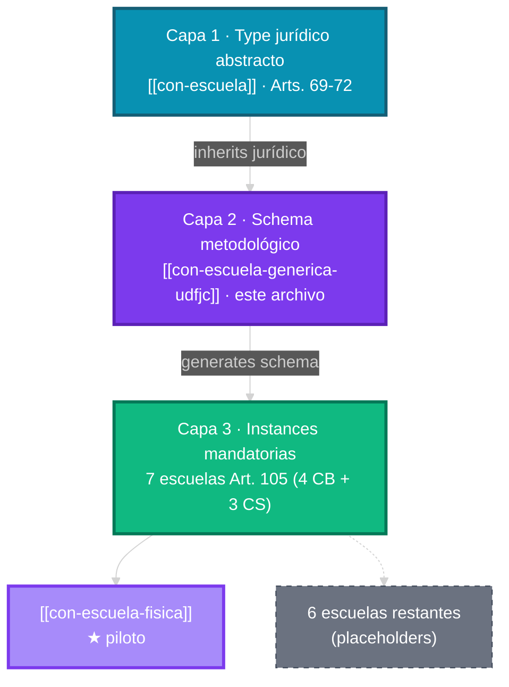

# Escuela Genérica UDFJC

## Definición operativa

Construcción abstracta que representa una Escuela tipo post-reforma, aplicable a cualquier campo disciplinar.

## Características invariantes

| Dimensión | Valor típico |
|---|---|
| Docentes | ~25 (5 roles JTBD) |
| Estudiantes | ~600-1.200 |
| CABAs activas | 2-4 |
| Campo conocimiento-saber | 1 (Art. 59) |
| Presupuesto | Art. 88-90 |

## Fuente primaria

> Madera Sepúlveda, C. C. (2026). §04 · JTBD de la Comunidad UDFJC. *Capítulo MI-12* §1.3. UDFJC.

## Lenguaje ubicuo asociado

Escuela Genérica · Unidad de análisis · Instanciación · Particularización disciplinar.

## Notas de aplicación

- **Conexión M04 §1.3**: alcance del paper.
- **NO confundir** con Escuelas reales ni con `con-escuela` (definición jurídica).

## Patrón Type → Schema → Instance (v1.1.0 · 2026-04-27)

Este concepto es la **Capa 2 (Schema)** de un patrón 3-capas que materializa el mandato Art. 105 ACU-004-25:

### Especificación del schema

Toda instancia (`con-escuela-{nombre}`) debe:

1. Declarar `concepto_capabilities: [NORMATIVE, NEON, DDD, SCENARIO, INSTANCE]`.
2. Apuntar `concepto_instance_of: "[[con-escuela-generica-udfjc]]"` y `concepto_instance_of_type: "[[con-escuela]]"`.
3. Particularizar `concepto_instance_specifics` con: campo conocimiento-saber, ámbito disciplinar (CB/CS), vicerrectoría (siempre Formación), facultad de articulación, CABAs proyectadas, fechas meta de creación.
4. Modelar transición S0→S5 con `concepto_facet_scenario.bindings[]` referenciando `[[con-framework-86-indicadores-s0-s5]]`.
5. Establecer adoption_chain con: ACU-004-25 Art. 69-72 (jurídico) + Art. 105 (mandato) + Acuerdo CSU específico de creación (cuando se expida).

Ver el piloto [[con-escuela-fisica]] para template completo.
