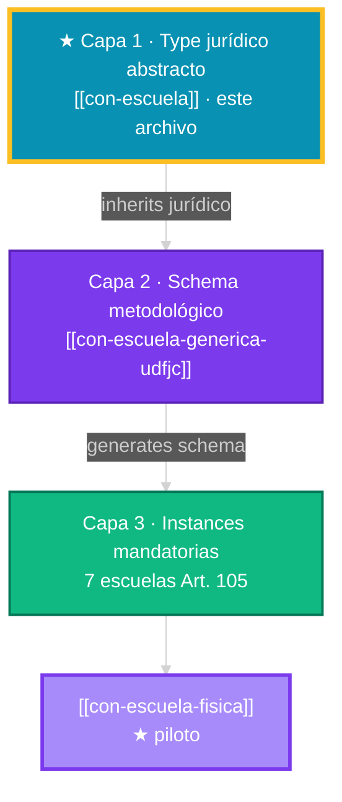

# Escuela UDFJC reformada (Arts. 69-72 ACU-004-25)

## Definición operativa

Unidad académica básica de la UDFJC reformada donde **están adscritos los docentes** y su productividad académica en torno a **un campo del conocimiento-saber**. Permea las demás unidades a través de investigación-creación, extensión y formación. Coexiste con Facultades, Institutos y Centros como estructuras paralelas **no jerárquicas**. Es atravesada transversalmente por **CABAs**.

## Reconciliación de los 4 contextos del término "Escuela" en el corpus

| # | Contexto | Sección dominante | Naturaleza | Resolución |
|---|---|---|---|---|
| (a) | NORMATIVO-estructural | sec-MI12-00, 01 | NORMATIVO | **Este glosario es la SSOT** |
| (b) | JTBD-ecosistema | sec-MI12-04 (BPA-003) | ACADÉMICO | Wrapper sobre el átomo |
| (c) | MLP-transformativa | sec-MI12-02 (Geels) | ACADÉMICO | Wrapper sobre el átomo |
| (d) | BMK-TDABC | sec-MI12-05, 10 | DATO-CALCULADO | Wrapper sobre el átomo |

> Los contextos (b)(c)(d) son **wrappers** que aplican al átomo NORMATIVO. Cualquier mención debe primero anclarse a este glosario.

## Fuente primaria

> Arts. 58-59 (campo del conocimiento-saber); 69-72 (Escuelas, Director, Consejo); 71 (~25 Escuelas por decreto CSU). ACU-004-25.

## Invariantes operativas DDD

1. Una Escuela declara **al menos un campo del conocimiento-saber**.
2. Docentes de planta TC adscritos a una Escuela como anclaje primario.
3. **Director** docente de planta TC, electo por voto docente, 4 años, sin reelección inmediata.
4. **Consejo de Escuela**: 70% docentes + 30% CV+entrevista (Art. 72).
5. Atravesada por **N CABAs** transversales (≥0).
6. Desarrolla **simultáneamente** PM1+PM2+PM3.

## Lenguaje ubicuo asociado

Escuela · Director(a) de Escuela · Consejo de Escuela · Docente adscrito · Campo del conocimiento-saber · CABA (transversal).

## Notas de aplicación

- **Cuándo invocarla**: cuando se hable de la unidad académica básica de adscripción docente. Si el contexto es JTBD ecosistema, MLP nicho o BMK comparativa, citar wrapper aplicable.
- **Sustitución estructural**: las Escuelas reemplazan al modelo Facultad-Departamento del Acuerdo 003/1997. Coexisten complementariamente con la Facultad reformada (no jerárquicamente).

## Patrón Type → Schema → Instance (v1.1.0 · 2026-04-27)

Este concepto es la **Capa 1 (Type jurídico abstracto)** de un patrón 3-capas que materializa el mandato Art. 105 ACU-004-25:

### Mandato Art. 105 — 7 escuelas mandatorias

El Art. 105 ACU-004-25 ordena la conformación de **nuevas escuelas** en plazo de 2 años (deadline **2027-05-05**), distribuidas en:

- **Bloque Ciencias Básicas (4 escuelas)** — incluye [[con-escuela-fisica|Escuela de Física]] (piloto del patrón) + 3 escuelas adicionales pendientes de confirmación nominal.
- **Bloque Ciencias de la Salud (3 escuelas)** — pendientes de confirmación nominal.

Cada instancia (Capa 3) hereda jurídicamente este Type (Capa 1) vía el schema metodológico (Capa 2). Ver dashboard agregado: [[_dash-escuelas]].
