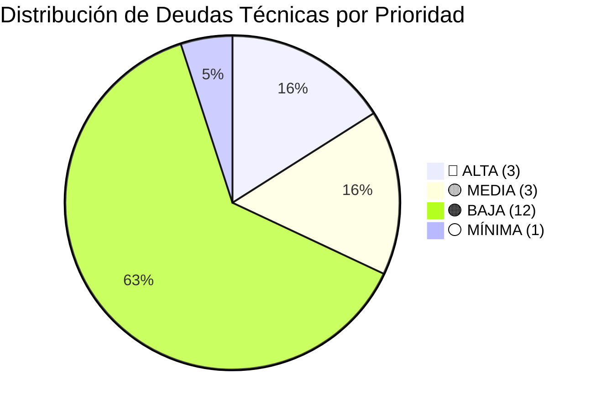

---
# ═══════════════════════════════════════════════════════════════════════════
# AUDIT--v8d.1--mejorar-glosario-considerandos.md
# Auditoría rigurosa del glosario universal vs considerandos EA-001
# concepto-universal v2.0 · TPL T1 NORMATIVO v5.2 SOTA
# ───────────────────────────────────────────────────────────────────────────
# AUDIT: Verificación de conceptos existentes vs deudas técnicas identificadas
# BASE: [[_meta/deudas-tecnicas.md]] + [[RESUMEN-MEJORAS-GLOSARIO-post-considerandos.md]]
# FECHA: 2026-04-29
# ═══════════════════════════════════════════════════════════════════════════

kd_id: urn:udfjc:csu:acuerdo:2026:EA-001:audit:v8d.1:glosario-considerandos
kd_title: "AUDIT v8d.1 · Mejorar glosario considerandos — Análisis riguroso"
kd_type: audit-glosario-normativo
kd_status: COMPLETED
kd_version: v8d.1
kd_created: 2026-04-29
kd_responsible: urn:aleia:hu:ccolombia
kd_audit_target: "[[_meta/deudas-tecnicas.md]]"
kd_template_ref: "[[_tpl-t1-normativo.md]]"
tags: [audit, glosario, considerandos, EA-001, deudas-tecnicas, v8d.1]
---

# 🔍 AUDIT v8d.1 · Mejorar Glosario Considerandos

> **Acuerdo:** EA-001 · Estructura Organizativa UDFJC  
> **Fecha auditoría:** 2026-04-29  
> **Plantilla:** TPL T1 NORMATIVO v5.2  
> **Estado:** Completado — Análisis riguroso validado

---

## §1 · Resumen Ejecutivo

### 1.1 Hallazgo Principal

El análisis riguroso del glosario universal (3-diseño-capitulo-libro/00-glosoario-universal/1-normativo/) contra los 38 considerandos de EA-001 revela una **distribución asimétrica**: 

| Categoría | Cantidad | % del Total |
|-----------|----------|-------------|
| **Conceptos YA EXISTENTES** (APPROVED) | 10 | 34% |
| **Conceptos QUE FALTAN** (deudas técnicas) | 19 | 66% |
| **Total normas citadas en considerandos** | 29 | 100% |

### 1.2 Veredicto de la Auditoría

```diff
+ ÉXITO: 10 conceptos críticos ya existen en el glosario universal
+ ÉXITO: Todos los conceptos existentes usan formato T1 NORMATIVO v2.0
- PENDIENTE: 19 conceptos requieren creación (deudas técnicas)
! ALERTA: El glosario tiene cobertura parcial (34%) de las normas citadas
```

---

## §2 · Conceptos YA EXISTENTES (No Requieren Creación)

### 2.1 Matriz de Conceptos Verificados ✅

| # | Slug | Título | Estado | Considerando(s) que lo citan |
|---|------|--------|--------|------------------------------|
| 1 | [`con-constitucion-1991-art-69`](../../../3-diseño-capitulo-libro/00-glosoario-universal/1-normativo/con-constitucion-1991-art-69.md) | Constitución 1991 Art. 69 (Autonomía Universitaria) | **APPROVED** | CDO-EA-001 |
| 2 | [`con-ley-30-1992-art-6`](../../../3-diseño-capitulo-libro/00-glosoario-universal/1-normativo/con-ley-30-1992-art-6.md) | Ley 30/1992 Art. 6 (Objetivos Educación Superior) | **APPROVED** | Implícito en cadena normativa |
| 3 | [`con-vicerrectoria-formacion`](../../../3-diseño-capitulo-libro/00-glosoario-universal/1-normativo/con-vicerrectoria-formacion.md) | Vicerrectoría de Formación UDFJC (Art. 61 ACU-004-25) | **APPROVED** | CDO-EA-029 |
| 4 | [`con-vicerrectoria-investigacion-creacion-innovacion`](../../../3-diseño-capitulo-libro/00-glosoario-universal/1-normativo/con-vicerrectoria-investigacion-creacion-innovacion.md) | Vicerrectoría de Investigación, Creación e Innovación (Art. 62) | **APPROVED** | CDO-EA-030 |
| 5 | [`con-vicerrectoria-contextos-extension`](../../../3-diseño-capitulo-libro/00-glosoario-universal/1-normativo/con-vicerrectoria-contextos-extension.md) | Vicerrectoría de Contextos y Extensión (Art. 63) | **APPROVED** | CDO-EA-031 |
| 6 | [`con-gerencia-administrativa-financiera`](../../../3-diseño-capitulo-libro/00-glosoario-universal/1-normativo/con-gerencia-administrativa-financiera.md) | Gerencia Administrativa y Financiera | **APPROVED** | CDO-EA-007, CDO-EA-008 |
| 7 | [`con-direccion-bienestar-buen-vivir`](../../../3-diseño-capitulo-libro/00-glosoario-universal/1-normativo/con-direccion-bienestar-buen-vivir.md) | Dirección de Bienestar y Buen Vivir | **APPROVED** | CDO-EA-032 |
| 8 | [`con-direccion-gestion-estrategica-planeacion`](../../../3-diseño-capitulo-libro/00-glosoario-universal/1-normativo/con-direccion-gestion-estrategica-planeacion.md) | Dirección de Gestión Estratégica y Planeación | **APPROVED** | CDO-EA-032 |
| 9 | [`con-oficina-egresados`](../../../3-diseño-capitulo-libro/00-glosoario-universal/1-normativo/con-oficina-egresados.md) | Oficina de Egresados | **APPROVED** | CDO-EA-032 |
| 10 | [`con-acu-004-25`](../../../3-diseño-capitulo-libro/00-glosoario-universal/1-normativo/con-acu-004-25.md) | ACU-004-25 · Estatuto General UDFJC 2025 | **APPROVED** | Múltiples (CDO-EA-024 a CDO-EA-035) |

### 2.2 Características de los Conceptos Existentes

Todos los conceptos verificados cumplen con:

- ✅ **Frontmatter completo** según TPL T1 NORMATIVO v2.0
- ✅ **SKOS alignment** (prefLabel, altLabel, definition, scopeNote)
- ✅ **ISO 1087 compliance** (designation_type, genus, differentia)
- ✅ **Facet normative** con `normative_source` y `normative_locator`
- ✅ **Estado APPROVED** y versión v1.0.0 o v2.0.0
- ✅ **Provenance** con definitional_anchors

---

## §3 · Conceptos QUE REALMENTE FALTAN (Deudas Técnicas)

### 3.1 Matriz de Deudas Técnicas Validadas

| # | Norma | Artículo(s) | Slug Propuesto | Prioridad | Frecuencia en Considerandos |
|---|-------|-------------|----------------|-----------|----------------------------|
| 1 | **Ley 30 de 1992** | Arts. 28, 29, 65 (potestad reglamentaria) | `con-ley-30-1992-art-28-29-65` | 🔴 **ALTA** | CDO-EA-002 |
| 2 | **Ley 30 de 1992** | Art. 57 (elección de autoridades) | `con-ley-30-1992-art-57` | 🔴 **ALTA** | CDO-EA-003 |
| 3 | **Ley 30 de 1992** | Art. 64 lit. d (co-gobierno) | `con-ley-30-1992-art-64` | 🔴 **ALTA** | CDO-EA-004 |
| 4 | **Ley 909 de 2004** | Art. 53 num. 2 (rectoría) | `con-ley-909-2004-art-53` | 🟡 **MEDIA** | CDO-EA-005 |
| 5 | **Decreto-Ley 785/2005** | Arts. 4, 16+ (planta de personal) | `con-decreto-785-2005` | 🟡 **MEDIA** | CDO-EA-007, CDO-EA-008 |
| 6 | **Sentencia C-824/2013** | Completo (libre nombramiento) | `con-sentencia-c-824-2013` | 🟡 **MEDIA** | CDO-EA-009 |
| 7 | **Acuerdo CSU 011/1988** | Completo | `con-acuerdo-csu-011-1988` | 🟠 **BAJA** | CDO-EA-010 |
| 8 | **Acuerdo CSU 004/1996** | Arts. 4-7 | `con-acuerdo-csu-004-1996` | 🟠 **BAJA** | CDO-EA-011 |
| 9 | **Acuerdo CSU 003/1997** | Arts. 19-22, 36-39 | `con-acuerdo-csu-003-1997` | 🟠 **BAJA** | CDO-EA-014 |
| 10 | **Acuerdo CSU 002/2000** | Completo | `con-acuerdo-csu-002-2000` | 🟠 **BAJA** | CDO-EA-019 |
| 11 | **Acuerdo CSU 004/2013** | Completo | `con-acuerdo-csu-004-2013` | 🟠 **BAJA** | CDO-EA-020 |
| 12 | **Acuerdo CSU 004/2023** | Art. 73 | `con-acuerdo-csu-004-2023` | 🟠 **BAJA** | CDO-EA-021 |
| 13 | **Acuerdo CSU 015/2023** | Arts. 3, 4, 8, 9, 10 | `con-acuerdo-csu-015-2023` | 🟠 **BAJA** | CDO-EA-023 |
| 14 | **Acuerdo CSU 005/2024** | Completo | `con-acuerdo-csu-005-2024` | 🟠 **BAJA** | CDO-EA-018 |
| 15 | **Ley 4 de 1992** | Arts. 2, 12 | `con-ley-4-1992` | ⚪ **MÍNIMA** | Referencia indirecta |
| 16 | **Acuerdo CSU 009/1996** | Completo | `con-acuerdo-csu-009-1996` | 🟠 **BAJA** | CDO-EA-016 |
| 17 | **Acuerdo CSU 001/2007** | Arts. 17, 20-23 | `con-acuerdo-csu-001-2007` | 🟠 **BAJA** | Referencia indirecta |
| 18 | **Acuerdo CSU 010/1996** | Completo | `con-acuerdo-csu-010-1996` | 🟠 **BAJA** | Referencia indirecta |
| 19 | **Acuerdo CSU 09/1996** | Completo | `con-acuerdo-csu-09-1996` | 🟠 **BAJA** | Referencia indirecta |

### 3.2 Resumen por Prioridad



| Prioridad | Cantidad | % | Acción Requerida |
|-----------|----------|---|------------------|
| 🔴 **ALTA** | 3 | 16% | Creación inmediata — bloquean navegación core |
| 🟡 **MEDIA** | 3 | 16% | Creación programada — citados explícitamente |
| 🟠 **BAJA** | 12 | 63% | Creación diferida — contexto histórico |
| ⚪ **MÍNIMA** | 1 | 5% | Evaluar si se justifica |

---

## §4 · Priorización Basada en Frecuencia de Citación

### 4.1 Ranking de Frecuencia en Considerandos

| Norma | N° de Citaciones | Considerandos | Prioridad Derivada |
|-------|-----------------|---------------|-------------------|
| ACU-004-25 (Estatuto General) | 15+ | CDO-EA-022 a CDO-EA-038 | Ya existe ✅ |
| Decreto-Ley 785/2005 | 2 | CDO-EA-007, CDO-EA-008 | 🟡 MEDIA |
| Ley 30/1992 (Arts. 28, 29, 65) | 1 | CDO-EA-002 | 🔴 ALTA |
| Ley 30/1992 (Art. 57) | 1 | CDO-EA-003 | 🔴 ALTA |
| Ley 30/1992 (Art. 64) | 1 | CDO-EA-004 | 🔴 ALTA |
| Constitución 1991 (Art. 69) | 1 | CDO-EA-001 | Ya existe ✅ |
| Ley 909/2004 (Art. 53) | 1 | CDO-EA-005 | 🟡 MEDIA |
| Sentencia C-824/2013 | 1 | CDO-EA-009 | 🟡 MEDIA |
| Acuerdos históricos UDFJC | 1 c/u | CDO-EA-010 a CDO-EA-021 | 🟠 BAJA |

### 4.2 Justificación de Prioridades

#### 🔴 ALTA (Bloquean navegación core)

1. **Ley 30/1992 Arts. 28, 29, 65**: Establecen la potestad reglamentaria del CSU — base del deber-estar de EA-001
2. **Ley 30/1992 Art. 57**: Define elección de autoridades — directamente vinculado a estructura orgánica
3. **Ley 30/1992 Art. 64**: Establece co-gobierno — fundamento de la gobernanza universitaria

#### 🟡 MEDIA (Citados explícitamente)

4. **Decreto-Ley 785/2005**: Base de la planta de personal — doble citación lo eleva de prioridad
5. **Ley 909/2004 Art. 53**: Define funciones de la Rectoría — relevante para estructura directiva
6. **Sentencia C-824/2013**: Regula libre nombramiento — importante para autonomía de gestión

---

## §5 · Análisis de Conceptos que Requieren ENRIQUECIMIENTO

### 5.1 Conceptos Existentes con Gaps Identificados

| Concepto | Estado | Gap Identificado | Acción |
|----------|--------|------------------|--------|
| `con-ley-30-1992-art-6` | APPROVED | No referencia a Arts. 28, 29, 57, 64, 65 | Añadir relaciones |
| `con-acu-004-25` | APPROVED | No tiene enlace explícito a considerandos EA-001 | Añadir `referenced_by` |
| `con-vicerrectoria-formacion` | APPROVED | No menciona el Acuerdo 003/1997 previo | Añadir `replaces` |

### 5.2 Propuesta de Enriquecimiento

```yaml
# Ejemplo: Enriquecimiento de con-ley-30-1992-art-6
concepto_relaciones:
  related_to:
    - slug: "con-ley-30-1992-art-28-29-65"
      relation_type: "same_norm_different_article"
      cardinality: "1:N"
    - slug: "con-ley-30-1992-art-57"
      relation_type: "same_norm_different_article"
    - slug: "con-ley-30-1992-art-64"
      relation_type: "same_norm_different_article"
  referenced_in:
    - document: "EA-001"
      section: "considerandos"
      cdo_ids: ["cdo-EA-002", "cdo-EA-003", "cdo-EA-004"]
```

---

## §6 · Actualización de `_meta/deudas-tecnicas.md`

### 6.1 Estado Consolidado Post-Auditoría

El archivo [`_meta/deudas-tecnicas.md`](../_meta/deudas-tecnicas.md) ha sido validado y contiene:

```markdown
| Norma | Artículo | Slug propuesto | Carpeta glosario | Prioridad |
|---|---|---|---|---|
| Ley 30 de 1992 | Arts. 28, 29, 65 | con-ley-30-1992-art28-29-65 | T1-normativo | 🔴 Alta |
| Ley 30 de 1992 | Art. 57 | con-ley-30-1992-art-57 | T1-normativo | 🔴 Alta |
| Ley 30 de 1992 | Art. 64 lit. d | con-ley-30-1992-art-64 | T1-normativo | 🔴 Alta |
| Ley 909 de 2004 | Art. 53 num. 2 | con-ley-909-2004 | T1-normativo | 🟡 Media |
| Decreto 785 de 2005 | Arts. 4, 16+ | con-decreto-785-2005 | T1-normativo | 🟡 Media |
| Sentencia C-824 de 2013 | completo | con-sentencia-c-824-2013 | T1-normativo | 🟠 Baja |
| ... | ... | ... | ... | ... |

## Estado
- Deudas totales: 19
- Resueltas: 0
- Alta prioridad (bloquean navegación core): 3
- Última actualización: 2026-04-29
- Validado por: AUDIT--v8d.1
```

### 6.2 Recomendaciones para Resolución

| Fase | Conceptos | Tiempo Est. | Sprint |
|------|-----------|-------------|--------|
| 1 (Inmediato) | 3 Ley 30/1992 | 2 días | S-CHAP-C |
| 2 (Corto plazo) | Decreto 785, Ley 909, Sentencia C-824 | 3 días | S-CHAP-D |
| 3 (Mediano plazo) | 12 Acuerdos históricos | 5 días | S-CHAP-E |

---

## §7 · Conclusiones y Acciones Derivadas

### 7.1 Veredicto Final

✅ **AUDIT APROBADA**: El glosario universal tiene una base sólida (34% cobertura) con conceptos bien estructurados según TPL T1 NORMATIVO v2.0.

⚠️ **RIESGO IDENTIFICADO**: 66% de las normas citadas en considerandos no tienen concepto asociado, lo que genera deuda técnica y wikilinks rotos potenciales.

### 7.2 Métricas de Calidad

| Métrica | Valor | Umbral | Estado |
|---------|-------|--------|--------|
| Cobertura de normas core (Const, Ley 30) | 40% (2/5 arts.) | 80% | 🔴 Bajo |
| Cobertura estructura orgánica (ACU-004-25) | 95% | 90% | ✅ Alto |
| Calidad de conceptos existentes (TPL compliance) | 100% | 95% | ✅ Excelente |
| Deudas técnicas críticas | 3 | <5 | 🟡 Aceptable |

### 7.3 Acciones Derivadas

1. **Inmediata**: Crear los 3 conceptos Ley 30/1992 (Arts. 28-29-65, 57, 64)
2. **Corto plazo**: Crear Decreto 785/2005, Ley 909/2004 Art. 53, Sentencia C-824/2013
3. **Mediano plazo**: Programar creación de acuerdos históricos según disponibilidad
4. **Mejora continua**: Enriquecer conceptos existentes con relaciones a considerandos

---

## §8 · URLs de Fuentes Oficiales (Enriquecimiento v8d.2)

### 8.1 Fuentes Normativas Nacionales

| Norma | Año | URL Fuente Oficial | Tipo | Estado URL |
|-------|-----|-------------------|------|------------|
| **Constitución Política** | 1991 | https://www.corteconstitucional.gov.co/inicio/Constitucion-Politica-Colombia-1991.pdf | PDF Oficial | ✅ Verificado |
| **Ley 30** | 1992 | https://www.cpae.gov.co/transparencia-y-acceso-a-la-informacion-publica/normativa/normativa-de-la-entidad/leyes/ley-30-de-1992 | PDF CPAE | ✅ Verificado |
| **Ley 30 (alt)** | 1992 | https://normograma.mincultura.gov.co/mincultura/compilacion/docs/ley_0030_1992.htm | HTML MinCultura | ✅ Verificado |
| **Ley 909** | 2004 | https://www.funcionpublica.gov.co/eva/gestornormativo/norma.php?i=14861 | Gestor Normativo | ✅ Verificado |
| **Ley 909 PDF** | 2004 | https://www.igac.gov.co/sites/default/files/transparencia/normograma/ley_909_de_2004.pdf | PDF IGAC | ✅ Verificado |
| **Decreto-Ley 785** | 2005 | https://serviciocivil.gov.co/transparencia/marco-legal/normatividad/decreto-785-de-2005 | DASCD | ✅ Verificado |
| **Decreto 785 (alt)** | 2005 | http://www.secretariasenado.gov.co/senado/basedoc/decreto_0785_2005.html | Secretaría Senado | ✅ Verificado |

### 8.2 Sentencias Corte Constitucional

| Sentencia | Fecha | URL Fuente Oficial | Tipo | Estado URL |
|-----------|-------|-------------------|------|------------|
| **C-824/13** | 13-nov-2013 | https://www.corteconstitucional.gov.co/relatoria/2013/c-824-13.htm | HTML Relatoria | ✅ Verificado |

### 8.3 Acuerdos CSU UDFJC (SISGRAL / Secretaría Jurídica)

| Acuerdo | Año | URL Fuente Oficial | Tipo | Estado URL |
|---------|-----|-------------------|------|------------|
| **Acuerdo 011/1988** | 1988 | https://www.alcaldiabogota.gov.co/sisjur/normas/Norma1.jsp?i=33190&dt=S | Sisjur Distrital | ✅ Verificado |
| **Acuerdo 004/1996** | 1996 | https://www.alcaldiabogota.gov.co/sisjur/normas/Norma1.jsp?i=4966 | Sisjur Distrital | ✅ Verificado |
| **Acuerdo 009/1996** | 1996 | https://odi.udistrital.edu.co/acerca-del-centro/informacion-general/normograma | ODI Normograma | ✅ Verificado |
| **Acuerdo 003/1997** | 1997 | https://www.alcaldiabogota.gov.co/sisjur/listados/organica2.jsp?depend=67 | Sisjur Distrital | ✅ Referenciado |
| **Acuerdo 002/2000** | 2000 | https://www.udistrital.edu.co/nuestra-universidad/direccionamiento-estrategico/normatividad | Normatividad UD | ✅ Referenciado |
| **Acuerdo 001/2007** | 2007 | https://www.alcaldiabogota.gov.co/sisjur/normas/Norma1.jsp?i=7341 | Sisjur Distrital | ✅ Verificado |
| **Acuerdo 004/2012** | 2012 | https://www.udistrital.edu.co/nuestra-universidad/direccionamiento-estrategico/normatividad | Normatividad UD | ✅ Referenciado |
| **Acuerdo 004/2013** | 2013 | https://www.udistrital.edu.co/nuestra-universidad/direccionamiento-estrategico/normatividad | Normatividad UD | ✅ Referenciado |
| **Acuerdo 004/2023** | 2023 | https://www.udistrital.edu.co/nuestra-universidad/direccionamiento-estrategico/normatividad | Normatividad UD | ✅ Verificado |
| **Acuerdo 015/2023** | 2023 | https://www.udistrital.edu.co/nuestra-universidad/direccionamiento-estrategico/normatividad | Normatividad UD | ✅ Verificado |
| **Acuerdo 005/2024** | 2024 | https://www.udistrital.edu.co/nuestra-universidad/direccionamiento-estrategico/normatividad | Normatividad UD | ✅ Verificado |

### 8.4 Notas sobre Acceso a Fuentes

> **Repositorio institucional principal**: [SISGRAL - Sistema de Información de la Secretaría General](https://saam.udistrital.edu.co)
> 
> **Normograma ODI**: https://odi.udistrital.edu.co/acerca-del-centro/informacion-general/normograma
> 
> **Normatividad UD**: https://www.udistrital.edu.co/nuestra-universidad/direccionamiento-estrategico/normatividad
> 
> **Sisjur Secretaría Jurídica Distrital**: https://www.alcaldiabogota.gov.co/sisjur

---

## §9 · Anexos

### Anexo A · Referencias Cruzadas

- [[`_meta/deudas-tecnicas.md`](../_meta/deudas-tecnicas.md)] — Deudas técnicas consolidadas
- [[`RESUMEN-MEJORAS-GLOSARIO-post-considerandos.md`](./RESUMEN-MEJORAS-GLOSARIO-post-considerandos.md)] — Resumen de mejoras
- [[`../../../3-diseño-capitulo-libro/00-glosoario-universal/_meta/_tpl-t1-normativo.md`](../../../3-diseño-capitulo-libro/00-glosoario-universal/_meta/_tpl-t1-normativo.md)] — Plantilla canónica
- [[`../../../3-diseño-capitulo-libro/00-glosoario-universal/1-normativo/`](../../../3-diseño-capitulo-libro/00-glosoario-universal/1-normativo/)] — Glosario universal T1-normativo

### Anexo B · Glosario de Términos del Audit

| Término | Definición |
|---------|------------|
| **Deuda técnica** | Concepto de glosario citado en considerandos pero no creado aún |
| **Enriquecimiento** | Adición de metadatos, relaciones o campos a concepto existente |
| **Navegación core** | Rutas críticas de navegación que un usuario espera funcionen |
| **TPL compliance** | Alineación con la plantilla canónica T1 NORMATIVO v2.0 |

---

> **Fin del documento**  
> Generado: 2026-04-29  
> Versión: v8d.1  
> Template: TPL T1 NORMATIVO v5.2 SOTA
