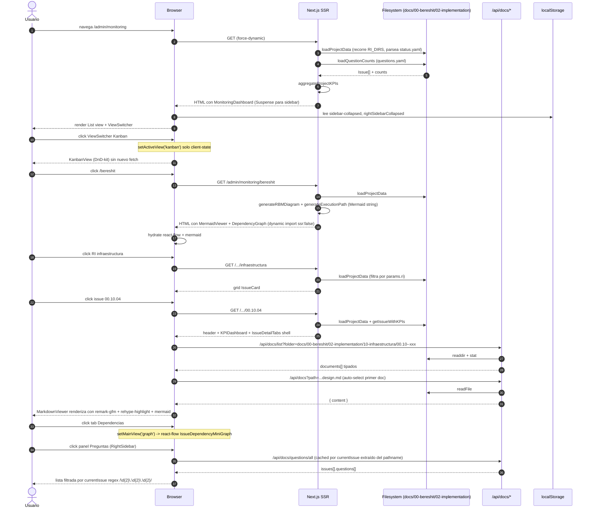
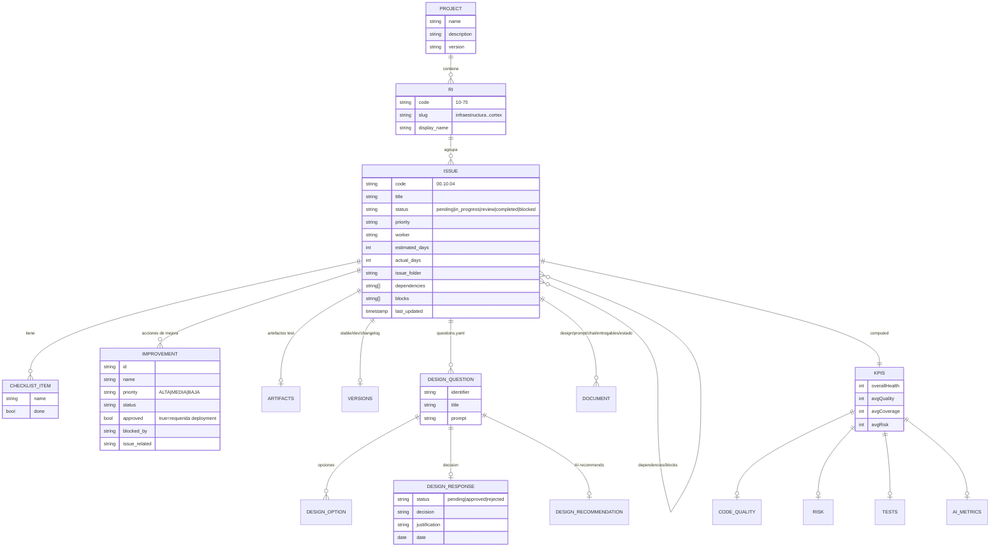

# Auditoría: Frontend `aleia-bereshit/cortex` (Monitoring)

**URL en producción**: https://aleia-bereshit-rosy.vercel.app/admin/monitoring  
**Repositorio fuente**: `C:\antigravity\aleia-bereshit\apps\cortex\src\`  
**Fecha auditoría**: 2026-04-24  
**Propósito**: punto de referencia visual y arquitectónico ("techo de calidad") para el rediseño del portal `aleia-reforma-ud`.

---

## 1. Topología de páginas

El árbol de rutas vive completo bajo `apps/cortex/src/app/admin/monitoring/`. Está montado sobre el App Router de Next 14, con `dynamic = 'force-dynamic'` en cada página (todas leen filesystem en cada request).

| Ruta | Tipo | Qué muestra | Linkea a / desde |
|---|---|---|---|
| `/admin/monitoring` | RSC + componente cliente | Dashboard maestro: StatsCards, KPIs proyecto, ViewSwitcher (List/RBM/Kanban/Graph/Mermaid/Questions). | Entra desde sidebar y Breadcrumb. Sale a `/admin/monitoring/bereshit`. |
| `/admin/monitoring/[project]` | RSC | Vista proyecto: árbol RBM (Mermaid), grafo de dependencias (react-flow), ruta de ejecución (Mermaid), tarjetas por RI con barra de progreso. | Sale a `/[project]/[ri]`. |
| `/admin/monitoring/[project]/[ri]` | RSC | Lista de issues del Resultado Intermedio: StatsCards + grid 1/2/3 col de `IssueCard`. | Sale a `/[project]/[ri]/[issue]`. |
| `/admin/monitoring/[project]/[ri]/[issue]` | RSC + tabs cliente | Detalle issue: header con metadatos, KPIs (gauge + sparklines), `IssueDetailTabs` (Documentos / Dependencias), `QuestionsSection`, Entregables, Versiones, tabla de mejoras (requeridas/diferidas). | Profundo: enlaces internos a issue.dependencies / issue.blocks. |
| `/admin/design-questions` | Client component | Vista standalone para gestión QTI-like de preguntas de diseño (dataset hardcoded en `questions-data.ts`). | Aislada de la jerarquía de monitoring. |
| `/admin/monitoring/error.tsx` | Boundary | Error UI estilizado con botón "Reintentar" + link "Volver al Dashboard". | — |
| `/admin/monitoring/layout.tsx` | RSC | Shell de tres columnas: `HierarchySidebar` (Suspense + skeleton), `Breadcrumb` + `<main>`, `RightSidebar` flotante. Toaster global. | Envuelve todas las rutas de monitoring. |

API routes en `app/api/`:

| Endpoint | Método | Propósito |
|---|---|---|
| `/api/docs?path=` | GET | Lee un archivo (md/yaml) desde el filesystem y devuelve su contenido. |
| `/api/docs/list?folder=` | GET | Lista documentos en una carpeta de issue clasificándolos por `type` (design / prompt / chat / entregables / estado / status). |
| `/api/docs/questions/all` | GET | Lee `questions.yaml` de todos los issues, agrega stats. |
| `/api/coherence/[issueCode]` | GET | Devuelve estado de coherencia computado por `lib/coherence/status-manager`. |
| `/api/observability/issues` y `.../stats` | GET | Stats Sentry (vía `@aleia-bereshit/observability`). |
| `/api/inngest` | POST | Webhook Inngest. |
| `/api/test-sentry` | GET | Endpoint de prueba. |

```mermaid
flowchart LR
  Root[/admin/monitoring/] --> Project[/admin/monitoring/bereshit]
  Project --> RI1[/.../infraestructura]
  Project --> RI2[/.../core-backend]
  Project --> RI3[/.../integraciones]
  Project --> RI4[/.../vistas]
  Project --> RI5[/.../workflows]
  Project --> RI6[/.../datos-maestros]
  Project --> RI7[/.../cortex]
  RI1 --> IssueA[/.../00.10.01]
  RI1 --> IssueB[/.../00.10.02]
  RI4 --> IssueC[/.../00.40.05]
  RI7 --> IssueD[/.../00.70.03]
  Root -. ViewSwitcher .-> RBM[Vista RBM en place]
  Root -. ViewSwitcher .-> Kanban[Vista Kanban en place]
  Root -. ViewSwitcher .-> Graph[Vista Grafo en place]
  Root -. ViewSwitcher .-> Mermaid[Vista Mermaid en place]
  Root -. ViewSwitcher .-> Q[Vista Preguntas en place]
  IssueA -.dep arrow.-> IssueB
  RightPanel[(RightSidebar Asistente: Preguntas/Chat)] -. context URL .-> IssueA
```

---

## 2. Diagrama de secuencia: Dashboard → Project → RI → Issue



---

## 3. Modelo de datos (erDiagram)



Cardinalidades clave: la relación `ISSUE -- ISSUE (dependencies/blocks)` es muchos-a-muchos auto-referenciada, codificada como dos arrays inversos en cada `status.yaml`. No hay base de datos: el grafo se reconstruye en memoria por cada request.

---

## 4. Inventario de componentes (`src/components/monitoring/`)

| Componente | Tipo | Props clave | Estado interno | Hooks externos | Deps notables | Cosa interesante que hace bien |
|---|---|---|---|---|---|---|
| `HierarchySidebar.tsx` | client | `items: HierarchyNode[]`, `onIssueSelect` | `isCollapsed`, `isMobileOpen`, `selectedIssueCode`, `useMemo(stats)` | `usePathname` | clsx, lucide | Sidebar plegable que persiste estado en localStorage, sincroniza el issue seleccionado con la URL via regex `/\d{2}\.\d{2}\.\d{2}/`, render compacto con dot indicador cuando `w-14`. |
| `RightSidebar.tsx` | client | `context: { projectName, currentIssue, currentRI }` | `isCollapsed`, `activeTab`, `messages`, `selectedQuestion`, `filterStatus` | `usePathname` | react-hot-toast, lucide | Panel derecho con tabs Preguntas/Chat, extrae currentIssue del pathname; modal in-place con overlay z-60 sobre sidebar z-40. |
| `MonitoringDashboard.tsx` | client | `data: ProjectData`, `projectKPIs` | `activeView` | — | clsx | Switch declarativo de 6 vistas sin re-fetch — todo client-side. |
| `ViewSwitcher.tsx` | client | `activeView`, `onViewChange` | `isExpanded` (tooltip) | — | lucide | Pill group con tooltip emergente; sexta opción `timeline` declarada pero `enabled:false` ("próx."). |
| `RBMView.tsx` | client | `issues: Issue[]` | `isExpanded` por nodo | `useMemo` | clsx | Árbol Impacto→Efecto→Producto recursivo con `RBMLevelNode`, KPIs por nivel, RAG aggregation desde hojas. |
| `KanbanView.tsx` | client | `issues`, `onStatusChange` | `activeId`, `localIssues` | `useSensor`, `useSensors` | @dnd-kit/core, @dnd-kit/sortable | Drag-and-drop con DragOverlay rotado 3°, optimistic update en `handleDragOver`, distance:8 para evitar drag accidental, columnas con `border-t-4` codificadas por estado. |
| `GraphView.tsx` | client | `issues` | nodos/edges via `useNodesState/useEdgesState` | `useMemo`, `useCallback` | react-flow-renderer | Custom IssueNode con progress bar interna y código RAG; minimap + controls. |
| `MermaidView.tsx` | client | `issues` | refresh trigger | `useEffect`, `useRef` | mermaid | Render dinámico de diagrama con subgraphs por RI, classDef RAG, emoji por estado, indicador `❓` cuando hay preguntas pendientes. |
| `MermaidViewer.tsx` | client | `chart: string` | render id único | `useEffect`, `useRef` | mermaid | Helper genérico para renderizar Mermaid embebido en MD. |
| `QuestionsView.tsx` | client | — | `selectedQuestion`, `filterStatus`, `searchQuery` | `useEffect`, `useMemo` | lucide | Vista QTI-inspired: card grid con border-left RAG, modal con pros/cons, AI recommendation con references. |
| `QuestionsSection.tsx` | client | `issueCode` | `questions`, `selected`, `loading` | `useEffect` | lucide | Versión embebida en página de issue, fetch a `/api/docs/questions` filtrado por issue. |
| `IssueDetailTabs.tsx` | client | `issueCode`, `issueFolder`, `dependencies`, `blocks`, `allIssues` | `documents`, `activeDocType`, `docContent`, `mainView` | `useEffect`, `useMemo` | react-flow-renderer | Doble nivel de tabs (Documentos/Dependencias y dentro Diseño/Prompt/Chat/Entregables/Estado), botón "Abrir en VSCode" con `vscode://file/...`. |
| `IssueCard.tsx` | server | `issue: Issue` | — | — | — | Card con border-left de 4px coloreado por estado, progress bar y conteo de tareas. |
| `KPIDashboard.tsx` | client | `kpis: IssueKPIs` | — | — | clsx | Score gauges SVG calculados con dasharray; código quality / risk / tests / AI metrics. |
| `KPICard.tsx` | client | `kpi: KPIData`, `size`, `showSparkline` | — | — | — | Sparkline SVG inline + delta trend icon. |
| `RAGIndicator.tsx` | client | `status`, `size`, `variant` | — | — | lucide | API uniforme para Red/Amber/Green/Gray con 4 variantes (dot/badge/icon/pill). |
| `Breadcrumb.tsx` | client | `className` | — | `usePathname` | lucide | Detecta segmentos de issue por regex y los renderiza como código mono; mapping `SEGMENT_NAMES` para slugs. |
| `MarkdownViewer.tsx` | client | `content`, `title`, `filePath`, `isModal` | `copied`, `isFullscreen` | — | react-markdown, remark-gfm, rehype-highlight | Modo modal vs inline vs fullscreen, copy-to-clipboard con feedback toast, deeplink VSCode. |
| `DependencyGraph.tsx` | client | `issues` | layout via dagre/manual | `useMemo` | react-flow-renderer | Auto-layout horizontal con flechas markerEnd:ArrowClosed. |
| `Sidebar.tsx` | client | `items: SidebarItem[]` | — | `usePathname` | — | Versión plana (precursora de HierarchySidebar). |
| `StatsCards.tsx` | server | `total`, `completed`, `inProgress`, `pending`, `blocked?` | — | — | — | Render condicional de columna "blocked" solo si > 0; grid 2→4→5 cols responsive. |
| `Skeletons.tsx` | server | — | — | — | — | `SidebarSkeleton`, `CardSkeleton`, `KPISkeleton` para Suspense fallback. |
| `DocumentLinks.tsx` | client | `links`, `issueFolder` | — | — | lucide | Botones a github/dummies/design files con iconos. |
| `ClaudeChatSidebar.tsx` | client | `context` | mensajes, isLoading | useRef | lucide | Versión más antigua del chat (consolidada en RightSidebar). |
| `ObservabilityDashboard.tsx` | client | `stats` | — | — | chart.js, react-chartjs-2 | Charts Sentry rendering. |

---

## 5. Sistemas técnicos SOTA implementados

**Routing pattern.** Catch-all jerárquico `app/admin/monitoring/[project]/[ri]/[issue]/page.tsx` con `dynamic = 'force-dynamic'` en cada nivel para reflejar cambios en filesystem sin rebuild. La jerarquía de URL es la verdad: el sidebar y el right-panel extraen el `currentIssue` del pathname con regex `/\d{2}\.\d{2}\.\d{2}/`, así que el estado "qué issue estoy viendo" no se duplica en context.

**Layout 3-columnas.** Implementado en `app/admin/monitoring/layout.tsx`. Sidebar izquierdo `<aside fixed lg:sticky w-72>` + `<main flex-1 mr-72>` (el `mr-72` reserva el espacio del RightSidebar fijo a la derecha). El layout se renderiza como server component y solo los hijos hidratables (HierarchySidebar, RightSidebar) son cliente. Sticky se logra con `sticky top-0 h-screen` y scroll independiente con `overflow-y-auto` interno.

**State management pattern.** Tres capas claras:
- *URL-first*: la ruta determina la página y el issue actual.
- *localStorage*: solo preferencias UI (`sidebar-collapsed`, `rightSidebarCollapsed`).
- *Component-local useState*: filtros, tabs activos, chat messages.
- *Sin Context global, sin Redux, sin Zustand.* Esto es deliberado y limpio.

**Data fetching.** SSR con lectura directa de filesystem (`fs.readdirSync`, `yaml.parse`) en cada request. El "single source of truth" son los `status.yaml` y `questions.yaml` distribuidos en el repo monorepo (`docs/00-bereshit/02-implementation/<RI>/<issue>/`). Las API routes solo se usan para datos cliente bajo demanda (lista de docs, contenido md, preguntas globales).

**Theming.** Tailwind con extensión de paleta de colores semánticos (`primary #3498db`, `success #27ae60`, `warning #f39c12`, `danger #e74c3c`, `info #9b59b6`, `dark #2c3e50`). El RAG (Red/Amber/Green/Gray) está reificado en `RAGIndicator` y replicado idéntico en HierarchySidebar, KPI gauges y MermaidView (classDef compartidas). Umbrales: `>= 70 green`, `>= 30 amber`, resto gray; bloqueo siempre red.

**Animaciones.** Sin librería de animación dedicada; se usa exclusivamente `transition-all`, `transition-colors`, `transition-shadow` de Tailwind con `duration-200/300`. Sparklines SVG con stroke-dasharray. Drag overlay con `rotate-3 scale-105`. Suficiente y performante.

**Responsiveness.** Breakpoints `md:` para 2 columnas, `lg:` para 3+ columnas en grids. Sidebar móvil: hamburger + overlay `bg-black/50` + `translate-x-full lg:translate-x-0`. RightSidebar no tiene comportamiento móvil dedicado (deuda).

**Performance.**
- `dynamicImport` con `ssr:false` para `DependencyGraph` y `MermaidViewer` para evitar SSR-incompatibility de react-flow y mermaid.
- `<Suspense fallback={SidebarSkeleton}>` en el layout (lectura paralela de `loadProjectData` + `loadQuestionCounts`).
- `useMemo` sobre stats agregadas y construcción de árboles RBM.
- Sin code-splitting agresivo; las vistas (Kanban, RBM, Graph, Mermaid, Questions) están en el mismo bundle.

---

## 6. Patrones UX destacables

- **Sidebar jerárquico con barra de progreso por nodo (`HierarchySidebar`).** Cada nodo muestra `code · ícono · nombre · % · barra RAG`. El árbol expande/colapsa con persistencia y resalta el path activo con `border-l-2 + bg-primary/5`. Funciona porque combina información estructural (jerarquía) y de estado (progreso/RAG) en una sola vertical sin duplicación.
- **Footer stats sticky.** Contador (completados/activos/bloqueados/pendientes) en la base del sidebar, siempre visible. Reduce la fricción de "scrolear hasta ver el dashboard total".
- **ViewSwitcher.** Pill group con 6 vistas + 1 teaser disabled. Cada vista comparte la misma data (`issues: Issue[]`) — multiplicidad de proyecciones sin re-fetch. El switch entre Lista/RBM/Kanban/Grafo/Mermaid/Preguntas es instantáneo.
- **Issue cards 3-col con código jerárquico (`IssueCard`).** Border-left coloreado por estado, código mono prominente, título grande, badge UPPERCASE, mini progress, worker tag. Densidad informativa alta sin saturación visual.
- **DetailPanel con tabs anidados (`IssueDetailTabs`).** Top-level Documentos/Dependencias; dentro de Documentos, sub-tabs Diseño/Prompt/Chat/Entregables/Estado. Botón "Abrir en VSCode" via `vscode://file/...` (genial para devs locales). Tabs sin documento se renderizan disabled grises.
- **RightSidebar Asistente.** Tabs Preguntas/Chat con icono Sparkles morado. Las Preguntas se filtran automáticamente al issue actual (extraído del pathname). Modal con overlay `z-[60]` para detalle de pregunta sin perder contexto.
- **RAG color coding pervasivo.** Mismas 4 categorías (`green/amber/red/gray`) usadas en sidebar, gauges, mermaid classDef, kanban borders, RAG indicator. La consistencia visual es absoluta. Los umbrales también son consistentes (`70/30/0`).
- **Chat con suggested prompts y Cmd-Enter.** Submit con Enter, shift+Enter newline, copy-to-clipboard por mensaje, copy feedback con check verde 2s.
- **Toast top-right.** `react-hot-toast` con tema oscuro, duración 4s, icon emerald/red.
- **Breadcrumb con regex.** Detecta códigos de issue (`XX.XX.XX`) automáticamente y los muestra mono, sin requerir mapping.

---

## 7. Detalle de cada vista

### 7.1 Vista "Lista" (default)

```
+--------------------------------------------------+
| Header: BERESHIT          [Lista|RBM|Kan|...]    |
+--------------------------------------------------+
| StatsCards: [Total][Compl][Prog][Pend][Block]    |
+--------------------------------------------------+
| KPIs Proyecto - Salud / Calidad / Cov / Riesgo   |
| Risk distribution dots LOW/MED/HIGH/CRIT         |
+--------------------------------------------------+
| Progreso General  ====== 42%                     |
+--------------------------------------------------+
| Proyectos                                        |
| > BERESHIT card                                  |
+--------------------------------------------------+
| Issues Recientes (6 cards en grid 1/2/3)         |
+--------------------------------------------------+
```

Componentes hijos: `StatsCards`, `IssueCard`. Interacciones: hover-lift en cards. Datos: `data.issues.slice(0,6)` + `projectKPIs` agregados.

### 7.2 Vista RBM

```
+--------------------------------------------------+
| Vista RBM   [Impacto·Efecto·Producto leyenda]    |
+--------------------------------------------------+
| 4 KPICard grandes con sparkline                  |
+--------------------------------------------------+
| RBM Tree (cyan border) BERESHIT 42%              |
|   |- (amber) RI1 Infraestructura 60%             |
|   |    |- 00.10.01 ... 80%                       |
|   |    |- 00.10.02 ... 30%                       |
|   |- (amber) RI2 Core Backend 45%                |
|   ...                                            |
+--------------------------------------------------+
```

Recursivo `RBMLevelNode` (depth 0-2 expandido por defecto). Border-left amber/cyan según tipo. KPIs por nodo (`KPICardCompact`).

### 7.3 Vista Kanban

```
+--------------------------------------------------+
| Vista Kanban  Arrastra para cambiar estado       |
+--------------------------------------------------+
| Pendiente | InProg | Revisión | Compl | Bloq    |
| (gris)    | (amber)| (azul)   |(emerald)|(rojo)|
| ---       | ---    | ---      | ---   | ---    |
| [card]    | [card] | [card]   |[card] |[card]  |
| [card]    | [card] |          |[card] |        |
| [card]    |        |          |       |        |
| [drop?]   | [drop?]| [drop?]  |[drop?]|[drop?] |
+--------------------------------------------------+
| {N} totales · {N} completados · {N} bloqueados   |
+--------------------------------------------------+
```

DnD-kit con sensors PointerSensor + KeyboardSensor (a11y). Activation distance 8px. DragOverlay con preview rotada 3°.

### 7.4 Vista Grafo (react-flow)

```
+--------------------------------------------------+
|                                                   |
|   [00.10.01]----->[00.10.02]                     |
|       |              |                            |
|       v              v                            |
|   [00.20.01]----->[00.40.05]----->[00.70.03]     |
|                                                   |
|   <Background dots> <Controls fit-view>          |
|   <MiniMap>                                       |
+--------------------------------------------------+
```

Nodos custom `IssueNode` con barra de progreso interna. Colores RAG. Edges con MarkerType.ArrowClosed.

### 7.5 Vista Mermaid

```
+--------------------------------------------------+
| [Refresh]                                        |
+--------------------------------------------------+
|  graph TD                                        |
|  subgraph Infraestructura 🏗️                     |
|     00.10.01[✅ "..."]  -- classDef completed    |
|     00.10.02[🔄 "..."]  -- classDef inprogress   |
|     00.10.03[❓ "..."]  -- classDef hasquestions |
|  end                                             |
|  subgraph Core Backend ⚙️ ...                    |
+--------------------------------------------------+
```

`mermaid.initialize({ securityLevel:'loose', curve:'basis' })`. Indicador `❓` overrides emoji de estado cuando hay preguntas pendientes.

### 7.6 Vista Preguntas

```
+--------------------------------------------------+
| Filter [todos/aprobado/rechazado/pend/sin resp]  |
| Search [____________]                            |
+--------------------------------------------------+
| Por issue:                                       |
|   00.10.04 - Setup CI                            |
|   |- [border-l amber] Q-001 Decisión bundler ⏳ |
|   |- [border-l green] Q-002 Pkg manager ✅      |
|   00.40.05 - ...                                 |
+--------------------------------------------------+
| (Click abre modal con pros/cons + recomendación) |
+--------------------------------------------------+
```

---

## 8. DetailPanel `/[issue]`

Estructura vertical (sin tabs en el shell; los tabs están dentro de `IssueDetailTabs`):

1. **Header compacto.** Code mono + título + badge de estado UPPERCASE; debajo, grid 4-col Worker / Días estimados / Prioridad / Progreso. Barra de progreso primary.
2. **Checklist.** Lista de chequeos con cuadros custom (✓ verde si done, gris border si no) + line-through al estar done.
3. **`KPIDashboard`.** Score gauges SVG circulares para Comprehensibility / Maintainability / Efficiency, panel de Risk, panel de Tests (coverage), panel de AI metrics (sessions, success rate, lines).
4. **`IssueDetailTabs`** — el corazón del DetailPanel:
   - **Tab "Documentos"** (sub-tabs Diseño / Prompt / Chat / Entregables / Estado). Llama `/api/docs/list?folder=…` para detectar qué docs existen, auto-selecciona el primero, `/api/docs?path=…` para leer contenido, render con `MarkdownViewer` (remark-gfm, rehype-highlight, mermaid embed). Botón externo "Abrir en VSCode".
   - **Tab "Dependencias"**. Mini grafo react-flow con dependencies arriba (gris arrow), issue actual al centro (border indigo 3px), blocks abajo (red arrow). Listas a los lados con links a otros issues.
5. **`QuestionsSection`.** Fetch a `/api/docs/questions/all` filtrado por issueCode. Cards con border-left RAG, modal con opciones / pros / cons / recomendación / referencias externas / decisión registrada.
6. **Entregables & Tests**. Mocks ready / tests passing / coverage % / link a PR Github.
7. **Versiones**. Stable / Development / Changelog (links externos).
8. **Acciones de Mejora.** Tabla compacta con 6 columnas (`ID / Mejora / Tipo / Estado / Bloqueado por / Commit`). Separación visual entre `requeridas` (`approved=true`) y `diferidas` (`approved=false`, `opacity-75`). Footer con los 5 contadores y barra de progreso del numerador "completed/required".

---

## 9. Brechas y deuda

- **Mobile.** El RightSidebar no tiene modo móvil — siempre fija ocupando 288px o colapsada a 0px. En pantalla pequeña la `<main>` tiene `mr-72` hardcoded en el layout (no responsive). El HierarchySidebar sí tiene hamburger + overlay, pero el grafo react-flow y los Mermaid grandes no son legibles en mobile.
- **Accesibilidad.** Algunos puntos buenos (`aria-label` en menús, `<nav aria-label="Breadcrumb">`, KeyboardSensor en DnD). Faltantes: contraste insuficiente en algunos badges (`text-amber-700` sobre `bg-amber-50`), modales sin focus trap, sin `role="dialog"` ni `aria-modal`, drag-and-drop sin instrucciones para lectores de pantalla, animaciones sin `prefers-reduced-motion`.
- **Performance.**
  - `loadProjectData()` se ejecuta en cada request (también en sub-rutas: project/[ri]/[issue] cargan TODOS los issues, no solo los suyos). No hay memoización ni cache layer.
  - `force-dynamic` desactiva ISR; en producción, cada navegación es una lectura completa de filesystem. Funciona porque Vercel monta el repo, pero para un sitio público sería caro.
  - El bundle cliente incluye chart.js + react-flow + mermaid + monaco-editor + react-markdown a la vez en MonitoringDashboard. Sin route-based code splitting agresivo.
- **Hardcoded.**
  - Cadena `'bereshit'` repetida en URLs (`/admin/monitoring/bereshit/...`), en `RI_DIRS` (paths `10-infraestructura..70-cortex`), en el deeplink VSCode (`vscode://file/c:/proyectos/aleia-bereshit${path}`), en URL Github PR (`github.com/aleia/bereshit/pull/...`), en `RightSidebar` con `projectName: 'BERESHIT'`.
  - El layout asume el proyecto es BERESHIT y muestra "Dashboard RBM" fijo.
  - Mapping de RI (slug ↔ display name ↔ folder prefix) duplicado en al menos 5 archivos (`monitoring.ts`, `[project]/page.tsx`, `[ri]/page.tsx`, `RBMView.tsx`, `MermaidView.tsx`, `Breadcrumb.tsx`).
- **Sin tests.** No hay carpeta `__tests__`, ni `*.test.ts(x)`, ni Playwright/Cypress visibles. No hay snapshot tests para los renderers críticos (Mermaid, RBM tree, KPI gauges).
- **Sin i18n.** Strings hardcoded en español ("En Progreso", "Bloqueado", "Pendiente", "Asistente", "Preguntas"). El `RAGIndicator` tiene `label` y `labelEs` como hint, pero nadie llama el `label` en inglés.
- **Chat es mock.** `ChatPanel.handleSubmit` hace `setTimeout(1500)` y devuelve respuesta de demostración hardcoded. No hay backend de IA real.
- **Sin loading states explícitos** en el DetailPanel cuando se cambia de tab; `isLoadingContent` solo afecta el área central.
- **Decisiones (DesignResponse) son read-only.** El componente `QuestionsView` permite ver pero la persistencia de aprobaciones en `/admin/design-questions` es solo `useState` local; al refrescar se pierde.
- **Diferencias UI entre `QuestionsSection` (página issue), `QuestionsView` (vista global), `RightSidebar/QuestionsPanel`** — tres reimplementaciones del mismo concepto con divergencias menores.

---

## 10. Plan de adaptación a `aleia-reforma-ud`

| Acción | Item | Path origen / detalle |
|---|---|---|
| **COPIAR** | `RAGIndicator.tsx` | `apps/cortex/src/components/monitoring/RAGIndicator.tsx`. API limpia, 4 variantes, semánticamente perfecto. |
| **COPIAR** | `Breadcrumb.tsx` | `apps/cortex/src/components/monitoring/Breadcrumb.tsx`. Solo cambiar `SEGMENT_NAMES` y la regex del último segmento. |
| **COPIAR** | `Skeletons.tsx` | `apps/cortex/src/components/monitoring/Skeletons.tsx`. Útil para Suspense fallbacks. |
| **COPIAR** | Patrón de `dynamic = 'force-dynamic'` + `Promise.all([loadX, loadY])` en layout | `apps/cortex/src/app/admin/monitoring/layout.tsx`. |
| **COPIAR** | Estructura de tabs en `IssueDetailTabs` (Documentos/Dependencias con sub-tabs por tipo) | `apps/cortex/src/components/monitoring/IssueDetailTabs.tsx` lines 268-490. |
| **COPIAR** | El patrón "URL es la verdad" + regex extractor para currentItem en sidebars | Líneas 545 RightSidebar y 346-358 HierarchySidebar. |
| **ADAPTAR** | `HierarchySidebar.tsx` | Generalizar `HierarchyNode.type` de `'project'\|'ri'\|'issue'` a `'biblioteca'\|'estante'\|'unidad'\|'documento'` (o el dominio de reforma-ud). Eliminar el código RAG hardcoded a 70/30. Permitir `code` opcional. |
| **ADAPTAR** | `RightSidebar.tsx` (Asistente) | Extender de 2 tabs (Preguntas/Chat) a N tabs (Citas, Glosario, Métricas, Asistente). El regex `currentIssue` debe hacerse pluggable por sección. |
| **ADAPTAR** | `MonitoringDashboard.tsx` + `ViewSwitcher.tsx` | Renombrar vistas (`list/rbm/kanban/graph/mermaid/questions`) al dominio (`lista/jerarquía/grafo-conocimiento/timeline/preguntas`). Reusar el patrón del switch declarativo. |
| **ADAPTAR** | `MarkdownViewer.tsx` | Mantener remark-gfm + rehype-highlight + mermaid. Extender para soportar callouts personalizados, footnotes y citas APA inline (el sitio reforma-ud necesita prohibición de wikilinks pero requiere refs externas APA). |
| **ADAPTAR** | API `/api/docs/list` + `/api/docs` | Filtrar por extensiones soportadas en reforma-ud, validar paths con allow-list. El `vscode://file/...` deeplink es opcional. |
| **REEMPLAZAR** | Lectura filesystem `loadProjectData` | reforma-ud usa Drizzle/Prisma + Postgres + embeddings (pgvector). Reemplazar `fs.readdirSync` por queries. Mantener la firma `Promise<ProjectData|null>` para no tocar componentes. |
| **REEMPLAZAR** | `force-dynamic` + filesystem | Usar `revalidate=60` o on-demand revalidation con webhooks de cambio de contenido (CMS / git push). Cache layer con `unstable_cache` o React `cache()`. |
| **REEMPLAZAR** | `react-flow-renderer` (deprecated) | Migrar a `@xyflow/react` (rebrand activo). |
| **REEMPLAZAR** | Toast `react-hot-toast` | Aceptable, pero considerar `sonner` (más moderno, mejor a11y). |
| **REEMPLAZAR** | Mock chat | Integrar Anthropic SDK con prompt-caching, contexto inyectado del item actual + estantes relevantes. |
| **REEMPLAZAR** | Mapping RI duplicado en 5 archivos | Centralizar en un único `lib/taxonomy.ts` con tipo discriminated union. |
| **EXTENDER** | Biblioteca / estantes / módulos (ontología reforma-ud) | Añadir nivel jerárquico extra: `Biblioteca > Estante > Tomo > Sección > Item`. La estructura recursiva de `HierarchyNode` y `RBMLevelNode` ya soporta arbitraria profundidad. |
| **EXTENDER** | Búsqueda semántica | Sidebar global con campo de búsqueda → embeddings query a pgvector → resultados con RAG indicators. No existe en bereshit. |
| **EXTENDER** | Citaciones APA enforced | Pre-commit hook + CI check que valide que cada concepto en M01-M12 tiene citación externa APA y no hay wikilinks ni rutas internas. |
| **EXTENDER** | Vista timeline (la `enabled:false` en bereshit) | Implementar Gantt simplificado con `vis-timeline` o `frappe-gantt`. |
| **EXTENDER** | Persistencia real de DesignQuestion responses | API mutation + auditoría (quién aprobó, cuándo, justificación). En bereshit es solo `useState`. |
| **EXTENDER** | Tests | Vitest unit + Playwright e2e cubriendo Sidebar (expand/collapse/persist), ViewSwitcher (cambios sin re-fetch), DnD Kanban (drag accept/cancel), MarkdownViewer (xss-safe). |
| **EXTENDER** | i18n | next-intl con catálogos es/en (los users esperados son hispanos pero el sitio académico requiere abstracts en inglés). |
| **EXTENDER** | a11y | Focus trap en modales, `prefers-reduced-motion`, anuncios ARIA en DnD, contraste auditado WCAG AA. |
| **EXTENDER** | Mobile | Right-sidebar como bottom-sheet en `< lg`, `<main>` sin `mr-72` fijo (usar grid responsive). |

---

## 11. Captura textual ASCII de los layouts principales

### 11.1 Layout global (`/admin/monitoring/*`)

```
+----------+----------------------------------------+----------+
| HierSide | Header: Breadcrumb · Dashboard RBM    |  Right   |
| -------  | --------------------------------------|  Sidebar |
| Logo     | <main> contenido página              |          |
| Progress | ...                                   |  Tabs:   |
| 42%====  | ...                                   |  Pregs   |
|          | ...                                   |  Chat    |
| Dashbrd  |                                       |          |
| > BER    |                                       |          |
|   > RI1  |                                       |          |
|     >00..|                                       |          |
|   > RI2  |                                       |          |
|   ...    |                                       |          |
|          |                                       |          |
| -------  | --------------------------------------|          |
| Footer:  | Footer: v2.0 - KPIs IA               |          |
| 12 ✓ 3 ⏳|                                       |          |
| 0 ✗ 2 .. |                                       |          |
+----------+----------------------------------------+----------+
   w-72                  flex-1                       w-72
   (collapsible w-14)                                 (toggleable w-0)
```

### 11.2 Dashboard `/admin/monitoring`

```
+---------------------------------------------------------------+
| BERESHIT (h2)         [Lista|RBM|Kan|Graph|Merm|Pregs|...]   |
| Plataforma de Gestión Educativa                              |
+---------------------------------------------------------------+
| [Total 47][Compl 12][Prog 8][Pend 25][Bloq 2]                |
+---------------------------------------------------------------+
| KPIs - Desarrollo con IA                                     |
| [Salud 65%][Calidad 70%][Coverage 45%][Riesgo 35]            |
| LOW 30  MEDIUM 12  HIGH 4  CRITICAL 1                        |
+---------------------------------------------------------------+
| Progreso General  [=========·············] 42%               |
| 120/280 días estimados                                       |
+---------------------------------------------------------------+
| Proyectos                                                    |
|  +- BERESHIT > Plataforma...                                 |
|     12 completados · 8 en progreso · 25 pendientes           |
+---------------------------------------------------------------+
| Issues Recientes (6 IssueCard cards en grid)                 |
+---------------------------------------------------------------+
```

### 11.3 Issue page `/admin/monitoring/bereshit/RI/00.XX.YY`

```
+---------------------------------------------------------------+
| 00.10.04  Setup CI/CD pipeline       [BLOQUEADO badge]       |
| Descripción del issue...                                     |
| [Worker claude-code][Días 5d][Prioridad ALTA][Prog 60%]      |
| [================------------] 60%                           |
| Checklist (6/10):                                            |
|  [✓] Configurar GitHub Actions                               |
|  [✓] Definir matriz de versiones                             |
|  [ ] Cache de dependencias  ...                              |
+---------------------------------------------------------------+
| KPI Dashboard (gauges SVG circulares + sparklines)           |
+---------------------------------------------------------------+
| [Documentos | Dependencias]            <Open VSCode>         |
| [Diseño|Prompt|Chat|Entregables|Estado]                      |
| <MarkdownViewer> contenido renderizado                       |
+---------------------------------------------------------------+
| Preguntas de Diseño (cards + modal)                          |
+---------------------------------------------------------------+
| Entregables & Tests        |  Versiones                       |
| Mocks Ready: Sí            |  Estable: v1.2.0                 |
| Tests Passing: No          |  Develop: v1.3.0-beta            |
| Coverage: 45%              |  Changelog: ↗                    |
| PR: #42 ↗                  |                                  |
+---------------------------------------------------------------+
| Acciones de Mejora (4 requeridas, 3 diferidas)               |
| [Resumen 5 contadores + barra]                               |
| Tabla Requeridas: ID|Mejora|Tipo|Estado|Bloq|Commit          |
| Tabla Diferidas: ID|Mejora|Estado|Razón                      |
+---------------------------------------------------------------+
```

### 11.4 RightSidebar (panel derecho)

```
+--------------------+
| ⭐ Asistente        |
+--------------------+
| [Pregs] [Chat]     |
+--------------------+
|  47 preguntas | 12 |
|  pendientes        |
|  Filter: [todos v] |
+--------------------+
|  00.10.04 - CI     |
|  [|amber] Q-001    |
|     Bundler choice |
|     ⏳ Pendiente   |
|  [|green] Q-002    |
|     PM choice ✅   |
|                    |
|  00.40.05 - ...    |
|  [|red] Q-001 ❌   |
+--------------------+
```

---

**Síntesis para reforma-ud.** El frontend `bereshit/cortex` brilla por: (1) jerarquía URL-driven sin estado global redundante, (2) consistencia RAG total entre todas las vistas, (3) ViewSwitcher como switch declarativo de proyecciones sobre la misma data, (4) sidebars colapsables persistidas con localStorage, (5) tabs anidados en el detail panel con auto-selección de primer documento disponible, (6) lectura directa de filesystem como SSOT (escalará si se reemplaza por DB manteniendo la firma `loadX`). Los puntos a superar son: i18n, mobile, a11y, tests, persistencia real de decisiones, búsqueda semántica, taxonomía centralizada, y desacoplar la cadena hardcoded `bereshit`.
