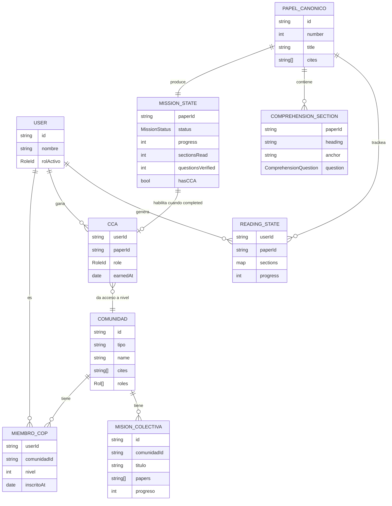
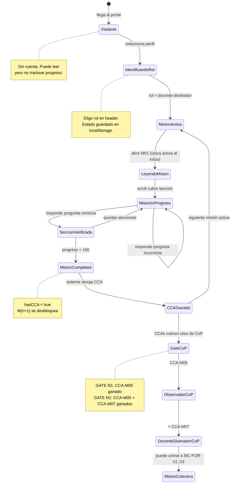
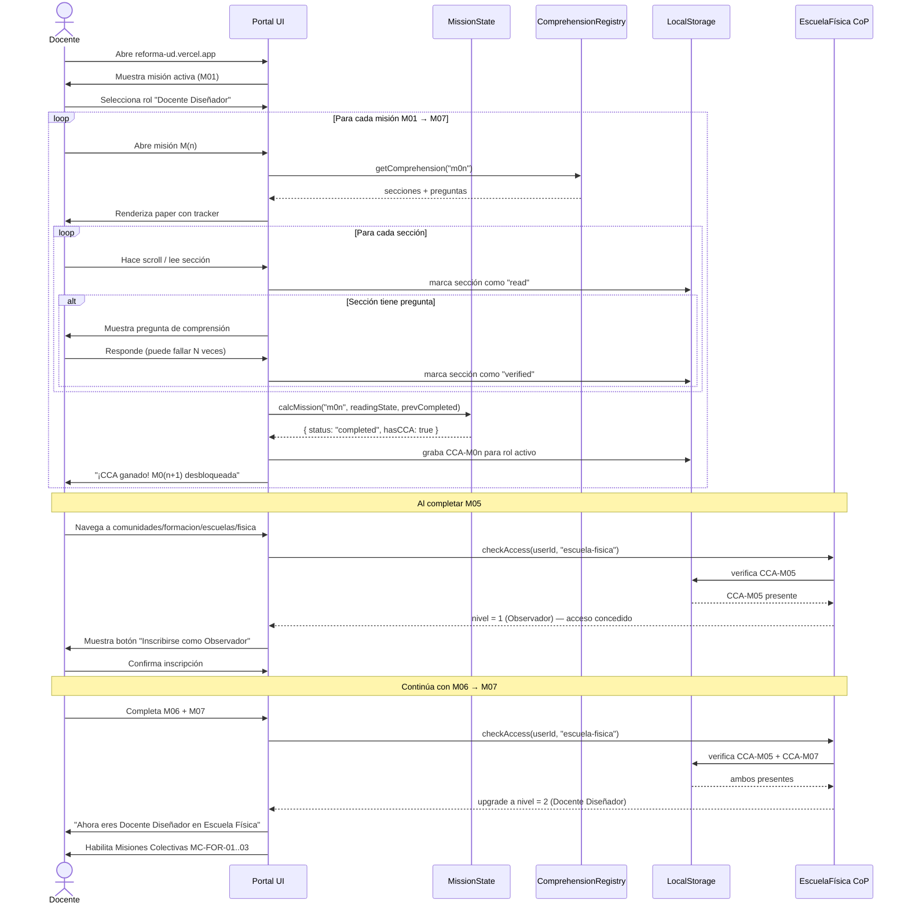

# AUDIT · Flujo completo de inscripción a CoP · Docente → Escuela Física

> **Propósito.** Modelo de dominio, state machine y spec de implementación para el flujo completo que lleva a un docente desde el portal (sin ningún avance) hasta estar inscrito como miembro activo en la CoP **Escuela de Física – Emprendedora Transformativa** con nivel **Docente Diseñador** (N2).

---

## 0 · TL;DR

- **Bloqueador inmediato:** M01 no tiene preguntas de comprensión → docente completa 70% de progreso (lectura) pero no puede alcanzar 100% → misión nunca `completed` → M02 bloqueado → flujo roto.
- **Fix immediato:** agregar `M01_COMPREHENSION` a `src/lib/comprehension.ts` (spec en §5).
- **Flujo completo:** 5 estados del docente, 2 gates de acceso a la CoP.
- **Requisitos de acceso Escuela Física:**
  - Nivel 1 Observador → CCA de M05 ganado.
  - Nivel 2 Docente Diseñador → CCA de M05 **y** M07 ganados.
- **Papers mínimos para N2:** M01 → M02 → M03 → M04 → M05 → M06 → M07 (secuencial).
- **Misiones colectivas** se habilitan al alcanzar N1.

---

## 1 · Entidades del dominio



---

## 2 · State machine · Docente en el portal



---

## 3 · Secuencia · "Inscribirse a Escuela Física como Docente Diseñador"



---

## 4 · Mapa Papers → Gate de acceso CoP

### 4.1 Escuela Física

| Paper | Contenido clave | Gate que abre |
|---|---|---|
| M01 | Cadena normativa — por qué la reforma es mandato | Desbloquea M02 |
| M02 | (pendiente de revisar) | Desbloquea M03 |
| M03 | Benchmark OECD Education 2030 | Desbloquea M04 |
| M04 | JTBD · 6 roles de la comunidad | Desbloquea M05 |
| **M05** | **Escuela Emprendedora Transformativa · CABA** | **GATE N1 Escuela Física → Observador** |
| M06 | Benchmark CCA en 21 IES | Desbloquea M07 (+ VR Formación N1) |
| **M07** | BPAs activadoras | **GATE N2 Escuela Física → Docente Diseñador** |

### 4.2 Acceso por nivel

```
Nivel 1 · Observador         → CCA-M05 ✓
Nivel 2 · Docente Diseñador  → CCA-M05 ✓ + CCA-M07 ✓
Nivel 3 · Líder Académico    → nivel 2 + participar en MC-FOR activa (pendiente diseño)
Nivel 4 · Mentor Formativo   → nivel 3 + propuesta aprobada (pendiente diseño)
```

### 4.3 VR Formación (comunidad padre)

| Paper | Gate |
|---|---|
| M01 | N1 Observador |
| M04 | Permanece en N1 (confirma comprensión de roles) |
| M06 | N2 Docente Diseñador VR Formación |

---

## 5 · Spec de implementación · M01 comprehension (desbloqueador inmediato)

### 5.1 Agregar `M01_COMPREHENSION` a `src/lib/comprehension.ts`

El archivo a editar: `apps/portal-next/src/lib/comprehension.ts`

Agregar antes del `COMPREHENSION_REGISTRY`:

```ts
export const M01_COMPREHENSION: DocumentComprehension = {
  docId: 'm01',
  title: 'M01 — Mandato Normativo',
  sections: [
    {
      heading: '§2.1 · Tres marcos de política de innovación',
      anchor: '21-tres-marcos-para-la-política-de-innovación-schot--steinmueller-2018',
      summary: 'Schot & Steinmueller (2018) describen tres frames históricos: R&D, Sistemas de Innovación y Cambio Transformativo (Frame 3).',
      question: {
        prompt: '¿Cuál es la diferencia central entre Frame 2 (Sistemas de Innovación) y Frame 3 (Cambio Transformativo)?',
        options: [
          'Frame 2 financia I+D; Frame 3 conecta empresas y universidades',
          'Frame 2 pregunta cómo conectar actores; Frame 3 pregunta hacia dónde dirigir la innovación',
          'Frame 2 es público; Frame 3 es privado',
          'Frame 2 aplica a Colombia; Frame 3 solo aplica a Europa',
        ],
        correctIndex: 1,
        explain: 'Frame 3 añade la pregunta de direccionalidad: la innovación debe orientarse hacia transformaciones sociotécnicas (pobreza, injusticia, insostenibilidad) — no solo crecer económicamente (Frame 2).',
      },
    },
    {
      heading: '§4.4 · CONPES 4069 — Adopción de Frame 3 en Colombia',
      anchor: '44-conpes-40692021-política-nacional-cti-adopción-formal-de-frame-3',
      summary: 'El CONPES 4069/2021 adopta formalmente Frame 3 como paradigma rector de la Política Nacional CTI en Colombia.',
      question: {
        prompt: '¿Qué instrumento de política pública colombiana adopta formalmente el Frame 3 de Schot & Steinmueller como paradigma rector de la CTI nacional?',
        options: [
          'Ley 30 de 1992',
          'Constitución Política Art. 69',
          'CONPES 4069 / 2021',
          'PIIOM 2022-2026',
        ],
        correctIndex: 2,
        explain: 'El CONPES 4069/2021 es la Política Nacional de Ciencia, Tecnología e Innovación que adopta explícitamente Frame 3, estableciendo misiones transformativas como eje de la CTI colombiana.',
      },
    },
    {
      heading: '§2.3 · Autonomía universitaria como instrumento',
      anchor: '23-jerarquía-normativa-multinivel-co-la-autonomía-como-instrumento',
      summary: 'La autonomía universitaria (Art. 69 CP) no es absoluta: es funcional e instrumental al cumplimiento de los deberes constitucionales.',
      question: {
        prompt: 'Según §01, la autonomía universitaria del Art. 69 de la Constitución Política de Colombia es:',
        options: [
          'Un derecho absoluto que protege a la universidad de cualquier política del Estado',
          'Una capacidad instrumental orientada al cumplimiento de los deberes constitucionales de la universidad pública',
          'Una garantía que aplica solo a universidades privadas',
          'Un principio decorativo sin consecuencias jurídicas prácticas',
        ],
        correctIndex: 1,
        explain: '§2.3 y §4.2 argumentan que la autonomía es funcional e instrumental: limita la interferencia política arbitraria pero no exime a la UDFJC de cumplir el marco normativo superior (CONPES 4069, PIIOM, Ley 30).',
      },
    },
    {
      heading: '§4.6 · PIIOM 2022-2026 — Las 5 Misiones Transformativas',
      anchor: '46-piiom-2022-2026-las-5-misiones-transformativas-como-mandato-operativo',
      summary: 'El PIIOM establece 5 misiones transformativas como mandato operativo para las IES públicas colombianas.',
      question: {
        prompt: '¿Qué establece el PIIOM 2022-2026 para las IES públicas colombianas?',
        options: [
          'Un ranking de universidades por productividad investigativa',
          'Cinco misiones transformativas como mandato operativo de acción',
          'Un sistema de acreditación internacional voluntario',
          'Criterios de distribución presupuestal entre facultades',
        ],
        correctIndex: 1,
        explain: 'El Plan Integral de Innovación, Orden y Modernización (PIIOM) 2022-2026 operacionaliza el CONPES 4069 estableciendo 5 misiones transformativas concretas que las IES públicas deben implementar.',
      },
    },
  ],
};
```

Agregar al registry:

```ts
export const COMPREHENSION_REGISTRY: Record<string, DocumentComprehension> = {
  m01: M01_COMPREHENSION,   // ← NUEVO
  m04: M04_COMPREHENSION,
  m05: M05_COMPREHENSION,
  'comunidades/formacion/escuelas/fisica/principios-escuela-emprendedora': PRINCIPIOS_ESCUELA_EMP,
};
```

> **Nota sobre anchors:** los anchors son generados por `rehype-slug`. Si el portal renderiza los headings con un formato distinto, verificar en dev con `Inspect Element` → copiar el `id` del `<h3>` correspondiente. Los anchors arriba son aproximaciones basadas en el texto del heading y deben validarse contra el render real.

---

## 6 · Spec de acceso CoP · `checkCoPAccess` (pendiente de implementar)

Actualmente el portal NO tiene lógica que verifique CCAs antes de mostrar el botón de inscripción. Esto es lo que necesita implementarse en `src/lib/`:

```ts
// src/lib/cop-access.ts  (NUEVO)

import type { RoleId } from '@/lib/ui-state';

type CoPGate = {
  comunidadId: string;
  niveles: {
    nivel: number;
    nombre: string;
    requiredCCAs: string[];    // paperId[] que deben tener hasCCA=true
    requiredMCs?: string[];    // misiones colectivas completadas (fase posterior)
  }[];
};

export const COP_GATES: CoPGate[] = [
  {
    comunidadId: 'comunidades/formacion/escuelas/fisica',
    niveles: [
      { nivel: 1, nombre: 'Observador',          requiredCCAs: ['m05'] },
      { nivel: 2, nombre: 'Docente Diseñador',   requiredCCAs: ['m05', 'm07'] },
      { nivel: 3, nombre: 'Líder Académico',     requiredCCAs: ['m05', 'm07', 'm06'] },
    ],
  },
  {
    comunidadId: 'comunidades/formacion',
    niveles: [
      { nivel: 1, nombre: 'Observador',          requiredCCAs: ['m01'] },
      { nivel: 2, nombre: 'Docente Diseñador',   requiredCCAs: ['m01', 'm04', 'm06'] },
    ],
  },
];

/** Dado un set de CCAs ganados, retorna el nivel máximo alcanzado en la CoP. */
export function calcCoPLevel(
  comunidadId: string,
  earnedCCAs: string[]    // paperId[] con hasCCA=true
): { nivel: number; nombre: string } | null {
  const gate = COP_GATES.find((g) => g.comunidadId === comunidadId);
  if (!gate) return null;

  const alcanzados = gate.niveles
    .filter((n) => n.requiredCCAs.every((p) => earnedCCAs.includes(p)))
    .sort((a, b) => b.nivel - a.nivel);

  return alcanzados[0] ?? null;
}
```

---

## 7 · Pantalla de inscripción CoP · spec UI

### 7.1 Donde aparece el CTA

En la página `/comunidades/formacion/escuelas/fisica` (route actual `[[...slug]]`), agregar una sección **antes** de las misiones colectivas:

```
┌─────────────────────────────────────────────────────┐
│  🏫 Tu acceso a Escuela Física                      │
│                                                     │
│  ✅ CCA-M05 ganado · Escuela Emprendedora           │
│  ❌ CCA-M07 pendiente · BPAs activadoras            │
│                                                     │
│  Nivel alcanzable: 1 – Observador                   │
│  [Inscribirme como Observador]                      │
│                                                     │
│  Para Docente Diseñador: completa M07 primero.      │
└─────────────────────────────────────────────────────┘
```

### 7.2 Componente `<CoPAccessPanel />`

```tsx
// src/components/comunidad/cop-access-panel.tsx

type Props = {
  comunidadId: string;
  gates: CoPGate;
  earnedCCAs: string[];
  currentLevel?: number;
  onEnroll: (nivel: number) => void;
};
```

Usa `calcCoPLevel(comunidadId, earnedCCAs)` para mostrar:
- CCAs ganados (check verde) vs pendientes (x roja)
- Nivel máximo alcanzable
- CTA "Inscribirme como {nombre}"
- Siguiente CCA a ganar para subir de nivel

---

## 8 · Plan de implementación · 3 pasos inmediatos

### Paso 1 · M01 comprehension (hoy · 30 min)

Editar `src/lib/comprehension.ts`:
1. Agregar `M01_COMPREHENSION` con 4 preguntas (§5.1 de este doc).
2. Agregar `m01: M01_COMPREHENSION` al registry.
3. `pnpm dev` → navegar a `/mision/m01` → verificar anchors con inspect element → ajustar si difieren.
4. Completar M01 completo como smoke test.

### Paso 2 · cop-access.ts (sprint actual · 2h)

1. Crear `src/lib/cop-access.ts` con `COP_GATES` y `calcCoPLevel`.
2. Crear `src/components/comunidad/cop-access-panel.tsx`.
3. Integrar en la página `/comunidades/formacion/escuelas/fisica/index`.
4. Test: con CCA-M05 mockeado → muestra nivel Observador + CTA.

### Paso 3 · Completar M06 y M07 comprehension (sprint siguiente)

Los papers M07 necesitan las mismas preguntas. Repetir el proceso de §5.1 para:
- `M07_COMPREHENSION` (BPAs activadoras) → Gate N2 Escuela Física.
- `M06_COMPREHENSION` (Benchmark CCA) → Gate N2 VR Formación.

---

## 9 · Gaps abiertos para fases posteriores

| Gap | Descripción | Prioridad |
|---|---|---|
| Persistencia de CCAs server-side | Hoy CCAs en localStorage → se pierde al cambiar dispositivo | P1 post-MVP |
| M02, M03, M06, M07-M12 comprehension | Solo M01, M04, M05 tienen preguntas | P1 por misión |
| Misiones colectivas como gate N3 | MC-FOR-01/02/03 deben tener criterio de participación | P2 |
| Notificación de upgrade de nivel | Docente recibe aviso cuando sube de N1 a N2 | P2 |
| Admin: ver miembros inscritos por nivel | Panel de comunidad con tabla de miembros | P3 |
| Inscripción formal con email/notificación | Hoy es solo estado local | P3 |

---

> **Versión:** 1.0.0 · 2026-04-28
> **Estado:** READY-TO-BUILD · Paso 1 se puede ejecutar ahora mismo
