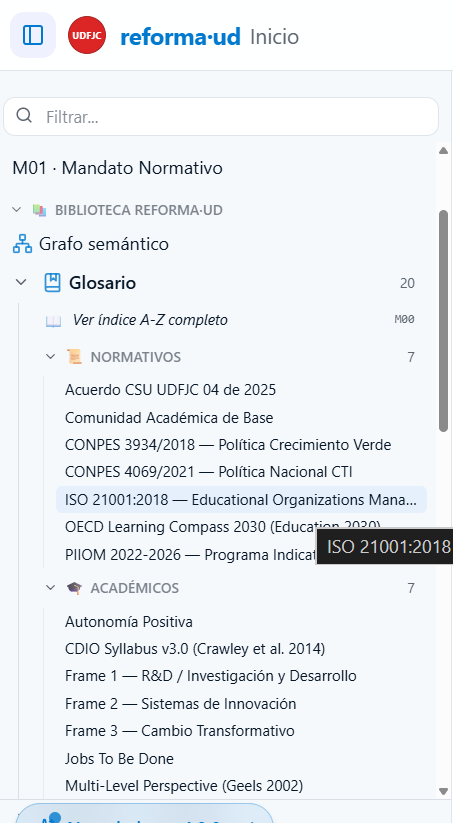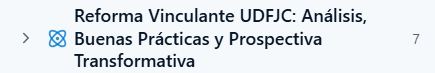---
kd_id: audit/v8f-serious-games-sota
kd_version: 2.0.0
kd_date: 2026-04-30
kd_status: ACTIVE
kd_doc_type: AUDIT + SPEC + ROADMAP
kd_title: v8f · Serious Games Framework RPG para Construcción Colaborativa de Documentos Fundantes
---

# AUDIT v8f · Serious Games Framework RPG: Construcción Colaborativa de Documentos Fundantes

> **Propósito:** Modelar la participación en la reforma UDFJC como un **RPG (Role-Playing Game) institucional** donde cada miembro progresa desde "Visitante" hasta "Director de Escuela" mediante misiones, exámenes, contribuciones y co-creación. El grafo de conocimiento se convierte en un **mapa de colonización** visual.

---

## Convenciones

- **RPG = Role-Playing Game institucional** — no es un juego de fantasía, es un sistema de roles reales
- **Todo el estado** se modela en frontmatter markdown (Obsidian-native)
- **Diagramas en Mermaid** — erDiagram, sequenceDiagram, flowchart, stateDiagram
- **Tracabilidad:** URLs verificables para cada framework

---

# PARTE I · MODELO DE ENTIDADES (ER Diagram)

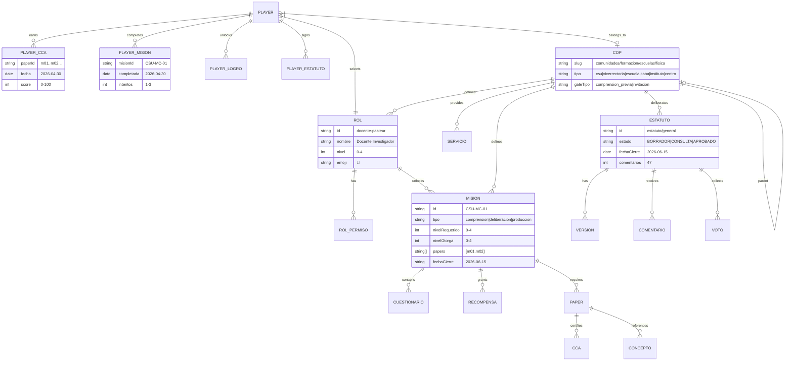

---

# PARTE II · FRAMEWORKS TEÓRICOS

## 2.1 MDA Framework (Mechanics-Dynamics-Aesthetics)

**Fuente:** Hunicke, R., LeBlanc, M., & Zubek, R. (2004). http://www.cs.northwestern.edu/~hunicke/MDA.pdf

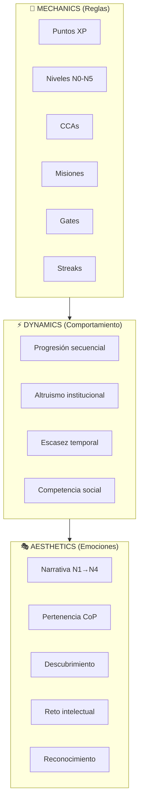

## 2.2 Octalysis — 8 Core Drives

**Fuente:** Chou, Y. (2015). https://yukaichou.com/gamification-book/

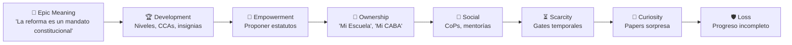

---

# PARTE III · PROGRESIÓN DE CARRERA (State Diagram)

## 3.1 Flujo General: Visitante → Director de Escuela

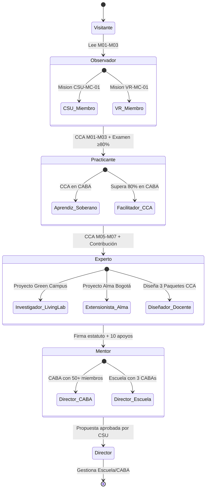

## 3.2 Flujo Específico: Habilitar una CABA

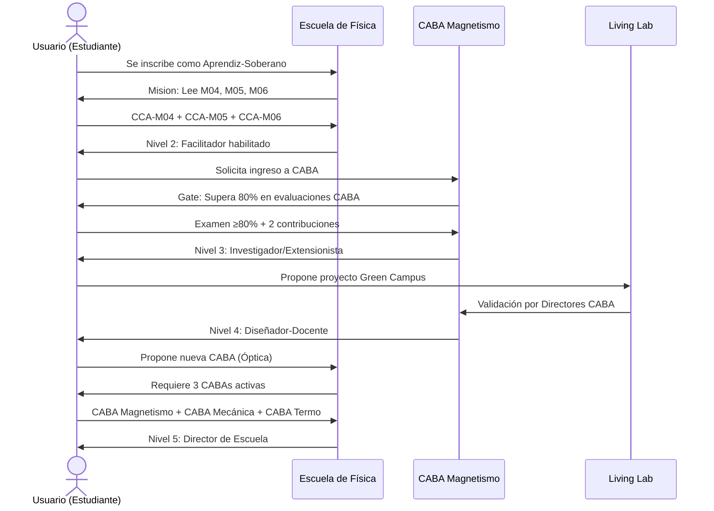

## 3.3 Flujo: Habilitar un Instituto

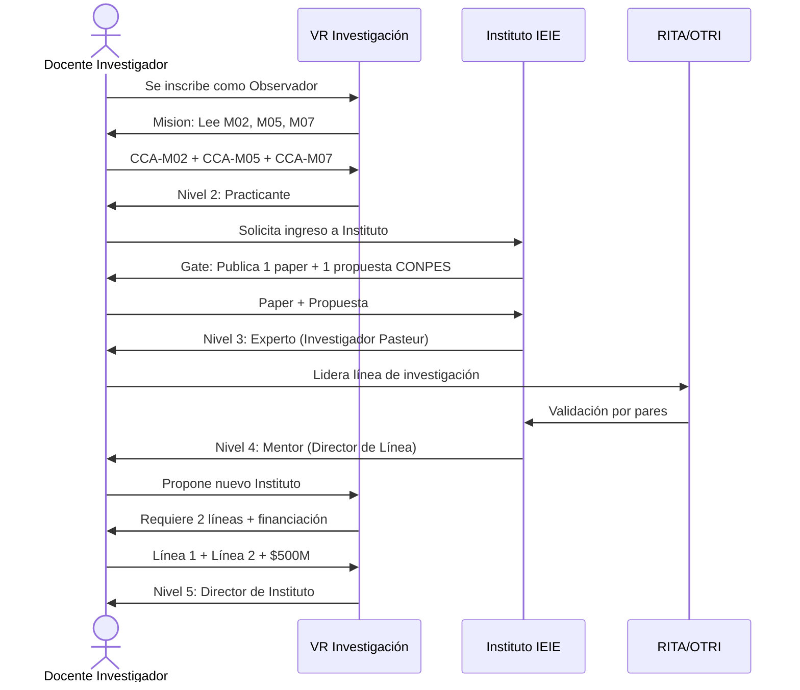

## 3.4 Flujo: Habilitar un Centro de Extensión

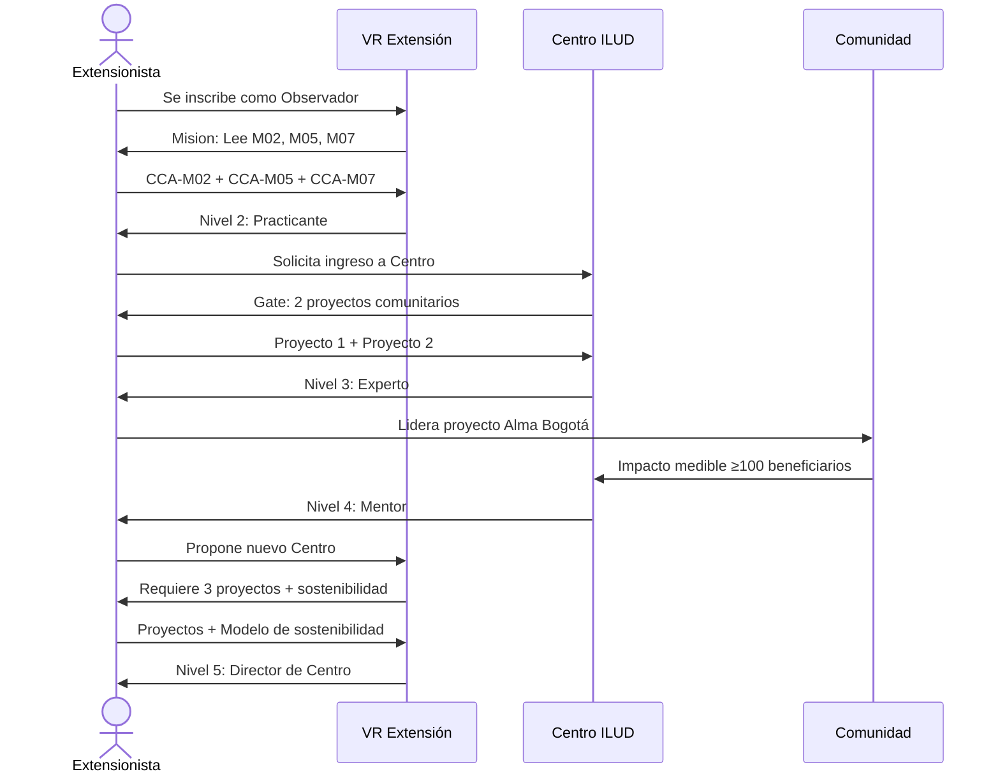

---

# PARTE IV · SISTEMA DE RETOS

## 4.1 Tipos de Retos

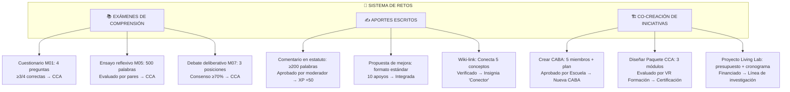

## 4.2 Matriz de Retos por Rol

| Reto | Estudiante | Docente | Director | Investigador | Extensionista |
|---|---|---|---|---|---|
| **Examen M01-M03** | ✅ Obligatorio | ✅ Obligatorio | ✅ Obligatorio | ✅ Obligatorio | ✅ Obligatorio |
| **Examen M05-M07** | ⚠️ Opcional | ✅ Obligatorio | ✅ Obligatorio | ✅ Obligatorio | ✅ Obligatorio |
| **Comentar estatuto** | ❌ Nivel 2+ | ✅ Nivel 2+ | ✅ Nivel 1+ | ✅ Nivel 2+ | ✅ Nivel 2+ |
| **Proponer estatuto** | ❌ Nivel 3+ | ❌ Nivel 3+ | ✅ Nivel 3+ | ❌ Nivel 3+ | ❌ Nivel 3+ |
| **Crear CABA** | ❌ Nivel 4+ | ❌ Nivel 4+ | ✅ Nivel 4+ | ❌ Nivel 4+ | ❌ Nivel 4+ |
| **Proyecto Living Lab** | ⚠️ Nivel 3+ | ✅ Nivel 3+ | ✅ Nivel 2+ | ✅ Nivel 3+ | ⚠️ Nivel 3+ |
| **Proyecto Alma Bogotá** | ⚠️ Nivel 2+ | ⚠️ Nivel 2+ | ⚠️ Nivel 2+ | ⚠️ Nivel 2+ | ✅ Nivel 2+ |

---

# PARTE V · MAPA DE COLONIZACIÓN (Grafo Gamificado)

## 5.1 Concepto

> El grafo semántico 2D/3D del corpus se convierte en un **mapa de colonización**: cada nodo representa un territorio de conocimiento. Al completar una misión, el territorio cambia de color (de gris a tu color de CoP).

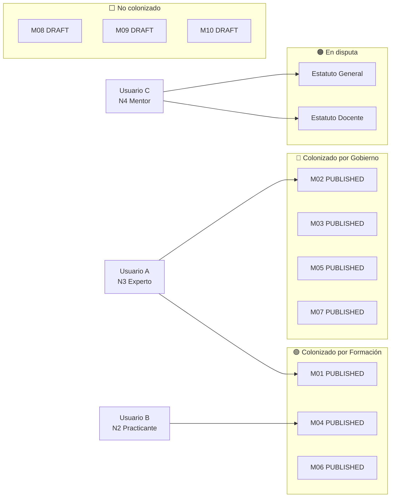

## 5.2 Visualización en el Portal

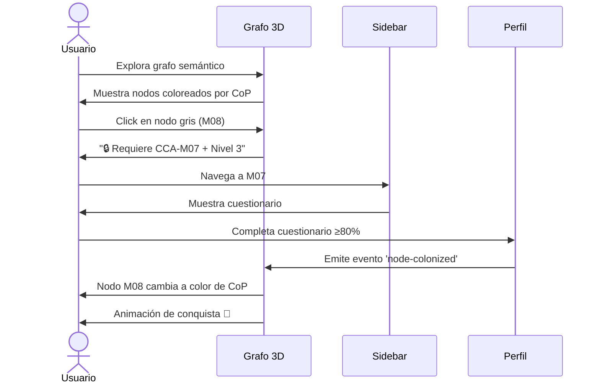

---

# PARTE VI · FRAMEWORKS RPG OPEN SOURCE

## 6.1 Opción A: Habitica (Open Source RPG Task Manager)

**Repo:** https://github.com/HabitRPG/habitica
**Web:** https://habitica.com/
**Licencia:** GPL-3.0

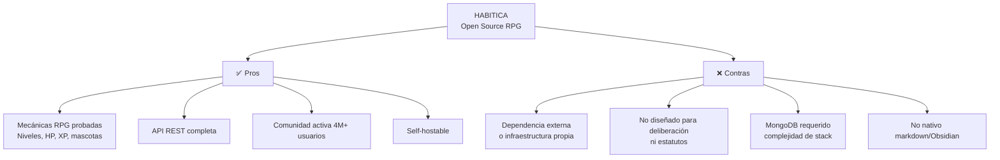

**Veredicto:** ❌ No recomendado — demasiado pesado, no es markdown-native.

## 6.2 Opción B: OpenBadges (Mozilla / IMS Global)

**Especificación:** https://www.imsglobal.org/activity/digital-badges
**Repo:** https://github.com/mozilla/openbadges-backpack
**Licencia:** MPL-2.0

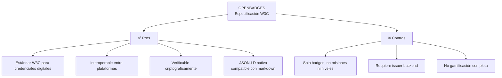

**Veredicto:** ⚠️ Componente útil para v9 (certificaciones) pero insuficiente solo.

## 6.3 Opción C: Custom Engine (Recomendado)

> **Decision:** No usamos framework externo. Creamos un **engine propio markdown-native** que se alimenta del frontmatter de Obsidian.

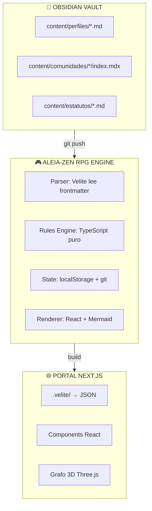

### ¿Por qué engine propio?

| Criterio | Habitica | OpenBadges | Aleia-Zen |
|---|---|---|---|
| Markdown-native | ❌ | ⚠️ | ✅ |
| Obsidian sync | ❌ | ❌ | ✅ |
| Sin backend | ❌ | ❌ | ✅ |
| Deliberación estatutos | ❌ | ❌ | ✅ |
| Grafo colonización | ❌ | ❌ | ✅ |
| Customizable 100% | ⚠️ | ⚠️ | ✅ |
| Costo de mantenimiento | 💰💰💰 | 💰💰 | 💰 |

---

# PARTE VII · MODELO MARKDOWN-NATIVE

## 7.1 Perfil de Jugador

```markdown
---
kd_type: player_profile
kd_rol: docente-pasteur
kd_nivel_global: 3
kd_ccas: [m01, m02, m03, m05, m07]
kd_misiones: [CSU-MC-01, CSU-MC-02, FOR-MC-01]
kd_xp: 1250
kd_streak: 12
kd_logros:
  - { id: early-adopter, fecha: 2026-04-15 }
  - { id: colonizador-m05, fecha: 2026-04-20 }
---
# Carlos Camilo Madera
Docente Investigador Pasteur
```

## 7.2 Misión CoP

```markdown
---
misionesCoP:
  - id: CSU-MC-01
    slug: mandato-normativo
    titulo: "Mandato Normativo"
    tipo: comprension
    papers: [m01, m02, m03]
    nivelRequerido: 0
    nivelOtorga: 1
    cuestionario:
      - id: q1
        pregunta: "¿Qué documento vincula CONPES 4069 con UDFJC?"
        opciones: ["Acuerdo CSU 04/2025", "Decreto 1279", "Ley 30"]
        correcta: 0
    recompensas:
      - { tipo: cca, id: cca-mandato }
      - { tipo: xp, cantidad: 100 }
    fecha_cierre: "2026-06-15"
---
```

## 7.3 Estatuto con Deliberación

```markdown
---
kd_type: estatuto
deliberacion:
  cop: comunidades/gobierno/csu
  estado: deliberacion_abierta
  fecha_cierre: "2026-06-15"
  comentarios: 47
versiones:
  - { id: v1, fecha: "2026-03-01", cambios: "Inicial" }
  - { id: v2, fecha: "2026-05-01", cambios: "Feedback VR Formación" }
---
# Estatuto General
...cuerpo...
```

---

# PARTE VIII · ROADMAP v8f → v9

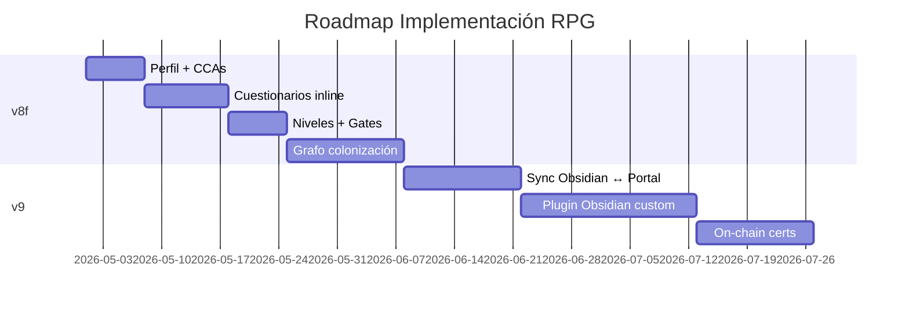

---

# PARTE IX · FUENTES

1. Hunicke, R., et al. (2004). MDA Framework. http://www.cs.northwestern.edu/~hunicke/MDA.pdf
2. Chou, Y. (2015). Octalysis. https://yukaichou.com/gamification-book/
3. Kim, A. J. (2018). Game Thinking. https://gamethinking.io/
4. Deci, E. L., & Ryan, R. M. (2017). SDT. https://selfdeterminationtheory.org/
5. Habitica Repo: https://github.com/HabitRPG/habitica
6. OpenBadges Spec: https://www.imsglobal.org/activity/digital-badges
7. Obsidian Dataview: https://github.com/blacksmithgu/obsidian-dataview
8. Obsidian Meta Bind: https://github.com/mProjectsCode/obsidian-meta-bind-plugin

---

> **Nota de cierre v2.0:** Este AUDIT-v8f establece el motor RPG completo para la reforma UDFJC. No usamos framework externo: el engine es markdown-native, Obsidian-first, y se traduce automáticamente al portal via Velite. Cada entidad (CABA, Instituto, Centro, Escuela) tiene su propio flujo de colonización con retos, exámenes y co-creación.
