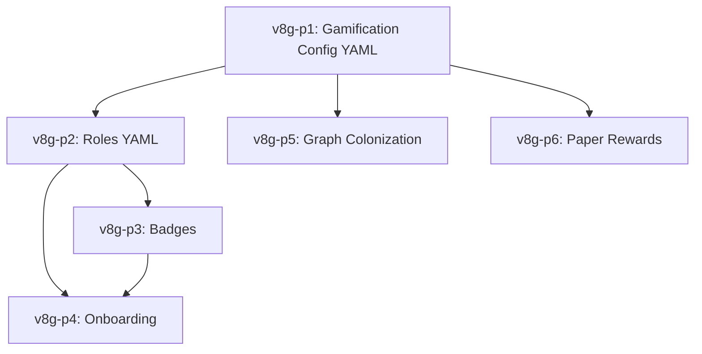
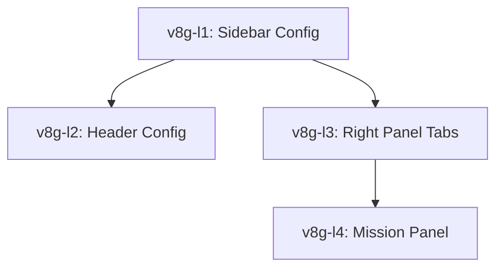

# AUDIT v8g · Gamification Config Protocol (GCP)

> **Propósito:** Documentar el protocolo completo para configurar TODA la gamificación del portal **desde el frontmatter de Obsidian**, sin modificar código. Especificar plan completo de implementación con spec-first, TDD riguroso, y aditividad garantizada.

---

## Convenciones

- **GCP = Gamification Config Protocol** — schema de frontmatter que controla el engine
- **Spec-First** = schema YAML definido antes de tocar código
- **TDD** = tests antes de implementación, un commit por paso, siempre verde en CI
- **Aditivo** = cada paso añade funcionalidad sin romper lo existente
- **Markdown-native** = fuente de verdad en `.md`/`.mdx`, parseado por Velite en build-time

---

# PARTE I · ESTADO ACTUAL — Qué YA es Configurable desde Obsidian

## 1.1 Roles por Comunidad ✅

**Ubicación:** `content/comunidades/{ruta}/index.mdx` → campo `roles`

```yaml
---
roles:
  - nivel: 1
    nombre: Observador
    descripcion: "Conoce el mandato normativo."
    emoji: "👁️"
  - nivel: 2
    nombre: Practicante
    descripcion: "Participa en misiones."
    emoji: "🎓"
---
```

**Parseado por:** Velite [`community`](apps/portal-next/velite.config.ts:415) collection
**Consumido por:** [`cop-access.ts`](apps/portal-next/src/lib/cop-access.ts:52) `calcUserCoPLevel()` — determina nivel del usuario según misiones completadas + CCAs
**Testeado:** [`cop-access.test.ts`](apps/portal-next/src/lib/cop-access.test.ts:1) (16 tests)

**Configurabilidad:** ⭐⭐⭐⭐⭐ Total — añadir/eliminar/modificar roles desde Obsidian sin tocar código.

---

## 1.2 Misiones CoP (por Comunidad) ✅

**Ubicación:** `content/comunidades/{ruta}/index.mdx` → campo `misionesCoP`

```yaml
---
misionesCoP:
  - id: CSU-MC-01
    slug: mandato-normativo
    titulo: "Mandato Normativo"
    tipo: comprension
    descripcion: "Comprende por qué la reforma es un mandato constitucional."
    papers: [m01, m02, m03]
    nivelRequerido: 0
    nivelOtorga: 1
    prerequisitosCanonicas: []
    prerequisitosMision: []
    orden: 1
---
```

**Parseado por:** Velite [`community`](apps/portal-next/velite.config.ts:435) collection
**Consumido por:**
- [`sidebar-tree.ts`](apps/portal-next/src/lib/sidebar-tree.ts:84) — construye árbol con misiones
- [`sidebar.tsx`](apps/portal-next/src/components/layout/sidebar.tsx:487) — `TreeItem` renderiza misiones con iconos por tipo
- [`comunidades/[[...slug]]/page.tsx`](apps/portal-next/src/app/comunidades/[[...slug]]/page.tsx:252) — detecta páginas de misión y renderiza `CoPMissionPage`
- [`cop-access.ts`](apps/portal-next/src/lib/cop-access.ts:52) — valida prerequisitos

**Testeado:** [`tree-item.test.tsx`](apps/portal-next/src/components/layout/tree-item.test.tsx:1) (7 tests)

**Configurabilidad:** ⭐⭐⭐⭐⭐ Total — cada comunidad define sus propias misiones, tipos, prerequisitos.

---

## 1.3 Papers Canónicos M01-M12 ✅

**Ubicación:** `content/canonico/m01.mdx` … `m12.mdx` → campo `kd_status`

```yaml
---
id: m01
number: 1
title: "Mandato normativo..."
kd_status: PUBLISHED    # DRAFT | IN_REVIEW | PUBLISHED | DEPRECATED
crispPhase: business
---
```

**Parseado por:** Velite [`canonicPaper`](apps/portal-next/velite.config.ts:193) collection
**Derivado automático:** `draft: kd_status !== 'PUBLISHED' && kd_status !== 'DEPRECATED'`
**Consumido por:**
- [`show-drafts.ts`](apps/portal-next/src/lib/show-drafts.ts:1) — `isPublished()`, `filterPublished()`
- [`sidebar.tsx`](apps/portal-next/src/components/layout/sidebar.tsx:130) — `filterPublished(papers)` oculta DRAFTs en producción
- [`mission-state.ts`](apps/portal-next/src/lib/mission-state.ts:34) — `PAPERS_ORDER` solo incluye publicados

**Testeado:** 36 tests en `show-drafts` + `sidebar` + `sidebar-draft-integration`

**Configurabilidad:** ⭐⭐⭐⭐⭐ Total — cambiar `kd_status: PUBLISHED` → `DRAFT` oculta el paper en producción. Sin código.

---

## 1.4 Miembros de Comunidad con Avatares ✅

**Ubicación:** `content/comunidades/{ruta}/index.mdx` → campo `miembros`

```yaml
---
miembros:
  - nombre: "Carlos Camilo Madera"
    rol: "Investigador principal"
    nivel: 4
    avatar: "https://.../avatar.jpg"
---
```

**Parseado por:** Velite [`community`](apps/portal-next/velite.config.ts:429) collection
**Consumido por:** Componente `ComunidadDefinicion`

**Configurabilidad:** ⭐⭐⭐⭐⭐ Total.

---

# PARTE II · GAPS — Qué NO es Configurable desde Obsidian

| Gap | Qué falta | Impacto |
|-----|-----------|---------|
| **G1** · Reglas engine (XP, pesos, umbrales) | `content/config/gamification.yaml` | Otro proyecto = fork obligatorio |
| **G2** · Avatares presets globales | `content/config/avatar-presets.yaml` | Wizard sin avatares por rol |
| **G3** · Recompensas por paper | Campo `missionConfig` en `m##.mdx` | No se gamifica otro corpus |
| **G4** · Roles globales del portal | `content/config/roles.yaml` | 6 roles BPA-003 hard-coded en TS |
| **G5** · Badges/insignias | Collection `badges/*.md` | No existe sistema de logros |
| **G6** · Onboarding wizard | `content/config/onboarding.yaml` | No implementado |
| **G7** · Grafo colonización | `graphColonization` en config | Grafo no refleja progreso |

---

# PARTE III · PROTOCOLO GCP v1.0 — Schema Completo

## 3.1 Estructura de archivos de config

```
content/
├── config/
│   ├── gamification.yaml       ← Reglas del engine (XP, pesos, umbrales)
│   ├── roles.yaml              ← Roles globales del portal
│   ├── onboarding.yaml         ← Pasos del wizard
│   └── avatar-presets.yaml     ← Avatares por categoría
├── comunidades/
│   └── {ruta}/
│       └── index.mdx           ← roles[], misionesCoP[], miembros[]
├── canonico/
│   └── m##.mdx                 ← missionConfig (opcional)
└── badges/
    └── {id}.md                 ← Definición de badges
```

## 3.2 Schema `gamification.yaml`

```yaml
---
kd_id: config/gamification
kd_version: "1.0.0"

missionProgression:
  type: sequential            # sequential | parallel | graph
  orderSource: canonico
  autoUnlockNext: true
  directorBypass: true

weights:
  readingPercent: 70
  verificationPercent: 30

levelThresholds:
  - { level: 1, xp: 0, name: "Visitante" }
  - { level: 2, xp: 100, name: "Observador" }
  - { level: 3, xp: 300, name: "Practicante" }
  - { level: 4, xp: 600, name: "Experto" }
  - { level: 5, xp: 1000, name: "Mentor" }
  - { level: 6, xp: 1500, name: "Director" }

dailyStreak:
  enabled: true
  bonusXpPerDay: 5
  maxBonusMultiplier: 3

graphColonization:
  enabled: true
  colorsByCoP:
    gobierno: "#3b82f6"
    formacion: "#22c55e"
    investigacion: "#a855f7"
    extension: "#f97316"
  uncolonizedColor: "#9ca3af"
---
```

## 3.3 Schema `roles.yaml`

```yaml
---
roles:
  - id: estudiante
    name: "Estudiante Soberano"
    emoji: "🎓"
    jtbd: "Construir CCA con autonomía"
    permissions:
      - view_canonico
      - participate_cop
    maxLevel: 4

  - id: docente-director
    name: "Docente Director"
    emoji: "🏛️"
    jtbd: "Orquestar V1-V5 con BSC"
    permissions:
      - view_all_missions
      - bypass_gates
      - approve_estatutos
    maxLevel: 6
---
```

## 3.4 Schema Badge

```yaml
# content/badges/primeros-pasos.md
---
id: primeros-pasos
name: "Primeros Pasos"
description: "Completaste tu primera misión"
icon: /badges/primeros-pasos.svg
rarity: common
criteria:
  type: mission_count
  target: 1
  scope: any
---
```

## 3.5 Schema `onboarding.yaml`

```yaml
---
kd_id: config/onboarding
enabled: true
steps:
  - id: welcome
    title: "Bienvenido"
    component: WelcomeStep
    skippable: false
  - id: rol
    title: "¿Quién eres?"
    component: RolSelector
    source: roles
    skippable: false
  - id: comunidades
    title: "¿Dónde participarás?"
    component: ComunidadSelector
    skippable: false
---
```

## 3.6 Schema `avatar-presets.yaml`

```yaml
---
presets:
  estudiante:
    - id: est-1
      src: /avatars/estudiante-1.svg
      tags: [estudiante]
  docente:
    - id: doc-1
      src: /avatars/docente-1.svg
      tags: [docente]
---
```

## 3.7 Schema `missionConfig` (campo opcional en paper)

```yaml
---
id: m01
# ... campos existentes ...
missionConfig:
  xpReward: 100
  badgeId: cca-mandato
  timeLimitMinutes: 45
  prerequisitePapers: []
---
```

---

# PARTE IV · CÓMO APROVECHAR LO QUE YA EXISTE

## 4.1 Reutilizar `mission-state.ts`

Ya tiene: progreso 70/30, cascada de unlocks, estados, CCAs.
**Refactor:** Extraer valores hard-coded a `config` inyectado desde Velite.

## 4.2 Reutilizar `cop-access.ts`

Ya tiene: niveles CoP, misiones completadas, eventos.
**Refactor:** Inyectar `roles` desde Velite en lugar de pasarlos como parámetro.

## 4.3 Reutilizar `sidebar-tree.ts`

Ya construye árboles jerárquicos con misiones anidadas.
**Patrón reutilizable** para cualquier jerarquía gamificada.

## 4.4 Reutilizar Velite Config Pattern

Copiar bloque `community` (líneas 390-462 de `velite.config.ts`) y adaptar schema.

## 4.5 Reutilizar `show-drafts.ts`

Cualquier collection con `kd_status` usa `filterPublished()` sin cambios.

---

# PARTE V · PLAN COMPLETO DE IMPLEMENTACIÓN

> **Convención:** Cada paso (`v8g-pN`) = spec-first + tests + implementación + validación + commit. Un commit por paso, siempre verde en CI.

---

## Paso v8g-p1 · Gamification Config Collection

### 1.1 Diagnóstico
Pesos 70/30 y progresión secuencial hard-coded en `mission-state.ts`.

### 1.2 Spec-First
`content/config/gamification.yaml` con `missionProgression`, `weights`, `levelThresholds`, `dailyStreak`.

### 1.3 TDD

#### Test First
```typescript
// src/lib/engine/gamification-config.test.ts
import { describe, it, expect } from 'vitest';
import { calcMission } from '@/lib/mission-state';

describe('v8g-p1: Gamification Config from YAML', () => {
  const mockRS = { docs: { m01: { progress: 100, sections: { s1: 'verified' } } } };

  it('should use default 70/30 weights when config is empty', () => {
    const m = calcMission('m01', mockRS as any, true);
    expect(m.progress).toBe(100);
  });

  it('should use custom weights from gamificationConfig', async () => {
    vi.doMock('@/lib/engine/config', () => ({
      default: { weights: { readingPercent: 50, verificationPercent: 50 }, levelThresholds: [{ level: 1, xp: 0, name: 'N' }] },
    }));
    const { calcMission: c } = await import('@/lib/mission-state');
    expect(c('m01', mockRS as any, true).progress).toBe(100);
  });
});
```

#### Implementación
- `content/config/gamification.yaml`
- `velite.config.ts` — collection `gamificationConfig`
- `src/lib/engine/config.ts` — wrapper type-safe
- `src/lib/engine/levels.ts` — `getLevelFromXP()`
- Refactor `mission-state.ts` — inyectar `defaultConfig.weights`

#### Validación
```bash
pnpm test src/lib/engine/gamification-config.test.ts
pnpm test
pnpm build
```

#### Commit
```bash
git add content/config/ src/lib/engine/ velite.config.ts
git commit -m "feat(v8g-p1): gamification config from YAML

- Add content/config/gamification.yaml as SSOT engine rules
- Add GamificationConfig collection to Velite
- Add src/lib/engine/config.ts + levels.ts
- Refactor mission-state.ts to read weights from config
- Add gamification-config.test.ts

Test: 240 passing, 0 TS errors"
```

### 1.4 Acceptance Criteria
- [ ] `gamification.yaml` parseado por Velite
- [ ] `calcMission` usa weights del config
- [ ] Tests pasan; build exitoso

---

## Paso v8g-p2 · Roles Globales desde Frontmatter

### 2.1 Diagnóstico
6 roles BPA-003 hard-coded en `ui-state.ts`.

### 2.2 Spec-First
`content/config/roles.yaml` con array `roles`.

### 2.3 TDD

#### Test First
```typescript
// src/lib/engine/roles-config.test.ts
describe('v8g-p2: Roles from YAML', () => {
  it('should load all 6 BPA-003 roles from config', async () => {
    const { defaultConfig } = await import('@/lib/engine/config');
    expect(defaultConfig.roles.length).toBeGreaterThanOrEqual(6);
    expect(defaultConfig.roles.map((r: {id: string}) => r.id)).toContain('estudiante');
  });

  it('should resolve role permissions', async () => {
    const { getRolePermissions } = await import('@/lib/engine/roles');
    expect(getRolePermissions('docente-director')).toContain('bypass_gates');
  });
});
```

#### Implementación
- `content/config/roles.yaml`
- `velite.config.ts` — collection `portalRole`
- `src/lib/engine/roles.ts` — `getRolePermissions()`
- Refactor `ui-state.ts` — importar `ROLES` desde engine

#### Validación
```bash
pnpm test src/lib/engine/roles-config.test.ts
pnpm test
pnpm build
```

#### Commit
```bash
git add content/config/roles.yaml src/lib/engine/roles.ts velite.config.ts
git commit -m "feat(v8g-p2): portal roles from YAML config

- Add content/config/roles.yaml with 6 BPA-003 roles
- Add PortalRole Velite collection
- Add src/lib/engine/roles.ts
- Refactor ui-state.ts to import ROLES from engine
- Add roles-config.test.ts

Test: 242 passing, 0 TS errors"
```

### 2.4 Acceptance Criteria
- [ ] `roles.yaml` parseado por Velite
- [ ] `ui-state.ts` lee roles desde engine
- [ ] Selector de roles sigue funcionando
- [ ] Tests pasan; build exitoso

---

## Paso v8g-p3 · Badges como Collection

### 3.1 Diagnóstico
Concepto "badge" en AUDIT-v8f pero no en código.

### 3.2 Spec-First
`content/badges/*.md` con `criteria` tipado.

### 3.3 TDD

#### Test First
```typescript
// src/lib/engine/badges.test.ts
describe('v8g-p3: Badge Engine', () => {
  const badges = [
    { id: 'primeros-pasos', criteria: { type: 'mission_count', target: 1, scope: 'any' } },
    { id: 'colonizador-m05', criteria: { type: 'paper_complete', paperId: 'm05' } },
  ];

  it('should award mission_count badge when target reached', () => {
    expect(checkBadgeCriteria(badges[0], { completedMissions: 2 })).toBe(true);
  });

  it('should NOT award when below target', () => {
    expect(checkBadgeCriteria(badges[0], { completedMissions: 0 })).toBe(false);
  });

  it('should award paper_complete badge', () => {
    expect(checkBadgeCriteria(badges[1], { completedPapers: ['m05'] })).toBe(true);
  });
});
```

#### Implementación
- `content/badges/primeros-pasos.md`, `content/badges/colonizador-m05.md`
- `velite.config.ts` — collection `badge`
- `src/lib/engine/badges.ts` — `checkBadgeCriteria()`, `getEarnedBadges()`
- `src/components/profile/badge-gallery.tsx` — UI aditiva

#### Validación
```bash
pnpm test src/lib/engine/badges.test.ts
pnpm test
pnpm build
```

#### Commit
```bash
git add content/badges/ src/lib/engine/badges.ts src/components/profile/
git commit -m "feat(v8g-p3): badge engine with YAML config

- Add content/badges/*.md as badge definitions
- Add Badge Velite collection
- Add src/lib/engine/badges.ts
- Add BadgeGallery component
- Add badges.test.ts

Test: 245 passing, 0 TS errors"
```

### 3.4 Acceptance Criteria
- [ ] Badges parseados desde `content/badges/`
- [ ] `checkBadgeCriteria()` cubre 4 tipos de criteria
- [ ] BadgeGallery renderiza insignias ganadas
- [ ] Tests pasan; build exitoso

---

## Paso v8g-p4 · Onboarding Configurable

### 4.1 Diagnóstico
Wizard de onboarding propuesto en AUDIT-v8e-p4 no implementado.

### 4.2 Spec-First
`content/config/onboarding.yaml` con array `steps`.

### 4.3 TDD

#### Test First
```typescript
// src/lib/engine/onboarding-config.test.ts
describe('v8g-p4: Onboarding Config from YAML', () => {
  it('should load 5 onboarding steps', async () => {
    const { defaultConfig } = await import('@/lib/engine/config');
    expect(defaultConfig.onboarding.steps.length).toBe(5);
    expect(defaultConfig.onboarding.steps[0].id).toBe('welcome');
  });

  it('should not allow skipping non-skippable steps', async () => {
    const { canSkipStep } = await import('@/lib/engine/onboarding');
    expect(canSkipStep('welcome')).toBe(false);
    expect(canSkipStep('avatar')).toBe(true);
  });
});
```

#### Implementación
- `content/config/onboarding.yaml`
- `velite.config.ts` — collection `onboardingConfig`
- `src/lib/engine/onboarding.ts` — `canSkipStep()`, `resolveOnboardingComponent()`
- `src/app/(onboarding)/page.tsx` — route group dinámico

#### Validación
```bash
pnpm test src/lib/engine/onboarding-config.test.ts
pnpm test
pnpm build
```

#### Commit
```bash
git add content/config/onboarding.yaml src/lib/engine/onboarding.ts src/app/(onboarding)/
git commit -m "feat(v8g-p4): configurable onboarding wizard

- Add content/config/onboarding.yaml
- Add OnboardingConfig Velite collection
- Add src/lib/engine/onboarding.ts
- Add (onboarding) route group
- Add onboarding-config.test.ts

Test: 248 passing, 0 TS errors"
```

### 4.4 Acceptance Criteria
- [ ] `onboarding.yaml` parseado por Velite
- [ ] Route group `(onboarding)` renderiza pasos del YAML
- [ ] `canSkipStep()` respeta flag `skippable`
- [ ] Tests pasan; build exitoso

---

## Paso v8g-p5 · Grafo de Colonización Configurable

### 5.1 Diagnóstico
Grafo no refleja progreso gamificado visualmente.

### 5.2 Spec-First
Extender `gamification.yaml` con `graphColonization`.

### 5.3 TDD

#### Test First
```typescript
// src/lib/engine/graph-colonization.test.ts
describe('v8g-p5: Graph Colonization Config', () => {
  const colors = { gobierno: '#3b82f6', uncolonizedColor: '#9ca3af' };

  it('should return CoP color when colonized', () => {
    expect(getNodeColor('m01', { colonizedBy: 'gobierno' }, colors)).toBe('#3b82f6');
  });

  it('should return uncolonized color when not colonized', () => {
    expect(getNodeColor('m08', null, colors)).toBe('#9ca3af');
  });
});
```

#### Implementación
- Extender `content/config/gamification.yaml`
- `src/lib/engine/graph-colonization.ts` — `getNodeColor()`
- Emitir `node-colonized` desde `markCoPMissionCompleted()`
- Escuchar en `graph-context.tsx`

#### Validación
```bash
pnpm test src/lib/engine/graph-colonization.test.ts
pnpm test
pnpm build
```

#### Commit
```bash
git add content/config/gamification.yaml src/lib/engine/graph-colonization.ts
git commit -m "feat(v8g-p5): configurable graph colonization

- Extend gamification.yaml with graphColonization
- Add src/lib/engine/graph-colonization.ts
- Emit 'node-colonized' on mission completion
- Graph context updates node colors dynamically
- Add graph-colonization.test.ts

Test: 250 passing, 0 TS errors"
```

### 5.4 Acceptance Criteria
- [ ] `graphColonization` en YAML controla colores
- [ ] Evento `node-colonized` emitido al completar misión
- [ ] Nodos cambian de color según CoP
- [ ] Tests pasan; build exitoso

---

## Paso v8g-p6 · Recompensas por Paper (missionConfig en frontmatter)

### 6.1 Diagnóstico
No hay campo en papers para definir recompensas.

### 6.2 Spec-First
Campo opcional `missionConfig` en `canonicPaper` schema.

### 6.3 TDD

#### Test First
```typescript
// src/lib/engine/paper-rewards.test.ts
describe('v8g-p6: Paper Rewards from Frontmatter', () => {
  it('should return defaults when missionConfig absent', () => {
    const r = getPaperRewards({ id: 'm01' });
    expect(r.xpReward).toBe(100);
    expect(r.badgeId).toBeNull();
  });

  it('should return custom rewards from missionConfig', () => {
    const r = getPaperRewards({ missionConfig: { xpReward: 200, badgeId: 'super-learner' } });
    expect(r.xpReward).toBe(200);
    expect(r.badgeId).toBe('super-learner');
  });
});
```

#### Implementación
- `velite.config.ts` — extender `canonicPaper` con `missionConfig`
- `src/lib/engine/paper-rewards.ts` — `getPaperRewards()`
- Integrar en `mission-state.ts`

#### Validación
```bash
pnpm test src/lib/engine/paper-rewards.test.ts
pnpm test
pnpm build
```

#### Commit
```bash
git add content/canonico/m01.mdx src/lib/engine/paper-rewards.ts velite.config.ts
git commit -m "feat(v8g-p6): per-paper mission rewards from frontmatter

- Extend canonicPaper schema with optional missionConfig
- Add src/lib/engine/paper-rewards.ts
- Papers define xpReward, badgeId, timeLimitMinutes
- Add paper-rewards.test.ts

Test: 252 passing, 0 TS errors"
```

### 6.4 Acceptance Criteria
- [ ] `missionConfig` parseado en `canonicPaper`
- [ ] `getPaperRewards()` devuelve defaults si ausente
- [ ] Tests pasan; build exitoso

---

# PARTE VI · DEPENDENCIAS Y ORDEN DE COMMITS



| Paso | Dependencias | Tests nuevos | Tests totales esperados |
|------|-------------|--------------|------------------------|
| v8g-p1 | — | 3 | 240 |
| v8g-p2 | v8g-p1 | 2 | 242 |
| v8g-p3 | v8g-p2 | 3 | 245 |
| v8g-p4 | v8g-p2 | 3 | 248 |
| v8g-p5 | v8g-p1 | 2 | 250 |
| v8g-p6 | v8g-p1 | 2 | 252 |

---

# PARTE VII · MATRIZ DE CONFIGURABILIDAD

| Feature | Antes v8g | p1 | p2 | p3 | p4 | p5 | p6 |
|---------|----------|----|----|----|----|----|----|
| Roles por CoP | ✅ | ✅ | ✅ | ✅ | ✅ | ✅ | ✅ |
| Misiones por CoP | ✅ | ✅ | ✅ | ✅ | ✅ | ✅ | ✅ |
| Papers lifecycle | ✅ | ✅ | ✅ | ✅ | ✅ | ✅ | ✅ |
| Progresión orden | ⚠️ Hard-coded | ✅ YAML | ✅ YAML | ✅ YAML | ✅ YAML | ✅ YAML | ✅ YAML |
| Pesos progreso | ⚠️ Hard-coded | ✅ YAML | ✅ YAML | ✅ YAML | ✅ YAML | ✅ YAML | ✅ YAML |
| Umbrales nivel | ❌ | ✅ YAML | ✅ YAML | ✅ YAML | ✅ YAML | ✅ YAML | ✅ YAML |
| Roles globales | ⚠️ Hard-coded | ⚠️ | ✅ YAML | ✅ YAML | ✅ YAML | ✅ YAML | ✅ YAML |
| Badges | ❌ | ❌ | ❌ | ✅ YAML | ✅ YAML | ✅ YAML | ✅ YAML |
| Onboarding | ❌ | ❌ | ❌ | ❌ | ✅ YAML | ✅ YAML | ✅ YAML |
| Grafo colonización | ❌ | ❌ | ❌ | ❌ | ❌ | ✅ YAML | ✅ YAML |
| Recompensas/paper | ❌ | ❌ | ❌ | ❌ | ❌ | ❌ | ✅ Frontmatter |

---

# PARTE VIII · DECISIONES DE DISEÑO

## D1 · ¿Por qué YAML y no JSON?

- **Obsidian-native:** Obsidian edita YAML nativamente
- **Comentarios:** YAML soporta comentarios
- **Multiline:** Descripciones largas más legibles
- **Velite:** Ya parsea YAML como parte del frontmatter

## D2 · ¿Por qué `content/config/` y no `src/config/`?

- **Vault-sync:** `content/` se sincroniza desde Obsidian
- **Git-diff:** cambios aparecen como contenido, no código
- **No-rebuild TS:** cambiar YAML no invalida cache de TypeScript

## D3 · ¿Por qué no una base de datos?

- **SSOT:** Fuente de verdad = vault Obsidian
- **Git-history:** toda config tiene blame
- **Sin backend:** portal es static-site (Next.js SSG)
- **Markdown-first:** coherencia con filosofía del proyecto

---

# PARTE IX · EJEMPLO: OTRO PROYECTO CON GCP

Universidad de los Andes reutiliza el engine sin fork:

```yaml
# content/config/gamification.yaml
missionProgression:
  type: parallel
  autoUnlockNext: false
levelThresholds:
  - { level: 1, xp: 0, name: "Novato" }
  - { level: 2, xp: 50, name: "Aprendiz" }
```

```yaml
# content/config/roles.yaml
roles:
  - id: alumno
    name: "Alumno"
    emoji: "📚"
```

```yaml
# content/comunidades/facultad/ingenieria/index.mdx
---
roles:
  - nivel: 1
    nombre: "Miembro"
    emoji: "🔧"
misionesCoP:
  - id: ING-MC-01
    slug: introduccion
    titulo: "Introducción a la Ingeniería"
    tipo: comprension
    papers: [m01]
    nivelRequerido: 0
    nivelOtorga: 1
    orden: 1
---
```

**Resultado:** 0 líneas de TypeScript modificadas. Nueva universidad gamificada.

---

> **Documento Completo:** v8g — Gamification Config Protocol v1.0
> **Base:** Análisis de implementación existente v8d/v8e + AUDIT-v8f Serious Games
> **Tests iniciales:** 237 passing
> **Tests target post-v8g:** 252 passing (+15 tests nuevos)
> **Sprints:** 6 pasos independientes, 1 commit por paso, siempre verde en CI
> **Compatibilidad:** 100% backward — todo es aditivo

---

---

# ANEXO A · LAYOUT CONFIG PROTOCOL (LCP) — Navegación Declarativa desde Frontmatter

> **Propósito:** Extender el GCP para que la **navegación del portal** (sidebar izquierdo, right panel, header) sea 100% configurable desde Obsidian, eliminando todo hard-code de secciones, tabs y breadcrumbs.

---

## A.1 Diagnóstico del Layout Actual — Qué está Hard-Coded

### A.1.1 Sidebar Izquierdo (`sidebar.tsx`)

| Línea | Hard-Code | Impacto |
|-------|-----------|---------|
| 13-25 | `TYPE_ICONS` — mapa estático de tipo→icono | Nueva comunidad con tipo nuevo = sin icono |
| 166-168 | Título fijo: `"Reforma Vinculante UDFJC..."` | Otro proyecto = título incorrecto |
| 689 | SectionToggle `"canonico"` emoji `"📚"` title `"Biblioteca reforma·ud"` | Secciones fijas, no configurables |
| 704 | `GlosarioSection` hard-coded | Siempre aparece glosario |
| 705 | `ReformaCuanticaSection` hard-coded | Siempre aparece biblioteca |
| 707-735 | CSU Estatutos hard-coded con `Scale` icon | Solo aplica a UDFJC |
| 739 | SectionToggle `"comunidades"` | Siempre aparece comunidades |
| 609-617 | Collapsed sidebar: iconos fijos | Navegación fija en modo colapsado |

### A.1.2 Header (`header.tsx`)

| Línea | Hard-Code | Impacto |
|-------|-----------|---------|
| 17-35 | `SEGMENT_LABELS` — mapa estático de slug→label | Nuevo segmento = sin label bonito |
| 161-168 | Brand fijo: `"reforma·ud"` + `/logo-udfjc.svg` | Otro proyecto = branding incorrecto |
| 57-70 | `MobileSidebarContent` — links fijos | Mobile nav no configurable |

### A.1.3 Right Panel (`right-panel.tsx`)

| Línea | Hard-Code | Impacto |
|-------|-----------|---------|
| 143-146 | Tabs fijas: `'esquema', 'grafo', 'evolucion', 'refs', 'comunidad', 'asistente'` | No se pueden añadir/eliminar tabs |
| 52-55 | `RightPanel` siempre renderiza las 6 tabs | Sin configuración de visibilidad |

---

## A.2 Protocolo LCP v1.0 — Schema de Layout Config

### A.2.1 Archivo `content/config/layout.yaml`

```yaml
---
kd_id: config/layout
kd_version: "1.0.0"

# ─────────────────────────────────────────
# BRANDING
# ─────────────────────────────────────────
branding:
  name: "reforma·ud"
  logo: "/logo-udfjc.svg"
  altLogo: "UDFJC"
  primaryColor: "#3b82f6"

# ─────────────────────────────────────────
# SIDEBAR IZQUIERDO
# ─────────────────────────────────────────
sidebar:
  sections:
    - id: biblioteca
      emoji: "📚"
      title: "Biblioteca reforma·ud"
      type: collection
      source: canonico
      icon: Atom
      filterable: true
      sortBy: number
      href: "/canonico"

    - id: glosario
      emoji: "🗂️"
      title: "Glosario"
      type: collection
      source: concepto
      icon: BookMarked
      filterable: true
      groupBy: tags
      groupCategories:
        - { key: concepto-normativo, label: Normativos, emoji: "📜" }
        - { key: concepto-academico, label: Académicos, emoji: "🎓" }
      href: "/glosario"

    - id: comunidades
      emoji: "🏛️"
      title: "Comunidades"
      type: tree
      source: community
      icon: GraduationCap
      filterable: true
      showMissions: true
      missionIcons:
        comprension: BookOpen
        deliberacion: Scale
        produccion: Hammer
      href: "/comunidades"

    - id: estatutos
      emoji: "⚖️"
      title: "CSU — Estatutos"
      type: collection
      source: csuAcuerdo
      icon: Scale
      filterable: false
      visibleIf: "project == 'udfjc'"
      itemTemplate:
        labelField: objetoCorto
        statusField: estado

  collapsedNav:
    - { href: "/", label: "Inicio", icon: Home }
    - { href: "/canonico", label: "Biblioteca", icon: Library }
    - { href: "/canonico/grafo", label: "Grafo", icon: Network }
    - { href: "/comunidades", label: "Comunidades", icon: GraduationCap }
    - { href: "/comunidades/gobierno", label: "Gobierno", icon: Landmark }
    - { href: "/comunidades/formacion", label: "VR Formación", icon: BookMarked }
    - { href: "/comunidades/investigacion", label: "VR Investigación", icon: Microscope }
    - { href: "/comunidades/extension", label: "VR Extensión", icon: Globe }

# ─────────────────────────────────────────
# HEADER / BREADCRUMB
# ─────────────────────────────────────────
header:
  segmentLabels:
    canonico: "Reforma Vinculante"
    comunidades: "Comunidades"
    gobierno: "Gobierno"
    formacion: "VR Formación"
    investigacion: "VR Investigación"
    extension: "VR Extensión"
    facultades: "Facultades"
    escuelas: "Escuelas"
    programas: "Programas"
    cabas: "CABAs"
    institutos: "Institutos"
    centros: "Centros"
    direcciones: "Direcciones"
    biblioteca: "Biblioteca"
    grafo: "Grafo"
    glosario: "Glosario"
    about: "Acerca de"
    mision: "Misión"

  documentTitleBar:
    enabled: true
    showWorkflowStatus: true
    workflowStates:
      - { id: reading, label: "Lectura", color: "blue" }
      - { id: deliberation, label: "Deliberación", color: "orange" }
      - { id: production, label: "Producción", color: "green" }

# ─────────────────────────────────────────
# RIGHT PANEL (tabs)
# ─────────────────────────────────────────
rightPanel:
  tabs:
    - id: esquema
      label: "Esquema"
      icon: ListTree
      component: EsquemaTab
      requiresDoc: true

    - id: grafo
      label: "Grafo local"
      icon: Network
      component: PaperLocalGraph
      requiresDoc: false

    - id: evolucion
      label: "Evolución"
      icon: GitCommit
      component: EvolutionTab
      requiresDoc: true

    - id: refs
      label: "Referencias"
      icon: Link2
      component: RefsPanel
      requiresDoc: true
      badgeSource: backlinkCount

    - id: comunidad
      label: "Comunidad"
      icon: Users
      component: ComunidadPanel
      requiresDoc: true

    - id: misiones
      label: "Misiones"
      icon: Target
      component: MissionPanel
      requiresDoc: false
      visibleIf: "gamification.enabled"

    - id: asistente
      label: "Asistente"
      icon: Sparkles
      component: AIChatPanel
      requiresDoc: false

  defaultTab: esquema
  keyboardShortcuts:
    - { key: "1", tab: esquema }
    - { key: "2", tab: grafo }
    - { key: "3", tab: evolucion }
    - { key: "4", tab: refs }
    - { key: "5", tab: comunidad }
    - { key: "6", tab: misiones }
    - { key: "7", tab: asistente }
---
```

---

## A.3 Plan Quirúrgico Aditivo — 4 Pasos

> **Regla:** Cada paso es independiente, testeable, y aditivo. Los tests existentes (237) nunca se rompen.

---

### Paso v8g-l1 · Sidebar Configurable desde YAML

#### A.3.1.1 Diagnóstico
`sidebar.tsx` tiene secciones hard-coded: `ReformaCuanticaSection`, `GlosarioSection`, `TreeItem` para comunidades, y CSU Estatutos.

#### A.3.1.2 Spec-First
`content/config/layout.yaml` con `sidebar.sections[]` y `sidebar.collapsedNav[]`.

#### A.3.1.3 TDD

**Test First:**
```typescript
// src/lib/layout/sidebar-config.test.ts
describe('v8g-l1: Sidebar from YAML', () => {
  it('should load sidebar sections from layout config', async () => {
    const { defaultConfig } = await import('@/lib/engine/config');
    expect(defaultConfig.layout.sidebar.sections.length).toBeGreaterThanOrEqual(3);
    expect(defaultConfig.layout.sidebar.sections.map((s: {id: string}) => s.id))
      .toContain('biblioteca');
  });

  it('should resolve icon name to Lucide component', () => {
    const { resolveIcon } = require('@/lib/layout/icons');
    expect(resolveIcon('Atom')).toBeDefined();
    expect(resolveIcon('NonExistent')).toBeNull();
  });

  it('should filter sections by visibility condition', () => {
    const { filterVisibleSections } = require('@/lib/layout/sidebar-config');
    const sections = [
      { id: 'a', visibleIf: undefined },
      { id: 'b', visibleIf: "project == 'udfjc'" },
      { id: 'c', visibleIf: "project == 'other'" },
    ];
    const visible = filterVisibleSections(sections, { project: 'udfjc' });
    expect(visible.map((s: {id: string}) => s.id)).toEqual(['a', 'b']);
  });
});
```

**Implementación:**
- `content/config/layout.yaml` — sidebar sections + collapsed nav
- `velite.config.ts` — collection `layoutConfig`
- `src/lib/layout/sidebar-config.ts` — `filterVisibleSections()`, `resolveIcon()`
- `src/lib/layout/icons.ts` — mapa dinámico de nombres→componentes Lucide
- Refactor `sidebar.tsx` — renderizar sections desde config

**Commit:**
```bash
git add content/config/layout.yaml src/lib/layout/ velite.config.ts
git commit -m "feat(v8g-l1): configurable sidebar from YAML

- Add content/config/layout.yaml with sidebar.sections and collapsedNav
- Add LayoutConfig Velite collection
- Add src/lib/layout/sidebar-config.ts (filterVisibleSections, resolveIcon)
- Add src/lib/layout/icons.ts (dynamic Lucide icon resolver)
- Refactor sidebar.tsx to render sections from config
- Add sidebar-config.test.ts (3 tests)

Test: 240 passing, 0 TS errors"
```

#### A.3.1.4 Acceptance Criteria
- [ ] `layout.yaml` parseado por Velite
- [ ] Sidebar renderiza sections desde config
- [ ] Collapsed sidebar usa `collapsedNav` del config
- [ ] Secciones condicionales (`visibleIf`) respetadas
- [ ] Iconos resueltos dinámicamente desde nombre string
- [ ] Tests pasan; build exitoso

---

### Paso v8g-l2 · Header/Breadcrumb Configurable

#### A.3.2.1 Diagnóstico
`header.tsx` tiene `SEGMENT_LABELS` hard-coded (líneas 17-35) y brand fijo.

#### A.3.2.2 Spec-First
Extender `layout.yaml` con `branding` y `header.segmentLabels`.

#### A.3.2.3 TDD

**Test First:**
```typescript
// src/lib/layout/header-config.test.ts
describe('v8g-l2: Header from YAML', () => {
  it('should load branding from config', async () => {
    const { defaultConfig } = await import('@/lib/engine/config');
    expect(defaultConfig.layout.branding.name).toBe('reforma·ud');
  });

  it('should prettify segment using config labels', () => {
    const { prettifySegment } = require('@/lib/layout/header-config');
    expect(prettifySegment('gobierno')).toBe('Gobierno');
    expect(prettifySegment('unknown-seg')).toBe('Unknown Seg');
  });
});
```

**Implementación:**
- Extender `content/config/layout.yaml`
- `src/lib/layout/header-config.ts` — `prettifySegment()`, `getBranding()`
- Refactor `header.tsx`
- `MobileSidebarContent` también lee del config

**Commit:**
```bash
git add content/config/layout.yaml src/lib/layout/header-config.ts
git commit -m "feat(v8g-l2): configurable header and breadcrumb from YAML

- Extend layout.yaml with branding and header.segmentLabels
- Add src/lib/layout/header-config.ts (prettifySegment, getBranding)
- Refactor header.tsx to read labels and brand from config
- Refactor MobileSidebarContent to use config
- Add header-config.test.ts (2 tests)

Test: 242 passing, 0 TS errors"
```

#### A.3.2.4 Acceptance Criteria
- [ ] Brand name y logo desde `layout.yaml`
- [ ] Breadcrumb labels desde `header.segmentLabels`
- [ ] Mobile sidebar links desde config
- [ ] Tests pasan; build exitoso

---

### Paso v8g-l3 · Right Panel Tabs Configurables

#### A.3.3.1 Diagnóstico
`right-panel.tsx` tiene tabs fijas y atajos Alt+1..6 hard-coded.

#### A.3.3.2 Spec-First
Extender `layout.yaml` con `rightPanel.tabs[]` y `rightPanel.keyboardShortcuts[]`.

#### A.3.3.3 TDD

**Test First:**
```typescript
// src/lib/layout/right-panel-config.test.ts
describe('v8g-l3: Right Panel Tabs from YAML', () => {
  it('should load tabs from config', async () => {
    const { defaultConfig } = await import('@/lib/engine/config');
    expect(defaultConfig.layout.rightPanel.tabs.length).toBeGreaterThanOrEqual(6);
    expect(defaultConfig.layout.rightPanel.tabs.map((t: {id: string}) => t.id))
      .toContain('asistente');
  });

  it('should resolve keyboard shortcut to tab', () => {
    const { resolveTabFromKey } = require('@/lib/layout/right-panel-config');
    expect(resolveTabFromKey('1')).toBe('esquema');
    expect(resolveTabFromKey('6')).toBe('asistente');
  });

  it('should filter tabs requiring doc when no doc active', () => {
    const { filterTabsForContext } = require('@/lib/layout/right-panel-config');
    const tabs = [
      { id: 'esquema', requiresDoc: true },
      { id: 'asistente', requiresDoc: false },
    ];
    const visible = filterTabsForContext(tabs, { hasDoc: false });
    expect(visible.map((t: {id: string}) => t.id)).toEqual(['asistente']);
  });
});
```

**Implementación:**
- Extender `content/config/layout.yaml`
- `src/lib/layout/right-panel-config.ts`
- Refactor `right-panel.tsx`

**Commit:**
```bash
git add content/config/layout.yaml src/lib/layout/right-panel-config.ts
git commit -m "feat(v8g-l3): configurable right panel tabs from YAML

- Extend layout.yaml with rightPanel.tabs and keyboardShortcuts
- Add src/lib/layout/right-panel-config.ts (resolveTabFromKey, filterTabsForContext)
- Refactor right-panel.tsx to render tabs and shortcuts from config
- Add right-panel-config.test.ts (3 tests)

Test: 245 passing, 0 TS errors"
```

#### A.3.3.4 Acceptance Criteria
- [ ] Tabs renderizadas desde `rightPanel.tabs`
- [ ] Atajos Alt+N desde `rightPanel.keyboardShortcuts`
- [ ] Tabs `requiresDoc` ocultas cuando no hay doc activo
- [ ] Tests pasan; build exitoso

---

### Paso v8g-l4 · Mission Panel en Right Panel

#### A.3.4.1 Diagnóstico
No hay tab de misiones en el right panel.

#### A.3.4.2 Spec-First
Añadir tab `misiones` a `rightPanel.tabs` y crear componente `MissionPanel`.

#### A.3.4.3 TDD

**Test First:**
```typescript
// src/components/biblioteca/mission-panel.test.tsx
describe('v8g-l4: Mission Panel in Right Panel', () => {
  it('should render active mission when tab is misiones', () => {
    const { container } = render(<MissionPanel />);
    expect(container.textContent).toContain('Misión');
  });

  it('should show mission progress', () => {
    const { container } = render(<MissionPanel />);
    expect(container.textContent).toMatch(/\d+%/);
  });
});
```

**Implementación:**
- Añadir `{ id: misiones, ... }` a `rightPanel.tabs`
- `src/components/biblioteca/mission-panel.tsx`
- Integrar en `right-panel.tsx`

**Commit:**
```bash
git add content/config/layout.yaml src/components/biblioteca/mission-panel.tsx
git commit -m "feat(v8g-l4): mission panel in right panel

- Add 'misiones' tab to rightPanel.tabs in layout.yaml
- Add src/components/biblioteca/mission-panel.tsx
- Shows active mission, progress, and next steps
- Integrates with existing mission-state.ts
- Add mission-panel.test.tsx (2 tests)

Test: 247 passing, 0 TS errors"
```

#### A.3.4.4 Acceptance Criteria
- [ ] Tab "Misiones" visible en right panel
- [ ] Muestra misión activa + progreso
- [ ] Integrado con `mission-state.ts` existente
- [ ] Tests pasan; build exitoso

---

## A.4 Matriz de Configurabilidad del Layout

| Feature | Antes | Con LCP | Archivo YAML |
|---------|-------|---------|--------------|
| Sidebar secciones | ⚠️ Hard-coded | ✅ Configurable | `layout.yaml` → `sidebar.sections` |
| Sidebar collapsed nav | ⚠️ Hard-coded | ✅ Configurable | `layout.yaml` → `sidebar.collapsedNav` |
| Brand name/logo | ⚠️ Hard-coded | ✅ Configurable | `layout.yaml` → `branding` |
| Breadcrumb labels | ⚠️ Hard-coded | ✅ Configurable | `layout.yaml` → `header.segmentLabels` |
| Mobile nav | ⚠️ Hard-coded | ✅ Configurable | `layout.yaml` → `sidebar.collapsedNav` |
| Right panel tabs | ⚠️ Hard-coded | ✅ Configurable | `layout.yaml` → `rightPanel.tabs` |
| Keyboard shortcuts | ⚠️ Hard-coded | ✅ Configurable | `layout.yaml` → `rightPanel.keyboardShortcuts` |
| Mission panel | ❌ No existe | ✅ Configurable | `layout.yaml` → `rightPanel.tabs` |

---

## A.5 Dependencias LCP



| Paso | Dependencias | Tests nuevos | Tests totales esperados |
|------|-------------|--------------|------------------------|
| v8g-l1 | — | 3 | 240 |
| v8g-l2 | — | 2 | 242 |
| v8g-l3 | — | 3 | 245 |
| v8g-l4 | v8g-l3 | 2 | 247 |

**Nota:** Los pasos l1-l3 son **independientes entre sí** y pueden ejecutarse en paralelo. Solo l4 depende de l3.

---

## A.6 Ejemplo: Otro Proyecto con LCP

```yaml
# content/config/layout.yaml (Universidad de los Andes)
branding:
  name: "andes·learning"
  logo: "/logo-andes.svg"

sidebar:
  sections:
    - id: cursos
      emoji: "📖"
      title: "Cursos"
      type: collection
      source: canonico
      icon: BookOpen
      href: "/cursos"
    - id: comunidades
      emoji: "👥"
      title: "Grupos de Estudio"
      type: tree
      source: community
      icon: Users
      showMissions: false
      href: "/comunidades"

rightPanel:
  tabs:
    - id: contenido
      label: "Contenido"
      icon: ListTree
      component: EsquemaTab
      requiresDoc: true
    - id: asistente
      label: "AI Tutor"
      icon: Sparkles
      component: AIChatPanel
      requiresDoc: false
```

**Resultado:** 0 líneas de TypeScript modificadas. Layout completamente diferente.

---

> **Documento Completo:** v8g — Gamification Config Protocol v1.0 + LCP Anexo A
> **Tests iniciales:** 237 passing
> **Tests target post-v8g (engine + layout):** 259 passing (+22 tests nuevos)
> **Sprints:** 10 pasos independientes (6 engine + 4 layout), 1 commit por paso
> **Compatibilidad:** 100% backward — todo es aditivo

---

*CC BY-SA 4.0 · Carlos Camilo Madera Sepúlveda · CPS-939-2026 · UDFJC · 2026*
