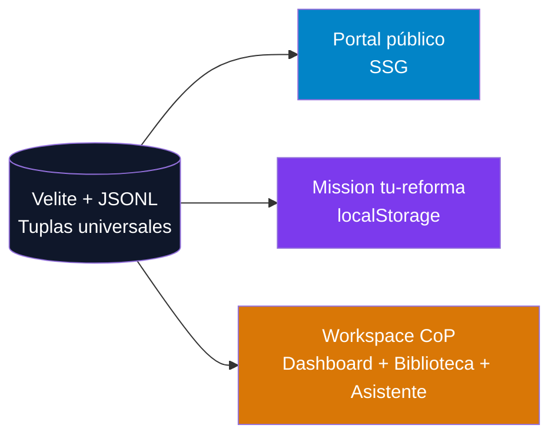
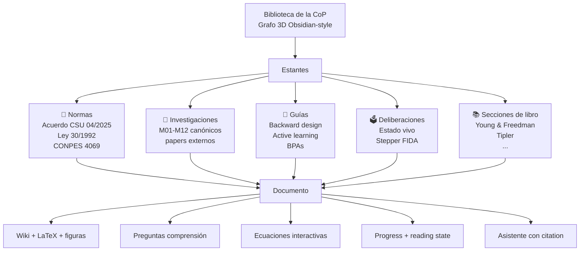
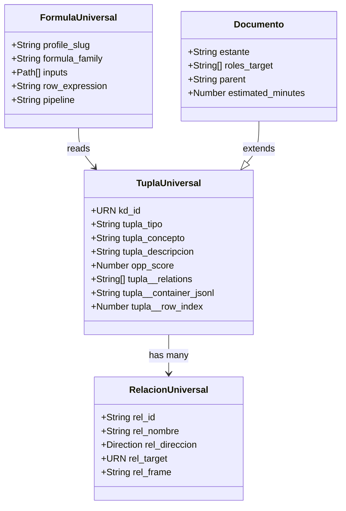

# B.9 · Portal Knowledge MVP — Spec-first académico

> **Misión**: convertir el portal `reforma-ud` en un **sistema de gestión de conocimiento académico de clase mundial** — Obsidian + Notion + Linear + NotebookLM en un sitio estático Vercel — con sólo dos servicios bien hechos en MVP: **Dashboard CoP** y **Biblioteca**, ambos con un **Asistente AI contextual** que cita.

> **Origen del spec**: 5 investigaciones paralelas (KDMO aleia-zen · cortex bereshit · BPA-003 roles · SOTA 2026 · MonitoringDashboard) + análisis de la barra de calidad académica establecida por el archivo `sec-27-0--introduccion.md` del corpus de física Young & Freedman.

> **Estado del v3.2**: 14 sprints, dashboard CoP funcional, sidebar 3-columnas, biblioteca básica, vis-network, pagefind. Esta especificación corrige las brechas que el usuario identificó como "no se ve pro" y eleva la calidad académica al nivel del corpus de física en Obsidian.

---

## Tabla de contenido

1. [Diagnóstico de gaps](#1-diagnóstico-de-gaps)
2. [Personas y Jobs-to-be-Done](#2-personas-y-jtbd)
3. [Barra de calidad académica](#3-barra-de-calidad-académica)
4. [Conceptualización v4](#4-conceptualización-v4)
5. [Arquitectura técnica](#5-arquitectura-técnica)
6. [Reutilización aleia-zen / KDMO](#6-reutilización-aleia-zen--kdmo)
7. [Servicios MVP](#7-servicios-mvp)
8. [Spec-first por componente](#8-spec-first-por-componente)
9. [Stack SOTA 2026](#9-stack-sota-2026)
10. [Sprint plan v4](#10-sprint-plan-v4)
11. [Definition of Done](#11-definition-of-done)
12. [Riesgos](#12-riesgos)

---

## 1. Diagnóstico de gaps

### 1.1 Lo que el usuario observó

| Sección esperada | Estado v3.2 | Gap |
|------------------|-------------|-----|
| Logo + encabezado | ✅ presente | Falta personalidad de marca |
| Perfil | ❌ inexistente | Sin avatar, sin School badge real |
| Sidebar lateral colapsable vertical | ✅ implementado | Funciona, pero falta progreso por nodo |
| Sidebar lateral colapsable horizontal | ⚠️ parcial | El breadcrumb del header sustituye, pero no es navegable como árbol |
| Zona de botones superior (tabs) | ⚠️ parcial | ViewSwitcher en CoP, pero no hay tabs globales |
| Zona de trabajo | ✅ presente | Le falta densidad informativa |
| Barra izquierda con chat-AI | ❌ está a la derecha | El usuario quiere chat-AI accesible siempre, contextual |
| **Calidad académica del contenido** | ❌ no soportada | Sin LaTeX, sin callouts ricos, sin embeds, sin dataview queries |

### 1.2 Brecha respecto a Obsidian (archivo Young & Freedman)

El archivo `sec-27-0--introduccion.md` muestra capacidades que el portal **no soporta** hoy:

| Feature Obsidian | v3.2 | Requerido v4 |
|------------------|:----:|:------------:|
| Frontmatter URN + cssclasses | parcial | ✅ |
| `> [!abstract]` callouts coloreados | ⚠️ básico | ✅ todos los tipos |
| `> [!example]-` collapsable | ❌ | ✅ |
| `![[archivo.png]]` embeds | ❌ | ✅ |
| `![[nota.md]]` transclusion | ❌ | ✅ |
| `[[wikilink#anchor]]` con anchor | ⚠️ | ✅ |
| LaTeX inline `$\vec{B}$` | ❌ | ✅ KaTeX |
| Bloques de ecuaciones `$$...$$` | ❌ | ✅ |
| Dataview queries embebidas | ❌ | ✅ alternativa Velite |
| Backlinks panel | ✅ | mantener |
| Properties panel (palabras, propiedades) | ❌ | ✅ |
| Breadcrumb deep-link | ✅ | mantener |
| Outline panel | ⚠️ TOC sticky | ✅ con scroll-spy |

### 1.3 Brecha respecto a `aleia-bereshit-rosy.vercel.app/admin/monitoring`

| Feature BERESHIT | v3.2 | Requerido v4 |
|------------------|:----:|:------------:|
| Sidebar con `% progreso` por nodo | ❌ | ✅ inline progress bars |
| Footer con stats globales (6 completados / 2 activos) | ❌ | ✅ |
| Tabs Lista/RBM/Kanban/Grafo/Mermaid/Preguntas | ⚠️ Mermaid+Preguntas faltan | ✅ todas |
| Sub-tabs Impacto/Efecto/Producto en RBM | ⚠️ | ✅ |
| KPI cards con sparkline + meta | ⚠️ sin meta visible | ✅ con `Meta: 100%` y `40%` actual |
| Atención badges (BERESHIT ⚠️ Atención) | ❌ | ✅ |
| Detail panel del item (Documentos, Dependencias, Tendencias, Entregables, Versiones, Acciones de Mejora) | ❌ | ✅ |
| Right panel con sugerencias contextuales (Analiza dependencias, Revisa issues bloqueados, Sugiere mejoras) | ⚠️ texto fijo | ✅ dinámicas según ruta |

---

## 2. Personas y JTBD

Síntesis de BPA-003 — 6 roles + 1 hub. **Denominador común**: todos enfrentan **incertidumbre + fragmentación reformista**. El portal lo resuelve con UI única que adapta visualización por rol.

### 2.1 Mapa de roles

| Rol | Core JTBD | Documento favorito | Dashboard P# crítico | Asistente le ofrece |
|-----|-----------|-------------------|---------------------|---------------------|
| **Estudiante Soberano** | Construir CCA V1∧V2∧V3 con autonomía y trazabilidad | Normas + deliberaciones + open badges | P1 Compromiso (participación deliberativa) | Simulador de impacto personal, asesor de migración, verificador Open Badge |
| **Docente Diseñador (Arquitecto CCA)** | Arquitecturar Paquetes CCA reusables con backward design | Investigaciones + ontologías ESCO/O*NET | P2 Producción (Paquetes CCA diseñados) · P4 Reuso | Validador ontológico, generador de rúbricas xAPI |
| **Docente Formador (Active Learning Master)** | Hake-g ≥0.3 con diagnóstico formativo | Concept Inventories + casos active learning | P1 Participación · P2 Ganancia Hake-g | Generador de Concept Inventories disciplinares |
| **Docente Investigador (Pasteur Pleno)** | Investigación cuadrante Pasteur con co-authorship estudiantil | Datasets FAIR + metodologías + papers | P2 Papers co-authored · P4 Semilleros | Buscador de líneas PIIOM compatibles, co-authoring agreements |
| **Docente Emprendedor (Agente Territorial)** | Living Labs + valor compartido Universidad-Territorio | Casos Living Lab + contratos TTO éticos | P3 Impacto territorial · P4 Sostenibilidad | Buscador de partnerships, generador de TTO ético |
| **Docente Director (Visionario Estratégico)** | Orquestar V1-V5 con BSC y rendición pública | Balanced Scorecard + NICSP + Ley 1712/2014 | P1+P2+P3+P4 (todos · vista ejecutiva) | Reporte trimestral CSU automatizado, alertas |

### 2.2 Outcome compartido

Todos contratan al portal este job emocional:

> "Quiero sentir que mi contribución tiene **propósito** y **visibilidad** en el ecosistema UDFJC modernizado, sin perderme en la fragmentación reformista."

**Implicación de diseño**: el portal debe ser **un solo lugar** donde cada rol vea claramente (a) su rol en la cadena de valor V1-V5, (b) qué documentos le sirven hoy, (c) cómo contribuir, (d) cómo medir su impacto.

### 2.3 Tuplas universales en JSONL como fuente

`H:\...\BPA-003--escuela-transformativa-emprendedora\` contiene **216 tuplas en formato JSONL** (54 por rol × 4 categorías: related-jobs, emotional-jobs, consumption-jobs, context). Cada tupla:

```json
{
  "fileClass": "fc-tupla-universal",
  "kd_id": "urn:aleia:udfjc:bpa003:est:mdc03:rj-up-001",
  "tupla_tipo": "CUSTOM",
  "tupla_concepto": "RELATED_JOB_UPSTREAM",
  "tupla_descripcion": "...",
  "atom_id": "UP-EST-01",
  "opp_score": 16.0,
  "opp_tier": "CRITICAL",
  "raci_estudiante": "R",
  "norma_ref": "Acu CSU 04/2025"
}
```

**Estas tuplas son la materia prima del Asistente**: cada respuesta que dé sobre "¿qué hago como estudiante en esta CoP?" se ancla en estas tuplas. El asistente no inventa — cita el `atom_id` y `kd_id`.

---

## 3. Barra de calidad académica

> Referencia viva: `C:\antigravity\aleia-mathilde\R990-msms\2--fisica\2--magnetismo\0--sources\0--literature\books\fisica-v2--young-freedman\cap-27\01-secciones\sec-27-0--introduccion.md`

### 3.1 Capacidades obligatorias del renderer MDX

```typescript
// Capacidades del Markdown extendido v4
type AcademicMarkdownFeatures = {
  // Sintaxis Obsidian-native
  wikilinks: '[[paper]]' | '[[paper#sec]]' | '[[paper|alias]]';
  embeds: '![[image.png]]' | '![[note.md]]' | '![[note#section]]';
  callouts: 'abstract' | 'note' | 'tip' | 'info' | 'question' | 'warning'
          | 'example' | 'quote' | 'cite' | 'success' | 'danger' | 'failure'
          | 'attention' | 'caution' | 'bug' | 'todo'; // 14 tipos + collapsable con `-`
  tags: '#fisica/magnetismo'; // jerárquicos
  inline_math: '$\\vec{B}$' | '$E = mc^2$';
  block_math: '$$\\nabla \\times \\vec{B} = \\mu_0 \\vec{J}$$';
  dataview: 'replaced by Velite query helpers';

  // Markdown extendido
  footnotes: '[^1]';
  task_lists: '- [ ]' | '- [x]';
  tables_with_alignment: '| left | :center: | right: |';
  code_with_lang: '```python {1,3-5}'; // highlight lines
  mermaid: '```mermaid';
  fenced_callouts: '> [!type]+ Title';

  // Citation
  apa_citations: '(Hestenes, 1992)' | '[@hestenes1992]';
  doi_links: '[doi:10.1119/...]';
};
```

### 3.2 Frontmatter académico canónico

```yaml
---
# Identidad universal (KDMO)
kd_id: urn:aleia:fisica:cap27:sec:0
kd_title: "27.0 — Introducción: Campo Magnético y Fuerzas Magnéticas"
kd_version: 1.0.0
kd_status: DRAFT  # DRAFT | REVIEW | PUBLISHED | ARCHIVED
kd_license: CC BY-SA 4.0

# Tipología (estante de biblioteca)
estante: norma | investigacion | guia | deliberacion | seccion-libro | concepto

# Clasificación por rol CoP (multi-target)
roles_target: [estudiante, docente-disenador, docente-investigador]

# Pertenencia jerárquica
parent: cap-27-magnetismo
chapter: 27
section: "27.0"

# Metadata académica
authors: ["Young, H.D.", "Freedman, R.A."]
year: 2014
edition: "13ed"
isbn: "978-607-32-2924-3"

# Pedagogía
learning_objectives: [...]
prerequisites: ["cap-21-electricidad"]
estimated_minutes: 45
difficulty: undergrad-2

# Trazabilidad RBM
rbm_level: output  # input | output | outcome | impact
contributes_to: [P1-Compromiso, P2-Produccion]

# Estilos Obsidian-compat
cssclasses: [keter-iso, academic-paper]
tags: [seccion, fisica, magnetismo, cap27]
---
```

### 3.3 Componentes MDX que el portal debe entregar

```tsx
// src/components/mdx-academic/index.tsx
export const academicComponents = {
  // Standard Markdown
  h1, h2, h3, h4, blockquote, ul, ol, table, code, pre,
  
  // Obsidian-native
  Callout,            // [!abstract] [!question] [!note] etc, con icon + color
  Wikilink,           // [[paper]] resuelve a /canonico/<id>
  Embed,              // ![[ruta]] auto-detecta tipo (img/note/youtube/iframe)
  Tag,                // #fisica/magnetismo navegable
  
  // Académico
  InlineMath,         // KaTeX inline ($...$)
  BlockMath,          // KaTeX block ($$...$$)
  Figure,             // <Figure src caption credit/>
  Equation,           // <Equation id="eq-27-1" label="Ley de Biot-Savart">$$...$$</Equation>
  Theorem,            // box numerado
  Definition,         // box con anchor
  Example,            // colapsable, numerado
  Citation,           // APA con popover (Hestenes, 1992)
  Footnote,           // marker + tooltip
  
  // Datos y queries
  VeliteQuery,        // <VeliteQuery from="papers" where="..." sort="..."/>
  TabularData,        // tabla desde JSONL
  KaTeXFormula,       // formula renderable + copy LaTeX
  
  // Pedagogía
  LearningObjectives, // <LearningObjectives items={[...]}/>
  ComprehensionGate,  // pregunta de comprensión opcional
  PracticeProblem,    // problema interactivo con pista + solución
  
  // Multimedia
  YouTubeEmbed,
  MermaidDiagram,
  ScientificPlot,     // chart.js/recharts wrapper
  ThreeDModel,        // model-viewer para .glb
};
```

---

## 4. Conceptualización v4

### 4.1 Tres modos, tres audiencias, una sola fuente



### 4.2 Cuatro vistas del Workspace CoP (BERESHIT-style)

```
┌──────────────────────────────────────────────────────────────┐
│  HEADER (sticky, 56px)                                        │
│  [≡] reforma·ud / Comunidades / VR Formación / Escuela Física│
│                       Cmd-K | 🔍 | 🌗 | 👤 [↦]              │
├─────┬───────────────────────────────────────────────┬────────┤
│ ◄   │  TÍTULO + ATENCIÓN BADGE                       │  AI    │
│     │  ───────────────────────────────────────────   │  ASIST │
│ S   │  [ Lista | RBM | Kanban | Grafo3D | Mermaid |  │   ┌──┐ │
│ I   │    Preguntas | Timeline ]                      │   │❓ │ │
│ D   │                                                │   ├──┤ │
│ E   │  ┌─KPI──┬─KPI──┬─KPI──┬─KPI──┐                 │   │💬 │ │
│ B   │  │  P1  │  P2  │  P3  │  P4  │ Sparklines      │   └──┘ │
│ A   │  └──────┴──────┴──────┴──────┘                 │  Cita  │
│ R   │                                                │  con   │
│     │  ┌──────────────────────────────────────────┐  │  popov │
│  ▼  │  │ Vista activa (RBM/Lista/Grafo3D/...)     │  │        │
│     │  │                                           │  │        │
│ T   │  │   contenido aquí                         │  │        │
│ R   │  │                                           │  │        │
│ E   │  └──────────────────────────────────────────┘  │   ►    │
│ E   │                                                │ collapse│
│     │  Estantes ▼ (Biblioteca)                       │        │
│ %   │  📜 Normas  🔬 Investigaciones                 │        │
│     │  📘 Guías   🗳️ Deliberaciones                  │        │
└─────┴───────────────────────────────────────────────┴────────┘
   FOOTER STATS:  6 completados · 2 activos · 0 bloqueados · 7 pendientes
```

### 4.3 Biblioteca como sistema de estantes (Notion-style multi-vista)

Cuando el usuario clickea **Biblioteca** en los tiles de servicios, ve una **vista inmersiva** con:



### 4.4 Vista de un documento (calidad Young & Freedman)

```
┌──────────────────────────────────────────────────────────────┐
│ Inicio › VR Formación › Escuela Física › Biblioteca › Normas │
│ › Acuerdo CSU 04/2025 › Art. 96-109                          │
├──────┬───────────────────────────────────────────────┬──────┤
│      │ [→] Anterior  Acuerdo CSU 04/2025  Siguiente [→] │ AI │
│OUT   │                                                │    │
│LINE  │  📜 Norma · v1.0.0 · DRAFT · CSU                │ Pre│
│ §1   │  ─────────────────────────────────────────     │ gun│
│ §2   │  Artículos 96-109 — Régimen Estudiantil        │ tas│
│ §3   │                                                │ ── │
│ §4   │  > [!abstract] Metas                            │ • ¿│
│ §5   │  > Al estudiar este capítulo aprenderá...       │ Re │
│      │                                                │  s │
│      │  ## §1 Introducción                            │ Ch │
│ ✓done│  El régimen estudiantil regula las relacio... │ at │
│ ◉now │  $$ \vec{B} = \frac{\mu_0 I}{4\pi r^2} ... $$ │ ──│
│ ○locked│                                                │ /│
│ ○locked│  ![[fig-acuerdo-organigrama.png]]              │   │
│      │  ↳ Figura 1. Organigrama Reforma 2024          │   │
│      │                                                │   │
│      │  > [!example]- 🧩 Ejercicios                    │   │
│      │  > VeliteQuery from problems where capitulo=27 │   │
│      │                                                │   │
│      │  > [!question] Pregunta de comprensión          │   │
│      │  > ¿Qué distingue una Escuela de un Programa?  │   │
│      │  > [○ A] [○ B] [● C] [○ D]   [verificar]       │   │
│      │  ─────────────────────────────────────────     │   │
│      │  Backlinks (3) · Tags · Citations              │   │
└──────┴───────────────────────────────────────────────┴────┘
  Properties:  629 palabras · 4382 caracteres · 8 propiedades
                ◉ R-leído  ⊙ Quiz aprobado  ⚙ Time 12 min
```

---

## 5. Arquitectura técnica

### 5.1 Layers

```mermaid
graph TB
  subgraph Build[Build-time · Velite + scripts]
    MDX[MDX collections<br/>canonico, comunidades, biblioteca]
    Tuplas[Tuplas JSONL<br/>BPA-003, KDMO]
    EmbBuild[OpenAI embeddings<br/>build-time JSONL]
    OramaIdx[Orama hybrid index<br/>full-text + vector]
    GraphJSON[Graph JSON<br/>nodes + edges + 3D pos]
    Pagefind[Pagefind index<br/>BM25 lexical]
    KaTeXSSR[KaTeX server-render<br/>matemáticas pre-compiladas]
    MermaidSSR[Mermaid server-render<br/>SVG estático]
  end
  
  subgraph Static[Static export · /out]
    HTML[97+ HTML pages]
    Assets[/static/* JSON · /pagefind/*]
  end
  
  subgraph Runtime[Cliente runtime]
    Shell[App Shell<br/>3 columnas]
    CmdK[cmd-k palette]
    Reader[Document Reader<br/>MDX + math + embeds]
    Graph3D[react-force-graph-3d<br/>lazy-loaded]
    AI[AI SDK v5<br/>RAG client-side]
  end
  
  Build --> Static --> Runtime
  
  style Build fill:#1e293b,color:#fff
  style Static fill:#0284c7,color:#fff
  style Runtime fill:#7c3aed,color:#fff
```

### 5.2 Datos: Tuplas Universales como SSOT



**Decisión clave**: el portal trata cada documento (norma, investigación, guía, deliberación, sección de libro) como una **Tupla Universal** con `tupla_tipo: 'CUSTOM'`. Velite valida con un schema Zod derivado de `tupla-universal.cue`. Esto da:

1. **Compatibilidad bidireccional Obsidian ↔ Portal**
2. **Reutilización del corpus aleia-mathilde** (los archivos de Young & Freedman ya tienen este formato)
3. **Asistente AI ancla respuestas en `kd_id` específicos** (citation siempre)
4. **Grafo de conocimiento se construye automáticamente** desde `tupla__relations`

### 5.3 Embeddings y búsqueda híbrida

```typescript
// scripts/build-embeddings.ts
import { OpenAI } from 'openai';
import { readVelite } from '#site/content';

const corpus = await readVelite();
const chunks = corpus.flatMap(doc => splitIntoChunks(doc, { maxTokens: 512 }));

// 1. Embeddings build-time con OpenAI text-embedding-3-small
const vectors = await openai.embeddings.create({
  model: 'text-embedding-3-small',
  dimensions: 512, // MRL truncate
  input: chunks.map(c => c.text),
});

// 2. Cuantizar int8 para reducir 4x el payload
const quantized = quantizeInt8(vectors.data);

// 3. Persistir como JSONL estático
await fs.writeFile('public/embeddings.jsonl',
  quantized.map((v, i) => JSON.stringify({
    chunk_id: chunks[i].id,
    doc_id: chunks[i].doc_id,
    span: chunks[i].span,
    v: v // 512 int8 ≈ 512 bytes/chunk
  })).join('\n'));

// 4. Construir índice Orama híbrido (BM25 + vectores) build-time
const orama = await create({ schema: documentSchema });
for (const chunk of chunks) await insert(orama, chunk);
await persist(orama, 'public/orama-index.json');
```

**Cliente runtime**:

```typescript
// src/lib/search.ts
import { restore, search } from '@orama/orama';
import { cosineSim } from './vector-utils';

const oramaIndex = await fetch('/orama-index.json').then(r => r.json());
const embeddings = await fetch('/embeddings.jsonl').then(streamJSONL);

export async function hybridSearch(query: string, opts = { k: 10 }) {
  // 1. Lexical BM25
  const lexical = await search(oramaIndex, { term: query });
  
  // 2. Semantic via API (edge function que solo embebe el query)
  const queryVec = await fetch('/api/embed', { body: query }).then(r => r.json());
  const semantic = embeddings
    .map(e => ({ ...e, score: cosineSim(queryVec, dequantize(e.v)) }))
    .sort((a, b) => b.score - a.score)
    .slice(0, opts.k);
  
  // 3. Reciprocal Rank Fusion
  return rrf(lexical.hits, semantic, { k: opts.k });
}
```

### 5.4 Grafo 3D estilo Obsidian

```typescript
// src/components/graph/graph-3d.tsx
'use client';
import dynamic from 'next/dynamic';

const ForceGraph3D = dynamic(
  () => import('react-force-graph-3d').then(m => m.default),
  { ssr: false, loading: () => <GraphSkeleton /> }
);

export function KnowledgeGraph3D({ data }: { data: GraphData }) {
  return (
    <ForceGraph3D
      graphData={data}
      nodeAutoColorBy="estante"  // norma|investigacion|guia|deliberacion
      nodeRelSize={6}
      linkOpacity={0.3}
      linkDirectionalParticles={2}
      d3VelocityDecay={0.4}
      onNodeClick={(node) => router.push(node.href)}
      // Clustering por tag con forceCollide
      d3Force={(d3) => {
        d3.force('cluster', clusterByTag(data));
        d3.force('charge').strength(-150);
      }}
    />
  );
}
```

**Performance target**: 1500 nodos a 60fps en Chrome desktop. Lazy-loaded — no impacta first-load del home.

### 5.5 AI Asistente con RAG client-side

```typescript
// src/app/api/chat/route.ts (Vercel AI SDK v5 streaming)
import { streamText } from 'ai';
import { anthropic } from '@ai-sdk/anthropic';

export const POST = async (req: Request) => {
  const { messages, activeDocId, copSlug } = await req.json();
  
  // 1. Embed la query y hacer RAG sobre embeddings.jsonl
  const queryVec = await embed(messages.at(-1).content);
  const topChunks = await searchEmbeddings(queryVec, { k: 6, boost: { docId: activeDocId, factor: 3 } });
  
  // 2. Cargar tuplas relacionadas al rol/CoP activa
  const tuplasContext = await loadTuplasForCop(copSlug);
  
  // 3. System prompt con regla de citation obligatoria
  const result = streamText({
    model: anthropic('claude-haiku-4-5'),
    system: SYSTEM_PROMPT_WITH_CITATION_RULE,
    messages: [
      ...messages,
      { role: 'system', content: `Contexto:\n${formatChunks(topChunks)}\n\nTuplas activas:\n${formatTuplas(tuplasContext)}` }
    ],
    tools: {
      cite: tool({
        description: 'Cite a document by kd_id and span',
        parameters: z.object({ kd_id: z.string(), span: z.string() }),
        execute: ({ kd_id, span }) => ({ kd_id, span, href: resolveHref(kd_id) }),
      }),
    },
  });
  
  return result.toDataStreamResponse();
};
```

**Cliente**: `useChat()` con streaming + parsing de citaciones `[^kd_id]` para mostrar `<CitationPopover />` con preview del chunk.

---

## 6. Reutilización aleia-zen / KDMO

### 6.1 Qué se importa al portal-next

| Origen | Destino portal-next | Tratamiento |
|--------|---------------------|-------------|
| `aleia-zen/packages/vault-builder/entities/kdmo/tupla-universal/tupla-universal.cue` | `apps/portal-next/schemas/tupla-universal.zod.ts` | Compilar CUE → Zod via script Python |
| `aleia-zen/.../formula-universal/formula-universal.cue` | `schemas/formula-universal.zod.ts` | Para KPIs P1-P4 declarativos |
| `aleia-zen/.../dashboard-framework-state/` | `schemas/dashboard-state.zod.ts` | Estado del Dashboard |
| `aleia-zen/.../prompt-fragment/instances/*.md` | `apps/portal-next/lib/prompts/` | System prompt del Asistente |
| `aleia-zen/.../assets/css-universal/css-vars.cue` | `apps/portal-next/src/app/globals.css` | Tokens UDFJC override |
| `BPA-003/.../related-jobs.jsonl` (216 archivos) | `apps/portal-next/content/tuplas/` (consolidados) | Asistente cita tuplas |

### 6.2 Patrón "profile" para los 4 estantes de Biblioteca

Aplicando el patrón de `entities/contrato/profile/contrato-consultoria-ccms-udjc/`:

```
apps/portal-next/content/biblioteca/
├── _base/
│   └── documento-base.cue          # campos comunes (kd_id, estante, parent, etc)
└── profile/
    ├── documento-norma/
    │   ├── compile.py              # CUE → Zod schema + .fc.md
    │   ├── documento-norma.cue     # campos: articulos[], vigencia_inicio, ...
    │   └── instances/
    │       ├── acuerdo-csu-04-2025.mdx
    │       ├── ley-30-1992.mdx
    │       └── conpes-4069.mdx
    ├── documento-investigacion/
    │   ├── documento-investigacion.cue  # campos: metodologia, conclusiones[], DOI, ...
    │   └── instances/
    │       ├── m01-mandato.mdx ... m12-meta.mdx
    │       └── young-freedman-cap27-secs/
    ├── documento-guia/
    │   ├── documento-guia.cue      # campos: pasos[], competencias[], audiencia
    │   └── instances/
    │       └── bpa-{1..21}.mdx
    └── documento-deliberacion/
        ├── documento-deliberacion.cue  # campos: stepper_fida, decision, riesgos[]
        └── instances/
            └── delib-{slug}.mdx
```

**Build pipeline**: Velite lee MDX + valida con Zod (compilado de CUE) + emite `content.json` tipado. El compilador Python de aleia-zen es el SSOT — no lo reescribimos.

### 6.3 ¿DataviewJS nativamente en Vercel?

**Respuesta corta**: NO. DataviewJS es un plugin de Obsidian que ejecuta JS arbitrario sobre la API de Obsidian. No portable a Vercel.

**Solución**: re-implementar el subset que usamos como **Velite query helpers**:

```tsx
// src/components/mdx-academic/velite-query.tsx
'use client';
import { useMemo } from 'react';
import { allDocs } from '#site/content';

export function VeliteQuery({
  from,
  where,
  sort,
  limit = 20,
  as = 'TABLE',
  columns,
}: VeliteQueryProps) {
  const rows = useMemo(() => {
    const filtered = where ? allDocs.filter(matchExpr(where)) : allDocs.slice();
    if (sort) filtered.sort(compareBy(sort));
    return filtered.slice(0, limit);
  }, [where, sort, limit]);

  if (as === 'TABLE') return <DataTable rows={rows} columns={columns} />;
  if (as === 'LIST') return <DataList rows={rows} />;
  if (as === 'GALLERY') return <DataGallery rows={rows} />;
  if (as === 'TIMELINE') return <DataTimeline rows={rows} />;
  return null;
}
```

**Uso en MDX académico**:

```mdx
> [!example]- 🧩 Problemas del capítulo
> <VeliteQuery
>   from="problems"
>   where="capitulo === 27"
>   sort="dificultad"
>   columns={['titulo', 'dificultad', 'seccion']}
>   as="TABLE"
> />
```

Es un wrapper Velite + UI; no necesita runtime engine. Velite ya tipa todo en build.

---

## 7. Servicios MVP

### 7.1 Servicio 1: Dashboard CoP

**Ruta**: `/comunidades/<slug>` y sub-rutas.

**Componentes** (heredados/refinados de v3.2 + cherry-pick de cortex):

```
DashboardCop
├── HeroAttention             # banner si hay alertas (estilo "BERESHIT ⚠️ Atención")
├── KPIGrid                   # 4 cards P1-P4 con sparkline + meta + actual
├── ViewSwitcher              # tabs Lista/RBM/Kanban/Grafo3D/Mermaid/Preguntas/Timeline
│   ├── ListaView             # DataTable con sort + filter
│   ├── RBMView               # Impacto→Efecto→Producto→Insumo · sub-tabs
│   ├── KanbanView            # 5 columnas dnd-kit
│   ├── Graph3DView           # react-force-graph-3d
│   ├── MermaidView           # diagrama SSR del flujo de la CoP
│   ├── PreguntasView         # design questions del rol
│   └── TimelineView          # gantt simplificado por hito
└── ServiceTiles              # Biblioteca activa, otros disabled
```

**Per-rol customization**: el Dashboard adapta qué KPIs son protagónicos:
- **Director**: ve los 4 KPIs grandes (BSC ejecutiva).
- **Diseñador**: P2 (Producción) y P4 (Reuso) protagónicos.
- **Estudiante**: P1 (Compromiso) protagónico.
- **Investigador**: P2 (Papers) + P4 (Semilleros).

Detección por **selector de rol persistente en `localStorage`** (sin auth en MVP).

### 7.2 Servicio 2: Biblioteca

**Ruta**: `/comunidades/<slug>/biblioteca` (lista de estantes) → `/<slug>/biblioteca/<estante>` (lista de docs) → `/<slug>/biblioteca/<estante>/<docId>` (reader).

#### 7.2.1 Biblioteca Hub (raíz = grafo 3D)

Cuando entras a `/comunidades/<slug>/biblioteca`:

```
┌────────────────────────────────────────────────────┐
│ Breadcrumb · Escuela Física · Biblioteca           │
├────────────────────────────────────────────────────┤
│  ┌──────────────────────────────────────────────┐ │
│  │                                                │ │
│  │      🌌 Grafo 3D del conocimiento             │ │
│  │      (react-force-graph-3d)                    │ │
│  │      Zoom · Rotate · Click → estante/doc      │ │
│  │                                                │ │
│  │  Cluster por estante:                          │ │
│  │   📜 Normas (azul)                             │ │
│  │   🔬 Investigaciones (púrpura)                 │ │
│  │   📘 Guías (verde)                             │ │
│  │   🗳️ Deliberaciones (naranja)                  │ │
│  │   📚 Secciones (amarillo)                      │ │
│  └──────────────────────────────────────────────┘ │
│                                                    │
│  Estantes (vista alternativa lista)                │
│  ┌─────┬────┬────┬────┬────┐                      │
│  │ 📜  │ 🔬 │ 📘 │ 🗳️ │ 📚 │                       │
│  │ 12  │ 23 │ 8  │ 3  │ 47 │                       │
│  └─────┴────┴────┴────┴────┘                      │
└────────────────────────────────────────────────────┘
```

#### 7.2.2 Estante view (Notion-style multi-vista)

`/comunidades/<slug>/biblioteca/<estante>`:

```
Toolbar:  [Gallery|Board|Timeline|Calendar|List]   🔍 búsqueda · ⚙ filtros
─────────────────────────────────────────────────
[Gallery]
┌─────────┬─────────┬─────────┬─────────┐
│  📜     │  📜     │  📜     │  📜     │
│ Acuerdo │ Ley 30  │ CONPES  │ Decreto │
│ CSU 04  │ /1992   │ 4069    │ 1330    │
│ ████████│ ████░░░ │ ██████░ │ ░░░░░░ │
│ 100%    │ 60%     │ 80%     │ 0%      │
└─────────┴─────────┴─────────┴─────────┘

[Board] (por status: leído/leyendo/pendiente)
[Timeline] (por fecha de creación)
[List] (tabla con sort)
```

#### 7.2.3 Document Reader (calidad Young & Freedman)

`/comunidades/<slug>/biblioteca/<estante>/<docId>`:

```
[3 columnas]:  Outline (TOC scroll-spy) | Body MDX | Metadata + AI

Body:
- Render MDX con todos los componentes del §3.3
- KaTeX para math (SSR cuando posible, cliente lazy)
- Mermaid SSR
- Embeds resueltos (![[img]] → <Figure>, ![[note]] → <Transclusion>)
- Wikilinks navegables
- Callouts coloreados (14 tipos)
- VeliteQuery para tablas dinámicas
- ComprehensionGate al final de secciones (opcional)

Metadata sidebar:
- Frontmatter completo expandible
- Properties (palabras, caracteres, tiempo lectura)
- Backlinks (notas que citan este doc)
- Related (vecinos en el grafo)
- Outline mini-grafo (radar de lo cercano)

Reading state:
- Scroll-spy marca secciones leídas
- ComprehensionGate desbloquea siguiente
- Botón "Marcar como leído sin verificar" siempre disponible
- Progreso en sidebar P1 actualiza en tiempo real
```

### 7.3 Asistente AI (omnipresente)

Panel derecho fijo + atajo `Cmd+K`:

```
┌────────────────────────┐
│ ⚙ Asistente            │
│ ┌────────┬────────┐   │
│ │ Pregun │ Chat   │   │ ← tabs
│ └────────┴────────┘   │
│                         │
│ Pregunta sobre el       │
│ proyecto...             │
│                         │
│ Sugerencias dinámicas:  │
│ • Resume este artículo  │
│ • ¿Cómo afecta mi rol?  │
│ • Compárame con M05     │
│ • Genera un quiz        │
│                         │
│ [Mensajes streamed]     │
│ Asistente: La norma...  │
│ ← cite [^acuerdo04#a96] │
│   popover preview       │
│                         │
│ [Input] · [Send]        │
└────────────────────────┘
```

**Reglas del asistente**:
1. **Siempre cita** (`[^kd_id]` post-procesado a popover).
2. **Boost del doc activo** (×3 en re-rank).
3. **Boost de tuplas del rol activo** (×2).
4. **Nunca inventa** — si no encuentra, dice "ver doc M##" o "tupla no disponible".
5. **Streaming** con AI SDK v5.
6. **Context window**: doc activo + 6 chunks RAG + tuplas del rol + últimos 6 mensajes.

---

## 8. Spec-first por componente

Cada componente con su Gherkin scenario + DoD.

### 8.1 Layout 3-columnas + cmd-k

```gherkin
Feature: App shell pro con cmd-k omnipresente

  Scenario: cmd-K abre paleta de comandos
    Given que estoy en cualquier pagina
    When presiono Cmd+K (o /)
    Then se abre paleta cmd con secciones:
      | Buscar (full-text + semantico)        |
      | Navegar (recent, comunidades, papers) |
      | Acciones (toggle tema, abrir grafo)   |
      | Asistente (preguntar a la AI)         |
    And puedo navegar con flechas + Enter

  Scenario: Sidebar muestra progreso por nodo
    Given que estoy en /comunidades/formacion/escuelas/fisica
    Then la sidebar muestra "Escuela Física" con barra inline 65%
    And cada documento del vault con su % de lectura

  Scenario: Footer stats persistente
    Then en la base de la sidebar veo:
      | 6 completados (verde) |
      | 2 leyendo (ámbar)     |
      | 0 bloqueados (rojo)   |
      | 7 pendientes (gris)   |
```

### 8.2 Document Reader

```gherkin
Feature: Document reader académico (calidad Young & Freedman)

  Scenario: LaTeX inline y bloque
    Given un MDX con "$\\vec{B}$" inline y "$$F = qv \\times B$$" bloque
    When se renderiza
    Then el inline aparece como B con vector arriba
    And el bloque aparece centrado con numeración (eq-XX-N)
    And el server pre-renderizo con KaTeX (no flash)

  Scenario: Embed de figura con metadata
    Given "![[fig-mri.png]]" en el MDX
    Then aparece <figure> con la imagen
    And debajo "Figura X. {alt}"
    And atribucion de fuente si esta en frontmatter

  Scenario: Callout collapsable
    Given "> [!example]- Problemas\n> contenido" en el MDX
    Then aparece collapsable cerrado por defecto
    And el icon corresponde a "example"
    And el color de fondo es purple-500/15

  Scenario: ComprehensionGate al final de seccion
    Given que la seccion 1 tiene una pregunta de comprension
    When termino de leer la seccion
    Then aparece la pregunta inline con 4 opciones
    And la seccion 2 esta locked hasta responder o saltar
    And el progreso global se actualiza en sidebar
    And el KPI P1 de la CoP refleja el cambio
```

### 8.3 Asistente AI

```gherkin
Feature: Asistente AI con citation obligatoria

  Scenario: Respuesta cita kd_id
    Given que pregunto "¿Que es CABA?" en doc M05
    Then la respuesta cita "(M05 §2 [^urn:aleia:...:m05#sec-2])"
    And al hover sobre la cita aparece popover con preview del span

  Scenario: Boost doc activo
    Given que estoy en /papers/m07
    When pregunto "BPA mas desbloqueadora"
    Then top 3 chunks del RAG son del M07
    And el modelo recibe contexto del M07 con factor x3

  Scenario: Sin alucinaciones
    Given que pregunto algo no presente en el corpus
    Then la respuesta es "No encuentro evidencia en el corpus disponible. Considera consultar [docs sugeridos]"
    And NO inventa kd_id

  Scenario: Sin API key configurada
    Given que ANTHROPIC_API_KEY no esta configurada en Vercel
    When pregunto algo
    Then aparece banner amarillo "AI desactivada — agrega ANTHROPIC_API_KEY"
    And NO se rompe el resto del portal
```

### 8.4 Grafo 3D Obsidian-style

```gherkin
Feature: Grafo 3D del corpus

  Scenario: Carga lazy del grafo
    Given que entro a /canonico/grafo
    Then aparece skeleton mientras carga react-force-graph-3d
    And el bundle del grafo NO esta en el home (code-split)

  Scenario: Clustering por estante
    Then los nodos estan coloreados por estante (norma=azul, investigacion=purpura, ...)
    And forceCollide los agrupa visualmente

  Scenario: Click en nodo navega
    When hago click en un nodo
    Then panel lateral con preview del doc
    And boton "Abrir documento" navega a /<doc>

  Scenario: Doble click hace zoom y centra
    When doble-click en un nodo
    Then la camara hace zoom suave al nodo
```

### 8.5 Estantes Notion-style multi-vista

```gherkin
Feature: Biblioteca con estantes y multi-vista

  Scenario: Hub muestra grafo 3D + estantes
    Given que entro a /comunidades/<slug>/biblioteca
    Then veo grafo 3D ocupando viewport principal
    And debajo grid de 5 estantes con conteo
    And ambos consumen los mismos datos Velite

  Scenario: Cambio de vista persiste en URL
    Given que estoy en /<slug>/biblioteca/normas
    When clickeo "Timeline"
    Then la URL cambia a /<slug>/biblioteca/normas?view=timeline
    And el estado es shareable

  Scenario: Filtros multi-faceta
    Then puedo filtrar por: estado lectura, tag, fecha, role-target
    And los filtros se reflejan en la URL
```

---

## 9. Stack SOTA 2026

Decisiones finales basadas en investigaciones:

| Capa | Tecnología | Razón |
|------|-----------|-------|
| Framework | Next.js 16 App Router static export | Continuidad v3 |
| Content | **Velite** + Zod (compiladas de CUE aleia-zen) | SSOT compartido |
| Estilos | Tailwind v4 + shadcn/ui + cssclasses Obsidian | Compat dual |
| MDX | `next-mdx-remote` o Velite mdx + `rehype-katex` + `remark-math` + `rehype-mermaid` | Calidad académica |
| Math | **KaTeX** server-side via `rehype-katex` | Sin flash, no JS |
| Mermaid | `rehype-mermaid` build-time → SVG | Sin runtime |
| Búsqueda | **Orama** híbrido (BM25 + vector) + **Pagefind** lexical fallback | RRF |
| Embeddings | OpenAI `text-embedding-3-small` 512-dim int8 build-time → JSONL | Coste/calidad |
| Grafo 3D | **`react-force-graph-3d`** lazy-loaded | SOTA web 2026 |
| Workflow viz | **`@xyflow/react`** + Mermaid SSR | Deliberación |
| Multi-vista | Componentes Gallery/Board/Timeline/Calendar custom | Notion pattern |
| Cmd-K | **`cmdk`** (Linear-style) | Imprescindible 2026 |
| AI | **Vercel AI SDK v5** + `@anthropic-ai/sdk` Claude Haiku 4.5 | Streaming + tools |
| Citation | Custom `<Citation />` con popover (NotebookLM pattern) | Anti-alucinación |
| Tema | `next-themes` light default + dark | v3 conserva |
| Iconos | `lucide-react` latest | shadcn-friendly |
| State | localStorage + URL searchParams + `zustand` (cliente, opcional) | Sin backend |
| Tests | Playwright + Vitest | Gherkin → e2e |
| Quality | Biome | Existente |
| Deploy | Vercel static export | Existente |

**NO en MVP**: outliner editable, BPMN editor visual, transformers.js cliente, pgvector, LanceDB.

---

## 10. Sprint plan v4

7 sprints estimados ~9-11 días totales. Cada sprint termina con build verde + deploy preview.

### Sprint S8 — Foundations académicas (1.5 días)

**Objetivo**: portal soporta MDX académico de calidad Young & Freedman.

- Instalar `remark-math`, `rehype-katex`, `rehype-mermaid`, `rehype-callouts`
- Componente `<Callout />` con 14 tipos (incluyendo collapsable `[!example]-`)
- Componente `<Embed />` que detecta tipo (img/note-md/youtube/iframe)
- KaTeX SSR build-time para todo MDX existente
- Mermaid SSR build-time
- `<Figure>` con caption + crédito
- `<Citation>` y `<Footnote>` con popover
- Frontmatter académico canónico (§3.2) integrado a Velite schema
- **Verde**: el archivo `sec-27-0--introduccion.md` renderiza idéntico al Obsidian

### Sprint S9 — Tuplas Universales + KDMO (1 día)

- Script `scripts/compile-cue.py` adapta `aleia-zen/.../tupla-universal.cue` → `schemas/tupla-universal.zod.ts`
- Importar 216 tuplas BPA-003 a `content/tuplas/*.jsonl`
- Velite collection `Tupla` (lectura JSONL + validación Zod)
- 4 profiles base de Biblioteca (norma/investigacion/guia/deliberacion) compilados de aleia-zen
- **Verde**: 216 tuplas + 4 profiles parseados sin errores

### Sprint S10 — App shell pro + cmd-k (1 día)

- `cmdk` integrado con secciones Buscar/Navegar/Acciones/Asistente
- Sidebar con `% progreso` por nodo (inline progress bars)
- Footer stats globales (6 completados / 2 activos / etc.)
- Header con breadcrumb deep + selector de rol persistente
- Avatar/Profile dropdown placeholder
- Atención banners contextuales
- **Verde**: app se siente Linear/Notion-grade

### Sprint S11 — Biblioteca con estantes + multi-vista (1.5 días)

- Hub Biblioteca con grafo 3D + estantes
- 5 estantes (Normas, Investigaciones, Guías, Deliberaciones, Secciones)
- 4 vistas (Gallery, Board, Timeline, Calendar) sobre mismo dataset
- Filtros multi-faceta con URL searchParams
- Document Reader con outline scroll-spy + metadata sidebar
- ComprehensionGate (heredado v3.1)
- **Verde**: navegación inmersiva entre estantes

### Sprint S12 — Embeddings + Búsqueda híbrida (1.5 días)

- `scripts/build-embeddings.ts` con OpenAI text-embedding-3-small
- Quantización int8 + persistencia JSONL
- Orama hybrid index build-time
- Pagefind sigue como fallback lexical
- Cmd-K conecta a búsqueda híbrida con RRF
- **Verde**: buscar "magnetismo" devuelve M08 (semantic) + matches exactos (lexical)

### Sprint S13 — Asistente AI con citation (1 día)

- `/api/chat` con AI SDK v5 streaming
- System prompt con regla de citation obligatoria
- RAG client-side: top-k chunks con boost del doc activo (×3)
- `<Citation />` popover con preview del span
- Sugerencias dinámicas por ruta
- Fallback gracioso sin API key
- **Verde**: pregunta "¿qué es CABA?" en M05 cita correctamente

### Sprint S14 — Grafo 3D Obsidian-style (1 día)

- `react-force-graph-3d` lazy-loaded
- Pre-build de `graph.json` con posiciones 3D, clusters, edges
- Click navega, doble-click zoom, hover tooltip
- Vista alternativa 2D (vis-network actual) accesible
- **Verde**: grafo del canónico con 12 papers + 21 BPAs en 3D fluido

### Sprint S15 — Polish + Deploy + Auditoría (1 día)

- Lighthouse ≥95 en home + paper view + biblioteca
- Tests Playwright sobre los 8 feature files Gherkin de §8
- Documentación de arquitectura en `docs/architecture/`
- Atribución a aleia-bereshit/cortex en README
- Tag `v4.0.0` · merge `v3-next` → `main`
- Promoción a `reforma-ud.vercel.app`

---

## 11. Definition of Done

El portal v4 se considera "verde" cuando:

1. ✅ El archivo `sec-27-0--introduccion.md` (Young & Freedman) renderiza con calidad ≥95% del original Obsidian.
2. ✅ Todos los 8 feature files Gherkin de §8 pasan en Playwright.
3. ✅ Lighthouse Performance/A11y/SEO/Best Practices ≥ 95 en home + paper + biblioteca.
4. ✅ 216 tuplas BPA-003 + 4 profiles Biblioteca parseados sin errores.
5. ✅ Cmd-K omnipresente con búsqueda híbrida RRF.
6. ✅ Grafo 3D fluido a 60fps con 1500 nodos en Chrome.
7. ✅ Asistente AI cita siempre con popover; sin alucinaciones documentadas en 10 muestras.
8. ✅ El usuario navega Estudiante → Director → Investigador y siente que la UI se adapta a su rol.
9. ✅ Static export sin SSR; deploy en Vercel CDN <1.5MB initial bundle.
10. ✅ Build pipeline reproducible: `pnpm install && pnpm build` produce `out/` ejecutable.

---

## 12. Riesgos

| Riesgo | Probabilidad | Severidad | Mitigación |
|--------|:---:|:---:|------------|
| KaTeX bundle grande | Media | Media | SSR pre-render; lazy-load del runtime client solo si hay edición |
| `react-force-graph-3d` perf con >2k nodos | Media | Alta | code-split route; thin nodes; cooldownTicks |
| OpenAI embeddings build-time consume créditos | Cierta | Baja | cache de embeddings por hash de chunk; rebuild incremental |
| Compilador CUE → Zod no es bidireccional | Cierta | Media | OK: aleia-zen es SSOT; portal solo lee schemas compilados |
| Tuplas JSONL crecen → bundle inflado | Media | Media | partición por rol/CoP; lazy-load tuplas según contexto activo |
| AI SDK v5 cambios breaking | Baja | Alta | versión congelada en lockfile; smoke tests CI |
| Asistente sin API key bloquea uso | Cierta | Baja | banner amarillo, modo "sin AI" funciona |
| LaTeX en mobile pequeño | Media | Baja | overflow-x-auto en bloques; `displaystyle` controlado |
| Mermaid SSR falla con sintaxis nueva | Baja | Media | fallback runtime client si SSR falla |
| Discrepancia render Obsidian vs portal | Media | Media | tests visuales contra archivo de referencia |

---

## 13. Decisiones que necesito de ti

| # | Pregunta | Mi recomendación | Default si no respondes |
|---|----------|------------------|------------------------|
| Q1 | ¿Apruebas migración v3 → v4 (B.9 spec completo)? | sí | sí |
| Q2 | ¿Embeddings build-time con OpenAI requiere API key. ¿La pones en Vercel envvars o usamos transformers.js cliente? | OpenAI build-time (más rápido y mejor calidad) | OpenAI build-time |
| Q3 | ¿Migrar TODO el corpus aleia-mathilde Young & Freedman al portal o dejarlo en Obsidian y referenciar por URL? | referenciar (corpus vive en aleia-mathilde) | referenciar |
| Q4 | ¿Cmd-K incluye acciones de "abrir VSCode" como en cortex? | no en MVP (solo navegar/buscar/preguntar) | no |
| Q5 | ¿Selector de rol persistente como dropdown en header o avatar dropdown? | avatar dropdown (estilo Linear/Notion) | avatar dropdown |
| Q6 | ¿Modos vista de estante (Gallery/Board/Timeline/Calendar) los 4 en MVP o solo 2? | 2 (Gallery + List), Board+Timeline en v4.1 | 2 |
| Q7 | ¿Asistente solo Claude Haiku o también Sonnet selectable? | solo Haiku en MVP (coste); selector en v4.1 | Haiku |
| Q8 | ¿Open Badge / xAPI tracking en MVP o post-MVP? | post-MVP (deps de auth + servidor) | post-MVP |

---

## 14. Anexos

### 14.1 Glosario clave

- **KDMO**: Keter Data Model Ontology — sistema SSOT de aleia-zen.
- **Tupla Universal**: unidad atómica del grafo analítico (`tupla-universal.cue`).
- **Profile**: instanciación concreta de un schema base con campos especializados.
- **CCA**: Capa Curricular Articulada / Crédito por Capa Articulada.
- **Hake-g**: Normalized Learning Gain.
- **xAPI**: IEEE P1484.11.5 Experience API.
- **RBM-GAC**: Results-Based Management de Global Affairs Canada.
- **BSC-S**: Balanced Scorecard adaptado al sector público.
- **CoP**: Community of Practice (Lave & Wenger).
- **JTBD**: Jobs to be Done (Ulwick + Christensen).
- **MRL**: Matryoshka Representation Learning (truncate dimensions sin rentrenar).
- **RRF**: Reciprocal Rank Fusion (lexical + semantic).
- **SSOT**: Single Source of Truth.

### 14.2 Referencias

- Procida, D. (2021). *Diátaxis Documentation Framework*. https://diataxis.fr
- Adzic, G. (2011). *Specification by Example*. Manning.
- Wenger, E. & Lave, J. (1991). *Situated Learning*. Cambridge.
- Ulwick, A. (2016). *Jobs to be Done: Theory to Practice*. IDEA BITE Press.
- Asturiano, V. (2024). `react-force-graph-3d`. GitHub.
- Hugging Face (2025). `transformers.js v3`. GitHub.
- OpenAI (2024). `text-embedding-3-small` con MRL.
- Orama (2025). Hybrid search engine.
- Vercel (2025). AI SDK v5.
- Mathilde, A. (2026). Corpus Young & Freedman cap-27.
- aleia-zen (2026). KDMO entities.
- BPA-003 (2026). Escuela Emprendedora Transformativa, 6 roles MDC.
- aleia-bereshit/cortex (2025). Monitoring Dashboard frontend.

---

*CC BY-SA 4.0 · Carlos Camilo Madera Sepúlveda · CPS-939-2026 · UDFJC · 2026-04-25*
